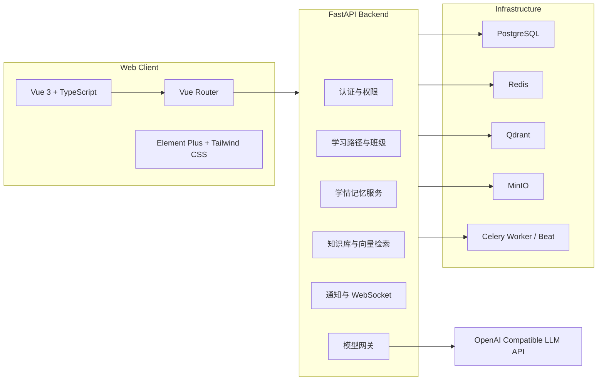

# AI 伴学与智能体协同平台

<p align="center">
  <strong>面向学生、教师与平台管理员的 AI 学习协同系统</strong>
</p>

<p align="center">
  <a href="https://github.com/mikoto0418/studyPartner"></a>
  
  
  
  
  
</p>

<p align="center">
  <a href="#核心能力">核心能力</a> ·
  <a href="#系统架构">系统架构</a> ·
  <a href="#快速启动">快速启动</a> ·
  <a href="#默认账号">默认账号</a> ·
  <a href="#项目文档">项目文档</a>
</p>

## 项目定位

AI 伴学与智能体协同平台是一套围绕“学习行为记录、学情记忆、知识库检索、教师智能体协作”构建的全栈系统。它不只是一个聊天应用，而是尝试把 AI Agent 融入学生学习、教师教学和平台运维的日常工作流中。

系统面向三类用户：

| 角色 | 核心价值 | 关键入口 |
|---|---|---|
| 学生 | 获得长期陪伴式学习支持，沉淀个人学情记忆 | 仪表盘、AI 伴学、月历计划、知识库、学习路径、成长全览 |
| 教师 | 观察班级态势，发现需要介入的学生，生成教学动作 | 工作台、学生列表、任务管理、路径任务、班级学情记忆看板 |
| 管理员 | 管理用户、模型配置、系统运行状态 | 管理概览、用户管理、模型配置、系统设置 |

## 核心能力

### 学生端

- **AI 伴学助手**：支持对话、上下文开关、学情记忆引用、待办/任务/日历/知识库上下文关联。
- **学习行为记录**：专注心跳、任务完成、B 站学习、AI 对话均可计入活跃度。
- **个人仪表盘**：待办、导师任务、学术便签、学习热力图、模块排序。
- **学习路径**：教师发布路径任务，学生按阶段推进并提交成果。
- **成长全览**：汇总路径进度、学习趋势、学情记忆卡片。

### 教师端

- **教学工作台**：查看指导学生、待批改、任务发布与 AI 教学辅助。
- **学生管理**：查看学生概况、复盘日志、学情分析与任务状态。
- **任务管理**：创建普通任务、查看提交、批改反馈。
- **路径任务**：用 AI 把教学目标拆成阶段、节点和资源。
- **班级学情洞察看板**：把学情记忆、路径进度和待批改提交转成带证据链的教师洞察。
- **大量学生选择器**：创建班级、发布任务、分配路径时支持搜索、筛选、分页和已选名单管理。

### 管理端

- **用户管理**：学生、教师、管理员账号管理。
- **模型配置**：按任务类型配置大模型能力，例如学生对话、每日复盘、记忆提取、路径生成等。
- **系统设置**：维护平台级运行配置。

## 系统架构



## 技术栈

| 层级 | 技术 |
|---|---|
| 前端 | Vue 3, TypeScript, Vite, Vue Router, Pinia, Element Plus, Tailwind CSS, lucide-vue-next |
| 后端 | FastAPI, SQLAlchemy Async, Alembic, Pydantic, JWT |
| 数据 | PostgreSQL, Redis, Qdrant, MinIO |
| 异步任务 | Celery Worker, Celery Beat |
| AI | OpenAI-compatible LLM Gateway, SiliconFlow, Embedding Model |
| 部署 | Docker Compose, Nginx, Cloudflare Tunnel |

## 目录结构

```text
studyPartner/
├── web/                         # Vue 3 前端
│   ├── src/api/                 # Axios API 模块
│   ├── src/views/               # 学生端、教师端、管理端页面
│   ├── src/components/          # 通用组件
│   └── src/utils/               # 前端展示工具
├── server/                      # FastAPI 后端
│   ├── app/api/                 # API 路由
│   ├── app/models/              # SQLAlchemy 模型
│   ├── app/services/            # 业务服务
│   ├── app/tasks/               # Celery 异步任务
│   └── alembic/                 # 数据库迁移
├── docs/                        # 产品、架构、API、数据库和设计文档
├── docker-compose.yml           # 开发环境编排
├── docker-compose.prod.yml      # 生产环境编排
└── .env.example                 # 环境变量模板
```

## 快速启动

### 环境要求

- Node.js 20+
- Python 3.11+
- Docker Desktop 或 Docker Engine
- PostgreSQL / Redis 可由 Docker Compose 自动拉起

### 1. 准备环境变量

```bash
cp .env.example .env
```

至少建议配置：

```ini
JWT_SECRET_KEY=change_me_generate_with_openssl_rand_hex_32
SILICONFLOW_API_KEY=
SMTP_HOST=
SMTP_USER=
SMTP_PASSWORD=
SMTP_FROM_EMAIL=
```

### 2. Docker Compose 启动全套基础设施

```bash
docker compose up -d
```

服务默认端口：

| 服务 | 地址 |
|---|---|
| 前端开发服务 | `http://localhost:5173` |
| 后端 API | `http://localhost:8000` |
| API 文档 | `http://localhost:8000/api/docs` |
| PostgreSQL | `localhost:15432` |
| Redis | `localhost:6379` |
| Qdrant | `http://localhost:6333` |
| MinIO Console | `http://localhost:9001` |

### 3. 初始化种子数据

```bash
docker compose exec backend python -m app.seed
```

### 4. 本地前端开发

```bash
cd web
npm install
npm run dev
```

### 5. 本地后端开发

```bash
cd server
pip install -r requirements.txt
uvicorn app.main:app --reload
```

### 6. 本地异步任务

```bash
cd server
celery -A app.core.celery_app:celery_app worker --loglevel=info -P threads
celery -A app.core.celery_app:celery_app beat --loglevel=info
```

## 默认账号

种子脚本会创建以下测试账号：

| 角色 | 用户名 | 密码 |
|---|---|---|
| 学生 | `student` | `student123` |
| 教师 | `teacher` | `teacher123` |
| 管理员 | `admin` | `admin123` |

## 常用命令

```bash
# 前端构建
cd web && npm run build

# 开发环境容器
docker compose up -d
docker compose ps
docker compose logs -f backend

# 停止环境
docker compose down

# 生产部署脚本
chmod +x deploy.sh
./deploy.sh
```

## 产品路线图

### 已完成或已具备基础能力

- 学生端 AI 伴学对话与学情记忆管理。
- 学习路径生成、发布与提交。
- 教师端任务、学生、班级看板。
- LearningInsight 班级洞察引擎与证据链。
- 教师端大量学生选择器。
- 管理端模型配置。
- WebSocket 通知、Celery 定时复盘、知识库基础能力。
- 学生个人信息与显示姓名口径统一。

### 下一阶段重点

- **教师工作台重构**：把班级概况和需介入学生提升为首屏核心。
- **教师 Agent 工作台**：从聊天框升级为可执行教学智能体，支持生成任务、反馈、简报和干预计划。
- **洞察动作闭环**：把洞察建议动作接入任务生成、提醒草稿、简报生成和干预计划。
- **大量学生选择器增强**：增加按班级筛选、导入学号名单、保存常用分组。
- **Agent 审计与工具调用**：所有 AI 建议和动作需要可追溯、可确认、可回滚。

## 项目文档

| 文档 | 说明 |
|---|---|
| [教师端与 Agent 平台重构设计方案](docs/teacher-agent-platform-redesign.md) | 教师仪表盘、班级洞察、Agent 工作台和大量学生选择器设计 |
| [LearningInsight 洞察引擎设计](docs/learning-insight-engine.md) | 洞察模型、生成来源、API、状态闭环 |
| [StudentPickerDialog 设计说明](docs/student-picker-dialog.md) | 大量学生选择器的组件合同、接口和协议边界 |
| [学习路径规划器设计](docs/learning-path-planner.md) | 教学设计框架、场景模板、节点产出与完成标准 |
| [UI 设计与界面交互规范](docs/ui-design.md) | 视觉系统、页面规范、交互状态 |
| [系统架构设计](docs/architecture.md) | 平台整体架构与模块划分 |
| [API 设计](docs/api-design.md) | 后端接口设计文档 |
| [数据库设计](docs/database-design.md) | 数据表、索引、关系说明 |
| [AI Memory 设计](docs/ai-memory-design.md) | 学情记忆机制与数据流 |
| [学习路径与班级记忆设计](docs/learning-path-class-memory-design.md) | 路径任务、班级看板、记忆聚合设计 |
| [部署指南](docs/deployment-guide.md) | 生产部署、容器、运维说明 |

## 设计原则

- **以行动为中心**：老师看到的不是指标堆叠，而是可执行建议。
- **证据优先**：Agent 结论必须能追溯到对话、复盘、任务提交或学习行为。
- **人在回路**：发布任务、发送通知、删除记忆、批量改动都需要人工确认。
- **长期陪伴**：学生端围绕长期学习画像和持续复盘设计，不做一次性问答工具。
- **大规模可用**：所有班级、学生、任务选择器必须能承载真实班级规模。

## 许可证

本项目采用 [Apache License 2.0](LICENSE) 开源协议。

当前新增的 `StudentPickerDialog` 与教师端洞察组件均为项目内自研实现，未复制第三方组件站源码。后续如引入外部开源组件，请在合并前确认许可证兼容性，并在 README、NOTICE 或第三方声明文档中补充归属信息。
