# AI 智能体与 Memory 系统设计文档

> **版本**：V1.0  
> **适用阶段**：MVP  
> **最后更新**：2026-06-02  
> **文档状态**：正式版

---

## 目录

1. [AI 智能体架构概述](#1-ai-智能体架构概述)
2. [LLM Provider 统一封装](#2-llm-provider-统一封装)
3. [任务类型与 Prompt 设计](#3-任务类型与-prompt-设计)
4. [Memory 分层架构详细设计](#4-memory-分层架构详细设计)
5. [Memory 生命周期](#5-memory-生命周期)
6. [每日 0 点复盘流程](#6-每日-0-点复盘流程)
7. [对话上下文构建](#7-对话上下文构建)
8. [知识库 RAG 流程](#8-知识库-rag-流程)
9. [Memory 安全与隐私](#9-memory-安全与隐私)
10. [性能与可靠性](#10-性能与可靠性)
11. [后续扩展：多智能体协同](#11-后续扩展多智能体协同)

---

## 1. AI 智能体架构概述

### 1.1 核心理念

每个学生在平台上拥有一个**专属的 AI 伴学智能体**。该智能体不是一个通用的聊天机器人，而是一个具备**持续记忆、行为理解和自适应成长**能力的个性化学习伙伴。

核心设计原则：

| 原则 | 说明 |
|------|------|
| **白板起步** | 智能体初始不预设任何学生偏好，完全从零开始 |
| **渐进成长** | 通过持续使用积累 Memory，智能体对学生的理解不断加深 |
| **上下文感知** | 每次对话自动注入学生当前状态（任务、TODO、日历、Memory 等） |
| **行为驱动** | Memory 不依赖学生主动输入，而是从行为日志中自动提取 |
| **安全可控** | 学生可查看和管理自己的 Memory，系统不存储敏感信息 |

### 1.2 智能体系统全局架构

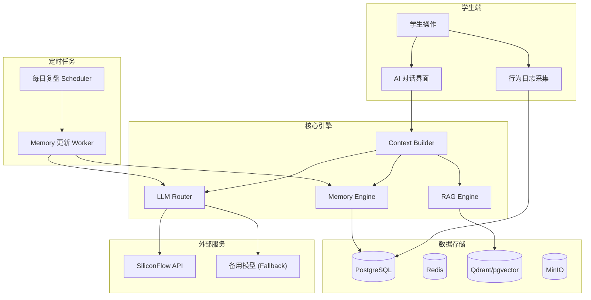
```mermaid
graph TB
    subgraph 学生端
        A[学生操作] --> B[行为日志采集]
        A --> C[AI 对话界面]
    end

    subgraph 核心引擎
        D[LLM Router]
        E[Memory Engine]
        F[Context Builder]
        G[RAG Engine]
    end

    subgraph 数据存储
        H[(PostgreSQL)]
        I[(Redis)]
        J[(Qdrant/pgvector)]
        K[(MinIO)]
    end

    subgraph 定时任务
        L[每日复盘 Scheduler]
        M[Memory 更新 Worker]
    end

    subgraph 外部服务
        N[SiliconFlow API]
        O["备用模型 (Fallback)"]
    end

    C --> F
    F --> D
    F --> E
    F --> G
    D --> N
    D --> O
    B --> H
    E --> H
    G --> J
    L --> M
    M --> E
    M --> D
```

### 1.3 智能体能力矩阵

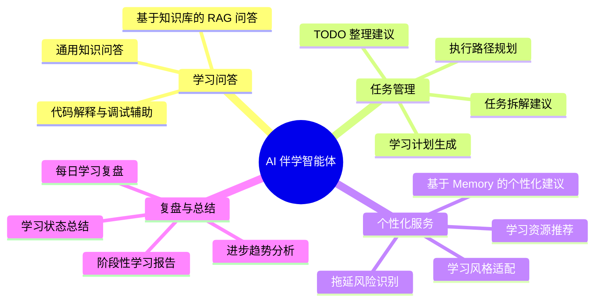
```mermaid
mindmap
  root((AI 伴学智能体))
    学习问答
      通用知识问答
      基于知识库的 RAG 问答
      代码解释与调试辅助
    任务管理
      任务拆解建议
      TODO 整理建议
      学习计划生成
      执行路径规划
    个性化服务
      基于 Memory 的个性化建议
      学习风格适配
      拖延风险识别
      学习资源推荐
    复盘与总结
      每日学习复盘
      阶段性学习报告
      学习状态总结
      进步趋势分析
```

### 1.4 智能体可访问的学生上下文

智能体在对话或执行任务时，可通过 Context Builder 访问以下数据：

| 上下文类型 | 数据来源 | 注入时机 | 说明 |
|-----------|---------|---------|------|
| 学生基础信息 | `users` + `student_profiles` | 每次对话 | 姓名、年级、专业方向等 |
| 当前 TODO | `todos` | 每次对话 | 未完成的待办事项列表 |
| 当前任务 | `tasks` + `task_assignees` | 每次对话 | 进行中/未开始的任务 |
| 日历计划 | `calendar_events` | 每次对话 | 近期计划安排 |
| 短期 Memory | `student_memories` (short_term) | 每次对话 | 最近学习状态和关注点 |
| 长期 Memory | `student_memories` (long_term) | 每次对话 | 稳定的学习偏好和习惯 |
| 最近行为摘要 | `behavior_logs` 聚合 | 每次对话 | 近 7 天行为统计摘要 |
| 最近对话摘要 | `ai_conversations` + `ai_messages` | 每次对话 | 最近 3 次对话的摘要 |
| 知识库内容 | Qdrant/pgvector RAG | 按需注入 | 当问题与知识库相关时检索 |

---

## 2. LLM Provider 统一封装

### 2.1 架构设计

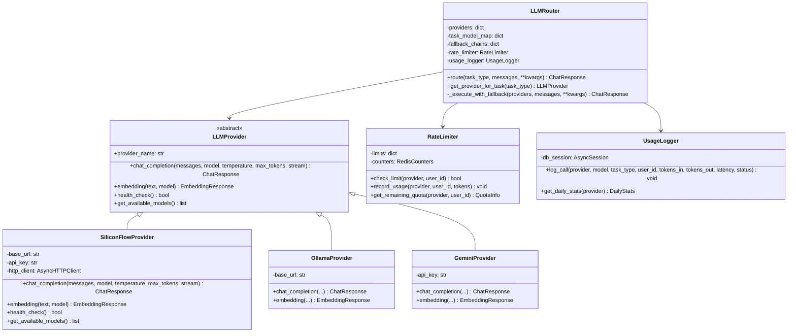
```mermaid
classDiagram
    class LLMProvider {
        <<abstract>>
        +provider_name: str
        +chat_completion(messages, model, temperature, max_tokens, stream) ChatResponse
        +embedding(text, model) EmbeddingResponse
        +health_check() bool
        +get_available_models() list
    }

    class SiliconFlowProvider {
        -base_url: str
        -api_key: str
        -http_client: AsyncHTTPClient
        +chat_completion(messages, model, temperature, max_tokens, stream) ChatResponse
        +embedding(text, model) EmbeddingResponse
        +health_check() bool
        +get_available_models() list
    }

    class OllamaProvider {
        -base_url: str
        +chat_completion(...) ChatResponse
        +embedding(...) EmbeddingResponse
    }

    class GeminiProvider {
        -api_key: str
        +chat_completion(...) ChatResponse
        +embedding(...) EmbeddingResponse
    }

    class LLMRouter {
        -providers: dict
        -task_model_map: dict
        -fallback_chains: dict
        -rate_limiter: RateLimiter
        -usage_logger: UsageLogger
        +route(task_type, messages, **kwargs) ChatResponse
        +get_provider_for_task(task_type) LLMProvider
        -_execute_with_fallback(providers, messages, **kwargs) ChatResponse
    }

    class RateLimiter {
        -limits: dict
        -counters: RedisCounters
        +check_limit(provider, user_id) bool
        +record_usage(provider, user_id, tokens) void
        +get_remaining_quota(provider, user_id) QuotaInfo
    }

    class UsageLogger {
        -db_session: AsyncSession
        +log_call(provider, model, task_type, user_id, tokens_in, tokens_out, latency, status) void
        +get_daily_stats(provider) DailyStats
    }

    LLMProvider <|-- SiliconFlowProvider
    LLMProvider <|-- OllamaProvider
    LLMProvider <|-- GeminiProvider
    LLMRouter --> LLMProvider
    LLMRouter --> RateLimiter
    LLMRouter --> UsageLogger
```

### 2.2 LLMProvider 抽象接口

```python
# app/core/llm/base.py

from abc import ABC, abstractmethod
from dataclasses import dataclass
from typing import AsyncIterator, Optional


@dataclass
class ChatMessage:
    role: str          # "system" | "user" | "assistant"
    content: str


@dataclass
class ChatResponse:
    content: str
    model: str
    provider: str
    usage: dict        # {"prompt_tokens": int, "completion_tokens": int, "total_tokens": int}
    finish_reason: str
    latency_ms: float


@dataclass
class EmbeddingResponse:
    embedding: list[float]
    model: str
    provider: str
    usage: dict


class LLMProvider(ABC):
    """LLM 提供商抽象基类"""

    def __init__(self, provider_name: str, config: dict):
        self.provider_name = provider_name
        self.config = config

    @abstractmethod
    async def chat_completion(
        self,
        messages: list[ChatMessage],
        model: str,
        temperature: float = 0.7,
        max_tokens: int = 2048,
        stream: bool = False,
        **kwargs
    ) -> ChatResponse | AsyncIterator[str]:
        """发送聊天请求，支持流式和非流式"""
        ...

    @abstractmethod
    async def embedding(
        self,
        text: str | list[str],
        model: str
    ) -> EmbeddingResponse | list[EmbeddingResponse]:
        """生成文本嵌入向量"""
        ...

    @abstractmethod
    async def health_check(self) -> bool:
        """检查提供商服务是否可用"""
        ...

    @abstractmethod
    async def get_available_models(self) -> list[str]:
        """获取可用模型列表"""
        ...
```

### 2.3 SiliconFlowProvider 实现

```python
# app/core/llm/providers/siliconflow.py

import time
import httpx
from typing import AsyncIterator

from app.core.llm.base import LLMProvider, ChatMessage, ChatResponse, EmbeddingResponse


class SiliconFlowProvider(LLMProvider):
    """硅基流动 OpenAI 兼容接口实现"""

    def __init__(self, config: dict):
        super().__init__(provider_name="siliconflow", config=config)
        self.base_url = config.get("base_url", "https://api.siliconflow.cn/v1")
        self.api_key = config["api_key"]
        self.http_client = httpx.AsyncClient(
            base_url=self.base_url,
            headers={
                "Authorization": f"Bearer {self.api_key}",
                "Content-Type": "application/json"
            },
            timeout=httpx.Timeout(60.0, connect=10.0)
        )

    async def chat_completion(
        self,
        messages: list[ChatMessage],
        model: str,
        temperature: float = 0.7,
        max_tokens: int = 2048,
        stream: bool = False,
        **kwargs
    ) -> ChatResponse | AsyncIterator[str]:
        payload = {
            "model": model,
            "messages": [{"role": m.role, "content": m.content} for m in messages],
            "temperature": temperature,
            "max_tokens": max_tokens,
            "stream": stream,
            **kwargs
        }

        start_time = time.monotonic()

        if stream:
            return self._stream_chat(payload, model, start_time)

        response = await self.http_client.post("/chat/completions", json=payload)
        response.raise_for_status()
        data = response.json()

        latency = (time.monotonic() - start_time) * 1000

        return ChatResponse(
            content=data["choices"][0]["message"]["content"],
            model=data.get("model", model),
            provider=self.provider_name,
            usage=data.get("usage", {}),
            finish_reason=data["choices"][0].get("finish_reason", "stop"),
            latency_ms=latency
        )

    async def _stream_chat(
        self, payload: dict, model: str, start_time: float
    ) -> AsyncIterator[str]:
        async with self.http_client.stream("POST", "/chat/completions", json=payload) as resp:
            resp.raise_for_status()
            async for line in resp.aiter_lines():
                if line.startswith("data: "):
                    chunk = line[6:]
                    if chunk == "[DONE]":
                        break
                    import json
                    data = json.loads(chunk)
                    delta = data["choices"][0].get("delta", {})
                    if "content" in delta and delta["content"]:
                        yield delta["content"]

    async def embedding(
        self,
        text: str | list[str],
        model: str
    ) -> EmbeddingResponse | list[EmbeddingResponse]:
        input_texts = [text] if isinstance(text, str) else text
        payload = {
            "model": model,
            "input": input_texts
        }

        response = await self.http_client.post("/embeddings", json=payload)
        response.raise_for_status()
        data = response.json()

        results = [
            EmbeddingResponse(
                embedding=item["embedding"],
                model=data.get("model", model),
                provider=self.provider_name,
                usage=data.get("usage", {})
            )
            for item in data["data"]
        ]

        return results[0] if isinstance(text, str) else results

    async def health_check(self) -> bool:
        try:
            response = await self.http_client.get("/models")
            return response.status_code == 200
        except Exception:
            return False

    async def get_available_models(self) -> list[str]:
        response = await self.http_client.get("/models")
        response.raise_for_status()
        data = response.json()
        return [m["id"] for m in data.get("data", [])]
```

### 2.4 LLMRouter 路由器

```python
# app/core/llm/router.py

import logging
from typing import Optional

from app.core.llm.base import LLMProvider, ChatMessage, ChatResponse

logger = logging.getLogger(__name__)


class LLMRouter:
    """
    任务类型驱动的 LLM 路由器。
    根据 task_type 选择最佳 provider + model 组合，
    支持降级链、速率限制和调用日志。
    """

    def __init__(
        self,
        providers: dict[str, LLMProvider],
        task_model_map: dict,
        fallback_chains: dict,
        rate_limiter,
        usage_logger
    ):
        self.providers = providers
        self.task_model_map = task_model_map
        self.fallback_chains = fallback_chains
        self.rate_limiter = rate_limiter
        self.usage_logger = usage_logger

    async def route(
        self,
        task_type: str,
        messages: list[ChatMessage],
        user_id: Optional[str] = None,
        stream: bool = False,
        **kwargs
    ) -> ChatResponse:
        """根据任务类型路由到合适的模型"""

        # 1. 获取该任务类型的配置
        config = self.task_model_map.get(task_type)
        if not config:
            raise ValueError(f"未知任务类型: {task_type}")

        # 2. 构建降级链
        chain = [config] + self.fallback_chains.get(task_type, [])

        # 3. 沿降级链尝试
        last_error = None
        for route_config in chain:
            provider_name = route_config["provider"]
            model = route_config["model"]
            provider = self.providers.get(provider_name)

            if not provider:
                logger.warning(f"Provider {provider_name} 未注册，跳过")
                continue

            # 4. 检查速率限制
            if user_id and not await self.rate_limiter.check_limit(
                provider_name, user_id
            ):
                logger.warning(f"用户 {user_id} 在 {provider_name} 上达到速率限制")
                continue

            try:
                # 5. 执行调用
                response = await provider.chat_completion(
                    messages=messages,
                    model=model,
                    temperature=route_config.get("temperature", 0.7),
                    max_tokens=route_config.get("max_tokens", 2048),
                    stream=stream,
                    **kwargs
                )

                # 6. 记录用量
                if user_id:
                    await self.rate_limiter.record_usage(
                        provider_name, user_id,
                        response.usage.get("total_tokens", 0)
                    )

                # 7. 记录日志
                await self.usage_logger.log_call(
                    provider=provider_name,
                    model=model,
                    task_type=task_type,
                    user_id=user_id,
                    tokens_in=response.usage.get("prompt_tokens", 0),
                    tokens_out=response.usage.get("completion_tokens", 0),
                    latency_ms=response.latency_ms,
                    status="success"
                )

                return response

            except Exception as e:
                last_error = e
                logger.error(
                    f"LLM 调用失败 [{provider_name}/{model}]: {e}",
                    exc_info=True
                )
                # 记录失败日志
                await self.usage_logger.log_call(
                    provider=provider_name,
                    model=model,
                    task_type=task_type,
                    user_id=user_id,
                    tokens_in=0, tokens_out=0, latency_ms=0,
                    status=f"error: {str(e)[:200]}"
                )
                continue

        raise RuntimeError(
            f"所有 Provider 均不可用，任务类型: {task_type}, 最后错误: {last_error}"
        )
```

### 2.5 配置驱动的模型选择

模型配置通过数据库表 `llm_provider_configs` 管理，管理员可在后台动态调整：

```json
{
  "task_model_map": {
    "student_chat": {
      "provider": "siliconflow",
      "model": "Qwen/Qwen2.5-7B-Instruct",
      "temperature": 0.8,
      "max_tokens": 2048
    },
    "daily_review": {
      "provider": "siliconflow",
      "model": "Qwen/Qwen2.5-7B-Instruct",
      "temperature": 0.3,
      "max_tokens": 4096
    },
    "memory_extract": {
      "provider": "siliconflow",
      "model": "Qwen/Qwen2.5-7B-Instruct",
      "temperature": 0.2,
      "max_tokens": 2048
    },
    "memory_update": {
      "provider": "siliconflow",
      "model": "Qwen/Qwen2.5-7B-Instruct",
      "temperature": 0.1,
      "max_tokens": 2048
    },
    "task_breakdown": {
      "provider": "siliconflow",
      "model": "Qwen/Qwen2.5-7B-Instruct",
      "temperature": 0.5,
      "max_tokens": 2048
    },
    "plan_generate": {
      "provider": "siliconflow",
      "model": "Qwen/Qwen2.5-7B-Instruct",
      "temperature": 0.5,
      "max_tokens": 2048
    },
    "knowledge_qa": {
      "provider": "siliconflow",
      "model": "Qwen/Qwen2.5-7B-Instruct",
      "temperature": 0.3,
      "max_tokens": 3072
    },
    "document_summary": {
      "provider": "siliconflow",
      "model": "Qwen/Qwen2.5-7B-Instruct",
      "temperature": 0.3,
      "max_tokens": 1024
    },
    "teacher_assistant": {
      "provider": "siliconflow",
      "model": "Qwen/Qwen2.5-7B-Instruct",
      "temperature": 0.4,
      "max_tokens": 3072
    },
    "system_summary": {
      "provider": "siliconflow",
      "model": "Qwen/Qwen2.5-7B-Instruct",
      "temperature": 0.2,
      "max_tokens": 512
    }
  },
  "fallback_chains": {
    "student_chat": [
      {"provider": "siliconflow", "model": "THUDM/glm-4-9b-chat", "temperature": 0.8, "max_tokens": 2048},
      {"provider": "ollama", "model": "qwen2.5:7b", "temperature": 0.8, "max_tokens": 2048}
    ],
    "daily_review": [
      {"provider": "siliconflow", "model": "THUDM/glm-4-9b-chat", "temperature": 0.3, "max_tokens": 4096}
    ],
    "knowledge_qa": [
      {"provider": "siliconflow", "model": "THUDM/glm-4-9b-chat", "temperature": 0.3, "max_tokens": 3072}
    ]
  }
}
```

### 2.6 Fallback 降级策略

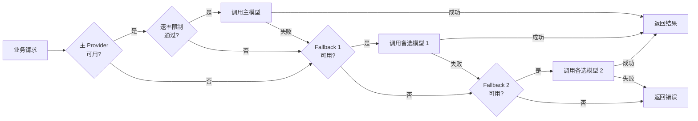
```mermaid
flowchart LR
    A[业务请求] --> B{主 Provider<br/>可用?}
    B -->|是| C{速率限制<br/>通过?}
    C -->|是| D[调用主模型]
    D -->|成功| E[返回结果]
    D -->|失败| F{Fallback 1<br/>可用?}
    C -->|否| F
    B -->|否| F
    F -->|是| G[调用备选模型 1]
    G -->|成功| E
    G -->|失败| H{Fallback 2<br/>可用?}
    F -->|否| H
    H -->|是| I[调用备选模型 2]
    I -->|成功| E
    I -->|失败| J[返回错误]
    H -->|否| J
```

### 2.7 速率限制与配额管理

```python
# app/core/llm/rate_limiter.py

import time
from dataclasses import dataclass
from redis.asyncio import Redis


@dataclass
class QuotaInfo:
    remaining_calls: int
    remaining_tokens: int
    reset_at: float     # Unix timestamp


class RateLimiter:
    """基于 Redis 的多维度速率限制器"""

    def __init__(self, redis: Redis):
        self.redis = redis

    async def check_limit(self, provider: str, user_id: str) -> bool:
        """检查用户是否在限额内"""
        now = time.time()

        # 检查每分钟请求数 (RPM)
        rpm_key = f"rate:{provider}:{user_id}:rpm"
        rpm_count = await self.redis.get(rpm_key)
        if rpm_count and int(rpm_count) >= self._get_rpm_limit(provider):
            return False

        # 检查每日 Token 配额
        daily_key = f"rate:{provider}:{user_id}:daily_tokens:{self._today()}"
        daily_tokens = await self.redis.get(daily_key)
        if daily_tokens and int(daily_tokens) >= self._get_daily_token_limit(provider):
            return False

        # 检查全局每分钟请求数
        global_rpm_key = f"rate:{provider}:global:rpm"
        global_rpm = await self.redis.get(global_rpm_key)
        if global_rpm and int(global_rpm) >= self._get_global_rpm_limit(provider):
            return False

        return True

    async def record_usage(self, provider: str, user_id: str, tokens: int):
        """记录使用量"""
        pipe = self.redis.pipeline()

        # 更新 RPM (60秒过期)
        rpm_key = f"rate:{provider}:{user_id}:rpm"
        pipe.incr(rpm_key)
        pipe.expire(rpm_key, 60)

        # 更新每日 Token
        daily_key = f"rate:{provider}:{user_id}:daily_tokens:{self._today()}"
        pipe.incrby(daily_key, tokens)
        pipe.expire(daily_key, 86400)

        # 更新全局 RPM
        global_rpm_key = f"rate:{provider}:global:rpm"
        pipe.incr(global_rpm_key)
        pipe.expire(global_rpm_key, 60)

        await pipe.execute()

    def _get_rpm_limit(self, provider: str) -> int:
        """每用户每分钟请求限制（可从配置表读取）"""
        defaults = {"siliconflow": 10, "ollama": 5}
        return defaults.get(provider, 10)

    def _get_daily_token_limit(self, provider: str) -> int:
        """每用户每日 Token 限制"""
        defaults = {"siliconflow": 100_000, "ollama": 500_000}
        return defaults.get(provider, 100_000)

    def _get_global_rpm_limit(self, provider: str) -> int:
        """全局每分钟请求限制"""
        defaults = {"siliconflow": 50, "ollama": 20}
        return defaults.get(provider, 50)

    def _today(self) -> str:
        from datetime import date
        return date.today().isoformat()
```

### 2.8 调用日志

每次 LLM 调用都会写入 `llm_usage_logs` 表，字段如下：

```json
{
  "log_id": "uuid",
  "provider": "siliconflow",
  "model": "Qwen/Qwen2.5-7B-Instruct",
  "task_type": "student_chat",
  "user_id": "student_uuid",
  "tokens_in": 1250,
  "tokens_out": 486,
  "total_tokens": 1736,
  "latency_ms": 2340.5,
  "status": "success",
  "error_message": null,
  "request_metadata": {
    "temperature": 0.8,
    "max_tokens": 2048,
    "conversation_id": "conv_uuid"
  },
  "created_at": "2026-06-01T14:30:00Z"
}
```

---

## 3. 任务类型与 Prompt 设计

### 3.1 任务类型总览

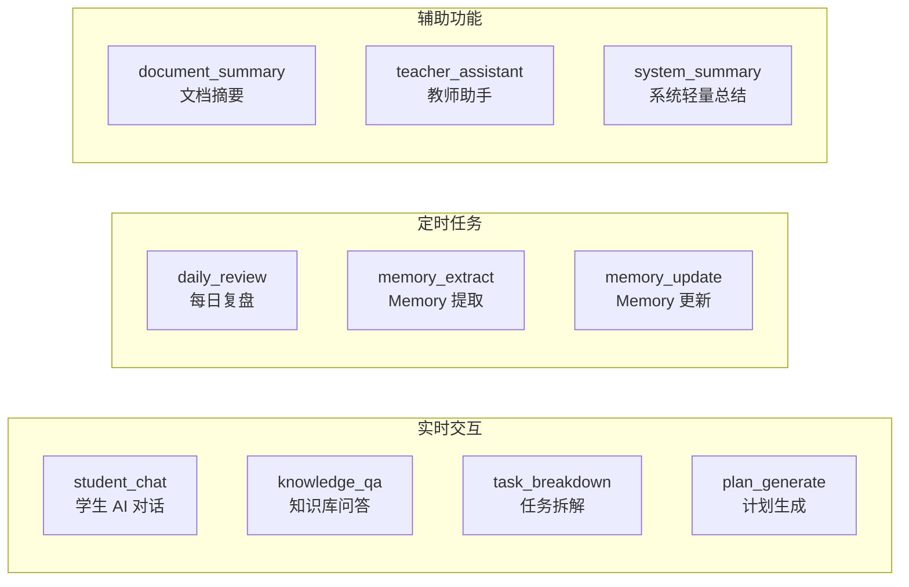
```mermaid
graph LR
    subgraph 实时交互
        A[student_chat<br/>学生 AI 对话]
        B[knowledge_qa<br/>知识库问答]
        C[task_breakdown<br/>任务拆解]
        D[plan_generate<br/>计划生成]
    end

    subgraph 定时任务
        E[daily_review<br/>每日复盘]
        F[memory_extract<br/>Memory 提取]
        G[memory_update<br/>Memory 更新]
    end

    subgraph 辅助功能
        H[document_summary<br/>文档摘要]
        I[teacher_assistant<br/>教师助手]
        J[system_summary<br/>系统轻量总结]
    end
```

### 3.2 student_chat — 学生 AI 对话

> **触发方式**：学生主动发起对话  
> **温度**：0.8  
> **最大 Token**：2048  
> **是否流式**：是

**System Prompt 模板**：

```text
你是「{student_name}」的 AI 伴学助手。你的职责是陪伴学生学习、解答疑问、提供个性化建议和情感支持。

## 你的身份
- 你是一个耐心、专业、温和的学习伙伴
- 你能记住学生的学习状态和偏好（通过下方 Memory 信息）
- 你关注学生的成长，会适时给出鼓励和建议

## 学生基本信息
- 姓名：{student_name}
- 研究方向：{research_direction}
- 入学时间：{enrollment_date}

## 当前学习状态（短期 Memory）
{short_term_memory_text}

## 学生长期画像（长期 Memory）
{long_term_memory_text}

## 当前 TODO 列表
{todo_list_text}

## 当前进行中的任务
{active_tasks_text}

## 近期日历安排
{calendar_events_text}

## 最近 7 天行为摘要
{recent_behavior_summary}

## 最近对话摘要
{recent_conversation_summary}

{rag_context_block}

## 行为规范
1. 使用友好的中文对话，语气自然，不要过于正式
2. 回答学术问题时要专业、准确
3. 在学生表达焦虑或压力时给予适当的情感支持
4. 基于 Memory 信息给出个性化建议，但不要明确暴露 Memory 内容
5. 发现学生可能存在拖延情况时，温和地提醒
6. 不要编造不存在的任务或计划
7. 如果不确定答案，坦诚告知，必要时建议查阅知识库
8. 如果学生问到知识库相关内容且有 RAG 检索结果，优先引用知识库中的信息并标注来源
```

### 3.3 daily_review — 每日复盘生成

> **触发方式**：每日 0:00 定时任务  
> **温度**：0.3  
> **最大 Token**：4096  
> **是否流式**：否

**System Prompt 模板**：

```text
你是一个学习数据分析助手。请根据以下学生一天的学习行为数据，生成一份结构化的每日学习复盘报告。

## 学生信息
- 姓名：{student_name}
- 日期：{review_date}

## 今日行为数据
### 学习时长
- 平台在线时长：{online_duration_min} 分钟
- B 站学习时长：{bilibili_duration_min} 分钟

### TODO 完成情况
- 今日创建：{todo_created} 个
- 今日完成：{todo_completed} 个
- 当前未完成：{todo_pending} 个
- 逾期未完成：{todo_overdue} 个

### 任务情况
- 进行中任务：{tasks_in_progress} 个
- 今日提交：{tasks_submitted} 个
- 今日完成：{tasks_completed} 个
- 逾期任务：{tasks_overdue} 个

### AI 对话
- 对话次数：{chat_count} 次
- 主要话题：{chat_topics}

### 知识库使用
- 搜索次数：{kb_search_count} 次
- 查看文档：{kb_docs_viewed} 份

### 文件上传
- 上传文件数：{files_uploaded} 个

### 日历计划
- 今日计划数：{planned_events} 个
- 已完成计划：{completed_events} 个

### 学习时间分布
{hourly_activity_distribution}

## 历史对比
- 昨日学习时长：{yesterday_duration_min} 分钟
- 本周平均时长：{week_avg_duration_min} 分钟
- 上周平均时长：{last_week_avg_duration_min} 分钟

## 当前短期 Memory
{current_short_term_memory}

## 输出要求
请输出以下 JSON 格式的复盘报告：

```json
{
  "summary": "一段 100-200 字的今日学习总结",
  "study_highlights": ["今日学习亮点列表"],
  "concerns": ["今日值得关注的问题"],
  "procrastination_risk": "low|medium|high",
  "procrastination_reason": "如果有拖延风险，说明理由",
  "tomorrow_suggestions": ["明日学习建议列表"],
  "teacher_summary": "面向教师的 50 字以内摘要",
  "mood_indicator": "positive|neutral|negative",
  "effort_score": 1-10
}
```

注意：
1. 要客观、有依据，不要凭空推测
2. 建议应具体可执行
3. teacher_summary 不要包含私密对话内容
4. 如果当天几乎没有行为数据，标注为不活跃并简要记录
```

### 3.4 memory_extract — Memory 提取

> **触发方式**：每日复盘后自动触发  
> **温度**：0.2  
> **最大 Token**：2048  
> **是否流式**：否

**System Prompt 模板**：

```text
你是一个学生行为分析专家。请根据以下学生的每日复盘报告和近期行为数据，提取可能有价值的 Memory 条目。

## 说明
Memory 是对学生学习行为、偏好、习惯的结构化记录。Memory 分为两类：
- **短期 Memory**：反映近期的状态变化，如"最近在准备某考试""最近学习时间偏晚"
- **长期 Memory 候选**：反映稳定持久的偏好或习惯，需多次验证后晋升

## 学生信息
- 姓名：{student_name}
- 学生 ID：{student_id}

## 今日复盘报告
{daily_review_json}

## 最近 7 天行为摘要
{weekly_behavior_summary}

## 最近 7 天 AI 对话主要话题
{weekly_chat_topics}

## 当前已有 Memory
### 短期 Memory
{current_short_term_memories}

### 长期 Memory
{current_long_term_memories}

## 输出要求
请输出 JSON 格式的 Memory 提取结果：

```json
{
  "new_memories": [
    {
      "content": "Memory 内容描述",
      "category": "learning_focus|study_habit|preference|strength|weakness|goal|risk|interest",
      "suggested_layer": "short_term",
      "confidence": 0.0-1.0,
      "evidence": "支撑该 Memory 的行为证据",
      "source_type": "daily_review|behavior_log|chat_analysis"
    }
  ],
  "update_existing": [
    {
      "memory_id": "要更新的已有 Memory ID",
      "action": "increase_confidence|decrease_confidence|update_content|mark_obsolete",
      "reason": "更新理由",
      "new_confidence": 0.0-1.0
    }
  ],
  "promotion_candidates": [
    {
      "memory_id": "建议从短期提升为长期的 Memory ID",
      "reason": "晋升理由"
    }
  ]
}
```

注意：
1. 不要提取敏感个人信息（如情感关系、健康状况等）
2. confidence 初始值不应超过 0.5，除非有非常充分的证据
3. 与已有 Memory 重复的内容应该建议更新而非重新创建
4. 每次提取的新 Memory 不超过 5 条，避免过度推断
```

### 3.5 memory_update — Memory 更新与冲突检测

> **触发方式**：memory_extract 之后  
> **温度**：0.1  
> **最大 Token**：2048  
> **是否流式**：否

**System Prompt 模板**：

```text
你是一个 Memory 管理专家。请对以下新提取的 Memory 条目与现有 Memory 进行冲突检测和合并决策。

## 任务
1. 检查新 Memory 是否与现有 Memory 存在冲突
2. 对冲突的 Memory 给出处理建议
3. 确认最终应写入的 Memory 列表

## 现有 Memory 列表
### 短期 Memory
{current_short_term_memories_with_ids}

### 长期 Memory
{current_long_term_memories_with_ids}

## 待写入的新 Memory
{new_memory_candidates}

## 待更新的现有 Memory
{update_candidates}

## 输出要求

```json
{
  "conflicts": [
    {
      "new_memory_content": "新 Memory 内容",
      "conflicting_memory_id": "冲突的现有 Memory ID",
      "conflicting_memory_content": "冲突的现有内容",
      "resolution": "keep_new|keep_old|merge|keep_both",
      "merged_content": "如果 resolution 是 merge，提供合并后的内容",
      "reason": "决策理由"
    }
  ],
  "final_writes": [
    {
      "action": "create|update|delete",
      "memory_id": "如果是 update/delete，提供 ID",
      "content": "Memory 内容",
      "category": "分类",
      "layer": "short_term|long_term",
      "confidence": 0.0-1.0,
      "evidence": "证据"
    }
  ],
  "promotions": [
    {
      "memory_id": "要晋升的 Memory ID",
      "approved": true,
      "reason": "批准或拒绝理由"
    }
  ]
}
```

注意：
1. 冲突检测要严格——内容相似或矛盾的才算冲突
2. 当新旧 Memory 矛盾时，优先参考时间更近的行为证据
3. 合并时保留更全面准确的信息
4. 长期 Memory 的修改要更谨慎，需要更强的证据支撑
```

### 3.6 task_breakdown — 任务拆解

> **触发方式**：学生对话中请求或系统自动触发  
> **温度**：0.5  
> **最大 Token**：2048  
> **是否流式**：是

**System Prompt 模板**：

```text
你是一个任务规划专家。请根据学生的任务信息和个人情况，将任务拆解为可执行的子步骤。

## 学生信息
- 姓名：{student_name}
- 研究方向：{research_direction}

## 学生学习画像（长期 Memory）
{long_term_memory_text}

## 任务信息
- 任务标题：{task_title}
- 任务描述：{task_description}
- 截止日期：{task_deadline}
- 优先级：{task_priority}
- 当前状态：{task_status}

## 学生当前负载
- 进行中任务数：{active_task_count}
- 未完成 TODO 数：{pending_todo_count}
- 近期日历安排：{upcoming_events}

## 输出要求
请输出任务拆解方案：

1. 将任务拆解为 3-8 个可执行的子步骤
2. 每个子步骤预估耗时
3. 考虑学生当前负载和截止日期，给出建议时间表
4. 如果学生有相关的学习习惯 Memory，据此调整建议
5. 输出格式清晰，使用编号列表
```

### 3.7 plan_generate — 计划生成

> **触发方式**：学生请求或教师为学生制定计划  
> **温度**：0.5  
> **最大 Token**：2048  
> **是否流式**：是

**System Prompt 模板**：

```text
你是一个学习计划制定专家。请根据学生的当前状况，制定一份切实可行的学习计划。

## 学生信息
- 姓名：{student_name}
- 研究方向：{research_direction}

## 学生画像（Memory）
### 短期状态
{short_term_memory_text}

### 长期偏好
{long_term_memory_text}

## 当前任务
{active_tasks_text}

## 当前 TODO
{pending_todos_text}

## 日历安排
{calendar_events_text}

## 倒数日
{countdowns_text}

## 计划周期
{plan_period}

## 输出要求
1. 按天列出具体学习计划
2. 每个计划项标注预估时长
3. 考虑学生的学习习惯（如偏好的学习时段、擅长领域、弱势领域）
4. 考虑倒数日和任务截止日期，合理分配优先级
5. 计划应留有弹性时间，不要排满
6. 如果学生有拖延倾向的 Memory，适当提前安排关键节点
```

### 3.8 knowledge_qa — 知识库 RAG 问答

> **触发方式**：学生对话中涉及知识库内容  
> **温度**：0.3  
> **最大 Token**：3072  
> **是否流式**：是

**System Prompt 模板**：

```text
你是一个知识库问答助手。请严格基于以下检索到的知识库内容回答学生的问题。

## 检索到的相关内容

{retrieved_chunks}

每段内容格式：
---
来源文档：{document_title}
上传者：{uploader}
上传时间：{upload_time}
相关度评分：{relevance_score}
内容片段：
{chunk_content}
---

## 回答规范
1. 严格基于上述检索内容回答问题
2. 如果检索内容不足以回答问题，明确告知并建议学生查阅其他资料
3. 在回答中标注信息来源，格式：【来源：文档名称】
4. 如果多个文档内容互相矛盾，指出差异并说明
5. 不要编造检索内容中没有的信息
6. 用清晰的中文回答，必要时使用代码块、公式等格式
```

### 3.9 document_summary — 文档摘要

> **触发方式**：文件上传至知识库后自动触发  
> **温度**：0.3  
> **最大 Token**：1024  
> **是否流式**：否

**System Prompt 模板**：

```text
你是一个文档分析助手。请为以下文档内容生成结构化摘要和标签。

## 文档信息
- 文件名：{filename}
- 文件类型：{file_type}
- 文件大小：{file_size}

## 文档内容（截取前 3000 字）
{document_content_preview}

## 输出要求
请输出 JSON 格式：

```json
{
  "title": "文档标题（如果能识别）",
  "summary": "200 字以内的文档摘要",
  "key_topics": ["关键主题列表"],
  "tags": ["自动生成的标签，5 个以内"],
  "document_type": "论文|课件|笔记|代码文档|教程|报告|其他",
  "difficulty_level": "入门|中级|高级",
  "language": "中文|英文|中英混合"
}
```
```

### 3.10 teacher_assistant — 教师助手

> **触发方式**：教师主动使用  
> **温度**：0.4  
> **最大 Token**：3072  
> **是否流式**：是

**System Prompt 模板**：

```text
你是一个教学管理助手，帮助教师了解学生学习状况并制定指导策略。

## 教师信息
- 姓名：{teacher_name}

## 学生概况
{students_overview}

每个学生概况包含：
- 姓名
- 近 7 天学习时长
- 任务完成率
- 活跃度评级
- 最近复盘摘要（teacher_summary）
- 风险标签（如有）

## 教师提问
{teacher_question}

## 回答规范
1. 基于学生学习数据给出客观分析
2. 不暴露学生私密对话内容
3. 给出具体可执行的教学建议
4. 关注有风险的学生（低活跃度、高拖延风险、任务逾期等）
5. 如果教师询问特定学生，提供更详细的分析
```

### 3.11 system_summary — 系统轻量总结

> **触发方式**：对话历史过长时进行压缩  
> **温度**：0.2  
> **最大 Token**：512  
> **是否流式**：否

**System Prompt 模板**：

```text
请将以下对话历史压缩为一段简洁的摘要。保留关键信息点，包括：
1. 讨论的主要话题
2. 达成的结论或决策
3. 学生表达的需求或困惑
4. AI 给出的重要建议

## 对话历史
{conversation_messages}

## 输出要求
- 200 字以内
- 使用第三人称
- 保留关键事实，省略寒暄和重复内容
- 格式：简洁的段落文字
```

---

## 4. Memory 分层架构详细设计

### 4.1 分层总览

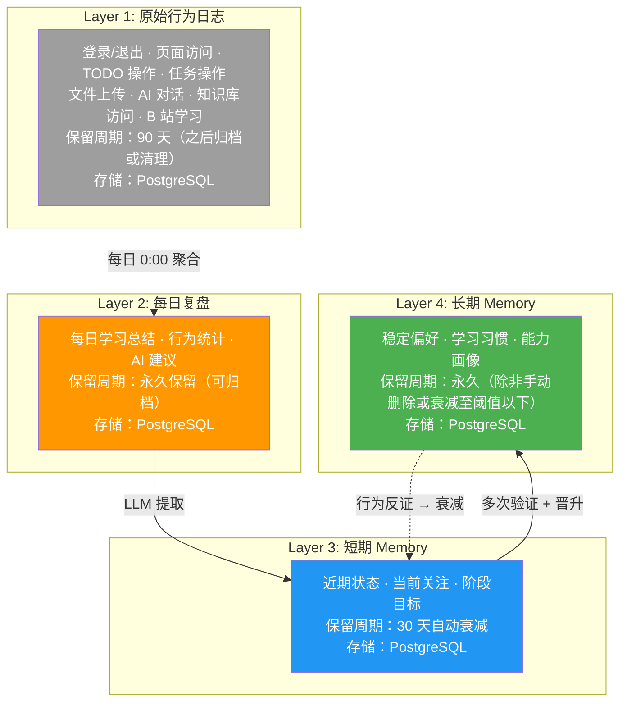
```mermaid
graph TB
    subgraph "Layer 4: 长期 Memory"
        L4["稳定偏好 · 学习习惯 · 能力画像<br/>保留周期：永久（除非手动删除或衰减至阈值以下）<br/>存储：PostgreSQL"]
    end

    subgraph "Layer 3: 短期 Memory"
        L3["近期状态 · 当前关注 · 阶段目标<br/>保留周期：30 天自动衰减<br/>存储：PostgreSQL"]
    end

    subgraph "Layer 2: 每日复盘"
        L2["每日学习总结 · 行为统计 · AI 建议<br/>保留周期：永久保留（可归档）<br/>存储：PostgreSQL"]
    end

    subgraph "Layer 1: 原始行为日志"
        L1["登录/退出 · 页面访问 · TODO 操作 · 任务操作<br/>文件上传 · AI 对话 · 知识库访问 · B 站学习<br/>保留周期：90 天（之后归档或清理）<br/>存储：PostgreSQL"]
    end

    L1 -->|"每日 0:00 聚合"| L2
    L2 -->|"LLM 提取"| L3
    L3 -->|"多次验证 + 晋升"| L4
    L4 -.->|"行为反证 → 衰减"| L3

    style L4 fill:#4CAF50,color:#fff
    style L3 fill:#2196F3,color:#fff
    style L2 fill:#FF9800,color:#fff
    style L1 fill:#9E9E9E,color:#fff
```

### 4.2 Layer 1：原始行为日志

#### 数据结构

```sql
-- behavior_logs 表
CREATE TABLE behavior_logs (
    id              UUID PRIMARY KEY DEFAULT gen_random_uuid(),
    user_id         UUID NOT NULL REFERENCES users(id),
    action_type     VARCHAR(50) NOT NULL,     -- 行为类型枚举
    action_detail   JSONB,                     -- 行为详情
    page_url        VARCHAR(500),              -- 触发页面
    session_id      VARCHAR(100),              -- 会话 ID
    ip_address      VARCHAR(45),
    user_agent      VARCHAR(500),
    duration_seconds INTEGER,                  -- 持续时长（适用于停留类行为）
    created_at      TIMESTAMPTZ NOT NULL DEFAULT NOW(),

    -- 索引
    CONSTRAINT idx_behavior_user_time
        UNIQUE (user_id, created_at, action_type)
);

CREATE INDEX idx_behavior_logs_user_date
    ON behavior_logs (user_id, DATE(created_at));
CREATE INDEX idx_behavior_logs_action_type
    ON behavior_logs (action_type);
```

#### action_type 枚举

| action_type | 说明 | action_detail 示例 |
|-------------|------|-------------------|
| `user_login` | 用户登录 | `{"method": "password"}` |
| `user_logout` | 用户退出 | `{}` |
| `page_view` | 页面访问 | `{"page": "/dashboard", "title": "仪表盘"}` |
| `todo_create` | 创建 TODO | `{"todo_id": "xxx", "title": "读论文"}` |
| `todo_complete` | 完成 TODO | `{"todo_id": "xxx", "title": "读论文"}` |
| `todo_delete` | 删除 TODO | `{"todo_id": "xxx"}` |
| `note_create` | 创建便签 | `{"note_id": "xxx"}` |
| `note_edit` | 编辑便签 | `{"note_id": "xxx"}` |
| `task_view` | 查看任务 | `{"task_id": "xxx", "title": "完成论文初稿"}` |
| `task_submit` | 提交任务 | `{"task_id": "xxx"}` |
| `task_complete` | 完成任务 | `{"task_id": "xxx"}` |
| `announcement_view` | 查看公告 | `{"announcement_id": "xxx"}` |
| `calendar_create` | 创建日历计划 | `{"event_id": "xxx"}` |
| `calendar_complete` | 完成日历计划 | `{"event_id": "xxx"}` |
| `bookmark_click` | 点击书签 | `{"bookmark_id": "xxx", "url": "..."}` |
| `file_upload` | 上传文件 | `{"file_id": "xxx", "filename": "...", "size": 1024}` |
| `kb_search` | 知识库搜索 | `{"query": "...", "results_count": 5}` |
| `kb_doc_view` | 查看知识库文档 | `{"document_id": "xxx"}` |
| `ai_chat_start` | 开始 AI 对话 | `{"conversation_id": "xxx"}` |
| `ai_chat_message` | 发送 AI 消息 | `{"conversation_id": "xxx", "message_length": 150}` |
| `bilibili_open` | 打开 B 站视频 | `{"resource_id": "xxx", "bvid": "BV1xxx"}` |
| `bilibili_stay` | B 站页面停留 | `{"resource_id": "xxx", "duration": 1800}` |
| `heartbeat` | 心跳（在线检测）| `{"page": "/dashboard"}` |

#### 存储策略

- **写入方式**：前端通过 API 批量上报行为日志（每 30 秒一次心跳 + 关键行为即时上报）
- **保留周期**：90 天。超过 90 天的日志按月归档到冷存储（MinIO JSON 文件），从 PostgreSQL 中清理
- **索引策略**：按 `(user_id, date)` 分区索引，支持高效的按天查询

#### 示例数据

```json
[
  {
    "id": "a1b2c3d4-...",
    "user_id": "student-001",
    "action_type": "todo_complete",
    "action_detail": {
      "todo_id": "todo-123",
      "title": "阅读 Attention Is All You Need",
      "priority": "high",
      "was_overdue": false
    },
    "page_url": "/dashboard",
    "session_id": "sess-abc",
    "duration_seconds": null,
    "created_at": "2026-06-01T15:30:00+08:00"
  },
  {
    "id": "e5f6g7h8-...",
    "user_id": "student-001",
    "action_type": "bilibili_stay",
    "action_detail": {
      "resource_id": "res-456",
      "bvid": "BV1xW4y1z7ab",
      "title": "Transformer 原理详解",
      "episode": 3,
      "duration": 2700
    },
    "page_url": "/bilibili/res-456",
    "session_id": "sess-abc",
    "duration_seconds": 2700,
    "created_at": "2026-06-01T20:15:00+08:00"
  }
]
```

### 4.3 Layer 2：每日复盘

#### 数据结构

```sql
-- daily_reviews 表
CREATE TABLE daily_reviews (
    id              UUID PRIMARY KEY DEFAULT gen_random_uuid(),
    user_id         UUID NOT NULL REFERENCES users(id),
    review_date     DATE NOT NULL,                -- 复盘日期（前一天）
    
    -- 统计数据
    online_duration_min     INTEGER DEFAULT 0,     -- 在线时长(分钟)
    bilibili_duration_min   INTEGER DEFAULT 0,     -- B站学习时长(分钟)
    todo_created            INTEGER DEFAULT 0,
    todo_completed          INTEGER DEFAULT 0,
    tasks_submitted         INTEGER DEFAULT 0,
    tasks_completed         INTEGER DEFAULT 0,
    tasks_overdue           INTEGER DEFAULT 0,
    chat_count              INTEGER DEFAULT 0,     -- AI对话次数
    kb_search_count         INTEGER DEFAULT 0,     -- 知识库搜索次数
    files_uploaded          INTEGER DEFAULT 0,
    planned_events          INTEGER DEFAULT 0,
    completed_events        INTEGER DEFAULT 0,
    
    -- AI 生成内容
    summary                 TEXT,                   -- 今日学习总结
    study_highlights        JSONB,                  -- 学习亮点
    concerns                JSONB,                  -- 关注问题
    procrastination_risk    VARCHAR(20),            -- low/medium/high
    procrastination_reason  TEXT,
    tomorrow_suggestions    JSONB,                  -- 明日建议
    teacher_summary         TEXT,                   -- 教师可见摘要
    mood_indicator          VARCHAR(20),            -- positive/neutral/negative
    effort_score            INTEGER,                -- 1-10
    
    -- AI 对话分析
    chat_topics             JSONB,                  -- 对话主要话题
    
    -- 行为分布
    hourly_activity         JSONB,                  -- 24小时活跃度分布
    
    -- 元信息
    llm_model_used          VARCHAR(100),
    generation_status       VARCHAR(20) DEFAULT 'pending',  -- pending/success/failed/skipped
    error_message           TEXT,
    raw_behavior_stats      JSONB,                  -- 原始统计数据快照
    created_at              TIMESTAMPTZ NOT NULL DEFAULT NOW(),
    updated_at              TIMESTAMPTZ NOT NULL DEFAULT NOW(),

    CONSTRAINT uq_daily_review_user_date UNIQUE (user_id, review_date)
);

CREATE INDEX idx_daily_reviews_user_date
    ON daily_reviews (user_id, review_date DESC);
```

#### 保留策略

- **保留周期**：永久保留
- 超过 1 年的复盘数据标记为 `archived`，不参与常规查询，但可按需检索
- 教师端仅显示 `teacher_summary` 字段

#### 示例数据

```json
{
  "id": "review-001",
  "user_id": "student-001",
  "review_date": "2026-06-01",
  "online_duration_min": 245,
  "bilibili_duration_min": 90,
  "todo_created": 4,
  "todo_completed": 3,
  "tasks_submitted": 1,
  "tasks_completed": 1,
  "tasks_overdue": 0,
  "chat_count": 5,
  "kb_search_count": 3,
  "files_uploaded": 1,
  "planned_events": 3,
  "completed_events": 2,
  "summary": "今天学习状态良好，主要集中在 Transformer 相关内容。上午完成了论文阅读任务，下午观看了 B 站教程视频约 90 分钟。AI 对话主要围绕注意力机制的实现细节。知识库搜索了 3 次关于 NLP 预训练模型的资料。有 1 个日历计划未完成（代码复现），建议明天优先处理。",
  "study_highlights": [
    "完成了 Attention Is All You Need 论文阅读",
    "提交了老师布置的论文笔记任务",
    "观看了约 90 分钟的 Transformer 教程视频"
  ],
  "concerns": [
    "代码复现计划未完成，可能需要更多时间"
  ],
  "procrastination_risk": "low",
  "procrastination_reason": null,
  "tomorrow_suggestions": [
    "优先完成昨日未完成的代码复现计划",
    "可以尝试用 PyTorch 实现一个简单的 Self-Attention 层",
    "建议整理今天的论文笔记到知识库"
  ],
  "teacher_summary": "该生今日学习时长 4h+，完成论文阅读任务，学习状态良好，有 1 项代码复现计划延后。",
  "mood_indicator": "positive",
  "effort_score": 7,
  "chat_topics": ["Transformer 原理", "注意力机制实现", "PyTorch 用法"],
  "hourly_activity": {
    "9": 3, "10": 5, "11": 4, "14": 5, "15": 4,
    "16": 3, "20": 5, "21": 4, "22": 3
  },
  "generation_status": "success"
}
```

### 4.4 Layer 3：短期 Memory

#### 数据结构

```sql
-- student_memories 表（短期和长期共用）
CREATE TABLE student_memories (
    id              UUID PRIMARY KEY DEFAULT gen_random_uuid(),
    user_id         UUID NOT NULL REFERENCES users(id),
    
    -- Memory 内容
    content         TEXT NOT NULL,                  -- Memory 描述
    category        VARCHAR(30) NOT NULL,           -- 分类
    layer           VARCHAR(20) NOT NULL,           -- short_term / long_term
    
    -- 置信度与生命周期
    confidence      FLOAT NOT NULL DEFAULT 0.3,     -- 0.0-1.0
    observation_count INTEGER NOT NULL DEFAULT 1,   -- 被观察到的次数
    last_observed_at TIMESTAMPTZ NOT NULL DEFAULT NOW(), -- 最后被验证的时间
    decay_rate      FLOAT NOT NULL DEFAULT 0.05,    -- 每日衰减率
    
    -- 溯源
    evidence        JSONB NOT NULL DEFAULT '[]',    -- 支撑证据列表
    source_type     VARCHAR(30) NOT NULL,           -- daily_review / behavior_log / chat_analysis / teacher_input / manual
    source_ids      JSONB DEFAULT '[]',             -- 来源数据 ID 列表
    
    -- 版本控制
    version         INTEGER NOT NULL DEFAULT 1,
    previous_content TEXT,                          -- 更新前的内容
    
    -- 状态
    status          VARCHAR(20) NOT NULL DEFAULT 'active',  -- active / decayed / archived / deleted
    is_visible_to_student BOOLEAN NOT NULL DEFAULT true,    -- 学生是否可见
    
    -- 时间戳
    created_at      TIMESTAMPTZ NOT NULL DEFAULT NOW(),
    updated_at      TIMESTAMPTZ NOT NULL DEFAULT NOW(),
    promoted_at     TIMESTAMPTZ,                    -- 晋升为长期的时间
    expired_at      TIMESTAMPTZ,                    -- 过期时间（仅短期）

    CONSTRAINT chk_confidence CHECK (confidence >= 0.0 AND confidence <= 1.0),
    CONSTRAINT chk_layer CHECK (layer IN ('short_term', 'long_term'))
);

CREATE INDEX idx_memories_user_layer
    ON student_memories (user_id, layer, status);
CREATE INDEX idx_memories_user_active
    ON student_memories (user_id) WHERE status = 'active';
CREATE INDEX idx_memories_decay
    ON student_memories (last_observed_at) WHERE layer = 'short_term' AND status = 'active';
```

#### category 分类枚举

| category | 说明 | 示例 |
|----------|------|------|
| `learning_focus` | 当前学习重点 | "最近在学习 Transformer 架构" |
| `study_habit` | 学习习惯 | "偏好在晚上 8-11 点学习" |
| `preference` | 学习偏好 | "喜欢通过视频教程入门新知识" |
| `strength` | 优势领域 | "Python 编程能力较强" |
| `weakness` | 薄弱领域 | "论文阅读速度偏慢" |
| `goal` | 学习目标 | "正在准备研究生入学考试" |
| `risk` | 风险提示 | "近一周任务完成率下降" |
| `interest` | 兴趣领域 | "对计算机视觉方向很感兴趣" |

#### 短期 Memory 特殊规则

- **保留周期**：30 天，每日衰减置信度
- **衰减公式**：`new_confidence = confidence × (1 - decay_rate)`，默认 `decay_rate = 0.05`
- **有效阈值**：confidence < 0.1 时标记为 `decayed`
- **刷新机制**：如果行为日志再次验证该 Memory，重置 `last_observed_at` 并提升 confidence
- **晋升条件**：见 [5.3 Memory 晋升](#53-memory-晋升promotion)

#### 示例数据

```json
{
  "id": "mem-st-001",
  "user_id": "student-001",
  "content": "最近在集中学习 Transformer 和注意力机制相关内容",
  "category": "learning_focus",
  "layer": "short_term",
  "confidence": 0.72,
  "observation_count": 5,
  "last_observed_at": "2026-06-01T00:05:00Z",
  "decay_rate": 0.05,
  "evidence": [
    {
      "date": "2026-05-28",
      "type": "bilibili_stay",
      "detail": "观看 Transformer 教程 45 分钟"
    },
    {
      "date": "2026-05-29",
      "type": "ai_chat",
      "detail": "与 AI 讨论 Multi-Head Attention 实现"
    },
    {
      "date": "2026-05-30",
      "type": "kb_search",
      "detail": "搜索 'attention mechanism' 相关文档"
    },
    {
      "date": "2026-06-01",
      "type": "todo_complete",
      "detail": "完成 'Attention Is All You Need 论文阅读'"
    },
    {
      "date": "2026-06-01",
      "type": "bilibili_stay",
      "detail": "观看 Transformer 原理详解 90 分钟"
    }
  ],
  "source_type": "daily_review",
  "source_ids": ["review-2026-05-28", "review-2026-05-29", "review-2026-05-30", "review-2026-06-01"],
  "version": 3,
  "previous_content": "最近在学习 NLP 和 Transformer 相关内容",
  "status": "active",
  "is_visible_to_student": true,
  "created_at": "2026-05-28T00:05:00Z",
  "updated_at": "2026-06-01T00:05:00Z"
}
```

### 4.5 Layer 4：长期 Memory

#### 数据结构

与短期 Memory 使用同一张表 `student_memories`，通过 `layer = 'long_term'` 区分。

#### 长期 Memory 特殊规则

- **保留周期**：永久，除非学生主动删除或置信度长期衰减至阈值以下
- **衰减率**：`decay_rate = 0.01`（远低于短期 Memory）
- **降级条件**：confidence < 0.15 且 60 天内未被观察到，降级为 `decayed`
- **修改门槛**：更新长期 Memory 需要至少 3 条新的证据支撑
- **最大数量**：每个学生最多 50 条活跃的长期 Memory（防止冗余膨胀）

#### 示例数据

```json
{
  "id": "mem-lt-001",
  "user_id": "student-001",
  "content": "偏好通过视频教程入门新的技术概念，然后再阅读相关论文深入理解",
  "category": "preference",
  "layer": "long_term",
  "confidence": 0.88,
  "observation_count": 15,
  "last_observed_at": "2026-06-01T00:05:00Z",
  "decay_rate": 0.01,
  "evidence": [
    {
      "date": "2026-04-15",
      "type": "pattern",
      "detail": "连续 3 周学习新主题时都先看 B 站视频"
    },
    {
      "date": "2026-05-10",
      "type": "pattern",
      "detail": "学习 GAN 时先看了 2 小时视频再读论文"
    },
    {
      "date": "2026-06-01",
      "type": "pattern",
      "detail": "学习 Transformer 时同样是先视频后论文"
    }
  ],
  "source_type": "daily_review",
  "version": 5,
  "status": "active",
  "is_visible_to_student": true,
  "promoted_at": "2026-05-01T00:05:00Z",
  "created_at": "2026-04-15T00:05:00Z",
  "updated_at": "2026-06-01T00:05:00Z"
}
```

```json
{
  "id": "mem-lt-002",
  "user_id": "student-001",
  "content": "有轻度拖延倾向，尤其在需要写代码的任务上容易推迟开始",
  "category": "risk",
  "layer": "long_term",
  "confidence": 0.65,
  "observation_count": 8,
  "last_observed_at": "2026-05-30T00:05:00Z",
  "decay_rate": 0.01,
  "evidence": [
    {
      "date": "2026-04-20",
      "type": "task_overdue",
      "detail": "代码复现任务延迟 2 天提交"
    },
    {
      "date": "2026-05-05",
      "type": "pattern",
      "detail": "连续 3 个编程任务在最后一天才开始"
    },
    {
      "date": "2026-05-25",
      "type": "daily_review",
      "detail": "代码调试 TODO 连续 4 天未完成"
    }
  ],
  "source_type": "daily_review",
  "version": 3,
  "status": "active",
  "is_visible_to_student": true,
  "promoted_at": "2026-05-10T00:05:00Z",
  "created_at": "2026-04-20T00:05:00Z",
  "updated_at": "2026-05-30T00:05:00Z"
}
```

---

## 5. Memory 生命周期

### 5.1 生命周期总览

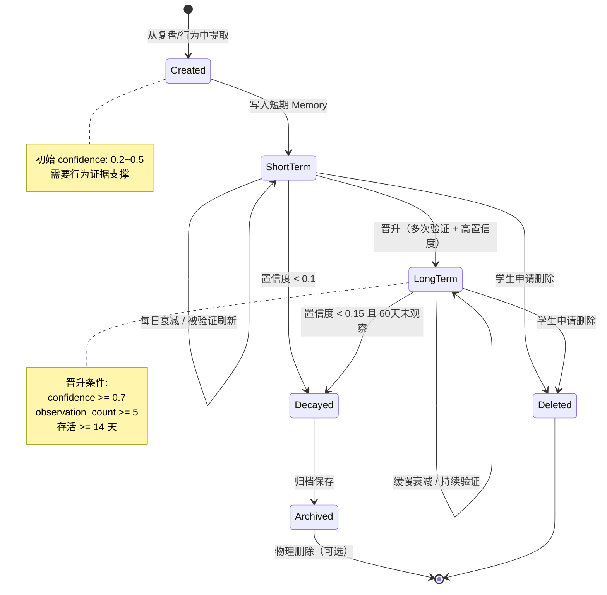
```mermaid
stateDiagram-v2
    [*] --> Created: 从复盘/行为中提取
    Created --> ShortTerm: 写入短期 Memory
    ShortTerm --> ShortTerm: 每日衰减 / 被验证刷新
    ShortTerm --> LongTerm: 晋升（多次验证 + 高置信度）
    ShortTerm --> Decayed: 置信度 < 0.1
    LongTerm --> LongTerm: 缓慢衰减 / 持续验证
    LongTerm --> Decayed: 置信度 < 0.15 且 60天未观察
    Decayed --> Archived: 归档保存
    Archived --> [*]: 物理删除（可选）

    ShortTerm --> Deleted: 学生申请删除
    LongTerm --> Deleted: 学生申请删除
    Deleted --> [*]

    note right of Created
        初始 confidence: 0.2~0.5
        需要行为证据支撑
    end note

    note right of LongTerm
        晋升条件:
        confidence >= 0.7
        observation_count >= 5
        存活 >= 14 天
    end note
```

### 5.2 创建（Creation）

Memory 的创建来源有三种：

| 来源 | 触发时机 | 初始 confidence | 说明 |
|------|---------|----------------|------|
| 每日复盘提取 | 每日 0:00 | 0.2 ~ 0.5 | 最主要的来源，从行为数据中 LLM 提取 |
| 对话分析 | 对话结束后 | 0.2 ~ 0.4 | 从 AI 对话中发现的学生特征 |
| 教师标注 | 教师手动 | 0.6 ~ 0.8 | 教师主动为学生添加的标签 |

创建流程：

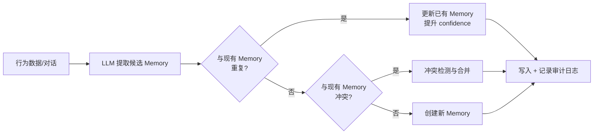
```mermaid
flowchart LR
    A[行为数据/对话] --> B[LLM 提取候选 Memory]
    B --> C{与现有 Memory<br/>重复?}
    C -->|是| D[更新已有 Memory<br/>提升 confidence]
    C -->|否| E{与现有 Memory<br/>冲突?}
    E -->|是| F[冲突检测与合并]
    E -->|否| G[创建新 Memory]
    F --> H[写入 + 记录审计日志]
    D --> H
    G --> H
```

### 5.3 置信度评分（Confidence Scoring）

置信度 (0.0 ~ 1.0) 反映系统对该 Memory 准确性的信心程度。

**初始评分规则**：

```python
def calculate_initial_confidence(evidence_count: int, source_type: str) -> float:
    """计算新 Memory 的初始置信度"""
    base_scores = {
        "daily_review": 0.3,
        "behavior_log": 0.25,
        "chat_analysis": 0.2,
        "teacher_input": 0.7,
        "manual": 0.5
    }
    base = base_scores.get(source_type, 0.2)
    
    # 证据数量加成，但不超过上限
    evidence_bonus = min(evidence_count * 0.05, 0.2)
    
    return min(base + evidence_bonus, 0.8)  # 初始不超过 0.8
```

**置信度变化规则**：

| 事件 | 置信度变化 | 说明 |
|------|----------|------|
| 新行为验证 | +0.05 ~ +0.15 | 根据验证强度不同 |
| 每日衰减（短期）| × (1 - 0.05) = -5% | 每天自动执行 |
| 每日衰减（长期）| × (1 - 0.01) = -1% | 每天自动执行 |
| 行为反证 | -0.1 ~ -0.2 | 发现与 Memory 矛盾的行为 |
| 学生反馈不准确 | -0.3 | 学生主动标记 |
| 教师确认 | +0.2 | 教师确认 Memory 准确 |

### 5.4 晋升（Promotion）

短期 Memory 满足以下**全部条件**时，可被晋升为长期 Memory：

```python
def check_promotion_eligibility(memory) -> bool:
    """检查短期 Memory 是否符合晋升条件"""
    conditions = [
        memory.confidence >= 0.7,                           # 置信度足够高
        memory.observation_count >= 5,                       # 被观察到足够多次
        (now() - memory.created_at).days >= 14,              # 存活至少 14 天
        memory.status == 'active',                           # 当前是活跃状态
        _count_active_long_term(memory.user_id) < 50,        # 长期 Memory 未满
    ]
    return all(conditions)
```

晋升时的处理：

1. `layer` 从 `short_term` 改为 `long_term`
2. `decay_rate` 从 `0.05` 改为 `0.01`
3. `promoted_at` 设置为当前时间
4. 写入 Memory 审计日志
5. 清理 `expired_at` 字段

### 5.5 冲突检测（Conflict Detection）

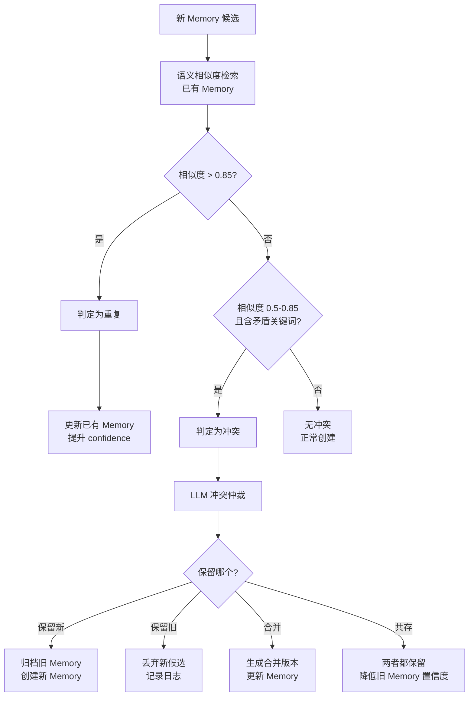
```mermaid
flowchart TD
    A[新 Memory 候选] --> B[语义相似度检索<br/>已有 Memory]
    B --> C{相似度 > 0.85?}
    C -->|是| D[判定为重复]
    D --> E[更新已有 Memory<br/>提升 confidence]
    C -->|否| F{相似度 0.5-0.85<br/>且含矛盾关键词?}
    F -->|是| G[判定为冲突]
    G --> H[LLM 冲突仲裁]
    H --> I{保留哪个?}
    I -->|保留新| J[归档旧 Memory<br/>创建新 Memory]
    I -->|保留旧| K[丢弃新候选<br/>记录日志]
    I -->|合并| L[生成合并版本<br/>更新 Memory]
    I -->|共存| M[两者都保留<br/>降低旧 Memory 置信度]
    F -->|否| N[无冲突<br/>正常创建]
```

冲突检测的关键逻辑：

```python
async def detect_conflicts(
    new_memory_content: str,
    existing_memories: list[Memory]
) -> list[ConflictResult]:
    """检测新 Memory 与已有 Memory 的冲突"""
    conflicts = []
    
    for existing in existing_memories:
        # 1. 计算语义相似度（使用 embedding）
        similarity = await compute_similarity(
            new_memory_content, existing.content
        )
        
        if similarity > 0.85:
            # 高度相似 → 视为重复
            conflicts.append(ConflictResult(
                type="duplicate",
                existing_memory=existing,
                similarity=similarity,
                resolution="update_existing"
            ))
        elif similarity > 0.5:
            # 中等相似 → 可能冲突，交给 LLM 判断
            is_contradictory = await llm_check_contradiction(
                new_memory_content, existing.content
            )
            if is_contradictory:
                conflicts.append(ConflictResult(
                    type="contradiction",
                    existing_memory=existing,
                    similarity=similarity,
                    resolution="needs_arbitration"
                ))
    
    return conflicts
```

### 5.6 衰减（Decay）

衰减是一个每日自动执行的后台任务：

```python
# 每日凌晨 0:30 执行 Memory 衰减
async def daily_memory_decay():
    """对所有活跃 Memory 执行衰减"""
    
    # 1. 短期 Memory 衰减
    short_term_memories = await db.execute(
        select(StudentMemory).where(
            StudentMemory.layer == 'short_term',
            StudentMemory.status == 'active'
        )
    )
    
    for memory in short_term_memories:
        new_confidence = memory.confidence * (1 - memory.decay_rate)
        
        if new_confidence < 0.1:
            memory.status = 'decayed'
            memory.expired_at = now()
            await log_memory_audit(memory, "decayed", 
                f"置信度衰减至 {new_confidence:.3f}，低于阈值 0.1")
        else:
            memory.confidence = new_confidence
    
    # 2. 长期 Memory 衰减
    long_term_memories = await db.execute(
        select(StudentMemory).where(
            StudentMemory.layer == 'long_term',
            StudentMemory.status == 'active'
        )
    )
    
    for memory in long_term_memories:
        new_confidence = memory.confidence * (1 - memory.decay_rate)
        days_since_observed = (now() - memory.last_observed_at).days
        
        if new_confidence < 0.15 and days_since_observed > 60:
            memory.status = 'decayed'
            memory.expired_at = now()
            await log_memory_audit(memory, "decayed",
                f"置信度 {new_confidence:.3f} < 0.15 且 {days_since_observed} 天未被观察")
        else:
            memory.confidence = new_confidence
    
    await db.commit()
```

### 5.7 删除（Student-Initiated Deletion）

学生可以在"我的 Memory"页面查看和管理自己的 Memory：

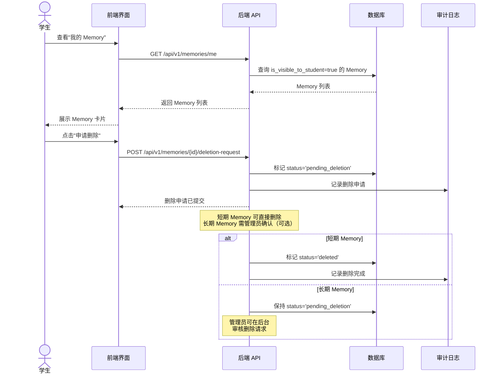
```mermaid
sequenceDiagram
    actor Student as 学生
    participant UI as 前端界面
    participant API as 后端 API
    participant DB as 数据库
    participant Log as 审计日志

    Student->>UI: 查看"我的 Memory"
    UI->>API: GET /api/v1/memories/me
    API->>DB: 查询 is_visible_to_student=true 的 Memory
    DB-->>API: Memory 列表
    API-->>UI: 返回 Memory 列表
    UI-->>Student: 展示 Memory 卡片

    Student->>UI: 点击"申请删除"
    UI->>API: POST /api/v1/memories/{id}/deletion-request
    API->>DB: 标记 status='pending_deletion'
    API->>Log: 记录删除申请
    API-->>UI: 删除申请已提交

    Note over API: 短期 Memory 可直接删除<br/>长期 Memory 需管理员确认（可选）

    alt 短期 Memory
        API->>DB: 标记 status='deleted'
        API->>Log: 记录删除完成
    else 长期 Memory
        API->>DB: 保持 status='pending_deletion'
        Note over API: 管理员可在后台<br/>审核删除请求
    end
```

### 5.8 审计日志（Memory Audit Trail）

```sql
-- memory_audit_logs 表
CREATE TABLE memory_audit_logs (
    id              UUID PRIMARY KEY DEFAULT gen_random_uuid(),
    memory_id       UUID NOT NULL REFERENCES student_memories(id),
    user_id         UUID NOT NULL REFERENCES users(id),
    action          VARCHAR(30) NOT NULL,      -- created/updated/promoted/decayed/deleted/conflict_resolved
    old_values      JSONB,                     -- 变更前的值
    new_values      JSONB,                     -- 变更后的值
    reason          TEXT,                      -- 变更原因
    triggered_by    VARCHAR(30) NOT NULL,      -- system/llm/student/teacher/admin
    created_at      TIMESTAMPTZ NOT NULL DEFAULT NOW()
);

CREATE INDEX idx_memory_audit_memory
    ON memory_audit_logs (memory_id);
CREATE INDEX idx_memory_audit_user
    ON memory_audit_logs (user_id, created_at DESC);
```

示例审计日志：

```json
{
  "id": "audit-001",
  "memory_id": "mem-st-001",
  "user_id": "student-001",
  "action": "updated",
  "old_values": {
    "content": "最近在学习 NLP 和 Transformer 相关内容",
    "confidence": 0.55,
    "observation_count": 3
  },
  "new_values": {
    "content": "最近在集中学习 Transformer 和注意力机制相关内容",
    "confidence": 0.72,
    "observation_count": 5
  },
  "reason": "2026-06-01 复盘发现继续学习 Transformer 内容，更新描述并提升置信度",
  "triggered_by": "llm",
  "created_at": "2026-06-02T00:05:30Z"
}
```

---

## 6. 每日 0 点复盘流程

### 6.1 整体流程图

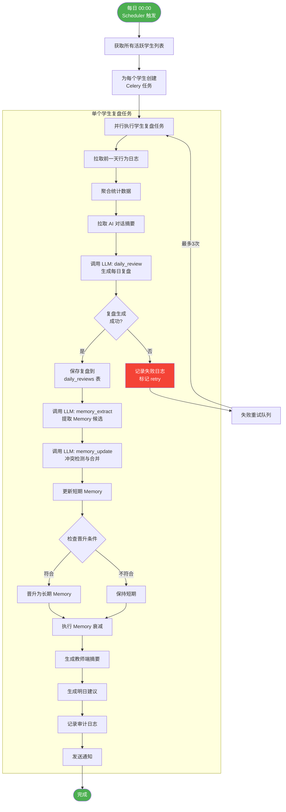
```mermaid
flowchart TB
    Start([每日 00:00<br/>Scheduler 触发]) --> A[获取所有活跃学生列表]
    A --> B[为每个学生创建<br/>Celery 任务]
    B --> C[并行执行学生复盘任务]

    subgraph 单个学生复盘任务
        C --> D[拉取前一天行为日志]
        D --> E[聚合统计数据]
        E --> F[拉取 AI 对话摘要]
        F --> G["调用 LLM: daily_review<br/>生成每日复盘"]
        G --> H{复盘生成<br/>成功?}
        H -->|否| I[记录失败日志<br/>标记 retry]
        H -->|是| J[保存复盘到<br/>daily_reviews 表]
        J --> K["调用 LLM: memory_extract<br/>提取 Memory 候选"]
        K --> L["调用 LLM: memory_update<br/>冲突检测与合并"]
        L --> M[更新短期 Memory]
        M --> N{检查晋升条件}
        N -->|符合| O[晋升为长期 Memory]
        N -->|不符合| P[保持短期]
        O --> Q[执行 Memory 衰减]
        P --> Q
        Q --> R[生成教师端摘要]
        R --> S[生成明日建议]
        S --> T[记录审计日志]
        T --> U[发送通知]
    end

    I --> V[失败重试队列]
    V -->|最多3次| C
    U --> W([完成])

    style Start fill:#4CAF50,color:white
    style W fill:#4CAF50,color:white
    style I fill:#f44336,color:white
```

### 6.2 详细步骤说明

#### Step 1：Scheduler 触发

```python
# app/tasks/scheduler.py

from apscheduler.schedulers.asyncio import AsyncIOScheduler
from apscheduler.triggers.cron import CronTrigger


def setup_scheduler():
    scheduler = AsyncIOScheduler()
    
    # 每日 00:00 触发复盘
    scheduler.add_job(
        trigger_daily_review,
        trigger=CronTrigger(hour=0, minute=0),
        id="daily_review",
        name="每日学习复盘",
        misfire_grace_time=3600  # 如果错过，1小时内仍会执行
    )
    
    # 每日 00:30 触发 Memory 衰减
    scheduler.add_job(
        trigger_memory_decay,
        trigger=CronTrigger(hour=0, minute=30),
        id="memory_decay",
        name="Memory 每日衰减"
    )
    
    scheduler.start()
    return scheduler
```

#### Step 2：为每个学生创建 Celery 任务

```python
# app/tasks/daily_review.py

from celery import group
from app.workers.celery_app import celery_app


async def trigger_daily_review():
    """触发所有活跃学生的每日复盘"""
    
    # 获取活跃学生列表（最近 7 天有登录行为）
    active_students = await get_active_students(days=7)
    
    if not active_students:
        logger.info("没有活跃学生，跳过每日复盘")
        return
    
    # 获取复盘日期（昨天）
    from datetime import date, timedelta
    review_date = date.today() - timedelta(days=1)
    
    # 创建并行任务组
    tasks = group(
        process_student_review.s(
            student_id=str(student.id),
            review_date=review_date.isoformat()
        )
        for student in active_students
    )
    
    # 执行（带超时和重试）
    result = tasks.apply_async()
    logger.info(f"已触发 {len(active_students)} 个学生的每日复盘任务")
    
    return result
```

#### Step 3：单个学生复盘详细流程

```python
# app/tasks/daily_review.py

@celery_app.task(
    bind=True,
    max_retries=3,
    default_retry_delay=300,  # 5分钟后重试
    time_limit=600,           # 单个任务最长10分钟
    soft_time_limit=540
)
def process_student_review(self, student_id: str, review_date: str):
    """处理单个学生的每日复盘"""
    import asyncio
    return asyncio.get_event_loop().run_until_complete(
        _async_process_student_review(self, student_id, review_date)
    )


async def _async_process_student_review(task, student_id: str, review_date: str):
    """单个学生的完整复盘流程"""
    
    review_date = date.fromisoformat(review_date)
    logger.info(f"开始处理学生 {student_id} 的 {review_date} 复盘")
    
    try:
        # ===== Step 3a: 拉取行为日志 =====
        behavior_logs = await get_behavior_logs(
            user_id=student_id,
            start_date=review_date,
            end_date=review_date
        )
        
        if not behavior_logs:
            # 当天无行为，生成简略复盘
            await create_inactive_review(student_id, review_date)
            return {"status": "skipped", "reason": "no_activity"}
        
        # ===== Step 3b: 聚合统计数据 =====
        stats = aggregate_daily_stats(behavior_logs)
        """
        stats = {
            "online_duration_min": 245,
            "bilibili_duration_min": 90,
            "todo_created": 4,
            "todo_completed": 3,
            "tasks_submitted": 1,
            ...
        }
        """
        
        # ===== Step 3c: 拉取AI对话摘要 =====
        chat_summary = await get_daily_chat_summary(student_id, review_date)
        
        # ===== Step 3d: 获取历史对比数据 =====
        historical = await get_historical_comparison(student_id, review_date)
        
        # ===== Step 3e: 获取当前 Memory =====
        current_memories = await get_student_memories(student_id)
        
        # ===== Step 3f: 调用 LLM 生成复盘 =====
        review_result = await llm_router.route(
            task_type="daily_review",
            messages=build_daily_review_prompt(
                student=await get_student(student_id),
                stats=stats,
                chat_summary=chat_summary,
                historical=historical,
                current_memories=current_memories,
                review_date=review_date
            ),
            user_id=student_id
        )
        
        review_data = parse_review_json(review_result.content)
        
        # ===== Step 3g: 保存复盘 =====
        daily_review = await save_daily_review(
            user_id=student_id,
            review_date=review_date,
            stats=stats,
            review_data=review_data,
            llm_model=review_result.model
        )
        
        # ===== Step 3h: 提取 Memory 候选 =====
        memory_candidates = await llm_router.route(
            task_type="memory_extract",
            messages=build_memory_extract_prompt(
                student=await get_student(student_id),
                review_data=review_data,
                weekly_summary=await get_weekly_summary(student_id),
                current_memories=current_memories
            ),
            user_id=student_id
        )
        
        candidates = parse_memory_candidates(memory_candidates.content)
        
        # ===== Step 3i: 冲突检测与 Memory 更新 =====
        if candidates.get("new_memories") or candidates.get("update_existing"):
            update_result = await llm_router.route(
                task_type="memory_update",
                messages=build_memory_update_prompt(
                    current_memories=current_memories,
                    new_candidates=candidates
                ),
                user_id=student_id
            )
            
            final_updates = parse_memory_updates(update_result.content)
            await apply_memory_updates(student_id, final_updates)
        
        # ===== Step 3j: 检查晋升条件 =====
        await check_and_promote_memories(student_id)
        
        # ===== Step 3k: 发送通知 =====
        await send_review_notification(student_id, review_date, review_data)
        
        logger.info(f"学生 {student_id} 的 {review_date} 复盘完成")
        return {"status": "success", "review_id": str(daily_review.id)}
        
    except Exception as e:
        logger.error(f"学生 {student_id} 复盘失败: {e}", exc_info=True)
        # 记录失败
        await mark_review_failed(student_id, review_date, str(e))
        # 触发重试
        raise task.retry(exc=e)
```

#### Step 4：生成教师端摘要

复盘完成后，系统为每位教师生成其负责学生的汇总视图：

```python
async def generate_teacher_summaries(review_date: date):
    """生成教师端学生学习摘要"""
    
    teachers = await get_all_teachers()
    
    for teacher in teachers:
        students = await get_teacher_students(teacher.id)
        student_reviews = []
        
        for student in students:
            review = await get_daily_review(student.id, review_date)
            if review:
                student_reviews.append({
                    "student_name": student.name,
                    "teacher_summary": review.teacher_summary,
                    "effort_score": review.effort_score,
                    "procrastination_risk": review.procrastination_risk,
                    "online_duration_min": review.online_duration_min,
                    "tasks_completed": review.tasks_completed,
                    "tasks_overdue": review.tasks_overdue
                })
        
        # 保存教师端汇总
        await save_teacher_daily_summary(teacher.id, review_date, student_reviews)
        
        # 如果有异常学生，发送提醒
        risk_students = [
            s for s in student_reviews 
            if s["procrastination_risk"] == "high" or s["tasks_overdue"] > 0
        ]
        if risk_students:
            await notify_teacher_risk_alert(teacher.id, risk_students)
```

### 6.3 复盘时序图

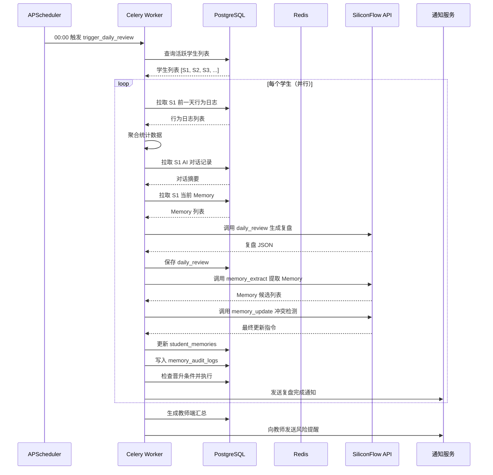
```mermaid
sequenceDiagram
    participant Scheduler as APScheduler
    participant Celery as Celery Worker
    participant DB as PostgreSQL
    participant Redis as Redis
    participant LLM as SiliconFlow API
    participant Notify as 通知服务

    Scheduler->>Celery: 00:00 触发 trigger_daily_review
    Celery->>DB: 查询活跃学生列表
    DB-->>Celery: 学生列表 [S1, S2, S3, ...]

    loop 每个学生（并行）
        Celery->>DB: 拉取 S1 前一天行为日志
        DB-->>Celery: 行为日志列表
        Celery->>Celery: 聚合统计数据
        Celery->>DB: 拉取 S1 AI 对话记录
        DB-->>Celery: 对话摘要
        Celery->>DB: 拉取 S1 当前 Memory
        DB-->>Celery: Memory 列表

        Celery->>LLM: 调用 daily_review 生成复盘
        LLM-->>Celery: 复盘 JSON
        Celery->>DB: 保存 daily_review

        Celery->>LLM: 调用 memory_extract 提取 Memory
        LLM-->>Celery: Memory 候选列表

        Celery->>LLM: 调用 memory_update 冲突检测
        LLM-->>Celery: 最终更新指令

        Celery->>DB: 更新 student_memories
        Celery->>DB: 写入 memory_audit_logs
        Celery->>DB: 检查晋升条件并执行

        Celery->>Notify: 发送复盘完成通知
    end

    Celery->>DB: 生成教师端汇总
    Celery->>Notify: 向教师发送风险提醒
```

---

## 7. 对话上下文构建

### 7.1 Context Builder 架构

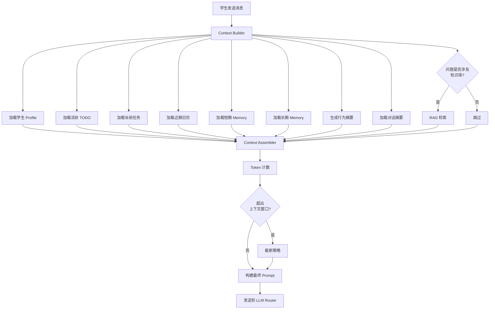
```mermaid
flowchart TB
    A[学生发送消息] --> B[Context Builder]
    
    B --> C[加载学生 Profile]
    B --> D[加载活跃 TODO]
    B --> E[加载当前任务]
    B --> F[加载近期日历]
    B --> G[加载短期 Memory]
    B --> H[加载长期 Memory]
    B --> I[生成行为摘要]
    B --> J[加载对话摘要]
    B --> K{问题是否涉及<br/>知识库?}
    K -->|是| L[RAG 检索]
    K -->|否| M[跳过]
    
    C & D & E & F & G & H & I & J & L & M --> N[Context Assembler]
    N --> O[Token 计数]
    O --> P{超出<br/>上下文窗口?}
    P -->|是| Q[截断策略]
    P -->|否| R[构建最终 Prompt]
    Q --> R
    R --> S[发送到 LLM Router]
```

### 7.2 上下文注入顺序与 Token 预算

上下文窗口管理采用**优先级分配制**，为每个上下文模块分配 Token 预算：

| 优先级 | 上下文模块 | Token 预算 | 截断策略 |
|--------|-----------|-----------|---------|
| P0（必选） | System Prompt 基础部分 | 500 | 不截断 |
| P0（必选） | 长期 Memory | 400 | 按 confidence 排序，截断低置信度 |
| P0（必选） | 短期 Memory | 300 | 按 confidence 排序，截断低置信度 |
| P1（重要） | 当前 TODO + 任务 | 400 | 只保留标题和状态 |
| P1（重要） | 近期日历 | 200 | 只保留未来 7 天 |
| P1（重要） | 最近行为摘要 | 300 | 压缩为统计数据 |
| P2（可选） | 最近对话摘要 | 300 | 压缩为关键信息 |
| P2（可选） | RAG 检索结果 | 800 | 只保留 top-3 chunks |
| — | 对话历史 | 剩余空间 | FIFO 截断旧消息 |

**总 Token 预算**：根据模型上下文窗口动态调整（如 Qwen2.5-7B 支持 32K）

### 7.3 Context Builder 实现

```python
# app/core/ai/context_builder.py

from dataclasses import dataclass


@dataclass
class ContextBudget:
    """上下文 Token 预算"""
    system_base: int = 500
    long_term_memory: int = 400
    short_term_memory: int = 300
    todos_tasks: int = 400
    calendar: int = 200
    behavior_summary: int = 300
    conversation_summary: int = 300
    rag_context: int = 800
    # 对话历史使用剩余空间


class ContextBuilder:
    """对话上下文构建器"""
    
    def __init__(self, llm_router, rag_engine, db_session):
        self.llm_router = llm_router
        self.rag_engine = rag_engine
        self.db = db_session
        self.budget = ContextBudget()
        self.tokenizer = get_tokenizer()  # tiktoken 或类似工具
    
    async def build_context(
        self,
        student_id: str,
        user_message: str,
        conversation_history: list[dict],
        max_context_tokens: int = 8192
    ) -> list[ChatMessage]:
        """构建完整的对话上下文"""
        
        messages = []
        used_tokens = 0
        
        # ===== 1. 加载学生数据（并行） =====
        student, todos, tasks, calendar, short_mem, long_mem, \
            behavior_summary, conv_summary = await asyncio.gather(
            self._load_student_profile(student_id),
            self._load_active_todos(student_id),
            self._load_active_tasks(student_id),
            self._load_upcoming_calendar(student_id),
            self._load_short_term_memories(student_id),
            self._load_long_term_memories(student_id),
            self._load_behavior_summary(student_id),
            self._load_conversation_summary(student_id)
        )
        
        # ===== 2. 判断是否需要 RAG =====
        rag_context = ""
        if await self._should_use_rag(user_message, student_id):
            rag_results = await self.rag_engine.search(
                query=user_message,
                user_id=student_id,
                top_k=3
            )
            rag_context = self._format_rag_results(rag_results)
        
        # ===== 3. 构建 System Prompt =====
        system_prompt = self._build_system_prompt(
            student=student,
            short_term_memory=self._truncate_to_budget(
                self._format_memories(short_mem), 
                self.budget.short_term_memory
            ),
            long_term_memory=self._truncate_to_budget(
                self._format_memories(long_mem),
                self.budget.long_term_memory
            ),
            todos=self._truncate_to_budget(
                self._format_todos(todos),
                self.budget.todos_tasks // 2
            ),
            tasks=self._truncate_to_budget(
                self._format_tasks(tasks),
                self.budget.todos_tasks // 2
            ),
            calendar=self._truncate_to_budget(
                self._format_calendar(calendar),
                self.budget.calendar
            ),
            behavior_summary=self._truncate_to_budget(
                behavior_summary,
                self.budget.behavior_summary
            ),
            conversation_summary=self._truncate_to_budget(
                conv_summary,
                self.budget.conversation_summary
            ),
            rag_context=self._truncate_to_budget(
                rag_context,
                self.budget.rag_context
            )
        )
        
        system_tokens = self._count_tokens(system_prompt)
        messages.append(ChatMessage(role="system", content=system_prompt))
        used_tokens += system_tokens
        
        # ===== 4. 填充对话历史（FIFO 截断） =====
        remaining_tokens = max_context_tokens - used_tokens - 500  # 预留输出空间
        
        history_messages = []
        for msg in reversed(conversation_history):
            msg_tokens = self._count_tokens(msg["content"])
            if remaining_tokens - msg_tokens < 0:
                break
            history_messages.insert(0, ChatMessage(
                role=msg["role"],
                content=msg["content"]
            ))
            remaining_tokens -= msg_tokens
        
        # 如果历史过长且被截断，在开头加入摘要提示
        if len(history_messages) < len(conversation_history):
            truncation_note = ChatMessage(
                role="system",
                content="[注意：以下仅为近期对话历史，更早的对话已被压缩为上方的对话摘要]"
            )
            messages.append(truncation_note)
        
        messages.extend(history_messages)
        
        # ===== 5. 添加当前用户消息 =====
        messages.append(ChatMessage(role="user", content=user_message))
        
        return messages
    
    async def _should_use_rag(self, message: str, student_id: str) -> bool:
        """判断是否需要 RAG 检索（基于简单规则 + 关键词）"""
        # 规则1: 包含知识库相关关键词
        kb_keywords = ["知识库", "资料", "文档", "论文", "文件", "资源"]
        if any(kw in message for kw in kb_keywords):
            return True
        
        # 规则2: 消息足够长且像是学术问题
        if len(message) > 20:
            return True
        
        return False
    
    def _truncate_to_budget(self, text: str, max_tokens: int) -> str:
        """将文本截断到 Token 预算内"""
        tokens = self.tokenizer.encode(text)
        if len(tokens) <= max_tokens:
            return text
        truncated = self.tokenizer.decode(tokens[:max_tokens])
        return truncated + "\n[...内容已截断]"
    
    def _count_tokens(self, text: str) -> int:
        return len(self.tokenizer.encode(text))
```

### 7.4 对话历史压缩策略

当对话历史超出上下文窗口时，采用滑动窗口 + 摘要压缩：

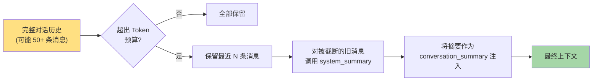
```mermaid
flowchart LR
    A["完整对话历史<br/>(可能 50+ 条消息)"] --> B{超出 Token<br/>预算?}
    B -->|否| C[全部保留]
    B -->|是| D[保留最近 N 条消息]
    D --> E[对被截断的旧消息<br/>调用 system_summary]
    E --> F[将摘要作为<br/>conversation_summary 注入]
    F --> G[最终上下文]

    style A fill:#FFE082
    style G fill:#A5D6A7
```

压缩触发条件：
- 对话历史 Token 数超过 `max_context_tokens × 0.4`
- 对话轮次超过 20 轮

---

## 8. 知识库 RAG 流程

### 8.1 端到端流程

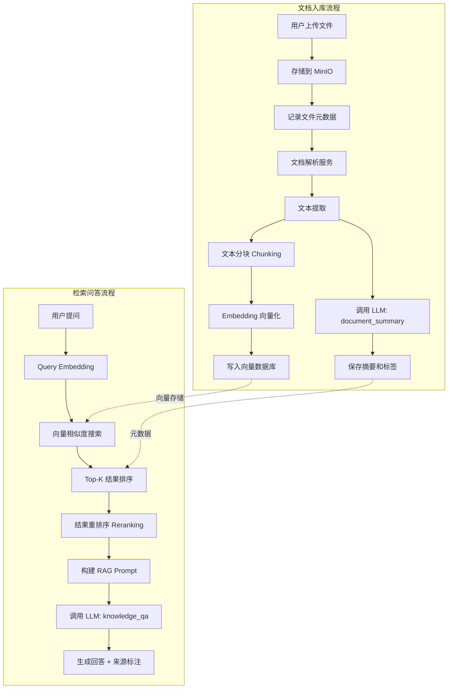
```mermaid
flowchart TB
    subgraph 文档入库流程
        A[用户上传文件] --> B[存储到 MinIO]
        B --> C[记录文件元数据]
        C --> D[文档解析服务]
        D --> E[文本提取]
        E --> F[文本分块 Chunking]
        F --> G["Embedding 向量化"]
        G --> H[写入向量数据库]
        E --> I["调用 LLM: document_summary"]
        I --> J[保存摘要和标签]
    end

    subgraph 检索问答流程
        K[用户提问] --> L["Query Embedding"]
        L --> M[向量相似度搜索]
        M --> N[Top-K 结果排序]
        N --> O[结果重排序 Reranking]
        O --> P[构建 RAG Prompt]
        P --> Q["调用 LLM: knowledge_qa"]
        Q --> R[生成回答 + 来源标注]
    end

    H -.->|向量存储| M
    J -.->|元数据| N
```

### 8.2 文档解析与分块策略

#### 支持的文件类型

| 文件类型 | 解析方式 | 优先级 |
|---------|---------|--------|
| PDF | PyPDF2 / pdfplumber | P0 |
| Word (.docx) | python-docx | P0 |
| Markdown (.md) | markdown-it-py | P0 |
| TXT | 直接读取 | P0 |
| PPT (.pptx) | python-pptx | P1 |
| Excel (.xlsx) | openpyxl | P2 |

#### 分块策略

```python
# app/core/rag/chunker.py

class DocumentChunker:
    """文档分块器"""
    
    # 默认配置
    DEFAULT_CHUNK_SIZE = 500      # 每个 chunk 的目标字符数
    DEFAULT_CHUNK_OVERLAP = 50    # chunk 之间的重叠字符数
    MIN_CHUNK_SIZE = 100          # 最小 chunk 大小
    MAX_CHUNK_SIZE = 1000         # 最大 chunk 大小
    
    def chunk_document(
        self,
        text: str,
        chunk_size: int = DEFAULT_CHUNK_SIZE,
        chunk_overlap: int = DEFAULT_CHUNK_OVERLAP,
        split_by: str = "paragraph"   # paragraph | sentence | fixed
    ) -> list[dict]:
        """将文档文本分割为 chunks"""
        
        if split_by == "paragraph":
            return self._split_by_paragraph(text, chunk_size, chunk_overlap)
        elif split_by == "sentence":
            return self._split_by_sentence(text, chunk_size, chunk_overlap)
        else:
            return self._split_fixed(text, chunk_size, chunk_overlap)
    
    def _split_by_paragraph(self, text, chunk_size, overlap):
        """按段落分割，尽量保持段落完整性"""
        paragraphs = text.split('\n\n')
        chunks = []
        current_chunk = ""
        current_start = 0
        char_position = 0
        
        for para in paragraphs:
            para = para.strip()
            if not para:
                char_position += 2
                continue
            
            if len(current_chunk) + len(para) > chunk_size and current_chunk:
                chunks.append({
                    "content": current_chunk.strip(),
                    "char_start": current_start,
                    "char_end": char_position,
                    "chunk_index": len(chunks)
                })
                # 保留 overlap
                overlap_text = current_chunk[-overlap:] if overlap > 0 else ""
                current_chunk = overlap_text + para + "\n\n"
                current_start = char_position - len(overlap_text)
            else:
                current_chunk += para + "\n\n"
            
            char_position += len(para) + 2
        
        if current_chunk.strip():
            chunks.append({
                "content": current_chunk.strip(),
                "char_start": current_start,
                "char_end": char_position,
                "chunk_index": len(chunks)
            })
        
        return chunks
```

#### 知识库数据表

```sql
-- knowledge_chunks 表
CREATE TABLE knowledge_chunks (
    id              UUID PRIMARY KEY DEFAULT gen_random_uuid(),
    document_id     UUID NOT NULL REFERENCES knowledge_documents(id) ON DELETE CASCADE,
    chunk_index     INTEGER NOT NULL,
    content         TEXT NOT NULL,
    char_start      INTEGER,
    char_end        INTEGER,
    token_count     INTEGER,
    embedding_model VARCHAR(100),
    embedding_id    VARCHAR(200),      -- 向量数据库中的 ID
    metadata        JSONB DEFAULT '{}',
    created_at      TIMESTAMPTZ NOT NULL DEFAULT NOW(),
    
    CONSTRAINT uq_chunk_doc_index UNIQUE (document_id, chunk_index)
);
```

### 8.3 Embedding 模型选择

| 模型 | 维度 | 来源 | 用途 | 说明 |
|------|------|------|------|------|
| BAAI/bge-large-zh-v1.5 | 1024 | SiliconFlow | 中文文档主力 | 中文效果最佳 |
| BAAI/bge-m3 | 1024 | SiliconFlow | 多语言 | 中英混合文档 |
| nomic-embed-text | 768 | Ollama (本地) | 降级备选 | 本地部署无需网络 |

### 8.4 向量检索与重排序

```python
# app/core/rag/retriever.py

from qdrant_client import QdrantClient
from qdrant_client.models import Filter, FieldCondition, MatchValue


class RAGRetriever:
    """知识库检索器"""
    
    def __init__(self, qdrant_client: QdrantClient, llm_router):
        self.qdrant = qdrant_client
        self.llm_router = llm_router
        self.collection_name = "knowledge_base"
    
    async def search(
        self,
        query: str,
        user_id: str,
        top_k: int = 5,
        score_threshold: float = 0.5,
        filter_tags: list[str] = None
    ) -> list[dict]:
        """执行向量检索"""
        
        # 1. 生成查询向量
        query_embedding = await self.llm_router.providers["siliconflow"].embedding(
            text=query,
            model="BAAI/bge-large-zh-v1.5"
        )
        
        # 2. 构建过滤条件
        search_filter = None
        if filter_tags:
            search_filter = Filter(
                must=[
                    FieldCondition(
                        key="tags",
                        match=MatchValue(value=tag)
                    ) for tag in filter_tags
                ]
            )
        
        # 3. 向量检索
        results = self.qdrant.search(
            collection_name=self.collection_name,
            query_vector=query_embedding.embedding,
            limit=top_k * 2,  # 多检索一些用于重排序
            score_threshold=score_threshold,
            query_filter=search_filter
        )
        
        # 4. 重排序（按相关度 + 时效性）
        ranked_results = self._rerank(results, query)
        
        # 5. 返回 Top-K
        return [
            {
                "chunk_id": r.id,
                "content": r.payload["content"],
                "document_title": r.payload["document_title"],
                "document_id": r.payload["document_id"],
                "relevance_score": r.score,
                "uploader": r.payload.get("uploader", "未知"),
                "upload_time": r.payload.get("upload_time", ""),
                "chunk_index": r.payload.get("chunk_index", 0)
            }
            for r in ranked_results[:top_k]
        ]
    
    def _rerank(self, results, query):
        """简单重排序：综合相关度和时效性"""
        for r in results:
            time_score = self._time_decay_score(r.payload.get("upload_time"))
            r.score = r.score * 0.8 + time_score * 0.2
        
        return sorted(results, key=lambda r: r.score, reverse=True)
```

### 8.5 RAG 回答中的来源引用

```text
## AI 回答示例

根据知识库中的资料，Transformer 的自注意力机制主要包含以下步骤：

1. **Query、Key、Value 的计算**：通过线性变换将输入向量映射为 Q、K、V 三个矩阵 【来源：Transformer 原理详解.pdf】

2. **注意力权重计算**：使用 Scaled Dot-Product Attention 公式 Attention(Q,K,V) = softmax(QK^T / √d_k) × V 【来源：Attention Is All You Need 论文笔记.md】

3. **多头注意力**：将上述过程并行执行 h 次（通常 h=8），最后拼接结果 【来源：Transformer 原理详解.pdf】

> 如需查看原始文档，可在知识库中搜索相关资料。
```

---

## 9. Memory 安全与隐私

### 9.1 数据分类与保护级别

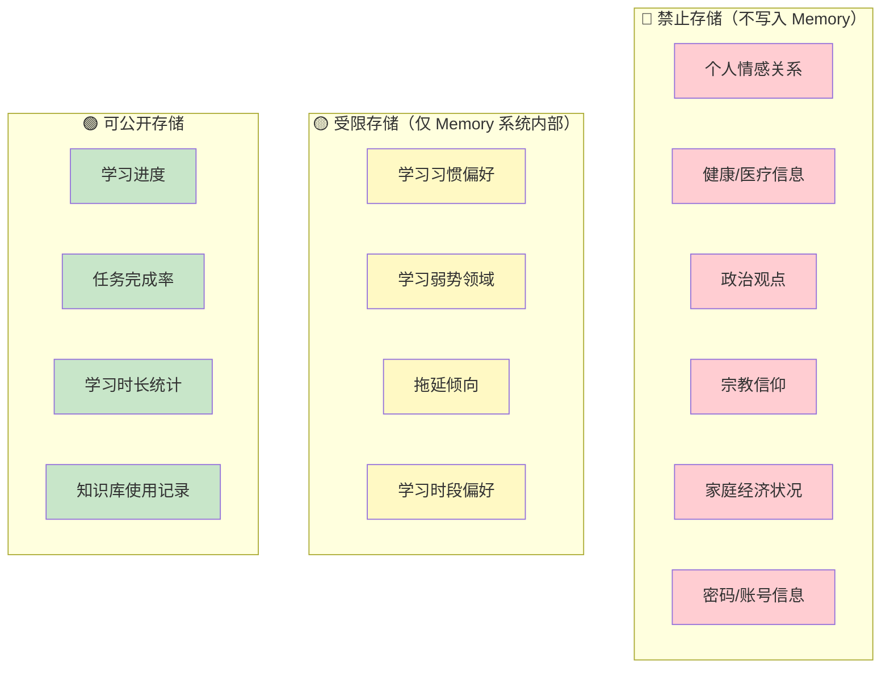
```mermaid
graph TB
    subgraph "🔴 禁止存储（不写入 Memory）"
        A1[个人情感关系]
        A2[健康/医疗信息]
        A3[政治观点]
        A4[宗教信仰]
        A5[家庭经济状况]
        A6[密码/账号信息]
    end

    subgraph "🟡 受限存储（仅 Memory 系统内部）"
        B1[学习习惯偏好]
        B2[学习弱势领域]
        B3[拖延倾向]
        B4[学习时段偏好]
    end

    subgraph "🟢 可公开存储"
        C1[学习进度]
        C2[任务完成率]
        C3[学习时长统计]
        C4[知识库使用记录]
    end

    style A1 fill:#FFCDD2
    style A2 fill:#FFCDD2
    style A3 fill:#FFCDD2
    style A4 fill:#FFCDD2
    style A5 fill:#FFCDD2
    style A6 fill:#FFCDD2
    style B1 fill:#FFF9C4
    style B2 fill:#FFF9C4
    style B3 fill:#FFF9C4
    style B4 fill:#FFF9C4
    style C1 fill:#C8E6C9
    style C2 fill:#C8E6C9
    style C3 fill:#C8E6C9
    style C4 fill:#C8E6C9
```

### 9.2 各角色数据访问权限矩阵

| 数据类型 | 学生本人 | 教师 | 管理员 |
|---------|---------|------|--------|
| 原始行为日志 | ❌ 不可见 | ❌ 不可见 | ✅ 可查看（审计用） |
| 每日复盘 (summary) | ✅ 完整查看 | ✅ teacher_summary 字段 | ✅ 可查看 |
| 短期 Memory | ✅ 标记为可见的 | ❌ 不可直接查看 | ✅ 审计日志 |
| 长期 Memory | ✅ 标记为可见的 | ❌ 不可直接查看 | ✅ 审计日志 |
| AI 对话原文 | ✅ 完整查看 | ❌ 仅看对话统计 | ❌ 仅看调用日志 |
| Memory 审计日志 | ❌ 不可见 | ❌ 不可见 | ✅ 可查看 |
| LLM 调用日志 | ❌ 不可见 | ❌ 不可见 | ✅ 可查看 |

### 9.3 学生 Memory 可见性

学生在"我的 Memory"页面可以看到的信息：

```json
{
  "visible_memories": [
    {
      "id": "mem-xxx",
      "content": "你最近在集中学习 Transformer 和注意力机制",
      "category": "learning_focus",
      "layer": "short_term",
      "confidence_level": "较高",    // 模糊化展示，不显示精确数值
      "last_updated": "2026-06-01",
      "can_delete": true
    }
  ],
  "hidden_info": [
    // 以下信息对学生不可见：
    // - 精确 confidence 数值
    // - evidence 详情
    // - 审计日志
    // - decay_rate
    // - observation_count 精确数
  ]
}
```

### 9.4 Memory 删除工作流

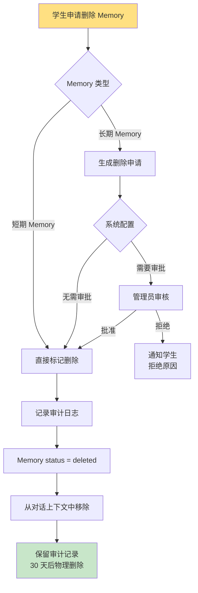
```mermaid
flowchart TD
    A[学生申请删除 Memory] --> B{Memory 类型}
    B -->|短期 Memory| C[直接标记删除]
    B -->|长期 Memory| D[生成删除申请]
    C --> E[记录审计日志]
    D --> F{系统配置}
    F -->|需要审批| G[管理员审核]
    F -->|无需审批| C
    G -->|批准| C
    G -->|拒绝| H[通知学生<br/>拒绝原因]
    E --> I[Memory status = deleted]
    I --> J[从对话上下文中移除]
    J --> K[保留审计记录<br/>30 天后物理删除]

    style A fill:#FFE082
    style K fill:#C8E6C9
```

### 9.5 对话隐私保护

```python
# 对话内容的隐私保护规则

PRIVACY_RULES = {
    # 1. AI 对话原文不暴露给教师
    "teacher_access_to_conversations": "summary_only",
    
    # 2. Memory 提取时过滤敏感内容
    "sensitive_content_filter": [
        "情感", "恋爱", "分手", "生病", "医院",
        "家庭", "经济", "贷款", "宗教", "政治"
    ],
    
    # 3. 管理员查看日志时脱敏
    "admin_log_access": "metadata_only",  # 只看调用统计，不看内容
    
    # 4. 数据导出限制
    "data_export": {
        "student": ["own_reviews", "own_visible_memories"],
        "teacher": ["student_summaries", "task_stats"],
        "admin": ["system_stats", "audit_logs"]
    }
}
```

---

## 10. 性能与可靠性

### 10.1 异步处理架构

```mermaid
graph LR
    subgraph 同步请求
        A[AI 对话] -->|SSE 流式| B[FastAPI]
        C[知识库搜索] --> B
    end

    subgraph 异步任务（Celery）
        B --> D[Redis Broker]
        D --> E[Worker 1: 每日复盘]
        D --> F[Worker 2: Memory 更新]
        D --> G[Worker 3: 文档处理]
        D --> H[Worker 4: 通知发送]
    end

    subgraph 定时任务（APScheduler）
        I[每日 00:00 复盘]
        J[每日 00:30 衰减]
        K[每周 Stats 报告]
    end

    I --> D
    J --> D
    K --> D
```

### 10.2 重试策略

```python
# 不同任务类型的重试配置
RETRY_CONFIGS = {
    "daily_review": {
        "max_retries": 3,
        "retry_delays": [300, 600, 1800],   # 5min, 10min, 30min
        "timeout": 600                        # 单次最长 10 分钟
    },
    "memory_extract": {
        "max_retries": 2,
        "retry_delays": [60, 300],
        "timeout": 120
    },
    "memory_update": {
        "max_retries": 2,
        "retry_delays": [60, 300],
        "timeout": 120
    },
    "document_processing": {
        "max_retries": 3,
        "retry_delays": [60, 300, 600],
        "timeout": 900                        # 大文件最长 15 分钟
    },
    "notification": {
        "max_retries": 5,
        "retry_delays": [10, 30, 60, 300, 600],
        "timeout": 30
    }
}
```

### 10.3 超时处理

```python
# app/core/llm/timeout.py

import asyncio
from contextlib import asynccontextmanager


@asynccontextmanager
async def llm_timeout(seconds: int, task_type: str):
    """LLM 调用超时保护"""
    try:
        yield
    except asyncio.TimeoutError:
        logger.error(f"LLM 调用超时 [{task_type}]: {seconds}s")
        # 对于可降级的任务，返回默认值
        if task_type in ("system_summary", "document_summary"):
            return get_default_response(task_type)
        raise


# 使用示例
async def call_with_timeout(task_type, messages):
    timeout = RETRY_CONFIGS[task_type]["timeout"]
    async with llm_timeout(timeout, task_type):
        return await asyncio.wait_for(
            llm_router.route(task_type, messages),
            timeout=timeout
        )
```

### 10.4 队列管理

```python
# app/workers/celery_config.py

# Celery 队列配置
CELERY_QUEUES = {
    "default": {
        "exchange": "default",
        "routing_key": "default",
    },
    "daily_review": {
        "exchange": "daily_review",
        "routing_key": "daily_review",
        "consumer_arguments": {"x-priority": 10}   # 高优先级
    },
    "memory": {
        "exchange": "memory",
        "routing_key": "memory.*",
    },
    "document": {
        "exchange": "document",
        "routing_key": "document.*",
    },
    "notification": {
        "exchange": "notification",
        "routing_key": "notification",
        "consumer_arguments": {"x-priority": 5}
    }
}

# 任务路由
CELERY_TASK_ROUTES = {
    "app.tasks.daily_review.*": {"queue": "daily_review"},
    "app.tasks.memory.*": {"queue": "memory"},
    "app.tasks.document.*": {"queue": "document"},
    "app.tasks.notification.*": {"queue": "notification"},
}

# 并发控制
CELERY_WORKER_CONCURRENCY = {
    "daily_review": 3,    # 最多同时处理 3 个学生的复盘
    "memory": 2,
    "document": 2,
    "notification": 5
}
```

### 10.5 每用户速率限制

| 操作类型 | 限制 | 时间窗口 | 说明 |
|---------|------|---------|------|
| AI 对话 | 30 次 | 每小时 | 防止滥用 |
| AI 对话 | 200 次 | 每天 | 日限额 |
| 知识库搜索 | 60 次 | 每小时 | - |
| 文件上传 | 20 个 | 每天 | - |
| 单次对话长度 | 2000 字 | 每条消息 | 防止过长输入 |
| Token 消耗 | 100K | 每天 | 所有 LLM 调用合计 |

### 10.6 监控与告警

```python
# 需要监控的关键指标
MONITORING_METRICS = {
    # LLM 服务
    "llm_latency_p95": {
        "threshold": 10000,   # 10秒
        "alert": "LLM 响应延迟超过 10 秒"
    },
    "llm_error_rate": {
        "threshold": 0.1,     # 10%
        "alert": "LLM 错误率超过 10%"
    },
    "llm_daily_tokens": {
        "threshold": 5_000_000,
        "alert": "每日 Token 消耗接近上限"
    },
    
    # 复盘任务
    "daily_review_failure_count": {
        "threshold": 5,
        "alert": "今日复盘失败数超过 5 个"
    },
    "daily_review_duration": {
        "threshold": 3600,    # 1小时
        "alert": "每日复盘总耗时超过 1 小时"
    },
    
    # 系统资源
    "celery_queue_length": {
        "threshold": 100,
        "alert": "Celery 队列积压超过 100 个任务"
    },
    "postgres_connection_pool": {
        "threshold": 0.8,     # 80%
        "alert": "数据库连接池使用率超过 80%"
    }
}
```

---

## 11. 后续扩展：多智能体协同

### 11.1 智能体类型规划

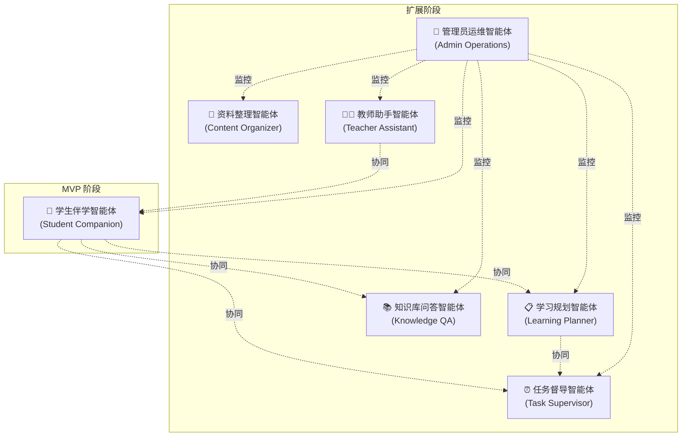
```mermaid
graph TB
    subgraph "MVP 阶段"
        A["🤖 学生伴学智能体<br/>(Student Companion)"]
    end

    subgraph "扩展阶段"
        B["📋 学习规划智能体<br/>(Learning Planner)"]
        C["⏰ 任务督导智能体<br/>(Task Supervisor)"]
        D["📚 知识库问答智能体<br/>(Knowledge QA)"]
        E["📁 资料整理智能体<br/>(Content Organizer)"]
        F["👨‍🏫 教师助手智能体<br/>(Teacher Assistant)"]
        G["🔧 管理员运维智能体<br/>(Admin Operations)"]
    end

    A -.->|协同| B
    A -.->|协同| C
    A -.->|协同| D
    B -.->|协同| C
    F -.->|协同| A
    G -.->|监控| A & B & C & D & E & F
```

### 11.2 各智能体职责定义

| 智能体 | 面向角色 | 核心职责 | 触发方式 |
|--------|---------|---------|---------|
| 学生伴学智能体 | 学生 | 日常对话、学习问答、个性化建议 | 学生主动对话 |
| 学习规划智能体 | 学生/教师 | 周计划/月计划生成、学习路径推荐 | 学生请求或定时 |
| 任务督导智能体 | 学生 | 任务进度追踪、逾期预警、执行建议 | 定时检查 + 事件触发 |
| 知识库问答智能体 | 学生/教师 | RAG 问答、文档理解、跨文档分析 | 学生提问 |
| 资料整理智能体 | 学生/教师 | 文档摘要、标签生成、知识图谱构建 | 文件上传触发 |
| 教师助手智能体 | 教师 | 学生分析、教学建议、批量报告生成 | 教师主动使用 |
| 管理员运维智能体 | 管理员 | 系统状态分析、异常检测、配置建议 | 管理员使用 + 告警触发 |

### 11.3 智能体间通信模式

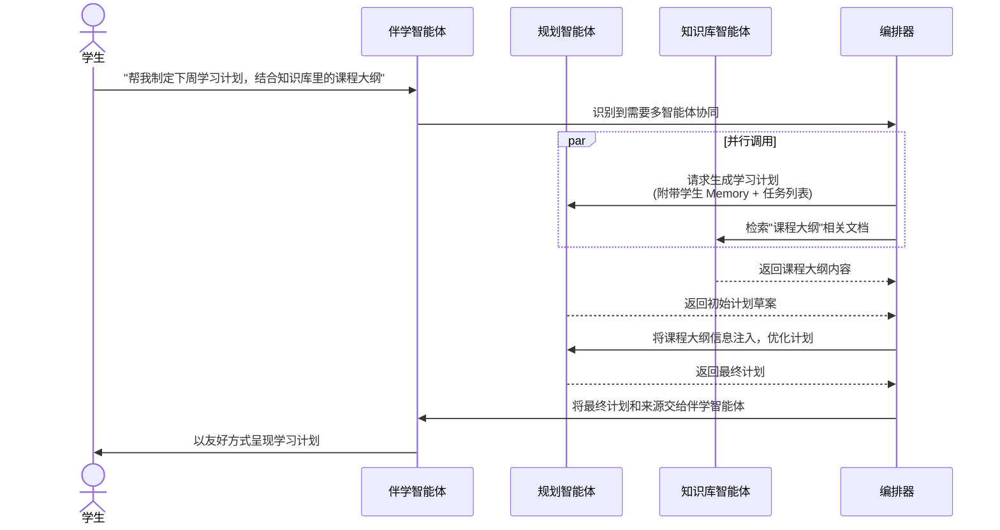
```mermaid
sequenceDiagram
    actor Student as 学生
    participant Companion as 伴学智能体
    participant Planner as 规划智能体
    participant KB as 知识库智能体
    participant Orchestrator as 编排器

    Student->>Companion: "帮我制定下周学习计划，结合知识库里的课程大纲"

    Companion->>Orchestrator: 识别到需要多智能体协同
    
    par 并行调用
        Orchestrator->>Planner: 请求生成学习计划<br/>(附带学生 Memory + 任务列表)
        Orchestrator->>KB: 检索"课程大纲"相关文档
    end

    KB-->>Orchestrator: 返回课程大纲内容
    Planner-->>Orchestrator: 返回初始计划草案

    Orchestrator->>Planner: 将课程大纲信息注入，优化计划
    Planner-->>Orchestrator: 返回最终计划

    Orchestrator->>Companion: 将最终计划和来源交给伴学智能体
    Companion->>Student: 以友好方式呈现学习计划
```

### 11.4 智能体编排工作流

```python
# app/core/agents/orchestrator.py (扩展阶段设计)

class AgentOrchestrator:
    """多智能体编排器"""
    
    ROUTING_RULES = {
        # 意图 → 需要协同的智能体列表
        "create_study_plan": ["planner", "companion"],
        "knowledge_question": ["knowledge_qa", "companion"],
        "task_help": ["task_supervisor", "companion"],
        "organize_documents": ["content_organizer"],
        "teacher_analysis": ["teacher_assistant"],
        "full_planning_with_kb": ["planner", "knowledge_qa", "companion"],
    }
    
    async def orchestrate(
        self,
        intent: str,
        context: dict,
        user_id: str
    ) -> dict:
        """根据意图编排多智能体协同"""
        
        agents_needed = self.ROUTING_RULES.get(intent, ["companion"])
        
        # 1. 并行收集各智能体的输入
        agent_results = {}
        parallel_agents = [a for a in agents_needed if a != "companion"]
        
        tasks = [
            self._call_agent(agent, context)
            for agent in parallel_agents
        ]
        
        results = await asyncio.gather(*tasks, return_exceptions=True)
        
        for agent, result in zip(parallel_agents, results):
            if not isinstance(result, Exception):
                agent_results[agent] = result
        
        # 2. 将结果汇总给 companion 做最终回答
        if "companion" in agents_needed:
            context["agent_results"] = agent_results
            final_response = await self._call_agent("companion", context)
            return final_response
        
        return agent_results
```

### 11.5 扩展路线图

```mermaid
gantt
    title 多智能体协同扩展路线图
    dateFormat  YYYY-MM
    section MVP
    学生伴学智能体        :done, 2026-06, 2026-08
    section 阶段一
    知识库问答智能体       :2026-09, 2026-10
    教师助手智能体         :2026-09, 2026-10
    section 阶段二
    学习规划智能体         :2026-11, 2026-12
    任务督导智能体         :2026-11, 2026-12
    section 阶段三
    资料整理智能体         :2027-01, 2027-02
    管理员运维智能体       :2027-01, 2027-02
    多智能体编排器         :2027-02, 2027-04
    section 长期
    自动周报月报           :2027-03, 2027-05
    学习风险预警系统       :2027-04, 2027-06
```

---

## 附录

### A. 核心 API 端点一览

| 端点 | 方法 | 说明 | 角色 |
|------|------|------|------|
| `/api/v1/ai/chat` | POST | AI 对话（流式 SSE） | 学生 |
| `/api/v1/ai/conversations` | GET | 获取对话列表 | 学生 |
| `/api/v1/ai/conversations/{id}/messages` | GET | 获取对话消息 | 学生 |
| `/api/v1/memories/me` | GET | 获取我的 Memory | 学生 |
| `/api/v1/memories/{id}/deletion-request` | POST | 申请删除 Memory | 学生 |
| `/api/v1/reviews/me` | GET | 获取我的复盘列表 | 学生 |
| `/api/v1/reviews/{date}` | GET | 获取指定日期复盘 | 学生 |
| `/api/v1/knowledge/search` | POST | 知识库搜索 | 学生/教师 |
| `/api/v1/knowledge/upload` | POST | 上传知识库文档 | 学生/教师/管理员 |
| `/api/v1/teacher/students/{id}/reviews` | GET | 查看学生复盘摘要 | 教师 |
| `/api/v1/teacher/ai-assistant` | POST | 教师助手对话 | 教师 |
| `/api/v1/admin/memories/audit-logs` | GET | Memory 审计日志 | 管理员 |
| `/api/v1/admin/llm/usage-logs` | GET | LLM 调用日志 | 管理员 |
| `/api/v1/admin/llm/config` | GET/PUT | LLM 配置管理 | 管理员 |

### B. 环境变量配置

```bash
# LLM Provider
SILICONFLOW_API_KEY=sk-xxxxx
SILICONFLOW_BASE_URL=https://api.siliconflow.cn/v1
DEFAULT_CHAT_MODEL=Qwen/Qwen2.5-7B-Instruct
DEFAULT_EMBEDDING_MODEL=BAAI/bge-large-zh-v1.5

# 向量数据库
QDRANT_HOST=qdrant
QDRANT_PORT=6333
QDRANT_COLLECTION=knowledge_base

# Celery
CELERY_BROKER_URL=redis://redis:6379/1
CELERY_RESULT_BACKEND=redis://redis:6379/2

# 速率限制
RATE_LIMIT_RPM_PER_USER=10
RATE_LIMIT_DAILY_TOKENS_PER_USER=100000
RATE_LIMIT_GLOBAL_RPM=50

# Memory 配置
MEMORY_SHORT_TERM_DECAY_RATE=0.05
MEMORY_LONG_TERM_DECAY_RATE=0.01
MEMORY_SHORT_TERM_THRESHOLD=0.1
MEMORY_LONG_TERM_THRESHOLD=0.15
MEMORY_PROMOTION_MIN_CONFIDENCE=0.7
MEMORY_PROMOTION_MIN_OBSERVATIONS=5
MEMORY_PROMOTION_MIN_DAYS=14
MEMORY_MAX_LONG_TERM_PER_STUDENT=50

# RAG 配置
RAG_CHUNK_SIZE=500
RAG_CHUNK_OVERLAP=50
RAG_TOP_K=5
RAG_SCORE_THRESHOLD=0.5
```

### C. 关键设计决策记录

| 决策 | 选择 | 理由 |
|------|------|------|
| Memory 存储 | PostgreSQL (非向量库) | Memory 条目数量少、需要复杂查询，关系型数据库更合适；向量相似度检测只在冲突检测时偶尔使用 |
| 每日复盘时间 | 00:00 | 用户活动最少的时段，避免影响正常使用 |
| 衰减策略 | 指数衰减 | 更符合记忆遗忘曲线，近期变化影响大，远期影响逐渐消失 |
| 对话上下文 | 优先级预算制 | 比固定窗口更灵活，确保最重要的信息始终存在 |
| Memory 初始置信度上限 | 0.8 | 防止单次观察产生过高置信度的 Memory |
| 长期 Memory 上限 | 50 条/学生 | 防止 Memory 膨胀导致上下文过载和管理困难 |
| 教师对 AI 对话的访问 | 仅摘要 | 保护学生隐私，教师只需了解学习状态而非私密内容 |
| RAG 分块策略 | 按段落优先 | 保持语义完整性，避免在句子中间截断 |
