# 系统架构设计文档

> AI 伴学与智能体协同平台 · System Architecture Design Document

版本：V1.0
文档状态：初稿
最后更新：2026-06-02
关联文档：[PRD 文档](./prd6.2.md)

---

## 目录

1. [系统概述](#一系统概述)
2. [整体架构图](#二整体架构图)
3. [技术栈详细说明](#三技术栈详细说明)
4. [服务拓扑](#四服务拓扑)
5. [前后端分离架构](#五前后端分离架构)
6. [认证与权限架构](#六认证与权限架构)
7. [AI 服务架构](#七ai-服务架构)
8. [数据流架构](#八数据流架构)
9. [文件与知识库架构](#九文件与知识库架构)
10. [异步任务架构](#十异步任务架构)
11. [通知架构](#十一通知架构)
12. [缓存策略](#十二缓存策略)
13. [安全架构](#十三安全架构)
14. [可扩展性设计](#十四可扩展性设计)
15. [目录结构规划](#十五目录结构规划)

---

## 一、系统概述

### 1.1 平台定位

**AI 伴学与智能体协同平台** 是一个通用型 AI 辅助学习平台，旨在为学习者提供一个具备记忆、复盘、建议、协同和知识沉淀能力的智能学习环境。平台不绑定任何特定机构，可灵活部署于个人学习、学校教学、培训机构、企业内训等多种场景。

### 1.2 核心理念

```
学生使用平台 → 系统记录行为 → 每日 0:00 AI 自动复盘
→ 更新个人 Memory → AI 智能体提供个性化建议
→ 老师/管理员监控并下达任务 → 学生持续学习，形成长期数据积累
```

### 1.3 设计原则

| 原则 | 说明 |
|------|------|
| **前后端分离** | 前端 SPA + 后端 REST API，通过 JSON 通信，独立部署、独立迭代 |
| **模型无关** | 统一 LLM Provider 封装，业务代码不绑定任何具体模型供应商 |
| **场景无关** | 架构设计不依赖特定机构，通过配置即可适配不同使用场景 |
| **异步优先** | 重计算任务（AI 复盘、文档向量化）全部走异步队列，保证接口响应速度 |
| **数据隔离** | 学生数据严格隔离，教师仅可查看授权学生，管理员可审计但不默认查看隐私数据 |
| **渐进增强** | MVP 先实现核心闭环，架构预留多智能体、多模型、多通知渠道等扩展能力 |

### 1.4 系统边界

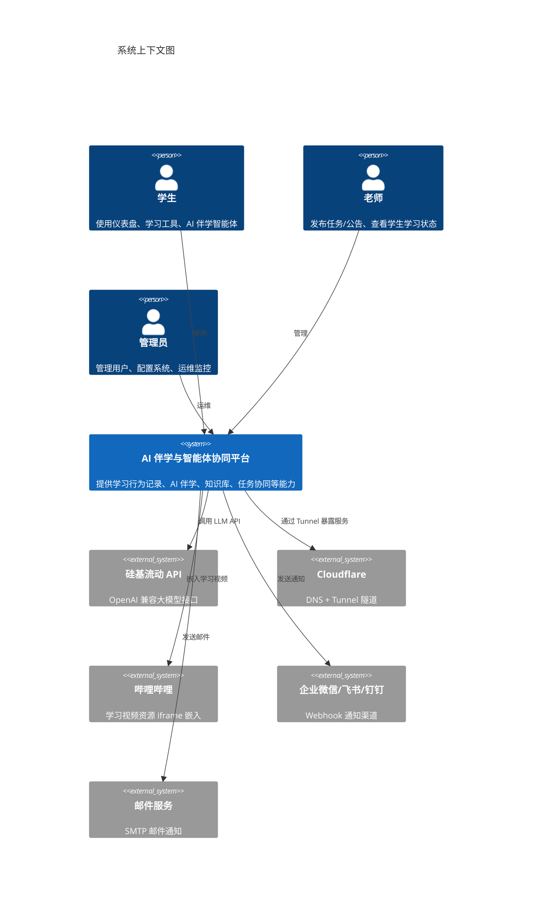
```mermaid
C4Context
    title 系统上下文图

    Person(student, "学生", "使用仪表盘、学习工具、AI 伴学智能体")
    Person(teacher, "老师", "发布任务/公告、查看学生学习状态")
    Person(admin, "管理员", "管理用户、配置系统、运维监控")

    System(platform, "AI 伴学与智能体协同平台", "提供学习行为记录、AI 伴学、知识库、任务协同等能力")

    System_Ext(siliconflow, "硅基流动 API", "OpenAI 兼容大模型接口")
    System_Ext(cloudflare, "Cloudflare", "DNS + Tunnel 隧道")
    System_Ext(bilibili, "哔哩哔哩", "学习视频资源 iframe 嵌入")
    System_Ext(webhook, "企业微信/飞书/钉钉", "Webhook 通知渠道")
    System_Ext(email, "邮件服务", "SMTP 邮件通知")

    Rel(student, platform, "使用")
    Rel(teacher, platform, "管理")
    Rel(admin, platform, "运维")
    Rel(platform, siliconflow, "调用 LLM API")
    Rel(platform, cloudflare, "通过 Tunnel 暴露服务")
    Rel(platform, bilibili, "嵌入学习视频")
    Rel(platform, webhook, "发送通知")
    Rel(platform, email, "发送邮件")
```

---

## 二、整体架构图

### 2.1 全局架构

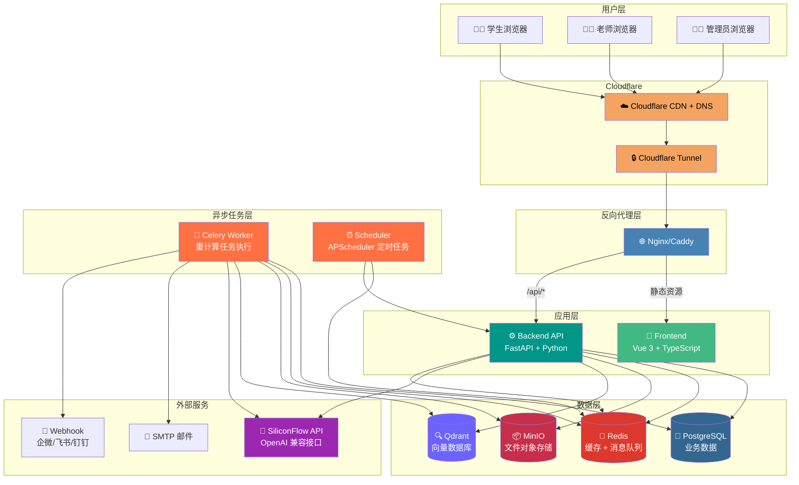
```mermaid
graph TB
    subgraph 用户层
        U1[🧑‍🎓 学生浏览器]
        U2[👩‍🏫 老师浏览器]
        U3[👨‍💼 管理员浏览器]
    end

    subgraph Cloudflare
        CF[☁️ Cloudflare CDN + DNS]
        CT[🔒 Cloudflare Tunnel]
    end

    subgraph 反向代理层
        NGX[🌐 Nginx/Caddy]
    end

    subgraph 应用层
        FE[📱 Frontend<br/>Vue 3 + TypeScript]
        BE[⚙️ Backend API<br/>FastAPI + Python]
    end

    subgraph 异步任务层
        WK[🔧 Celery Worker<br/>重计算任务执行]
        SC[⏰ Scheduler<br/>APScheduler 定时任务]
    end

    subgraph 数据层
        PG[(🐘 PostgreSQL<br/>业务数据)]
        RD[(🔴 Redis<br/>缓存 + 消息队列)]
        MIO[(📦 MinIO<br/>文件对象存储)]
        QD[(🔍 Qdrant<br/>向量数据库)]
    end

    subgraph 外部服务
        LLM[🤖 SiliconFlow API<br/>OpenAI 兼容接口]
        SMTP[📧 SMTP 邮件]
        WH[🔔 Webhook<br/>企微/飞书/钉钉]
    end

    U1 & U2 & U3 --> CF
    CF --> CT
    CT --> NGX
    NGX -->|静态资源| FE
    NGX -->|/api/*| BE
    BE --> PG
    BE --> RD
    BE --> MIO
    BE --> QD
    BE --> LLM
    BE --> RD
    WK --> PG
    WK --> RD
    WK --> MIO
    WK --> QD
    WK --> LLM
    WK --> SMTP
    WK --> WH
    SC --> RD
    SC --> BE

    style CF fill:#f4a460,color:#000
    style CT fill:#f4a460,color:#000
    style NGX fill:#4682b4,color:#fff
    style FE fill:#42b883,color:#fff
    style BE fill:#009688,color:#fff
    style WK fill:#ff7043,color:#fff
    style SC fill:#ff7043,color:#fff
    style PG fill:#336791,color:#fff
    style RD fill:#dc382d,color:#fff
    style MIO fill:#c72e49,color:#fff
    style QD fill:#6c63ff,color:#fff
    style LLM fill:#9c27b0,color:#fff
```

### 2.2 请求链路

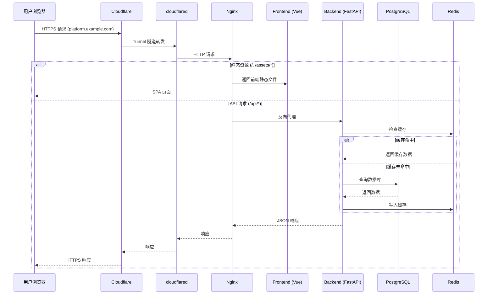
```mermaid
sequenceDiagram
    participant User as 用户浏览器
    participant CF as Cloudflare
    participant Tunnel as cloudflared
    participant Nginx as Nginx
    participant FE as Frontend (Vue)
    participant API as Backend (FastAPI)
    participant DB as PostgreSQL
    participant Cache as Redis

    User->>CF: HTTPS 请求 (platform.example.com)
    CF->>Tunnel: Tunnel 隧道转发
    Tunnel->>Nginx: HTTP 请求
    alt 静态资源 (/, /assets/*)
        Nginx->>FE: 返回前端静态文件
        FE-->>User: SPA 页面
    else API 请求 (/api/*)
        Nginx->>API: 反向代理
        API->>Cache: 检查缓存
        alt 缓存命中
            Cache-->>API: 返回缓存数据
        else 缓存未命中
            API->>DB: 查询数据库
            DB-->>API: 返回数据
            API->>Cache: 写入缓存
        end
        API-->>Nginx: JSON 响应
        Nginx-->>Tunnel: 响应
        Tunnel-->>CF: 响应
        CF-->>User: HTTPS 响应
    end
```

---

## 三、技术栈详细说明

### 3.1 前端技术栈

| 技术 | 版本 | 角色 | 选择理由 |
|------|------|------|----------|
| **Vue 3** | ^3.5 | UI 框架 | Composition API 提供更好的逻辑复用与 TypeScript 集成；生态成熟；学习成本低 |
| **TypeScript** | ^5.x | 类型系统 | 编译时类型检查，减少运行时错误；IDE 智能提示提升开发效率；大型项目可维护性保障 |
| **Vite** | ^6.x | 构建工具 | 基于 ESBuild 的极速冷启动；HMR 毫秒级热更新；开箱即用的 TypeScript 支持 |
| **Pinia** | ^3.x | 状态管理 | Vue 3 官方推荐；DevTools 集成；TypeScript 原生支持；轻量且直观的 API |
| **Vue Router** | ^4.x | 路由 | 官方路由库；支持路由守卫（用于权限控制）；支持懒加载 |
| **Element Plus** | ^2.x | UI 组件库 | 丰富的企业级组件；完善的中文文档；表单、表格、对话框等开箱即用 |
| **Tailwind CSS** | ^4.x | 原子化 CSS | 与 Element Plus 互补；快速实现自定义布局和样式；减少 CSS 文件体积 |
| **Vue Draggable Plus** | latest | 拖拽 | 仪表盘卡片拖拽排序、布局自定义 |
| **ECharts** | ^5.x | 数据可视化 | 学习热力图、统计图表；丰富的图表类型；性能优秀 |
| **FullCalendar** | ^6.x | 日历组件 | 月/周/日视图；事件拖拽；Vue 3 适配器 |
| **markdown-it** | latest | Markdown 渲染 | AI 对话内容渲染；知识库文档预览 |

### 3.2 后端技术栈

| 技术 | 版本 | 角色 | 选择理由 |
|------|------|------|----------|
| **FastAPI** | ^0.115 | Web 框架 | 异步原生支持（async/await）；自动 OpenAPI 文档生成；Pydantic 数据校验；SSE 原生支持 |
| **Python** | ^3.12 | 运行时 | AI/ML 生态最丰富；OpenAI SDK 原生支持；文档解析库齐全 |
| **SQLAlchemy** | ^2.x | ORM | Python 最成熟的 ORM；支持异步（AsyncSession）；完善的关系映射与查询构建 |
| **Alembic** | latest | 数据库迁移 | SQLAlchemy 官方迁移工具；版本化的 schema 变更管理 |
| **PostgreSQL** | ^16 | 关系数据库 | JSONB 支持（存储灵活的配置和 Memory）；全文搜索；pgvector 扩展预留 |
| **Redis** | ^7 | 缓存 + 消息队列 | 会话缓存、限流计数、热点数据缓存；作为 Celery 的 Broker 和 Result Backend |
| **Celery** | ^5.x | 异步任务 | 成熟的分布式任务队列；支持任务优先级、重试、结果追踪 |
| **APScheduler** | ^3.x | 定时任务 | 轻量级调度器；Cron 表达式支持；每日 0:00 复盘等周期任务 |
| **MinIO** | latest | 对象存储 | S3 兼容 API；自托管零成本；文件上传、知识库文档存储 |
| **Qdrant** | ^1.x | 向量数据库 | 高性能向量检索；支持过滤查询；REST + gRPC API；适合 RAG 场景 |
| **OpenAI SDK** | ^1.x | LLM 客户端 | 硅基流动兼容 OpenAI API；统一的 Chat/Embedding 调用接口 |
| **Pydantic** | ^2.x | 数据校验 | FastAPI 深度集成；请求/响应数据自动校验与序列化 |
| **python-jose** | latest | JWT | Token 生成与验证；支持多种签名算法 |
| **passlib** | latest | 密码 | bcrypt 密码哈希；安全的密码存储与校验 |

### 3.3 部署技术栈

| 技术 | 角色 | 选择理由 |
|------|------|----------|
| **Docker** | 容器化 | 环境一致性；隔离性；一键部署 |
| **Docker Compose** | 服务编排 | 单文件定义 10 个服务；适合单机部署 MVP |
| **Nginx** | 反向代理 | 静态资源服务；API 反向代理；SSL 终止（Tunnel 内可选） |
| **Cloudflare Tunnel** | 内网穿透 | 免费域名访问；自动 HTTPS；不需要公网 IP 和端口映射 |

---

## 四、服务拓扑

### 4.1 Docker Compose 服务全景

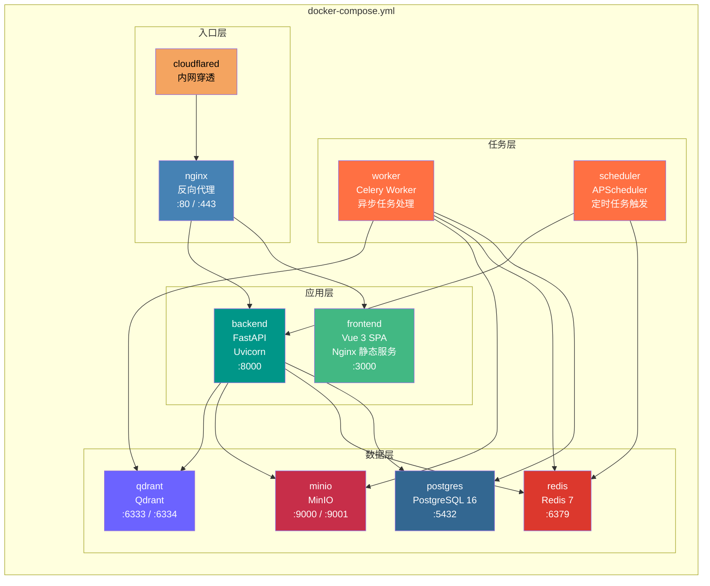
```mermaid
graph LR
    subgraph docker-compose.yml
        subgraph 入口层
            cloudflared[cloudflared<br/>内网穿透]
            nginx[nginx<br/>反向代理<br/>:80 / :443]
        end

        subgraph 应用层
            frontend[frontend<br/>Vue 3 SPA<br/>Nginx 静态服务<br/>:3000]
            backend[backend<br/>FastAPI<br/>Uvicorn<br/>:8000]
        end

        subgraph 任务层
            worker[worker<br/>Celery Worker<br/>异步任务处理]
            scheduler[scheduler<br/>APScheduler<br/>定时任务触发]
        end

        subgraph 数据层
            postgres[postgres<br/>PostgreSQL 16<br/>:5432]
            redis[redis<br/>Redis 7<br/>:6379]
            minio[minio<br/>MinIO<br/>:9000 / :9001]
            qdrant[qdrant<br/>Qdrant<br/>:6333 / :6334]
        end
    end

    cloudflared --> nginx
    nginx --> frontend
    nginx --> backend
    backend --> postgres
    backend --> redis
    backend --> minio
    backend --> qdrant
    worker --> postgres
    worker --> redis
    worker --> minio
    worker --> qdrant
    scheduler --> redis
    scheduler --> backend

    style cloudflared fill:#f4a460,color:#000
    style nginx fill:#4682b4,color:#fff
    style frontend fill:#42b883,color:#fff
    style backend fill:#009688,color:#fff
    style worker fill:#ff7043,color:#fff
    style scheduler fill:#ff7043,color:#fff
    style postgres fill:#336791,color:#fff
    style redis fill:#dc382d,color:#fff
    style minio fill:#c72e49,color:#fff
    style qdrant fill:#6c63ff,color:#fff
```

### 4.2 服务配置详情

| 服务 | 镜像 | 端口(容器) | 数据卷 | 依赖 | 重启策略 |
|------|------|------------|--------|------|----------|
| **frontend** | 自构建 (Node → Nginx) | 3000 | — | — | `always` |
| **backend** | 自构建 (Python) | 8000 | — | postgres, redis | `always` |
| **postgres** | `postgres:16-alpine` | 5432 | `pgdata:/var/lib/postgresql/data` | — | `always` |
| **redis** | `redis:7-alpine` | 6379 | `redisdata:/data` | — | `always` |
| **minio** | `minio/minio:latest` | 9000, 9001 | `miniodata:/data` | — | `always` |
| **qdrant** | `qdrant/qdrant:latest` | 6333, 6334 | `qdrantdata:/qdrant/storage` | — | `always` |
| **worker** | 同 backend 镜像 | — | — | postgres, redis, minio, qdrant | `always` |
| **scheduler** | 同 backend 镜像 | — | — | postgres, redis | `always` |
| **nginx** | `nginx:alpine` | 80, 443 | `./nginx/nginx.conf` | frontend, backend | `always` |
| **cloudflared** | `cloudflare/cloudflared` | — | `./cloudflared/config.yml` | nginx | `always` |

### 4.3 网络拓扑

所有服务处于同一个 Docker 自定义 bridge 网络 `studypartner-net` 中，通过服务名进行 DNS 解析：

```yaml
# docker-compose.yml 网络定义
networks:
  studypartner-net:
    driver: bridge
```

容器间通信示例：
- Backend → PostgreSQL: `postgresql://postgres:5432/studypartner`
- Backend → Redis: `redis://redis:6379/0`
- Backend → MinIO: `http://minio:9000`
- Backend → Qdrant: `http://qdrant:6333`
- Nginx → Frontend: `http://frontend:3000`
- Nginx → Backend: `http://backend:8000`

---

## 五、前后端分离架构

### 5.1 通信模型

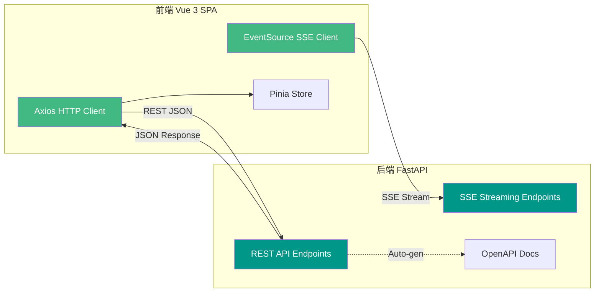
```mermaid
graph LR
    subgraph 前端 Vue 3 SPA
        A[Axios HTTP Client]
        B[EventSource SSE Client]
        C[Pinia Store]
    end

    subgraph 后端 FastAPI
        D[REST API Endpoints]
        E[SSE Streaming Endpoints]
        F[OpenAPI Docs]
    end

    A -->|REST JSON| D
    B -->|SSE Stream| E
    D -.->|Auto-gen| F
    D -->|JSON Response| A
    A --> C

    style A fill:#42b883,color:#fff
    style B fill:#42b883,color:#fff
    style D fill:#009688,color:#fff
    style E fill:#009688,color:#fff
```

### 5.2 REST API 规范

**基础约定：**

| 项目 | 规范 |
|------|------|
| 基础路径 | `/api/v1` |
| 数据格式 | JSON (`application/json`) |
| 认证方式 | `Authorization: Bearer <JWT>` |
| 分页参数 | `?page=1&page_size=20` |
| 排序参数 | `?sort_by=created_at&order=desc` |
| 时间格式 | ISO 8601 (`2026-06-02T00:00:00+08:00`) |
| 错误格式 | `{ "code": 40001, "message": "...", "detail": "..." }` |

**统一响应结构：**

```json
{
  "code": 0,
  "message": "success",
  "data": { ... },
  "meta": {
    "page": 1,
    "page_size": 20,
    "total": 100
  }
}
```

**API 模块划分：**

| 模块 | 前缀 | 说明 |
|------|------|------|
| 认证 | `/api/v1/auth` | 登录、登出、刷新 Token |
| 用户 | `/api/v1/users` | 用户 CRUD、个人信息 |
| 仪表盘 | `/api/v1/dashboard` | 布局保存/读取 |
| TODO | `/api/v1/todos` | 待办事项 CRUD |
| 便签 | `/api/v1/notes` | 便签 CRUD |
| 倒数日 | `/api/v1/countdowns` | 倒数日 CRUD |
| 书签 | `/api/v1/bookmarks` | 书签 CRUD |
| 公告 | `/api/v1/announcements` | 公告发布与查看 |
| 任务 | `/api/v1/tasks` | 任务管理与提交 |
| 日历 | `/api/v1/calendar` | 日历计划 CRUD |
| 行为日志 | `/api/v1/behavior-logs` | 行为记录上报与查询 |
| 学习时长 | `/api/v1/study-time` | 在线时长心跳与统计 |
| AI 对话 | `/api/v1/ai/chat` | 智能体对话（含 SSE） |
| Memory | `/api/v1/ai/memory` | Memory 查看与管理 |
| 复盘 | `/api/v1/ai/reviews` | 每日复盘查看 |
| 知识库 | `/api/v1/knowledge` | 知识库检索与问答 |
| 文件 | `/api/v1/files` | 文件上传与管理 |
| B 站资源 | `/api/v1/bilibili` | B 站链接管理与观看记录 |
| 通知 | `/api/v1/notifications` | 站内通知 |
| 热力图 | `/api/v1/heatmap` | 学习热力图数据 |
| 模型配置 | `/api/v1/admin/llm-config` | LLM 模型配置（管理员） |
| 系统管理 | `/api/v1/admin/system` | 系统日志、运行状态 |

### 5.3 SSE 流式输出

AI 对话采用 **Server-Sent Events (SSE)** 实现流式输出，避免 WebSocket 的复杂连接管理：

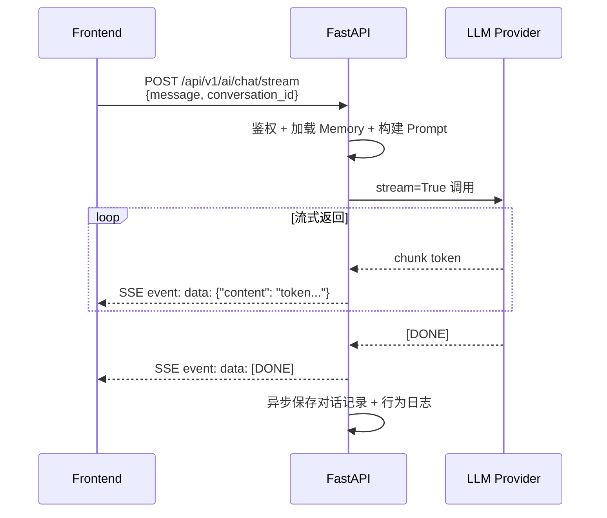
```mermaid
sequenceDiagram
    participant FE as Frontend
    participant API as FastAPI
    participant LLM as LLM Provider

    FE->>API: POST /api/v1/ai/chat/stream<br/>{message, conversation_id}
    API->>API: 鉴权 + 加载 Memory + 构建 Prompt
    API->>LLM: stream=True 调用
    loop 流式返回
        LLM-->>API: chunk token
        API-->>FE: SSE event: data: {"content": "token..."}
    end
    LLM-->>API: [DONE]
    API-->>FE: SSE event: data: [DONE]
    API->>API: 异步保存对话记录 + 行为日志
```

**SSE 事件格式：**

```
event: message
data: {"role": "assistant", "content": "你好", "done": false}

event: message
data: {"role": "assistant", "content": "！", "done": false}

event: done
data: {"conversation_id": "xxx", "message_id": "yyy", "usage": {"prompt_tokens": 120, "completion_tokens": 45}}
```

### 5.4 前端状态管理

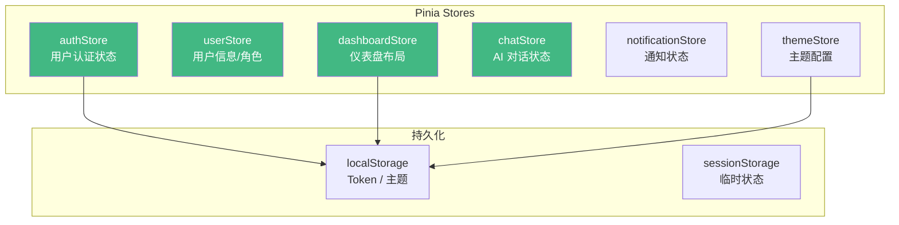
```mermaid
graph TB
    subgraph Pinia Stores
        AS[authStore<br/>用户认证状态]
        US[userStore<br/>用户信息/角色]
        DS[dashboardStore<br/>仪表盘布局]
        CS[chatStore<br/>AI 对话状态]
        NS[notificationStore<br/>通知状态]
        TS[themeStore<br/>主题配置]
    end

    subgraph 持久化
        LS[localStorage<br/>Token / 主题]
        SS[sessionStorage<br/>临时状态]
    end

    AS --> LS
    DS --> LS
    TS --> LS

    style AS fill:#42b883,color:#fff
    style US fill:#42b883,color:#fff
    style DS fill:#42b883,color:#fff
    style CS fill:#42b883,color:#fff
```

---

## 六、认证与权限架构

### 6.1 JWT 认证流程

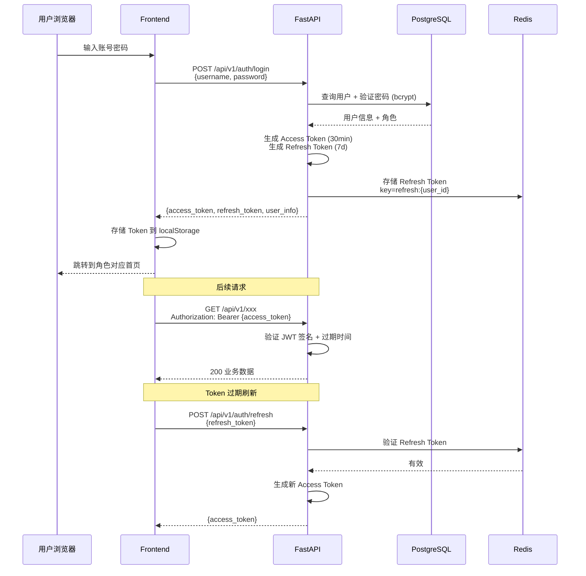
```mermaid
sequenceDiagram
    participant User as 用户浏览器
    participant FE as Frontend
    participant API as FastAPI
    participant DB as PostgreSQL
    participant Redis as Redis

    User->>FE: 输入账号密码
    FE->>API: POST /api/v1/auth/login<br/>{username, password}
    API->>DB: 查询用户 + 验证密码 (bcrypt)
    DB-->>API: 用户信息 + 角色
    API->>API: 生成 Access Token (30min)<br/>生成 Refresh Token (7d)
    API->>Redis: 存储 Refresh Token<br/>key=refresh:{user_id}
    API-->>FE: {access_token, refresh_token, user_info}
    FE->>FE: 存储 Token 到 localStorage
    FE-->>User: 跳转到角色对应首页

    Note over FE,API: 后续请求
    FE->>API: GET /api/v1/xxx<br/>Authorization: Bearer {access_token}
    API->>API: 验证 JWT 签名 + 过期时间
    API-->>FE: 200 业务数据

    Note over FE,API: Token 过期刷新
    FE->>API: POST /api/v1/auth/refresh<br/>{refresh_token}
    API->>Redis: 验证 Refresh Token
    Redis-->>API: 有效
    API->>API: 生成新 Access Token
    API-->>FE: {access_token}
```

**Token 设计：**

| Token 类型 | 有效期 | 存储位置 | 用途 |
|-----------|--------|----------|------|
| Access Token | 30 分钟 | 前端 localStorage | API 请求鉴权 |
| Refresh Token | 7 天 | 前端 localStorage + Redis | 无感刷新 Access Token |

**JWT Payload：**

```json
{
  "sub": "user_uuid",
  "username": "zhangsan",
  "role": "student",
  "exp": 1748880000,
  "iat": 1748878200
}
```

### 6.2 RBAC 权限模型

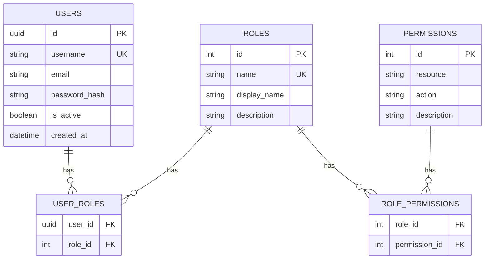
```mermaid
erDiagram
    USERS ||--o{ USER_ROLES : has
    ROLES ||--o{ USER_ROLES : has
    ROLES ||--o{ ROLE_PERMISSIONS : has
    PERMISSIONS ||--o{ ROLE_PERMISSIONS : has

    USERS {
        uuid id PK
        string username UK
        string email
        string password_hash
        boolean is_active
        datetime created_at
    }

    ROLES {
        int id PK
        string name UK
        string display_name
        string description
    }

    USER_ROLES {
        uuid user_id FK
        int role_id FK
    }

    PERMISSIONS {
        int id PK
        string resource
        string action
        string description
    }

    ROLE_PERMISSIONS {
        int role_id FK
        int permission_id FK
    }
```

**三种角色定义：**

| 角色 | 标识 | 默认首页 | 核心权限 |
|------|------|----------|----------|
| 管理员 | `admin` | `/admin/overview` | 全部权限：用户管理、系统配置、数据审计 |
| 老师 | `teacher` | `/teacher/workbench` | 任务/公告管理、查看授权学生数据、教师助手 |
| 学生 | `student` | `/student/dashboard` | 使用个人仪表盘、工具、AI 伴学、查看自己的数据 |

### 6.3 前端路由守卫

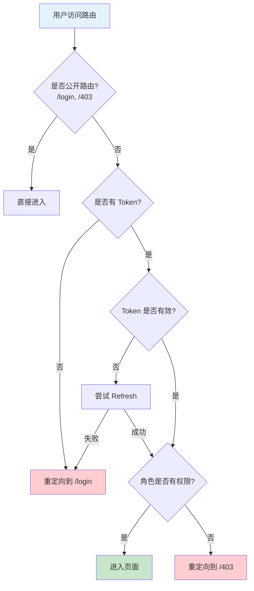
```mermaid
flowchart TD
    A[用户访问路由] --> B{是否公开路由?<br/>/login, /403}
    B -->|是| C[直接进入]
    B -->|否| D{是否有 Token?}
    D -->|否| E[重定向到 /login]
    D -->|是| F{Token 是否有效?}
    F -->|否| G[尝试 Refresh]
    G -->|失败| E
    G -->|成功| H{角色是否有权限?}
    F -->|是| H
    H -->|是| I[进入页面]
    H -->|否| J[重定向到 /403]

    style A fill:#e3f2fd
    style I fill:#c8e6c9
    style E fill:#ffcdd2
    style J fill:#ffcdd2
```

### 6.4 后端权限守卫

FastAPI 通过 **依赖注入** 实现分层权限控制：

```python
# 权限依赖链
get_current_user        # 解析 JWT，返回用户基本信息
require_active_user     # 确保用户未被禁用
require_role("admin")   # 要求管理员角色
require_role("teacher") # 要求老师角色
require_owner_or_admin  # 确保是数据所有者或管理员
```

**数据隔离策略：**

| 场景 | 隔离方式 |
|------|----------|
| 学生查看自己的 TODO/便签/倒数日 | `WHERE user_id = current_user.id` |
| 老师查看学生列表 | `JOIN teacher_student_relations WHERE teacher_id = current_user.id` |
| 老师查看学生学习数据 | 先验证师生关系，再查询 |
| 管理员查看所有数据 | 无 WHERE 过滤，但有审计日志 |
| 学生 Memory | 学生可查看部分，老师查看教学摘要，管理员查看更新日志 |

---

## 七、AI 服务架构

### 7.1 统一 LLM Provider 架构

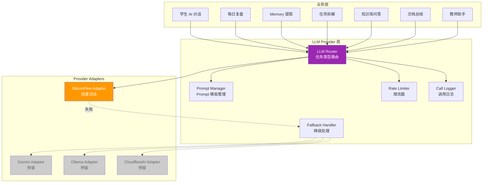
```mermaid
graph TB
    subgraph 业务层
        SC[学生 AI 对话]
        DR[每日复盘]
        ME[Memory 提取]
        TB[任务拆解]
        KQ[知识库问答]
        DS[文档总结]
        TA[教师助手]
    end

    subgraph LLM Provider 层
        RT[LLM Router<br/>任务类型路由]
        PM[Prompt Manager<br/>Prompt 模板管理]
        RL[Rate Limiter<br/>限流器]
        LOG[Call Logger<br/>调用日志]
        FB[Fallback Handler<br/>降级处理]
    end

    subgraph Provider Adapters
        SF[SiliconFlow Adapter<br/>硅基流动]
        GE[Gemini Adapter<br/>预留]
        OL[Ollama Adapter<br/>预留]
        CF[CloudflareAI Adapter<br/>预留]
    end

    SC & DR & ME & TB & KQ & DS & TA --> RT
    RT --> PM
    RT --> RL
    RT --> LOG
    RT --> SF
    SF -.->|失败| FB
    FB -.-> GE
    FB -.-> OL
    FB -.-> CF

    style RT fill:#9c27b0,color:#fff
    style SF fill:#ff9800,color:#fff
    style GE fill:#ccc,color:#666
    style OL fill:#ccc,color:#666
    style CF fill:#ccc,color:#666
```

### 7.2 任务类型路由

不同的 AI 任务需要不同的模型参数和策略：

| 任务类型 | 标识 | 模型偏好 | Temperature | Max Tokens | 优先级 | 备注 |
|----------|------|----------|-------------|------------|--------|------|
| 学生对话 | `student_chat` | 高质量对话模型 | 0.7 | 2048 | 高 | 流式输出 |
| 每日复盘 | `daily_review` | 推理/总结模型 | 0.3 | 4096 | 中 | 异步执行 |
| Memory 提取 | `memory_extract` | 推理模型 | 0.2 | 2048 | 中 | 异步执行 |
| 任务拆解 | `task_breakdown` | 对话模型 | 0.5 | 2048 | 中 | 按需触发 |
| 计划生成 | `plan_generate` | 对话模型 | 0.5 | 2048 | 低 | 按需触发 |
| 知识库问答 | `knowledge_qa` | 对话模型 | 0.3 | 2048 | 高 | 结合 RAG |
| 文档总结 | `document_summary` | 长上下文模型 | 0.2 | 4096 | 低 | 异步执行 |
| 教师助手 | `teacher_assistant` | 对话模型 | 0.5 | 2048 | 中 | 按需触发 |
| 系统总结 | `system_summary` | 轻量模型 | 0.1 | 1024 | 低 | 轻量任务 |

### 7.3 Fallback 降级策略

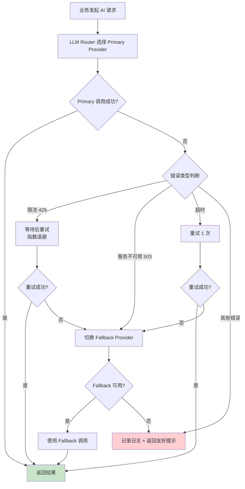
```mermaid
flowchart TD
    A[业务发起 AI 请求] --> B[LLM Router 选择 Primary Provider]
    B --> C{Primary 调用成功?}
    C -->|是| D[返回结果]
    C -->|否| E{错误类型判断}
    E -->|限流 429| F[等待后重试<br/>指数退避]
    E -->|服务不可用 503| G[切换 Fallback Provider]
    E -->|超时| H[重试 1 次]
    E -->|其他错误| I[记录日志 + 返回友好提示]
    F --> J{重试成功?}
    J -->|是| D
    J -->|否| G
    G --> K{Fallback 可用?}
    K -->|是| L[使用 Fallback 调用]
    K -->|否| I
    H --> M{重试成功?}
    M -->|是| D
    M -->|否| G
    L --> D

    style D fill:#c8e6c9
    style I fill:#ffcdd2
```

### 7.4 限流策略

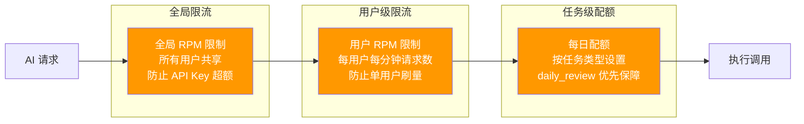
```mermaid
graph LR
    subgraph 全局限流
        GRL[全局 RPM 限制<br/>所有用户共享<br/>防止 API Key 超额]
    end

    subgraph 用户级限流
        URL[用户 RPM 限制<br/>每用户每分钟请求数<br/>防止单用户刷量]
    end

    subgraph 任务级配额
        TQL[每日配额<br/>按任务类型设置<br/>daily_review 优先保障]
    end

    REQ[AI 请求] --> GRL --> URL --> TQL --> EXEC[执行调用]

    style GRL fill:#ff9800,color:#fff
    style URL fill:#ff9800,color:#fff
    style TQL fill:#ff9800,color:#fff
```

**限流实现（Redis）：**

| 维度 | Redis Key | 策略 | 默认值 |
|------|-----------|------|--------|
| 全局 RPM | `ratelimit:global:rpm` | 滑动窗口 | 60 rpm |
| 用户 RPM | `ratelimit:user:{user_id}:rpm` | 滑动窗口 | 10 rpm |
| 用户日配额 | `quota:user:{user_id}:daily` | 计数器，每日重置 | 100 次/天 |
| 任务类型日配额 | `quota:task:{task_type}:daily` | 计数器 | 视类型而定 |

---

## 八、数据流架构

### 8.1 行为记录数据流

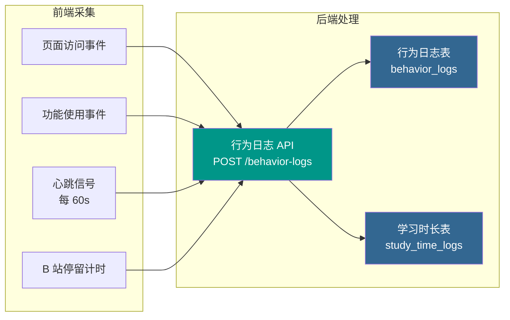
```mermaid
flowchart LR
    subgraph 前端采集
        A1[页面访问事件]
        A2[功能使用事件]
        A3[心跳信号<br/>每 60s]
        A4[B 站停留计时]
    end

    subgraph 后端处理
        B1[行为日志 API<br/>POST /behavior-logs]
        B2[行为日志表<br/>behavior_logs]
        B3[学习时长表<br/>study_time_logs]
    end

    A1 & A2 --> B1
    A3 --> B1
    A4 --> B1
    B1 --> B2
    B1 --> B3

    style B1 fill:#009688,color:#fff
    style B2 fill:#336791,color:#fff
    style B3 fill:#336791,color:#fff
```

**行为事件分类：**

| 类型 | 事件 | 数据 |
|------|------|------|
| 登录/退出 | `login`, `logout` | `timestamp` |
| 页面访问 | `page_view` | `page_path, duration` |
| TODO | `todo_create`, `todo_complete`, `todo_delete` | `todo_id, title` |
| 便签 | `note_create`, `note_edit`, `note_delete` | `note_id` |
| 任务 | `task_view`, `task_submit`, `task_complete` | `task_id, status` |
| 公告 | `announcement_read` | `announcement_id` |
| 日历 | `plan_create`, `plan_complete` | `event_id` |
| 书签 | `bookmark_visit` | `bookmark_id, url` |
| 文件 | `file_upload` | `file_id, filename` |
| 知识库 | `knowledge_search`, `knowledge_view` | `query, doc_id` |
| AI 对话 | `ai_chat` | `conversation_id, message_count` |
| B 站 | `bilibili_open`, `bilibili_heartbeat` | `resource_id, duration` |

### 8.2 每日复盘数据流

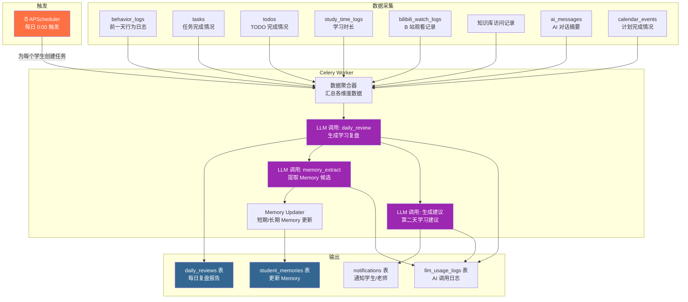
```mermaid
flowchart TD
    subgraph 触发
        CRON[⏰ APScheduler<br/>每日 0:00 触发]
    end

    subgraph 数据采集
        BL[behavior_logs<br/>前一天行为日志]
        TK[tasks<br/>任务完成情况]
        TD[todos<br/>TODO 完成情况]
        ST[study_time_logs<br/>学习时长]
        BW[bilibili_watch_logs<br/>B 站观看记录]
        KB[知识库访问记录]
        AI[ai_messages<br/>AI 对话摘要]
        CE[calendar_events<br/>计划完成情况]
    end

    subgraph Celery Worker
        AGG[数据聚合器<br/>汇总各维度数据]
        LLM1[LLM 调用: daily_review<br/>生成学习复盘]
        LLM2[LLM 调用: memory_extract<br/>提取 Memory 候选]
        MU[Memory Updater<br/>短期/长期 Memory 更新]
        SUG[LLM 调用: 生成建议<br/>第二天学习建议]
    end

    subgraph 输出
        DR[daily_reviews 表<br/>每日复盘报告]
        SM[student_memories 表<br/>更新 Memory]
        NF[notifications 表<br/>通知学生/老师]
        LOG[llm_usage_logs 表<br/>AI 调用日志]
    end

    CRON -->|为每个学生创建任务| AGG
    BL & TK & TD & ST & BW & KB & AI & CE --> AGG
    AGG --> LLM1
    LLM1 --> DR
    LLM1 --> LLM2
    LLM2 --> MU
    MU --> SM
    LLM1 --> SUG
    SUG --> NF
    LLM1 & LLM2 & SUG --> LOG

    style CRON fill:#ff7043,color:#fff
    style LLM1 fill:#9c27b0,color:#fff
    style LLM2 fill:#9c27b0,color:#fff
    style SUG fill:#9c27b0,color:#fff
    style DR fill:#336791,color:#fff
    style SM fill:#336791,color:#fff
```

### 8.3 Memory 生命周期

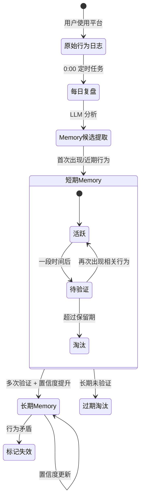
```mermaid
stateDiagram-v2
    [*] --> 原始行为日志: 用户使用平台
    原始行为日志 --> 每日复盘: 0:00 定时任务
    每日复盘 --> Memory候选提取: LLM 分析
    Memory候选提取 --> 短期Memory: 首次出现/近期行为
    短期Memory --> 长期Memory: 多次验证 + 置信度提升
    短期Memory --> 过期淘汰: 长期未验证
    长期Memory --> 长期Memory: 置信度更新
    长期Memory --> 标记失效: 行为矛盾

    state 短期Memory {
        [*] --> 活跃
        活跃 --> 待验证: 一段时间后
        待验证 --> 活跃: 再次出现相关行为
        待验证 --> 淘汰: 超过保留期
    }
```

**Memory 数据模型：**

| 字段 | 类型 | 说明 |
|------|------|------|
| `memory_id` | UUID | 主键 |
| `user_id` | UUID | 所属学生 |
| `memory_type` | ENUM | `short_term` / `long_term` |
| `category` | STRING | 分类（学习偏好/习惯/能力/兴趣等） |
| `content` | TEXT | Memory 内容描述 |
| `confidence` | FLOAT | 置信度 (0.0 ~ 1.0) |
| `evidence` | JSONB | 来源证据（关联行为日志 ID 列表） |
| `first_seen` | DATETIME | 首次发现时间 |
| `last_verified` | DATETIME | 最近验证时间 |
| `verify_count` | INT | 验证次数 |
| `status` | ENUM | `active` / `expired` / `deleted` |

---

## 九、文件与知识库架构

### 9.1 文件上传流程

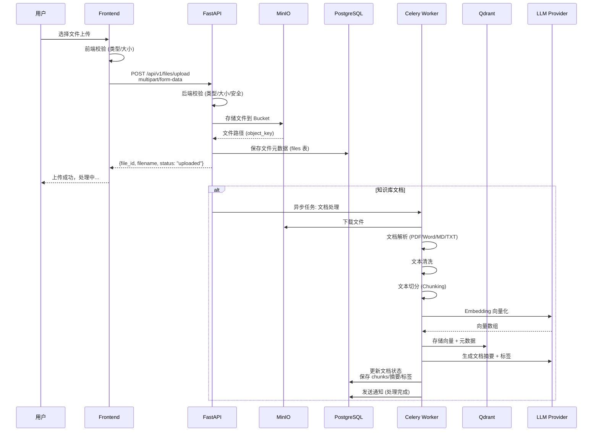
```mermaid
sequenceDiagram
    participant User as 用户
    participant FE as Frontend
    participant API as FastAPI
    participant MIO as MinIO
    participant DB as PostgreSQL
    participant WK as Celery Worker
    participant QD as Qdrant
    participant LLM as LLM Provider

    User->>FE: 选择文件上传
    FE->>FE: 前端校验 (类型/大小)
    FE->>API: POST /api/v1/files/upload<br/>multipart/form-data
    API->>API: 后端校验 (类型/大小/安全)
    API->>MIO: 存储文件到 Bucket
    MIO-->>API: 文件路径 (object_key)
    API->>DB: 保存文件元数据 (files 表)
    API-->>FE: {file_id, filename, status: "uploaded"}
    FE-->>User: 上传成功，处理中...

    alt 知识库文档
        API->>WK: 异步任务: 文档处理
        WK->>MIO: 下载文件
        WK->>WK: 文档解析 (PDF/Word/MD/TXT)
        WK->>WK: 文本清洗
        WK->>WK: 文本切分 (Chunking)
        WK->>LLM: Embedding 向量化
        LLM-->>WK: 向量数组
        WK->>QD: 存储向量 + 元数据
        WK->>LLM: 生成文档摘要 + 标签
        WK->>DB: 更新文档状态<br/>保存 chunks/摘要/标签
        WK->>DB: 发送通知 (处理完成)
    end
```

### 9.2 知识库 RAG 检索流程

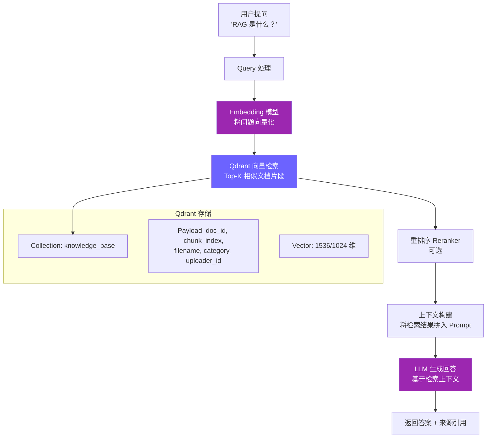
```mermaid
flowchart TD
    A[用户提问<br/>'RAG 是什么？'] --> B[Query 处理]
    B --> C[Embedding 模型<br/>将问题向量化]
    C --> D[Qdrant 向量检索<br/>Top-K 相似文档片段]
    D --> E[重排序 Reranker<br/>可选]
    E --> F[上下文构建<br/>将检索结果拼入 Prompt]
    F --> G[LLM 生成回答<br/>基于检索上下文]
    G --> H[返回答案 + 来源引用]

    subgraph Qdrant 存储
        Q1[Collection: knowledge_base]
        Q2[Payload: doc_id, chunk_index,<br/>filename, category, uploader_id]
        Q3[Vector: 1536/1024 维]
    end

    D --> Q1

    style C fill:#9c27b0,color:#fff
    style D fill:#6c63ff,color:#fff
    style G fill:#9c27b0,color:#fff
```

### 9.3 文档处理管线

| 阶段 | 处理内容 | 技术选型 |
|------|----------|----------|
| **文档解析** | 提取文本内容 | PyMuPDF (PDF), python-docx (Word), markdown-it (MD), 原文 (TXT) |
| **文本清洗** | 去除冗余空白、特殊字符、页眉页脚 | 正则表达式 + 自定义规则 |
| **文本切分** | 按语义段落切分，保持上下文完整 | 递归字符切分，chunk_size=512, overlap=50 |
| **向量化** | 文本 → 向量 | 硅基流动 Embedding API（BAAI/bge-large-zh-v1.5 或类似） |
| **存储** | 向量 + 元数据入库 | Qdrant Collection |
| **摘要生成** | 文档自动摘要 | LLM (document_summary 任务类型) |
| **标签生成** | 文档自动标签 | LLM 提取关键词 |

### 9.4 MinIO Bucket 设计

| Bucket | 用途 | 访问权限 |
|--------|------|----------|
| `user-files` | 用户上传的个人文件 | 私有，通过 API 签名 URL 访问 |
| `knowledge-docs` | 知识库文档原文件 | 私有，通过 API 访问 |
| `task-attachments` | 任务附件 | 私有，任务相关方可访问 |
| `avatars` | 用户头像 | 公开读 |
| `temp` | 临时文件（定期清理） | 私有 |

---

## 十、异步任务架构

### 10.1 整体架构

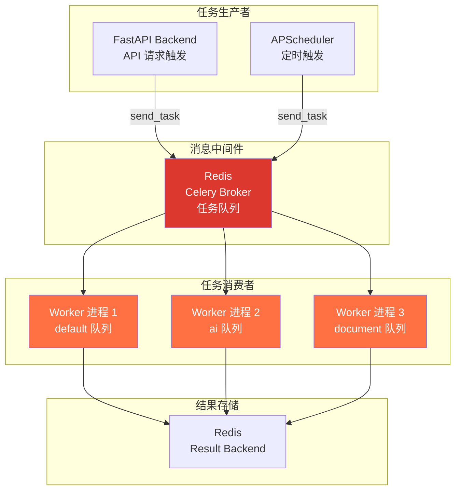
```mermaid
graph TB
    subgraph 任务生产者
        API[FastAPI Backend<br/>API 请求触发]
        SCH[APScheduler<br/>定时触发]
    end

    subgraph 消息中间件
        RD[Redis<br/>Celery Broker<br/>任务队列]
    end

    subgraph 任务消费者
        W1[Worker 进程 1<br/>default 队列]
        W2[Worker 进程 2<br/>ai 队列]
        W3[Worker 进程 3<br/>document 队列]
    end

    subgraph 结果存储
        RDB[Redis<br/>Result Backend]
    end

    API -->|send_task| RD
    SCH -->|send_task| RD
    RD --> W1 & W2 & W3
    W1 & W2 & W3 --> RDB

    style RD fill:#dc382d,color:#fff
    style W1 fill:#ff7043,color:#fff
    style W2 fill:#ff7043,color:#fff
    style W3 fill:#ff7043,color:#fff
```

### 10.2 Celery 任务队列

| 队列 | 优先级 | 处理任务 | 并发数 |
|------|--------|----------|--------|
| `default` | 普通 | 通知发送、行为数据聚合、数据导出 | 4 |
| `ai` | 高 | AI 对话后处理、每日复盘、Memory 提取、文档总结 | 2 |
| `document` | 低 | 文档解析、切分、向量化入库 | 2 |

### 10.3 Celery 任务清单

| 任务名 | 队列 | 触发方式 | 重试策略 | 说明 |
|--------|------|----------|----------|------|
| `daily_review_all` | ai | Scheduler 0:00 | 3 次，指数退避 | 遍历所有活跃学生，创建子任务 |
| `daily_review_student` | ai | 父任务 | 3 次，指数退避 | 单个学生每日复盘 |
| `extract_memory` | ai | 复盘完成后 | 3 次 | 从复盘结果中提取 Memory |
| `generate_suggestion` | ai | Memory 更新后 | 2 次 | 生成第二天学习建议 |
| `process_document` | document | 文件上传后 | 2 次 | 文档解析 → 切分 → 向量化 |
| `generate_doc_summary` | ai | 文档处理后 | 2 次 | 生成文档摘要和标签 |
| `send_email_notification` | default | 事件触发 | 3 次 | 发送邮件通知 |
| `send_webhook_notification` | default | 事件触发 | 3 次 | 发送 Webhook 通知 |
| `aggregate_heatmap_data` | default | Scheduler 0:30 | 2 次 | 聚合前一天热力图数据 |
| `cleanup_temp_files` | default | Scheduler 3:00 | 1 次 | 清理临时文件 |

### 10.4 APScheduler 定时任务

| 任务 | Cron 表达式 | 说明 |
|------|-------------|------|
| 每日复盘 | `0 0 * * *` | 每日 0:00 触发所有学生复盘 |
| 热力图聚合 | `30 0 * * *` | 每日 0:30 聚合前一天热力图数据 |
| 逾期任务检查 | `0 8 * * *` | 每日 8:00 检查逾期任务并通知 |
| 临时文件清理 | `0 3 * * *` | 每日 3:00 清理超过 24h 的临时文件 |
| Redis 配额重置 | `0 0 * * *` | 每日 0:00 重置用户 AI 调用日配额 |
| 数据库备份 | `0 4 * * *` | 每日 4:00 自动备份数据库 |

---

## 十一、通知架构

### 11.1 通知系统架构

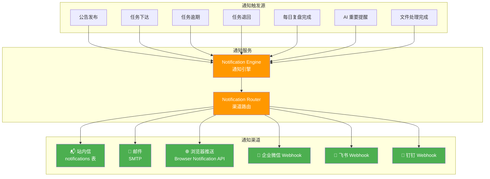
```mermaid
flowchart TD
    subgraph 通知触发源
        E1[公告发布]
        E2[任务下达]
        E3[任务逾期]
        E4[任务退回]
        E5[每日复盘完成]
        E6[AI 重要提醒]
        E7[文件处理完成]
    end

    subgraph 通知服务
        NE[Notification Engine<br/>通知引擎]
        NR[Notification Router<br/>渠道路由]
    end

    subgraph 通知渠道
        C1[📬 站内信<br/>notifications 表]
        C2[📧 邮件<br/>SMTP]
        C3[🌐 浏览器推送<br/>Browser Notification API]
        C4[🔔 企业微信 Webhook]
        C5[🔔 飞书 Webhook]
        C6[🔔 钉钉 Webhook]
    end

    E1 & E2 & E3 & E4 & E5 & E6 & E7 --> NE
    NE --> NR
    NR --> C1
    NR --> C2
    NR --> C3
    NR --> C4
    NR --> C5
    NR --> C6

    style NE fill:#ff9800,color:#fff
    style NR fill:#ff9800,color:#fff
    style C1 fill:#4caf50,color:#fff
    style C2 fill:#4caf50,color:#fff
    style C3 fill:#4caf50,color:#fff
    style C4 fill:#4caf50,color:#fff
    style C5 fill:#4caf50,color:#fff
    style C6 fill:#4caf50,color:#fff
```

### 11.2 通知数据模型

```sql
-- 通知表
CREATE TABLE notifications (
    id          UUID PRIMARY KEY,
    user_id     UUID NOT NULL REFERENCES users(id),
    type        VARCHAR(50) NOT NULL,     -- announcement, task, review, system
    title       VARCHAR(200) NOT NULL,
    content     TEXT,
    link        VARCHAR(500),             -- 点击跳转的前端路由
    is_read     BOOLEAN DEFAULT FALSE,
    created_at  TIMESTAMP DEFAULT NOW()
);

-- 通知渠道配置表 (管理员配置)
CREATE TABLE notification_channels (
    id          SERIAL PRIMARY KEY,
    channel     VARCHAR(50) NOT NULL,     -- email, wecom, feishu, dingtalk
    enabled     BOOLEAN DEFAULT FALSE,
    config      JSONB,                    -- webhook_url, smtp config, etc.
    created_at  TIMESTAMP DEFAULT NOW()
);
```

### 11.3 通知优先级与渠道映射

| 通知场景 | 优先级 | 站内信 | 邮件 | Webhook | 浏览器推送 |
|----------|--------|--------|------|---------|------------|
| 新公告发布 | 普通 | ✅ | 可选 | 可选 | ❌ |
| 新任务下达 | 高 | ✅ | ✅ | ✅ | ✅ |
| 任务即将截止 (24h) | 高 | ✅ | ✅ | ✅ | ✅ |
| 任务逾期 | 紧急 | ✅ | ✅ | ✅ | ✅ |
| 任务被退回 | 高 | ✅ | ✅ | ✅ | ❌ |
| 每日复盘完成 | 低 | ✅ | ❌ | ❌ | ❌ |
| AI 重要提醒 | 普通 | ✅ | ❌ | ❌ | ❌ |
| 文件处理完成 | 低 | ✅ | ❌ | ❌ | ❌ |

---

## 十二、缓存策略

### 12.1 Redis 用途全景

```mermaid
mindmap
    root((Redis 7))
        会话管理
            Refresh Token 存储
            用户在线状态
        缓存
            用户信息缓存
            角色权限缓存
            仪表盘布局缓存
            热力图数据缓存
            公告列表缓存
        限流
            全局 RPM 计数
            用户 RPM 计数
            AI 调用日配额
        消息队列
            Celery Broker
            Celery Result Backend
        实时状态
            学习时长心跳
            在线用户列表
```

### 12.2 缓存 Key 规范

| 业务 | Key 模式 | 数据类型 | TTL | 说明 |
|------|----------|----------|-----|------|
| 用户信息 | `user:info:{user_id}` | Hash | 30 min | 用户基本信息 + 角色 |
| 仪表盘布局 | `dashboard:layout:{user_id}` | String (JSON) | 1 hour | 仪表盘模块配置 |
| 公告列表 | `announcements:active` | String (JSON) | 5 min | 当前有效公告列表 |
| 热力图 | `heatmap:{user_id}:{year}` | String (JSON) | 1 hour | 年度热力图数据 |
| Refresh Token | `auth:refresh:{user_id}` | String | 7 days | Refresh Token |
| 心跳 | `heartbeat:{user_id}` | String | 120s | 在线状态，心跳续期 |
| 在线用户 | `online:users` | Set | — | 在线用户 ID 集合 |
| 限流 (全局) | `ratelimit:global:rpm` | Sorted Set | 60s 滑窗 | 全局请求计数 |
| 限流 (用户) | `ratelimit:user:{user_id}:rpm` | Sorted Set | 60s 滑窗 | 用户请求计数 |
| AI 日配额 | `quota:ai:user:{user_id}:daily` | String (Counter) | 到当天结束 | AI 调用次数 |

### 12.3 缓存更新策略

| 策略 | 适用场景 | 说明 |
|------|----------|------|
| **Cache-Aside** | 用户信息、仪表盘布局 | 读：先查缓存，miss 则查 DB 后写入缓存；写：先更新 DB，再删除缓存 |
| **Write-Through** | 学习时长心跳 | 写入时同时更新缓存和 DB |
| **TTL 过期** | 公告列表、热力图 | 设置合理 TTL，过期自动重新加载 |
| **主动失效** | 权限变更、布局保存 | 管理员修改权限时主动清除相关用户缓存 |

---

## 十三、安全架构

### 13.1 安全分层

```mermaid
graph TB
    subgraph 网络层
        CF_WAF[Cloudflare WAF<br/>DDoS 防护 + WAF 规则]
        CF_SSL[Cloudflare SSL<br/>自动 HTTPS]
    end

    subgraph 接入层
        CORS[CORS 策略<br/>仅允许指定域名]
        RL[Rate Limiting<br/>API 限流]
    end

    subgraph 认证层
        JWT_V[JWT 验证<br/>签名 + 过期检查]
        RBAC_V[RBAC 权限<br/>角色权限验证]
    end

    subgraph 应用层
        INPUT[输入校验<br/>Pydantic 验证]
        SQL_INJ[SQL 注入防护<br/>ORM 参数化查询]
        XSS[XSS 防护<br/>输出转义]
        FILE_V[文件校验<br/>类型 + 大小 + 内容检测]
    end

    subgraph 数据层
        PWD[密码哈希<br/>bcrypt]
        KEY[API Key 加密存储<br/>后端环境变量]
        ISO[数据隔离<br/>行级权限过滤]
        BACKUP[数据备份<br/>定时自动备份]
    end

    CF_WAF --> CORS --> JWT_V --> INPUT --> PWD
    CF_SSL --> RL --> RBAC_V --> SQL_INJ --> KEY
    XSS --> ISO
    FILE_V --> BACKUP
```

### 13.2 安全措施详细说明

| 安全领域 | 措施 | 实现方式 |
|----------|------|----------|
| **密码存储** | bcrypt 哈希，不可逆 | `passlib[bcrypt]`，cost factor = 12 |
| **JWT 安全** | HS256 签名 + 短期 Access Token | `python-jose`，密钥从环境变量读取 |
| **API Key 保护** | 仅存储在后端环境变量/数据库加密字段 | 前端永远不接触 API Key |
| **CORS** | 仅允许 `platform.example.com` | FastAPI `CORSMiddleware` 白名单配置 |
| **输入校验** | 所有请求通过 Pydantic 模型校验 | 自动类型检查 + 长度/范围约束 |
| **SQL 注入防护** | ORM 参数化查询，禁止原生 SQL 拼接 | SQLAlchemy ORM |
| **XSS 防护** | AI 回答 Markdown 渲染时转义 HTML | `markdown-it` + sanitize 配置 |
| **文件上传限制** | 类型白名单 + 大小上限 + MIME 检测 | 允许：PDF/Word/MD/TXT，上限：50MB |
| **数据隔离** | 所有查询带 user_id/role 过滤 | ORM 查询钩子 + API 权限装饰器 |
| **日志审计** | 管理员操作、AI 调用、权限变更记录 | `system_logs` 表 |
| **Cloudflare 安全** | WAF、DDoS 防护、Bot 防护 | Cloudflare Dashboard 配置 |
| **备份策略** | 数据库日备份、MinIO 文件备份 | 定时任务 + `pg_dump` |

### 13.3 文件上传安全

```mermaid
flowchart LR
    A[文件上传请求] --> B{前端校验}
    B -->|通过| C{后端校验}
    B -->|拒绝| X1[❌ 提示错误]
    C -->|通过| D[存储到 MinIO]
    C -->|拒绝| X2[❌ 返回 400]

    subgraph 前端校验
        B1[文件扩展名白名单]
        B2[文件大小 ≤ 50MB]
    end

    subgraph 后端校验
        C1[MIME Type 检测]
        C2[文件扩展名二次校验]
        C3[文件大小二次校验]
        C4[文件名清洗<br/>去除特殊字符]
        C5[生成唯一文件名<br/>UUID + 原扩展名]
    end
```

---

## 十四、可扩展性设计

### 14.1 扩展点规划

```mermaid
mindmap
    root((可扩展性))
        AI 模型
            多模型路由
            本地模型 Ollama
            Gemini / Groq
            ModelScope 魔搭
            阿里百炼 / 腾讯混元
        智能体类型
            学习规划智能体
            任务督导智能体
            知识库问答智能体
            资料整理智能体
            教师助手智能体
            管理员运维智能体
        仪表盘组件
            组件注册表
            第三方组件
            自定义组件
        通知渠道
            QQ 机器人
            微信通知
            短信通知
        文件类型
            PPT / Excel
            图片 OCR
            代码文件
        部署形态
            云服务器
            K8s 集群
            多租户 SaaS
```

### 14.2 插件化设计

**LLM Provider 扩展：**

```python
# 新增模型提供商只需实现接口
class BaseLLMProvider(ABC):
    @abstractmethod
    async def chat(self, messages, **kwargs) -> str: ...

    @abstractmethod
    async def chat_stream(self, messages, **kwargs) -> AsyncGenerator: ...

    @abstractmethod
    async def embedding(self, texts, **kwargs) -> list[list[float]]: ...

# 新增提供商示例
class GeminiProvider(BaseLLMProvider):
    async def chat(self, messages, **kwargs) -> str: ...
    async def chat_stream(self, messages, **kwargs) -> AsyncGenerator: ...
    async def embedding(self, texts, **kwargs) -> list[list[float]]: ...
```

**通知渠道扩展：**

```python
# 新增通知渠道只需实现接口
class BaseNotificationChannel(ABC):
    @abstractmethod
    async def send(self, recipient, title, content, **kwargs) -> bool: ...

# 新增渠道示例
class WeChatChannel(BaseNotificationChannel):
    async def send(self, recipient, title, content, **kwargs) -> bool: ...
```

**仪表盘组件扩展：**

```typescript
// 前端组件注册表
interface DashboardWidget {
  id: string
  name: string
  component: Component  // Vue 组件
  defaultSize: { w: number; h: number }
  minSize: { w: number; h: number }
  roles: ('student' | 'teacher' | 'admin')[]
  configSchema?: object  // 组件配置 schema
}

// 注册新组件
registerWidget({
  id: 'pomodoro-timer',
  name: '番茄钟',
  component: () => import('./widgets/PomodoroTimer.vue'),
  defaultSize: { w: 2, h: 2 },
  minSize: { w: 1, h: 1 },
  roles: ['student'],
})
```

### 14.3 多智能体架构预留

```mermaid
graph TB
    subgraph 智能体注册中心
        AR[Agent Registry<br/>智能体注册表]
    end

    subgraph 已实现 MVP
        A1[🧑‍🎓 学生伴学智能体<br/>student_companion]
    end

    subgraph 预留扩展
        A2[📋 学习规划智能体<br/>study_planner]
        A3[⏰ 任务督导智能体<br/>task_supervisor]
        A4[📚 知识库问答智能体<br/>knowledge_qa]
        A5[📁 资料整理智能体<br/>document_organizer]
        A6[👩‍🏫 教师助手智能体<br/>teacher_assistant]
        A7[🔧 运维智能体<br/>admin_ops]
    end

    subgraph 协同层
        CO[Agent Coordinator<br/>智能体协同调度<br/>P2 实现]
    end

    AR --> A1
    AR -.-> A2 & A3 & A4 & A5 & A6 & A7
    CO -.-> AR

    style A1 fill:#4caf50,color:#fff
    style A2 fill:#e0e0e0,color:#666
    style A3 fill:#e0e0e0,color:#666
    style A4 fill:#e0e0e0,color:#666
    style A5 fill:#e0e0e0,color:#666
    style A6 fill:#e0e0e0,color:#666
    style A7 fill:#e0e0e0,color:#666
    style CO fill:#e0e0e0,color:#666
```

---

## 十五、目录结构规划

### 15.1 项目根目录

```
studyPartner/
├── web/                        # 前端项目 (Vue 3)
├── server/                     # 后端项目 (FastAPI)
├── docker/                     # Docker 相关配置
│   ├── nginx/
│   │   └── nginx.conf          # Nginx 配置
│   ├── cloudflared/
│   │   └── config.yml          # Cloudflare Tunnel 配置
│   └── postgres/
│       └── init.sql            # 数据库初始化脚本
├── docs/                       # 项目文档
│   ├── prd6.2.md               # PRD 文档
│   ├── architecture.md         # 架构设计文档 (本文档)
│   ├── api-design.md           # API 设计文档
│   ├── database-design.md      # 数据库设计文档
│   └── deployment.md           # 部署文档
├── scripts/                    # 运维脚本
│   ├── backup.sh               # 数据库备份脚本
│   └── setup.sh                # 环境初始化脚本
├── docker-compose.yml          # 服务编排
├── docker-compose.dev.yml      # 开发环境覆盖
├── .env.example                # 环境变量模板
├── .gitignore
├── Makefile                    # 常用命令快捷方式
└── README.md
```

### 15.2 前端目录结构 (`web/`)

```
web/
├── public/                     # 静态资源
│   ├── favicon.ico
│   └── logo.svg
├── src/
│   ├── api/                    # API 请求封装
│   │   ├── modules/            # 按模块组织
│   │   │   ├── auth.ts         # 认证 API
│   │   │   ├── user.ts         # 用户 API
│   │   │   ├── todo.ts         # TODO API
│   │   │   ├── note.ts         # 便签 API
│   │   │   ├── countdown.ts    # 倒数日 API
│   │   │   ├── bookmark.ts     # 书签 API
│   │   │   ├── announcement.ts # 公告 API
│   │   │   ├── task.ts         # 任务 API
│   │   │   ├── calendar.ts     # 日历 API
│   │   │   ├── chat.ts         # AI 对话 API
│   │   │   ├── memory.ts       # Memory API
│   │   │   ├── review.ts       # 复盘 API
│   │   │   ├── knowledge.ts    # 知识库 API
│   │   │   ├── file.ts         # 文件 API
│   │   │   ├── bilibili.ts     # B 站 API
│   │   │   ├── notification.ts # 通知 API
│   │   │   ├── heatmap.ts      # 热力图 API
│   │   │   └── admin.ts        # 管理员 API
│   │   ├── request.ts          # Axios 实例 + 拦截器
│   │   └── index.ts            # 统一导出
│   │
│   ├── assets/                 # 静态资源
│   │   ├── images/
│   │   ├── icons/
│   │   └── styles/
│   │       ├── variables.css   # CSS 变量 / 主题
│   │       ├── global.css      # 全局样式
│   │       └── tailwind.css    # Tailwind 入口
│   │
│   ├── components/             # 通用组件
│   │   ├── common/             # 基础通用组件
│   │   │   ├── AppHeader.vue
│   │   │   ├── AppSidebar.vue
│   │   │   ├── AppBreadcrumb.vue
│   │   │   ├── LoadingSpinner.vue
│   │   │   ├── EmptyState.vue
│   │   │   └── ConfirmDialog.vue
│   │   ├── dashboard/          # 仪表盘组件
│   │   │   ├── WidgetContainer.vue
│   │   │   ├── WidgetGrid.vue
│   │   │   └── widgets/
│   │   │       ├── StudyTimeWidget.vue
│   │   │       ├── TodoWidget.vue
│   │   │       ├── NoteWidget.vue
│   │   │       ├── CountdownWidget.vue
│   │   │       ├── BookmarkWidget.vue
│   │   │       ├── TaskWidget.vue
│   │   │       ├── AnnouncementWidget.vue
│   │   │       ├── HeatmapWidget.vue
│   │   │       ├── CalendarWidget.vue
│   │   │       ├── AiSuggestionWidget.vue
│   │   │       ├── RecentFilesWidget.vue
│   │   │       └── RecentKnowledgeWidget.vue
│   │   ├── chat/               # AI 对话组件
│   │   │   ├── ChatWindow.vue
│   │   │   ├── ChatMessage.vue
│   │   │   ├── ChatInput.vue
│   │   │   └── MarkdownRenderer.vue
│   │   └── knowledge/          # 知识库组件
│   │       ├── FileUploader.vue
│   │       ├── DocumentList.vue
│   │       └── SearchResult.vue
│   │
│   ├── composables/            # 组合式函数
│   │   ├── useAuth.ts          # 认证逻辑
│   │   ├── usePermission.ts    # 权限判断
│   │   ├── useBehaviorLog.ts   # 行为记录上报
│   │   ├── useHeartbeat.ts     # 心跳 / 在线时长
│   │   ├── useSSE.ts           # SSE 流式连接
│   │   ├── useNotification.ts  # 通知管理
│   │   └── useTheme.ts         # 主题切换
│   │
│   ├── layouts/                # 布局组件
│   │   ├── StudentLayout.vue   # 学生端布局
│   │   ├── TeacherLayout.vue   # 老师端布局
│   │   ├── AdminLayout.vue     # 管理员端布局
│   │   └── BlankLayout.vue     # 空白布局 (登录页)
│   │
│   ├── router/                 # 路由
│   │   ├── index.ts            # 路由实例
│   │   ├── guards.ts           # 路由守卫
│   │   └── routes/
│   │       ├── common.ts       # 公共路由
│   │       ├── student.ts      # 学生端路由
│   │       ├── teacher.ts      # 老师端路由
│   │       └── admin.ts        # 管理员端路由
│   │
│   ├── stores/                 # Pinia 状态管理
│   │   ├── auth.ts             # 认证状态
│   │   ├── user.ts             # 用户信息
│   │   ├── dashboard.ts        # 仪表盘布局
│   │   ├── chat.ts             # 对话状态
│   │   ├── notification.ts     # 通知状态
│   │   └── theme.ts            # 主题状态
│   │
│   ├── types/                  # TypeScript 类型定义
│   │   ├── api.d.ts            # API 响应类型
│   │   ├── user.d.ts           # 用户类型
│   │   ├── todo.d.ts           # TODO 类型
│   │   ├── task.d.ts           # 任务类型
│   │   ├── chat.d.ts           # 对话类型
│   │   └── ...
│   │
│   ├── utils/                  # 工具函数
│   │   ├── format.ts           # 格式化 (日期/数字)
│   │   ├── storage.ts          # localStorage 封装
│   │   ├── validator.ts        # 表单验证规则
│   │   └── constants.ts        # 常量定义
│   │
│   ├── views/                  # 页面视图
│   │   ├── common/
│   │   │   ├── LoginView.vue
│   │   │   ├── ForbiddenView.vue
│   │   │   ├── NotFoundView.vue
│   │   │   └── ProfileView.vue
│   │   ├── student/
│   │   │   ├── DashboardView.vue
│   │   │   ├── ChatView.vue
│   │   │   ├── TodoView.vue
│   │   │   ├── NoteView.vue
│   │   │   ├── CountdownView.vue
│   │   │   ├── BookmarkView.vue
│   │   │   ├── TaskView.vue
│   │   │   ├── AnnouncementView.vue
│   │   │   ├── CalendarView.vue
│   │   │   ├── HeatmapView.vue
│   │   │   ├── BilibiliView.vue
│   │   │   ├── KnowledgeView.vue
│   │   │   ├── FileView.vue
│   │   │   ├── ReviewView.vue
│   │   │   └── MemoryView.vue
│   │   ├── teacher/
│   │   │   ├── WorkbenchView.vue
│   │   │   ├── StudentListView.vue
│   │   │   ├── StudentDetailView.vue
│   │   │   ├── TaskManageView.vue
│   │   │   ├── AnnouncementManageView.vue
│   │   │   ├── CalendarManageView.vue
│   │   │   ├── KnowledgeManageView.vue
│   │   │   ├── StudentReviewView.vue
│   │   │   └── AssistantView.vue
│   │   └── admin/
│   │       ├── OverviewView.vue
│   │       ├── UserManageView.vue
│   │       ├── RoleManageView.vue
│   │       ├── AnnouncementManageView.vue
│   │       ├── TaskManageView.vue
│   │       ├── KnowledgeManageView.vue
│   │       ├── LLMConfigView.vue
│   │       ├── NotificationConfigView.vue
│   │       ├── FileManageView.vue
│   │       ├── BehaviorLogView.vue
│   │       ├── AILogView.vue
│   │       ├── MemoryLogView.vue
│   │       ├── SystemLogView.vue
│   │       └── SystemSettingsView.vue
│   │
│   ├── App.vue                 # 根组件
│   └── main.ts                 # 入口文件
│
├── index.html
├── package.json
├── tsconfig.json
├── vite.config.ts
├── tailwind.config.ts
├── .env.development            # 开发环境变量
├── .env.production             # 生产环境变量
├── Dockerfile                  # 前端 Docker 构建
└── .eslintrc.cjs
```

### 15.3 后端目录结构 (`server/`)

```
server/
├── app/
│   ├── __init__.py
│   ├── main.py                 # FastAPI 应用入口
│   ├── config.py               # 配置管理 (Pydantic Settings)
│   │
│   ├── api/                    # API 路由层
│   │   ├── __init__.py
│   │   ├── deps.py             # 公共依赖 (鉴权、分页等)
│   │   └── v1/
│   │       ├── __init__.py
│   │       ├── router.py       # v1 路由汇总
│   │       ├── auth.py         # 认证 API
│   │       ├── users.py        # 用户管理 API
│   │       ├── dashboard.py    # 仪表盘 API
│   │       ├── todos.py        # TODO API
│   │       ├── notes.py        # 便签 API
│   │       ├── countdowns.py   # 倒数日 API
│   │       ├── bookmarks.py    # 书签 API
│   │       ├── announcements.py # 公告 API
│   │       ├── tasks.py        # 任务 API
│   │       ├── calendar.py     # 日历 API
│   │       ├── behavior_logs.py # 行为日志 API
│   │       ├── study_time.py   # 学习时长 API
│   │       ├── chat.py         # AI 对话 API (含 SSE)
│   │       ├── memory.py       # Memory API
│   │       ├── reviews.py      # 复盘 API
│   │       ├── knowledge.py    # 知识库 API
│   │       ├── files.py        # 文件 API
│   │       ├── bilibili.py     # B 站资源 API
│   │       ├── notifications.py # 通知 API
│   │       ├── heatmap.py      # 热力图 API
│   │       └── admin/
│   │           ├── __init__.py
│   │           ├── llm_config.py  # 模型配置 API
│   │           └── system.py      # 系统管理 API
│   │
│   ├── models/                 # SQLAlchemy 数据模型
│   │   ├── __init__.py
│   │   ├── base.py             # 基础模型 (BaseModel, TimestampMixin)
│   │   ├── user.py             # User, Role, UserRole
│   │   ├── dashboard.py        # DashboardLayout
│   │   ├── todo.py             # Todo
│   │   ├── note.py             # Note
│   │   ├── countdown.py        # Countdown
│   │   ├── bookmark.py         # Bookmark
│   │   ├── announcement.py     # Announcement, Receiver, Read
│   │   ├── task.py             # Task, Assignee, Submission
│   │   ├── calendar_event.py   # CalendarEvent
│   │   ├── behavior_log.py     # BehaviorLog
│   │   ├── study_time.py       # StudyTimeLog
│   │   ├── bilibili.py         # BilibiliResource, WatchLog
│   │   ├── file.py             # File
│   │   ├── knowledge.py        # KnowledgeDocument, KnowledgeChunk
│   │   ├── chat.py             # AIConversation, AIMessage
│   │   ├── memory.py           # StudentMemory
│   │   ├── review.py           # DailyReview
│   │   ├── notification.py     # Notification
│   │   └── llm_config.py       # LLMProviderConfig, LLMUsageLog
│   │
│   ├── schemas/                # Pydantic 请求/响应模型
│   │   ├── __init__.py
│   │   ├── common.py           # 通用响应模型、分页模型
│   │   ├── auth.py             # 登录请求/响应
│   │   ├── user.py             # 用户 CRUD Schema
│   │   ├── todo.py
│   │   ├── note.py
│   │   ├── countdown.py
│   │   ├── bookmark.py
│   │   ├── announcement.py
│   │   ├── task.py
│   │   ├── calendar_event.py
│   │   ├── chat.py
│   │   ├── memory.py
│   │   ├── review.py
│   │   ├── knowledge.py
│   │   ├── file.py
│   │   ├── notification.py
│   │   └── llm_config.py
│   │
│   ├── services/               # 业务逻辑层
│   │   ├── __init__.py
│   │   ├── auth_service.py     # 认证逻辑
│   │   ├── user_service.py     # 用户管理逻辑
│   │   ├── todo_service.py
│   │   ├── note_service.py
│   │   ├── announcement_service.py
│   │   ├── task_service.py
│   │   ├── calendar_service.py
│   │   ├── behavior_service.py # 行为日志逻辑
│   │   ├── study_time_service.py
│   │   ├── chat_service.py     # AI 对话逻辑
│   │   ├── memory_service.py   # Memory 管理逻辑
│   │   ├── review_service.py   # 复盘逻辑
│   │   ├── knowledge_service.py # 知识库逻辑
│   │   ├── file_service.py     # 文件管理逻辑
│   │   ├── notification_service.py
│   │   └── heatmap_service.py  # 热力图数据聚合
│   │
│   ├── core/                   # 核心模块
│   │   ├── __init__.py
│   │   ├── security.py         # JWT 生成/验证、密码哈希
│   │   ├── database.py         # 数据库连接 (AsyncSession)
│   │   ├── redis.py            # Redis 连接
│   │   ├── minio_client.py     # MinIO 客户端
│   │   ├── qdrant_client.py    # Qdrant 客户端
│   │   └── exceptions.py       # 自定义异常
│   │
│   ├── llm/                    # LLM Provider 层
│   │   ├── __init__.py
│   │   ├── base.py             # BaseLLMProvider 抽象类
│   │   ├── router.py           # LLM Router (任务路由)
│   │   ├── rate_limiter.py     # 限流器
│   │   ├── fallback.py         # Fallback 降级处理
│   │   ├── logger.py           # 调用日志记录
│   │   ├── prompts/            # Prompt 模板
│   │   │   ├── student_chat.py
│   │   │   ├── daily_review.py
│   │   │   ├── memory_extract.py
│   │   │   ├── task_breakdown.py
│   │   │   ├── knowledge_qa.py
│   │   │   └── document_summary.py
│   │   └── providers/          # 模型提供商适配器
│   │       ├── __init__.py
│   │       ├── siliconflow.py  # 硅基流动 (MVP)
│   │       ├── gemini.py       # Gemini (预留)
│   │       ├── ollama.py       # Ollama (预留)
│   │       └── cloudflare.py   # Cloudflare AI (预留)
│   │
│   ├── tasks/                  # Celery 异步任务
│   │   ├── __init__.py
│   │   ├── celery_app.py       # Celery 实例配置
│   │   ├── daily_review.py     # 每日复盘任务
│   │   ├── memory_tasks.py     # Memory 提取/更新任务
│   │   ├── document_tasks.py   # 文档处理任务
│   │   ├── notification_tasks.py # 通知发送任务
│   │   └── maintenance_tasks.py  # 维护任务 (清理/备份)
│   │
│   ├── scheduler/              # 定时任务
│   │   ├── __init__.py
│   │   └── jobs.py             # APScheduler Job 定义
│   │
│   ├── document_parser/        # 文档解析
│   │   ├── __init__.py
│   │   ├── base.py             # BaseParser 抽象类
│   │   ├── pdf_parser.py       # PDF 解析
│   │   ├── word_parser.py      # Word 解析
│   │   ├── markdown_parser.py  # Markdown 解析
│   │   ├── text_parser.py      # TXT 解析
│   │   └── chunker.py          # 文本切分器
│   │
│   ├── notifications/          # 通知渠道实现
│   │   ├── __init__.py
│   │   ├── base.py             # BaseNotificationChannel
│   │   ├── in_app.py           # 站内信
│   │   ├── email_channel.py    # 邮件
│   │   ├── wecom.py            # 企业微信 Webhook
│   │   ├── feishu.py           # 飞书 Webhook
│   │   └── dingtalk.py         # 钉钉 Webhook
│   │
│   └── middleware/             # 中间件
│       ├── __init__.py
│       ├── cors.py             # CORS 配置
│       ├── logging.py          # 请求日志
│       └── rate_limit.py       # API 限流
│
├── alembic/                    # 数据库迁移
│   ├── versions/               # 迁移版本文件
│   ├── env.py
│   └── script.py.mako
├── alembic.ini                 # Alembic 配置
├── tests/                      # 测试
│   ├── conftest.py
│   ├── test_auth.py
│   ├── test_todos.py
│   └── ...
├── requirements.txt            # Python 依赖
├── Dockerfile                  # 后端 Docker 构建
├── .env.example                # 环境变量模板
└── pyproject.toml              # 项目元数据
```

### 15.4 分层架构映射

```mermaid
graph TB
    subgraph 前端 Web
        V[Views 页面] --> C[Components 组件]
        C --> CS[Composables 组合式函数]
        V --> S[Stores 状态管理]
        S --> A[API 请求层]
    end

    subgraph 后端 Server
        AR[API Routes 路由层] --> SV[Services 业务逻辑层]
        SV --> M[Models 数据模型层]
        SV --> LLM_L[LLM Provider 层]
        SV --> T[Tasks 异步任务层]
        AR --> D[Deps 依赖注入]
        D --> CR[Core 核心模块]
        M --> CR
    end

    A -->|REST / SSE| AR

    style V fill:#42b883,color:#fff
    style AR fill:#009688,color:#fff
    style SV fill:#00897b,color:#fff
    style M fill:#336791,color:#fff
    style LLM_L fill:#9c27b0,color:#fff
```

**分层职责：**

| 层 | 前端对应 | 后端对应 | 职责 |
|----|----------|----------|------|
| **展示层** | Views + Components | — | 用户交互、页面渲染 |
| **状态层** | Pinia Stores | — | 前端应用状态管理 |
| **通信层** | API 模块 (Axios/SSE) | API Routes | 请求/响应、数据序列化 |
| **业务层** | Composables | Services | 核心业务逻辑 |
| **数据层** | — | Models + Schemas | 数据定义、ORM 映射 |
| **基础设施层** | — | Core (DB/Redis/MinIO) | 中间件连接与管理 |
| **AI 层** | — | LLM Provider | 模型调用与管理 |
| **任务层** | — | Tasks + Scheduler | 异步任务与定时任务 |

---

## 附录

### A. 环境变量清单

```bash
# ========== 数据库 ==========
POSTGRES_HOST=postgres
POSTGRES_PORT=5432
POSTGRES_DB=studypartner
POSTGRES_USER=studypartner
POSTGRES_PASSWORD=<secure_password>

# ========== Redis ==========
REDIS_HOST=redis
REDIS_PORT=6379
REDIS_PASSWORD=<secure_password>
REDIS_DB=0

# ========== MinIO ==========
MINIO_ENDPOINT=minio:9000
MINIO_ACCESS_KEY=<access_key>
MINIO_SECRET_KEY=<secret_key>
MINIO_BUCKET_PREFIX=studypartner

# ========== Qdrant ==========
QDRANT_HOST=qdrant
QDRANT_PORT=6333
QDRANT_COLLECTION=knowledge_base

# ========== JWT ==========
JWT_SECRET_KEY=<secure_random_string>
JWT_ALGORITHM=HS256
JWT_ACCESS_TOKEN_EXPIRE_MINUTES=30
JWT_REFRESH_TOKEN_EXPIRE_DAYS=7

# ========== LLM (硅基流动) ==========
SILICONFLOW_API_KEY=<api_key>
SILICONFLOW_BASE_URL=https://api.siliconflow.cn/v1
SILICONFLOW_CHAT_MODEL=Qwen/Qwen2.5-7B-Instruct
SILICONFLOW_EMBEDDING_MODEL=BAAI/bge-large-zh-v1.5

# ========== 通知 ==========
SMTP_HOST=smtp.example.com
SMTP_PORT=587
SMTP_USER=noreply@example.com
SMTP_PASSWORD=<smtp_password>
WECOM_WEBHOOK_URL=<webhook_url>
FEISHU_WEBHOOK_URL=<webhook_url>
DINGTALK_WEBHOOK_URL=<webhook_url>

# ========== Cloudflare Tunnel ==========
TUNNEL_TOKEN=<tunnel_token>

# ========== 应用配置 ==========
APP_NAME=AI伴学与智能体协同平台
APP_ENV=production
APP_DEBUG=false
CORS_ORIGINS=https://platform.example.com
```

### B. 端口分配

| 服务 | 容器内端口 | 宿主机映射 | 说明 |
|------|-----------|-----------|------|
| Frontend (Nginx) | 3000 | — | 通过 Nginx 反代访问 |
| Backend (Uvicorn) | 8000 | — | 通过 Nginx 反代访问 |
| PostgreSQL | 5432 | 15432 (可选) | 开发时可直连 |
| Redis | 6379 | 16379 (可选) | 开发时可直连 |
| MinIO API | 9000 | 19000 (可选) | |
| MinIO Console | 9001 | 19001 (可选) | MinIO 管理面板 |
| Qdrant HTTP | 6333 | 16333 (可选) | |
| Qdrant gRPC | 6334 | 16334 (可选) | |
| Nginx | 80/443 | 80/443 | 对外入口 |

### C. 关键技术决策记录

| 决策项 | 选择 | 备选方案 | 决策理由 |
|--------|------|----------|----------|
| 前端框架 | Vue 3 | React | 更低学习门槛；中文生态更好；Composition API 足够灵活 |
| 后端框架 | FastAPI | Django/Flask | 异步原生；自动文档；性能优秀；SSE 支持好 |
| 数据库 | PostgreSQL | MySQL | JSONB 适合灵活数据；pgvector 扩展预留；功能更强 |
| 文件存储 | MinIO | 本地文件系统 | S3 兼容 API；分布式就绪；便于迁移到云 OSS |
| 向量库 | Qdrant | pgvector | 专用向量库性能更好；支持过滤查询；独立扩展 |
| 任务队列 | Celery | RQ / Dramatiq | 生态最成熟；功能最完善；社区支持好 |
| 内网穿透 | Cloudflare Tunnel | frp / ngrok | 免费；自动 HTTPS；集成 CDN/WAF；稳定可靠 |
| AI 对话流式 | SSE | WebSocket | 单向流式足够；实现简单；HTTP 兼容性好；无需保持长连接 |
