# 数据库设计文档（Database Design Document）

> **项目名称**：AI 伴学与智能体协同平台  
> **数据库**：PostgreSQL 15+  
> **版本**：V1.0  
> **最后更新**：2026-06-02  
> **适用阶段**：MVP

---

## 目录

- [一、设计原则与约定](#一设计原则与约定)
- [二、公共字段约定](#二公共字段约定)
- [三、枚举值定义](#三枚举值定义)
- [四、ER 关系图](#四er-关系图)
- [五、数据表详细设计](#五数据表详细设计)
  - [5.1 users — 用户表](#51-users--用户表)
  - [5.2 roles — 角色表](#52-roles--角色表)
  - [5.3 user_roles — 用户角色关联表](#53-user_roles--用户角色关联表)
  - [5.4 student_profiles — 学生档案表](#54-student_profiles--学生档案表)
  - [5.5 teacher_student_relations — 师生关联表](#55-teacher_student_relations--师生关联表)
  - [5.6 dashboard_layouts — 仪表盘布局表](#56-dashboard_layouts--仪表盘布局表)
  - [5.7 todos — 待办事项表](#57-todos--待办事项表)
  - [5.8 notes — 便签表](#58-notes--便签表)
  - [5.9 countdowns — 倒数日表](#59-countdowns--倒数日表)
  - [5.10 bookmarks — 书签表](#510-bookmarks--书签表)
  - [5.11 announcements — 公告表](#511-announcements--公告表)
  - [5.12 announcement_receivers — 公告接收表](#512-announcement_receivers--公告接收表)
  - [5.13 announcement_reads — 公告已读记录表](#513-announcement_reads--公告已读记录表)
  - [5.14 tasks — 任务表](#514-tasks--任务表)
  - [5.15 task_assignees — 任务分配表](#515-task_assignees--任务分配表)
  - [5.16 task_submissions — 任务提交表](#516-task_submissions--任务提交表)
  - [5.17 calendar_events — 日历计划表](#517-calendar_events--日历计划表)
  - [5.18 behavior_logs — 行为日志表](#518-behavior_logs--行为日志表)
  - [5.19 study_time_logs — 学习时长记录表](#519-study_time_logs--学习时长记录表)
  - [5.20 bilibili_resources — B站资源表](#520-bilibili_resources--b站资源表)
  - [5.21 bilibili_watch_logs — B站观看记录表](#521-bilibili_watch_logs--b站观看记录表)
  - [5.22 files — 文件表](#522-files--文件表)
  - [5.23 knowledge_documents — 知识库文档表](#523-knowledge_documents--知识库文档表)
  - [5.24 knowledge_chunks — 知识库切片表](#524-knowledge_chunks--知识库切片表)
  - [5.25 ai_conversations — AI对话表](#525-ai_conversations--ai对话表)
  - [5.26 ai_messages — AI消息表](#526-ai_messages--ai消息表)
  - [5.27 student_memories — 学生Memory表](#527-student_memories--学生memory表)
  - [5.28 daily_reviews — 每日复盘表](#528-daily_reviews--每日复盘表)
  - [5.29 notifications — 通知表](#529-notifications--通知表)
  - [5.30 llm_provider_configs — 模型配置表](#530-llm_provider_configs--模型配置表)
  - [5.31 llm_usage_logs — 模型调用日志表](#531-llm_usage_logs--模型调用日志表)
  - [5.32 system_logs — 系统日志表](#532-system_logs--系统日志表)
- [六、索引设计策略](#六索引设计策略)
- [七、数据分区与归档策略](#七数据分区与归档策略)
- [八、数据库安全与备份](#八数据库安全与备份)

---

## 一、设计原则与约定

| 原则 | 说明 |
|------|------|
| 主键 | 所有表统一使用 `UUID` 作为主键（`uuid_generate_v4()`），避免自增 ID 带来的安全隐患和分布式冲突 |
| 时间字段 | 所有时间字段统一使用 `TIMESTAMPTZ`（带时区），默认 `NOW()`，存储 UTC，前端按用户时区展示 |
| 软删除 | 需要保留历史的表添加 `deleted_at TIMESTAMPTZ` 字段，`NULL` 表示未删除 |
| 命名规范 | 表名使用复数形式的 `snake_case`；字段名使用 `snake_case`；外键字段以 `_id` 结尾 |
| 字符编码 | 数据库统一使用 `UTF-8` 编码 |
| JSON 字段 | 需要灵活结构的字段使用 `JSONB` 类型，方便索引和查询 |
| 枚举字段 | 使用 `VARCHAR` 存储枚举值（而非 PostgreSQL ENUM 类型），便于枚举值的动态扩展 |
| 索引策略 | 高频查询字段建立 B-Tree 索引；全文搜索字段建立 GIN 索引；JSONB 字段使用 GIN 索引 |
| 外键约束 | 使用数据库级外键约束保证引用完整性，删除策略根据业务分别选用 `CASCADE`、`SET NULL` 或 `RESTRICT` |
| 扩展依赖 | 需要启用 PostgreSQL 扩展：`uuid-ossp`（UUID 生成）、`pgcrypto`（加密）、`pg_trgm`（模糊搜索） |

### 初始化扩展

```sql
CREATE EXTENSION IF NOT EXISTS "uuid-ossp";
CREATE EXTENSION IF NOT EXISTS "pgcrypto";
CREATE EXTENSION IF NOT EXISTS "pg_trgm";
```

---

## 二、公共字段约定

以下字段在所有表（或绝大多数表）中统一包含：

| 字段名 | 类型 | 可空 | 默认值 | 说明 |
|--------|------|------|--------|------|
| `id` | `UUID` | NOT NULL | `uuid_generate_v4()` | 主键 |
| `created_at` | `TIMESTAMPTZ` | NOT NULL | `NOW()` | 创建时间 |
| `updated_at` | `TIMESTAMPTZ` | NOT NULL | `NOW()` | 更新时间（应用层或触发器维护） |

以下字段在支持软删除的表中额外包含：

| 字段名 | 类型 | 可空 | 默认值 | 说明 |
|--------|------|------|--------|------|
| `deleted_at` | `TIMESTAMPTZ` | NULL | `NULL` | 软删除时间，`NULL` 表示未删除 |

### 自动更新 `updated_at` 的触发器函数

```sql
CREATE OR REPLACE FUNCTION trigger_set_updated_at()
RETURNS TRIGGER AS $$
BEGIN
  NEW.updated_at = NOW();
  RETURN NEW;
END;
$$ LANGUAGE plpgsql;

-- 使用示例（每张表均需挂载）：
-- CREATE TRIGGER set_updated_at
--   BEFORE UPDATE ON <table_name>
--   FOR EACH ROW
--   EXECUTE FUNCTION trigger_set_updated_at();
```

---

## 三、枚举值定义

### 3.1 用户状态（user_status）

| 值 | 说明 |
|----|------|
| `active` | 正常 |
| `inactive` | 未激活 |
| `disabled` | 已禁用 |

### 3.2 角色编码（role_code）

| 值 | 说明 |
|----|------|
| `admin` | 管理员 |
| `teacher` | 老师 |
| `student` | 学生 |

### 3.3 待办事项优先级（todo_priority）

| 值 | 说明 |
|----|------|
| `low` | 低 |
| `medium` | 中 |
| `high` | 高 |
| `urgent` | 紧急 |

### 3.4 待办事项状态（todo_status）

| 值 | 说明 |
|----|------|
| `pending` | 待完成 |
| `completed` | 已完成 |
| `cancelled` | 已取消 |

### 3.5 任务状态（task_status）

| 值 | 说明 |
|----|------|
| `not_started` | 未开始 |
| `in_progress` | 进行中 |
| `submitted` | 已提交 |
| `completed` | 已完成 |
| `rejected` | 已退回 |
| `overdue` | 已逾期 |
| `cancelled` | 已取消 |

### 3.6 任务优先级（task_priority）

| 值 | 说明 |
|----|------|
| `low` | 低 |
| `medium` | 中 |
| `high` | 高 |
| `urgent` | 紧急 |

### 3.7 任务分配状态（assignee_status）

| 值 | 说明 |
|----|------|
| `not_started` | 未开始 |
| `in_progress` | 进行中 |
| `submitted` | 已提交 |
| `completed` | 已完成 |
| `rejected` | 已退回 |
| `overdue` | 已逾期 |

### 3.8 公告目标类型（announcement_target_type）

| 值 | 说明 |
|----|------|
| `all` | 全体成员 |
| `all_students` | 全体学生 |
| `all_teachers` | 全体老师 |
| `specific_users` | 指定用户 |

### 3.9 公告状态（announcement_status）

| 值 | 说明 |
|----|------|
| `draft` | 草稿 |
| `published` | 已发布 |
| `expired` | 已过期 |
| `withdrawn` | 已撤回 |

### 3.10 日历事件状态（event_status）

| 值 | 说明 |
|----|------|
| `planned` | 已计划 |
| `in_progress` | 进行中 |
| `completed` | 已完成 |
| `cancelled` | 已取消 |

### 3.11 日历事件类型（event_type）

| 值 | 说明 |
|----|------|
| `personal` | 个人计划 |
| `task` | 任务相关 |
| `countdown` | 倒数日关联 |
| `teacher_assigned` | 老师指定 |

### 3.12 行为类型（behavior_type）

| 值 | 说明 |
|----|------|
| `login` | 登录 |
| `logout` | 退出 |
| `page_visit` | 页面访问 |
| `todo_create` | 创建待办 |
| `todo_complete` | 完成待办 |
| `todo_delete` | 删除待办 |
| `note_create` | 创建便签 |
| `note_edit` | 编辑便签 |
| `note_delete` | 删除便签 |
| `task_view` | 查看任务 |
| `task_submit` | 提交任务 |
| `task_complete` | 完成任务 |
| `announcement_view` | 查看公告 |
| `calendar_create` | 创建日历计划 |
| `calendar_complete` | 完成日历计划 |
| `bookmark_visit` | 访问书签 |
| `file_upload` | 上传文件 |
| `knowledge_search` | 知识库搜索 |
| `knowledge_view` | 知识库查看 |
| `ai_chat` | AI 对话 |
| `bilibili_open` | 打开B站资源 |
| `bilibili_watch` | 观看B站资源 |
| `review_generated` | 生成每日复盘 |
| `memory_updated` | 更新Memory |

### 3.13 学习时长会话状态（session_status）

| 值 | 说明 |
|----|------|
| `active` | 进行中 |
| `completed` | 已结束（正常） |
| `timeout` | 超时断开 |

### 3.14 文件来源（file_source）

| 值 | 说明 |
|----|------|
| `upload` | 用户上传 |
| `task_attachment` | 任务附件 |
| `task_submission` | 任务提交附件 |
| `knowledge_base` | 知识库上传 |
| `avatar` | 用户头像 |

### 3.15 知识库文档处理状态（document_process_status）

| 值 | 说明 |
|----|------|
| `pending` | 待处理 |
| `parsing` | 解析中 |
| `chunking` | 切片中 |
| `embedding` | 向量化中 |
| `completed` | 已完成 |
| `failed` | 处理失败 |

### 3.16 知识库文档可见性（document_visibility）

| 值 | 说明 |
|----|------|
| `public` | 所有人可见 |
| `teachers_only` | 仅老师可见 |
| `private` | 仅上传者可见 |

### 3.17 AI 对话类型（conversation_type）

| 值 | 说明 |
|----|------|
| `student_chat` | 学生伴学对话 |
| `knowledge_qa` | 知识库问答 |
| `task_breakdown` | 任务拆解 |
| `plan_generate` | 计划生成 |
| `teacher_assistant` | 教师助手 |

### 3.18 AI 消息角色（message_role）

| 值 | 说明 |
|----|------|
| `system` | 系统消息 |
| `user` | 用户消息 |
| `assistant` | AI 回复 |

### 3.19 Memory 类型（memory_type）

| 值 | 说明 |
|----|------|
| `short_term` | 短期 Memory |
| `long_term` | 长期 Memory |

### 3.20 Memory 类别（memory_category）

| 值 | 说明 |
|----|------|
| `learning_preference` | 学习偏好 |
| `study_habit` | 学习习惯 |
| `skill_level` | 技能水平 |
| `interest_area` | 兴趣方向 |
| `weakness` | 薄弱环节 |
| `behavior_pattern` | 行为模式 |
| `current_focus` | 当前关注 |
| `goal` | 目标 |
| `other` | 其他 |

### 3.21 Memory 状态（memory_status）

| 值 | 说明 |
|----|------|
| `active` | 生效中 |
| `superseded` | 已被新 Memory 取代 |
| `archived` | 已归档 |
| `deleted_by_user` | 被用户删除 |

### 3.22 通知类型（notification_type）

| 值 | 说明 |
|----|------|
| `announcement` | 新公告 |
| `task_assigned` | 新任务 |
| `task_due_soon` | 任务即将截止 |
| `task_overdue` | 任务逾期 |
| `task_rejected` | 任务被退回 |
| `task_completed` | 任务已完成 |
| `review_generated` | 复盘已生成 |
| `ai_reminder` | AI 生成提醒 |
| `knowledge_processed` | 文档处理完成 |
| `system` | 系统通知 |

### 3.23 通知渠道（notification_channel）

| 值 | 说明 |
|----|------|
| `in_app` | 站内信 |
| `email` | 邮件 |
| `browser` | 浏览器推送 |
| `webhook` | Webhook（企业微信/飞书/钉钉） |

### 3.24 LLM 任务类型（llm_task_type）

| 值 | 说明 |
|----|------|
| `student_chat` | 学生 AI 对话 |
| `daily_review` | 每日复盘 |
| `memory_extract` | Memory 提取 |
| `task_breakdown` | 任务拆解 |
| `plan_generate` | 计划生成 |
| `knowledge_qa` | 知识库问答 |
| `document_summary` | 文档总结 |
| `teacher_assistant` | 教师助手 |
| `system_summary` | 系统轻量总结 |
| `embedding` | 文本向量化 |

### 3.25 系统日志级别（log_level）

| 值 | 说明 |
|----|------|
| `DEBUG` | 调试 |
| `INFO` | 信息 |
| `WARNING` | 警告 |
| `ERROR` | 错误 |
| `CRITICAL` | 严重 |

### 3.26 B站观看记录类型（watch_event_type）

| 值 | 说明 |
|----|------|
| `open` | 打开页面 |
| `heartbeat` | 心跳上报 |
| `close` | 关闭页面 |
| `manual_complete` | 手动标记完成 |

---

## 四、ER 关系图

```mermaid
erDiagram
    users ||--o{ user_roles : "拥有角色"
    roles ||--o{ user_roles : "被分配"
    users ||--o| student_profiles : "学生档案"
    users ||--o{ teacher_student_relations : "老师关联"
    users ||--o{ teacher_student_relations : "学生关联"
    users ||--o| dashboard_layouts : "布局配置"
    users ||--o{ todos : "创建待办"
    users ||--o{ notes : "创建便签"
    users ||--o{ countdowns : "创建倒数日"
    users ||--o{ bookmarks : "创建书签"
    users ||--o{ announcements : "发布公告"
    users ||--o{ announcement_receivers : "接收公告"
    users ||--o{ announcement_reads : "阅读公告"
    announcements ||--o{ announcement_receivers : "公告接收者"
    announcements ||--o{ announcement_reads : "公告已读"
    users ||--o{ tasks : "创建任务"
    tasks ||--o{ task_assignees : "分配给"
    users ||--o{ task_assignees : "被分配任务"
    task_assignees ||--o{ task_submissions : "提交记录"
    users ||--o{ task_submissions : "提交者"
    users ||--o{ calendar_events : "创建计划"
    users ||--o{ behavior_logs : "行为日志"
    users ||--o{ study_time_logs : "学习时长"
    users ||--o{ bilibili_resources : "添加B站资源"
    bilibili_resources ||--o{ bilibili_watch_logs : "观看记录"
    users ||--o{ bilibili_watch_logs : "观看者"
    users ||--o{ files : "上传文件"
    files ||--o| knowledge_documents : "关联文档"
    knowledge_documents ||--o{ knowledge_chunks : "文档切片"
    users ||--o{ ai_conversations : "AI对话"
    ai_conversations ||--o{ ai_messages : "对话消息"
    users ||--o{ student_memories : "学生Memory"
    users ||--o{ daily_reviews : "每日复盘"
    users ||--o{ notifications : "接收通知"
    users ||--o{ llm_usage_logs : "模型调用"
    llm_provider_configs ||--o{ llm_usage_logs : "使用配置"

    users {
        UUID id PK
        VARCHAR username
        VARCHAR email
        VARCHAR password_hash
        VARCHAR nickname
        VARCHAR avatar_url
        VARCHAR phone
        VARCHAR status
        TIMESTAMPTZ last_login_at
        TIMESTAMPTZ created_at
        TIMESTAMPTZ updated_at
        TIMESTAMPTZ deleted_at
    }

    roles {
        UUID id PK
        VARCHAR code
        VARCHAR name
        TEXT description
        TIMESTAMPTZ created_at
        TIMESTAMPTZ updated_at
    }

    user_roles {
        UUID id PK
        UUID user_id FK
        UUID role_id FK
        TIMESTAMPTZ created_at
    }

    student_profiles {
        UUID id PK
        UUID user_id FK
        VARCHAR student_id
        VARCHAR grade
        VARCHAR major
        VARCHAR research_direction
        DATE enrollment_date
        TEXT bio
        JSONB extra_info
        TIMESTAMPTZ created_at
        TIMESTAMPTZ updated_at
    }

    teacher_student_relations {
        UUID id PK
        UUID teacher_id FK
        UUID student_id FK
        BOOLEAN is_primary
        TIMESTAMPTZ created_at
    }

    dashboard_layouts {
        UUID id PK
        UUID user_id FK
        JSONB layout_config
        BOOLEAN is_default
        TIMESTAMPTZ created_at
        TIMESTAMPTZ updated_at
    }

    todos {
        UUID id PK
        UUID user_id FK
        VARCHAR title
        TEXT description
        VARCHAR priority
        VARCHAR status
        VARCHAR category
        TIMESTAMPTZ due_date
        TIMESTAMPTZ completed_at
        INTEGER sort_order
        TIMESTAMPTZ created_at
        TIMESTAMPTZ updated_at
        TIMESTAMPTZ deleted_at
    }

    notes {
        UUID id PK
        UUID user_id FK
        VARCHAR title
        TEXT content
        VARCHAR color
        VARCHAR category
        BOOLEAN is_pinned
        INTEGER sort_order
        TIMESTAMPTZ created_at
        TIMESTAMPTZ updated_at
        TIMESTAMPTZ deleted_at
    }

    countdowns {
        UUID id PK
        UUID user_id FK
        VARCHAR title
        TEXT description
        DATE target_date
        VARCHAR color
        BOOLEAN is_pinned
        UUID related_task_id FK
        TIMESTAMPTZ created_at
        TIMESTAMPTZ updated_at
        TIMESTAMPTZ deleted_at
    }

    bookmarks {
        UUID id PK
        UUID user_id FK
        VARCHAR title
        VARCHAR url
        VARCHAR icon_url
        VARCHAR category
        INTEGER sort_order
        INTEGER visit_count
        TIMESTAMPTZ last_visited_at
        TIMESTAMPTZ created_at
        TIMESTAMPTZ updated_at
        TIMESTAMPTZ deleted_at
    }

    announcements {
        UUID id PK
        UUID creator_id FK
        VARCHAR title
        TEXT content
        VARCHAR status
        VARCHAR target_type
        BOOLEAN is_pinned
        TIMESTAMPTZ publish_at
        TIMESTAMPTZ expire_at
        TIMESTAMPTZ created_at
        TIMESTAMPTZ updated_at
        TIMESTAMPTZ deleted_at
    }

    announcement_receivers {
        UUID id PK
        UUID announcement_id FK
        UUID user_id FK
        TIMESTAMPTZ created_at
    }

    announcement_reads {
        UUID id PK
        UUID announcement_id FK
        UUID user_id FK
        TIMESTAMPTZ read_at
    }

    tasks {
        UUID id PK
        UUID creator_id FK
        VARCHAR title
        TEXT description
        VARCHAR priority
        VARCHAR status
        TIMESTAMPTZ start_date
        TIMESTAMPTZ due_date
        JSONB attachment_ids
        TIMESTAMPTZ created_at
        TIMESTAMPTZ updated_at
        TIMESTAMPTZ deleted_at
    }

    task_assignees {
        UUID id PK
        UUID task_id FK
        UUID user_id FK
        VARCHAR status
        TIMESTAMPTZ assigned_at
        TIMESTAMPTZ completed_at
    }

    task_submissions {
        UUID id PK
        UUID task_id FK
        UUID assignee_id FK
        UUID user_id FK
        TEXT content
        JSONB attachment_ids
        TEXT feedback
        UUID reviewed_by FK
        TIMESTAMPTZ reviewed_at
        TIMESTAMPTZ created_at
    }

    calendar_events {
        UUID id PK
        UUID user_id FK
        UUID created_by FK
        VARCHAR title
        TEXT description
        VARCHAR event_type
        VARCHAR status
        TIMESTAMPTZ start_time
        TIMESTAMPTZ end_time
        BOOLEAN all_day
        VARCHAR color
        UUID related_task_id FK
        UUID related_countdown_id FK
        TIMESTAMPTZ created_at
        TIMESTAMPTZ updated_at
        TIMESTAMPTZ deleted_at
    }

    behavior_logs {
        UUID id PK
        UUID user_id FK
        VARCHAR behavior_type
        VARCHAR target_type
        UUID target_id
        JSONB metadata
        VARCHAR ip_address
        VARCHAR user_agent
        TIMESTAMPTZ created_at
    }

    study_time_logs {
        UUID id PK
        UUID user_id FK
        VARCHAR session_id
        VARCHAR status
        TIMESTAMPTZ start_time
        TIMESTAMPTZ end_time
        INTEGER duration_seconds
        VARCHAR source
        TIMESTAMPTZ created_at
    }

    bilibili_resources {
        UUID id PK
        UUID creator_id FK
        VARCHAR bvid
        VARCHAR title
        TEXT description
        VARCHAR cover_url
        VARCHAR author_name
        INTEGER total_episodes
        INTEGER total_duration
        VARCHAR category
        JSONB episodes_info
        BOOLEAN is_shared
        TIMESTAMPTZ created_at
        TIMESTAMPTZ updated_at
        TIMESTAMPTZ deleted_at
    }

    bilibili_watch_logs {
        UUID id PK
        UUID user_id FK
        UUID resource_id FK
        VARCHAR event_type
        INTEGER episode_number
        INTEGER watch_duration
        BOOLEAN is_completed
        TIMESTAMPTZ created_at
    }

    files {
        UUID id PK
        UUID uploader_id FK
        VARCHAR original_name
        VARCHAR storage_path
        VARCHAR mime_type
        BIGINT file_size
        VARCHAR file_hash
        VARCHAR source
        JSONB metadata
        TIMESTAMPTZ created_at
        TIMESTAMPTZ deleted_at
    }

    knowledge_documents {
        UUID id PK
        UUID file_id FK
        UUID uploader_id FK
        VARCHAR title
        TEXT description
        VARCHAR category
        JSONB tags
        VARCHAR visibility
        VARCHAR process_status
        TEXT process_error
        TEXT summary
        INTEGER chunk_count
        TIMESTAMPTZ processed_at
        TIMESTAMPTZ created_at
        TIMESTAMPTZ updated_at
        TIMESTAMPTZ deleted_at
    }

    knowledge_chunks {
        UUID id PK
        UUID document_id FK
        INTEGER chunk_index
        TEXT content
        INTEGER token_count
        VARCHAR embedding_model
        VARCHAR vector_id
        JSONB metadata
        TIMESTAMPTZ created_at
    }

    ai_conversations {
        UUID id PK
        UUID user_id FK
        VARCHAR title
        VARCHAR conversation_type
        VARCHAR model_name
        JSONB context_config
        INTEGER message_count
        TIMESTAMPTZ last_message_at
        TIMESTAMPTZ created_at
        TIMESTAMPTZ updated_at
        TIMESTAMPTZ deleted_at
    }

    ai_messages {
        UUID id PK
        UUID conversation_id FK
        VARCHAR role
        TEXT content
        INTEGER token_count
        VARCHAR model_name
        JSONB metadata
        TIMESTAMPTZ created_at
    }

    student_memories {
        UUID id PK
        UUID user_id FK
        VARCHAR memory_type
        VARCHAR category
        TEXT content
        TEXT evidence
        FLOAT confidence
        VARCHAR status
        UUID source_review_id FK
        JSONB metadata
        INTEGER version
        UUID superseded_by FK
        TIMESTAMPTZ expires_at
        TIMESTAMPTZ created_at
        TIMESTAMPTZ updated_at
    }

    daily_reviews {
        UUID id PK
        UUID user_id FK
        DATE review_date
        TEXT summary
        JSONB study_stats
        JSONB task_stats
        JSONB behavior_stats
        TEXT ai_suggestion
        JSONB new_memories
        JSONB updated_memories
        VARCHAR model_name
        INTEGER token_count
        VARCHAR status
        TEXT error_message
        TIMESTAMPTZ created_at
    }

    notifications {
        UUID id PK
        UUID user_id FK
        VARCHAR notification_type
        VARCHAR title
        TEXT content
        VARCHAR channel
        VARCHAR target_type
        UUID target_id
        BOOLEAN is_read
        TIMESTAMPTZ read_at
        TIMESTAMPTZ created_at
    }

    llm_provider_configs {
        UUID id PK
        VARCHAR provider_name
        VARCHAR base_url
        VARCHAR api_key_enc
        VARCHAR model_name
        VARCHAR task_type
        INTEGER priority
        BOOLEAN enabled
        INTEGER daily_quota
        INTEGER used_today
        INTEGER rpm_limit
        INTEGER tpm_limit
        UUID fallback_provider_id FK
        JSONB extra_params
        TIMESTAMPTZ created_at
        TIMESTAMPTZ updated_at
    }

    llm_usage_logs {
        UUID id PK
        UUID user_id FK
        UUID provider_config_id FK
        VARCHAR task_type
        VARCHAR model_name
        INTEGER input_tokens
        INTEGER output_tokens
        INTEGER total_tokens
        FLOAT cost
        INTEGER latency_ms
        BOOLEAN success
        TEXT error_message
        VARCHAR request_id
        JSONB metadata
        TIMESTAMPTZ created_at
    }

    system_logs {
        UUID id PK
        VARCHAR level
        VARCHAR module
        VARCHAR action
        UUID user_id
        VARCHAR ip_address
        TEXT message
        JSONB details
        VARCHAR trace_id
        TIMESTAMPTZ created_at
    }
```



---

## 五、数据表详细设计

### 5.1 users — 用户表

> 存储所有平台用户的基础信息，包括管理员、老师和学生。

| 字段名 | 类型 | 可空 | 默认值 | 说明 |
|--------|------|------|--------|------|
| `id` | `UUID` | NOT NULL | `uuid_generate_v4()` | 主键 |
| `username` | `VARCHAR(64)` | NOT NULL | — | 登录用户名，唯一 |
| `email` | `VARCHAR(255)` | NULL | `NULL` | 邮箱地址，唯一（可空） |
| `password_hash` | `VARCHAR(255)` | NOT NULL | — | 密码哈希值（bcrypt） |
| `nickname` | `VARCHAR(64)` | NULL | `NULL` | 显示昵称 |
| `avatar_url` | `VARCHAR(512)` | NULL | `NULL` | 头像 URL |
| `phone` | `VARCHAR(20)` | NULL | `NULL` | 手机号 |
| `status` | `VARCHAR(20)` | NOT NULL | `'active'` | 用户状态：`active` / `inactive` / `disabled` |
| `last_login_at` | `TIMESTAMPTZ` | NULL | `NULL` | 最后登录时间 |
| `last_login_ip` | `VARCHAR(45)` | NULL | `NULL` | 最后登录 IP |
| `created_at` | `TIMESTAMPTZ` | NOT NULL | `NOW()` | 创建时间 |
| `updated_at` | `TIMESTAMPTZ` | NOT NULL | `NOW()` | 更新时间 |
| `deleted_at` | `TIMESTAMPTZ` | NULL | `NULL` | 软删除时间 |

**主键**：`id`

**唯一约束**：
- `UNIQUE (username)` — 用户名全局唯一
- `UNIQUE (email)` — 邮箱全局唯一（partial index: `WHERE email IS NOT NULL AND deleted_at IS NULL`）

**索引**：
- `idx_users_username` — `username`（B-Tree）
- `idx_users_email` — `email`（B-Tree，WHERE email IS NOT NULL）
- `idx_users_status` — `status`（B-Tree）
- `idx_users_deleted_at` — `deleted_at`（B-Tree，WHERE deleted_at IS NULL）

---

### 5.2 roles — 角色表

> 存储系统角色定义。MVP 阶段预置三个角色：admin、teacher、student。

| 字段名 | 类型 | 可空 | 默认值 | 说明 |
|--------|------|------|--------|------|
| `id` | `UUID` | NOT NULL | `uuid_generate_v4()` | 主键 |
| `code` | `VARCHAR(32)` | NOT NULL | — | 角色编码，唯一：`admin` / `teacher` / `student` |
| `name` | `VARCHAR(64)` | NOT NULL | — | 角色显示名称 |
| `description` | `TEXT` | NULL | `NULL` | 角色描述 |
| `is_system` | `BOOLEAN` | NOT NULL | `TRUE` | 是否为系统内置角色（不可删除） |
| `created_at` | `TIMESTAMPTZ` | NOT NULL | `NOW()` | 创建时间 |
| `updated_at` | `TIMESTAMPTZ` | NOT NULL | `NOW()` | 更新时间 |

**主键**：`id`

**唯一约束**：
- `UNIQUE (code)`

**索引**：
- `idx_roles_code` — `code`（B-Tree）

**初始数据**：

```sql
INSERT INTO roles (code, name, description, is_system) VALUES
  ('admin', '管理员', '系统管理员，负责平台配置与用户管理', TRUE),
  ('teacher', '老师', '负责学生学习任务管理和指导', TRUE),
  ('student', '学生', '平台主要使用者，使用学习工具和 AI 伴学', TRUE);
```

---

### 5.3 user_roles — 用户角色关联表

> 用户与角色的多对多关联。一个用户可拥有多个角色。

| 字段名 | 类型 | 可空 | 默认值 | 说明 |
|--------|------|------|--------|------|
| `id` | `UUID` | NOT NULL | `uuid_generate_v4()` | 主键 |
| `user_id` | `UUID` | NOT NULL | — | 用户 ID |
| `role_id` | `UUID` | NOT NULL | — | 角色 ID |
| `created_at` | `TIMESTAMPTZ` | NOT NULL | `NOW()` | 分配时间 |

**主键**：`id`

**唯一约束**：
- `UNIQUE (user_id, role_id)` — 防止重复分配

**外键**：
- `user_id → users(id) ON DELETE CASCADE`
- `role_id → roles(id) ON DELETE RESTRICT`

**索引**：
- `idx_user_roles_user_id` — `user_id`（B-Tree）
- `idx_user_roles_role_id` — `role_id`（B-Tree）

---

### 5.4 student_profiles — 学生档案表

> 存储学生的扩展信息，一对一关联 users 表。

| 字段名 | 类型 | 可空 | 默认值 | 说明 |
|--------|------|------|--------|------|
| `id` | `UUID` | NOT NULL | `uuid_generate_v4()` | 主键 |
| `user_id` | `UUID` | NOT NULL | — | 用户 ID（唯一） |
| `student_id` | `VARCHAR(32)` | NULL | `NULL` | 学号 |
| `grade` | `VARCHAR(32)` | NULL | `NULL` | 年级，如 `2024级` |
| `major` | `VARCHAR(128)` | NULL | `NULL` | 专业方向 |
| `research_direction` | `VARCHAR(255)` | NULL | `NULL` | 研究方向 |
| `enrollment_date` | `DATE` | NULL | `NULL` | 入学日期 |
| `bio` | `TEXT` | NULL | `NULL` | 个人简介 |
| `extra_info` | `JSONB` | NULL | `NULL` | 扩展信息（灵活存储） |
| `created_at` | `TIMESTAMPTZ` | NOT NULL | `NOW()` | 创建时间 |
| `updated_at` | `TIMESTAMPTZ` | NOT NULL | `NOW()` | 更新时间 |

**主键**：`id`

**唯一约束**：
- `UNIQUE (user_id)` — 一个用户只有一个学生档案
- `UNIQUE (student_id)` — 学号唯一（partial index: `WHERE student_id IS NOT NULL`）

**外键**：
- `user_id → users(id) ON DELETE CASCADE`

**索引**：
- `idx_student_profiles_user_id` — `user_id`（B-Tree）
- `idx_student_profiles_grade` — `grade`（B-Tree）

---

### 5.5 teacher_student_relations — 师生关联表

> 存储老师与学生之间的指导关系。一个学生可以有多个老师，一个老师可以指导多个学生。

| 字段名 | 类型 | 可空 | 默认值 | 说明 |
|--------|------|------|--------|------|
| `id` | `UUID` | NOT NULL | `uuid_generate_v4()` | 主键 |
| `teacher_id` | `UUID` | NOT NULL | — | 老师用户 ID |
| `student_id` | `UUID` | NOT NULL | — | 学生用户 ID |
| `is_primary` | `BOOLEAN` | NOT NULL | `FALSE` | 是否为主要指导老师 |
| `created_at` | `TIMESTAMPTZ` | NOT NULL | `NOW()` | 关联创建时间 |

**主键**：`id`

**唯一约束**：
- `UNIQUE (teacher_id, student_id)`

**外键**：
- `teacher_id → users(id) ON DELETE CASCADE`
- `student_id → users(id) ON DELETE CASCADE`

**索引**：
- `idx_tsr_teacher_id` — `teacher_id`（B-Tree）
- `idx_tsr_student_id` — `student_id`（B-Tree）

---

### 5.6 dashboard_layouts — 仪表盘布局表

> 存储用户的仪表盘布局配置（模块位置、尺寸、显示状态等）。

| 字段名 | 类型 | 可空 | 默认值 | 说明 |
|--------|------|------|--------|------|
| `id` | `UUID` | NOT NULL | `uuid_generate_v4()` | 主键 |
| `user_id` | `UUID` | NOT NULL | — | 用户 ID |
| `layout_config` | `JSONB` | NOT NULL | `'[]'::jsonb` | 布局配置 JSON，包含各模块位置、尺寸、是否显示等 |
| `is_default` | `BOOLEAN` | NOT NULL | `FALSE` | 是否为默认布局 |
| `created_at` | `TIMESTAMPTZ` | NOT NULL | `NOW()` | 创建时间 |
| `updated_at` | `TIMESTAMPTZ` | NOT NULL | `NOW()` | 更新时间 |

**`layout_config` JSONB 结构示例**：

```json
[
  {
    "module_id": "study_time",
    "title": "今日学习时长",
    "x": 0, "y": 0, "w": 4, "h": 2,
    "visible": true,
    "collapsed": false
  },
  {
    "module_id": "todo",
    "title": "待办事项",
    "x": 4, "y": 0, "w": 4, "h": 3,
    "visible": true,
    "collapsed": false
  }
]
```

**主键**：`id`

**唯一约束**：
- `UNIQUE (user_id)` — 每个用户仅保存一份布局

**外键**：
- `user_id → users(id) ON DELETE CASCADE`

**索引**：
- `idx_dashboard_layouts_user_id` — `user_id`（B-Tree）

---

### 5.7 todos — 待办事项表

> 学生的个人待办事项管理。

| 字段名 | 类型 | 可空 | 默认值 | 说明 |
|--------|------|------|--------|------|
| `id` | `UUID` | NOT NULL | `uuid_generate_v4()` | 主键 |
| `user_id` | `UUID` | NOT NULL | — | 所属用户 ID |
| `title` | `VARCHAR(255)` | NOT NULL | — | 待办标题 |
| `description` | `TEXT` | NULL | `NULL` | 待办详细描述 |
| `priority` | `VARCHAR(20)` | NOT NULL | `'medium'` | 优先级：`low` / `medium` / `high` / `urgent` |
| `status` | `VARCHAR(20)` | NOT NULL | `'pending'` | 状态：`pending` / `completed` / `cancelled` |
| `category` | `VARCHAR(64)` | NULL | `NULL` | 分类标签 |
| `due_date` | `TIMESTAMPTZ` | NULL | `NULL` | 截止时间 |
| `completed_at` | `TIMESTAMPTZ` | NULL | `NULL` | 完成时间 |
| `sort_order` | `INTEGER` | NOT NULL | `0` | 排序权重 |
| `created_at` | `TIMESTAMPTZ` | NOT NULL | `NOW()` | 创建时间 |
| `updated_at` | `TIMESTAMPTZ` | NOT NULL | `NOW()` | 更新时间 |
| `deleted_at` | `TIMESTAMPTZ` | NULL | `NULL` | 软删除时间 |

**主键**：`id`

**外键**：
- `user_id → users(id) ON DELETE CASCADE`

**索引**：
- `idx_todos_user_id_status` — `(user_id, status)`（B-Tree，主查询场景）
- `idx_todos_user_id_due_date` — `(user_id, due_date)`（B-Tree，截止日期查询）
- `idx_todos_deleted_at` — `deleted_at`（B-Tree，WHERE deleted_at IS NULL）

---

### 5.8 notes — 便签表

> 学生的便签记录，支持颜色分类和置顶。

| 字段名 | 类型 | 可空 | 默认值 | 说明 |
|--------|------|------|--------|------|
| `id` | `UUID` | NOT NULL | `uuid_generate_v4()` | 主键 |
| `user_id` | `UUID` | NOT NULL | — | 所属用户 ID |
| `title` | `VARCHAR(255)` | NULL | `NULL` | 便签标题 |
| `content` | `TEXT` | NULL | `NULL` | 便签内容 |
| `color` | `VARCHAR(20)` | NOT NULL | `'#fffbe6'` | 便签颜色（HEX 值） |
| `category` | `VARCHAR(64)` | NULL | `NULL` | 分类标签 |
| `is_pinned` | `BOOLEAN` | NOT NULL | `FALSE` | 是否置顶 |
| `sort_order` | `INTEGER` | NOT NULL | `0` | 排序权重 |
| `created_at` | `TIMESTAMPTZ` | NOT NULL | `NOW()` | 创建时间 |
| `updated_at` | `TIMESTAMPTZ` | NOT NULL | `NOW()` | 更新时间 |
| `deleted_at` | `TIMESTAMPTZ` | NULL | `NULL` | 软删除时间 |

**主键**：`id`

**外键**：
- `user_id → users(id) ON DELETE CASCADE`

**索引**：
- `idx_notes_user_id` — `user_id`（B-Tree）
- `idx_notes_user_id_pinned` — `(user_id, is_pinned)`（B-Tree）
- `idx_notes_deleted_at` — `deleted_at`（B-Tree，WHERE deleted_at IS NULL）

---

### 5.9 countdowns — 倒数日表

> 考试、比赛、项目截止日期等倒数日管理。

| 字段名 | 类型 | 可空 | 默认值 | 说明 |
|--------|------|------|--------|------|
| `id` | `UUID` | NOT NULL | `uuid_generate_v4()` | 主键 |
| `user_id` | `UUID` | NOT NULL | — | 所属用户 ID |
| `title` | `VARCHAR(255)` | NOT NULL | — | 倒数日标题 |
| `description` | `TEXT` | NULL | `NULL` | 描述 |
| `target_date` | `DATE` | NOT NULL | — | 目标日期 |
| `color` | `VARCHAR(20)` | NULL | `NULL` | 显示颜色 |
| `is_pinned` | `BOOLEAN` | NOT NULL | `FALSE` | 是否置顶在仪表盘 |
| `remind_before_days` | `INTEGER` | NULL | `NULL` | 提前提醒天数 |
| `related_task_id` | `UUID` | NULL | `NULL` | 关联任务 ID |
| `created_at` | `TIMESTAMPTZ` | NOT NULL | `NOW()` | 创建时间 |
| `updated_at` | `TIMESTAMPTZ` | NOT NULL | `NOW()` | 更新时间 |
| `deleted_at` | `TIMESTAMPTZ` | NULL | `NULL` | 软删除时间 |

**主键**：`id`

**外键**：
- `user_id → users(id) ON DELETE CASCADE`
- `related_task_id → tasks(id) ON DELETE SET NULL`

**索引**：
- `idx_countdowns_user_id` — `user_id`（B-Tree）
- `idx_countdowns_target_date` — `target_date`（B-Tree，用于提醒查询）
- `idx_countdowns_deleted_at` — `deleted_at`（B-Tree，WHERE deleted_at IS NULL）

---

### 5.10 bookmarks — 书签表

> 学生收藏的常用学习网站和资源链接。

| 字段名 | 类型 | 可空 | 默认值 | 说明 |
|--------|------|------|--------|------|
| `id` | `UUID` | NOT NULL | `uuid_generate_v4()` | 主键 |
| `user_id` | `UUID` | NOT NULL | — | 所属用户 ID |
| `title` | `VARCHAR(255)` | NOT NULL | — | 书签标题 |
| `url` | `VARCHAR(2048)` | NOT NULL | — | 书签 URL |
| `icon_url` | `VARCHAR(512)` | NULL | `NULL` | 图标 URL（favicon） |
| `category` | `VARCHAR(64)` | NULL | `NULL` | 分类 |
| `sort_order` | `INTEGER` | NOT NULL | `0` | 排序权重 |
| `visit_count` | `INTEGER` | NOT NULL | `0` | 访问次数统计 |
| `last_visited_at` | `TIMESTAMPTZ` | NULL | `NULL` | 最后访问时间 |
| `created_at` | `TIMESTAMPTZ` | NOT NULL | `NOW()` | 创建时间 |
| `updated_at` | `TIMESTAMPTZ` | NOT NULL | `NOW()` | 更新时间 |
| `deleted_at` | `TIMESTAMPTZ` | NULL | `NULL` | 软删除时间 |

**主键**：`id`

**外键**：
- `user_id → users(id) ON DELETE CASCADE`

**索引**：
- `idx_bookmarks_user_id` — `user_id`（B-Tree）
- `idx_bookmarks_user_id_category` — `(user_id, category)`（B-Tree）
- `idx_bookmarks_deleted_at` — `deleted_at`（B-Tree，WHERE deleted_at IS NULL）

---

### 5.11 announcements — 公告表

> 管理员和老师发布的公告。

| 字段名 | 类型 | 可空 | 默认值 | 说明 |
|--------|------|------|--------|------|
| `id` | `UUID` | NOT NULL | `uuid_generate_v4()` | 主键 |
| `creator_id` | `UUID` | NOT NULL | — | 发布者用户 ID |
| `title` | `VARCHAR(255)` | NOT NULL | — | 公告标题 |
| `content` | `TEXT` | NOT NULL | — | 公告正文（支持 Markdown） |
| `status` | `VARCHAR(20)` | NOT NULL | `'draft'` | 状态：`draft` / `published` / `expired` / `withdrawn` |
| `target_type` | `VARCHAR(20)` | NOT NULL | `'all'` | 发布对象类型：`all` / `all_students` / `all_teachers` / `specific_users` |
| `is_pinned` | `BOOLEAN` | NOT NULL | `FALSE` | 是否置顶 |
| `publish_at` | `TIMESTAMPTZ` | NULL | `NULL` | 定时发布时间（NULL 表示立即发布） |
| `expire_at` | `TIMESTAMPTZ` | NULL | `NULL` | 过期时间 |
| `created_at` | `TIMESTAMPTZ` | NOT NULL | `NOW()` | 创建时间 |
| `updated_at` | `TIMESTAMPTZ` | NOT NULL | `NOW()` | 更新时间 |
| `deleted_at` | `TIMESTAMPTZ` | NULL | `NULL` | 软删除时间 |

**主键**：`id`

**外键**：
- `creator_id → users(id) ON DELETE RESTRICT`

**索引**：
- `idx_announcements_status` — `status`（B-Tree）
- `idx_announcements_creator_id` — `creator_id`（B-Tree）
- `idx_announcements_pinned_status` — `(is_pinned, status)`（B-Tree，首页置顶公告查询）
- `idx_announcements_publish_at` — `publish_at`（B-Tree，定时发布任务扫描）
- `idx_announcements_deleted_at` — `deleted_at`（B-Tree，WHERE deleted_at IS NULL）

---

### 5.12 announcement_receivers — 公告接收表

> 当公告的 `target_type` 为 `specific_users` 时，记录具体接收人。

| 字段名 | 类型 | 可空 | 默认值 | 说明 |
|--------|------|------|--------|------|
| `id` | `UUID` | NOT NULL | `uuid_generate_v4()` | 主键 |
| `announcement_id` | `UUID` | NOT NULL | — | 公告 ID |
| `user_id` | `UUID` | NOT NULL | — | 接收用户 ID |
| `created_at` | `TIMESTAMPTZ` | NOT NULL | `NOW()` | 创建时间 |

**主键**：`id`

**唯一约束**：
- `UNIQUE (announcement_id, user_id)`

**外键**：
- `announcement_id → announcements(id) ON DELETE CASCADE`
- `user_id → users(id) ON DELETE CASCADE`

**索引**：
- `idx_ar_announcement_id` — `announcement_id`（B-Tree）
- `idx_ar_user_id` — `user_id`（B-Tree）

---

### 5.13 announcement_reads — 公告已读记录表

> 记录用户阅读公告的状态。

| 字段名 | 类型 | 可空 | 默认值 | 说明 |
|--------|------|------|--------|------|
| `id` | `UUID` | NOT NULL | `uuid_generate_v4()` | 主键 |
| `announcement_id` | `UUID` | NOT NULL | — | 公告 ID |
| `user_id` | `UUID` | NOT NULL | — | 用户 ID |
| `read_at` | `TIMESTAMPTZ` | NOT NULL | `NOW()` | 阅读时间 |

**主键**：`id`

**唯一约束**：
- `UNIQUE (announcement_id, user_id)` — 同一用户对同一公告只记录一次

**外键**：
- `announcement_id → announcements(id) ON DELETE CASCADE`
- `user_id → users(id) ON DELETE CASCADE`

**索引**：
- `idx_areads_announcement_id` — `announcement_id`（B-Tree）
- `idx_areads_user_id` — `user_id`（B-Tree）

---

### 5.14 tasks — 任务表

> 老师和管理员下达的学习任务。

| 字段名 | 类型 | 可空 | 默认值 | 说明 |
|--------|------|------|--------|------|
| `id` | `UUID` | NOT NULL | `uuid_generate_v4()` | 主键 |
| `creator_id` | `UUID` | NOT NULL | — | 任务创建者（老师/管理员） |
| `title` | `VARCHAR(255)` | NOT NULL | — | 任务标题 |
| `description` | `TEXT` | NULL | `NULL` | 任务详细描述（支持 Markdown） |
| `priority` | `VARCHAR(20)` | NOT NULL | `'medium'` | 优先级：`low` / `medium` / `high` / `urgent` |
| `status` | `VARCHAR(20)` | NOT NULL | `'not_started'` | 整体状态：`not_started` / `in_progress` / `submitted` / `completed` / `rejected` / `overdue` / `cancelled` |
| `start_date` | `TIMESTAMPTZ` | NULL | `NULL` | 任务开始时间 |
| `due_date` | `TIMESTAMPTZ` | NULL | `NULL` | 任务截止时间 |
| `attachment_ids` | `JSONB` | NULL | `NULL` | 附件文件 ID 列表，如 `["uuid1", "uuid2"]` |
| `created_at` | `TIMESTAMPTZ` | NOT NULL | `NOW()` | 创建时间 |
| `updated_at` | `TIMESTAMPTZ` | NOT NULL | `NOW()` | 更新时间 |
| `deleted_at` | `TIMESTAMPTZ` | NULL | `NULL` | 软删除时间 |

**主键**：`id`

**外键**：
- `creator_id → users(id) ON DELETE RESTRICT`

**索引**：
- `idx_tasks_creator_id` — `creator_id`（B-Tree）
- `idx_tasks_status` — `status`（B-Tree）
- `idx_tasks_due_date` — `due_date`（B-Tree，逾期检查用）
- `idx_tasks_priority_status` — `(priority, status)`（B-Tree）
- `idx_tasks_deleted_at` — `deleted_at`（B-Tree，WHERE deleted_at IS NULL）

---

### 5.15 task_assignees — 任务分配表

> 任务与被分配学生的关联，记录每个学生对该任务的状态。

| 字段名 | 类型 | 可空 | 默认值 | 说明 |
|--------|------|------|--------|------|
| `id` | `UUID` | NOT NULL | `uuid_generate_v4()` | 主键 |
| `task_id` | `UUID` | NOT NULL | — | 任务 ID |
| `user_id` | `UUID` | NOT NULL | — | 被分配的学生用户 ID |
| `status` | `VARCHAR(20)` | NOT NULL | `'not_started'` | 个人任务状态：`not_started` / `in_progress` / `submitted` / `completed` / `rejected` / `overdue` |
| `assigned_at` | `TIMESTAMPTZ` | NOT NULL | `NOW()` | 分配时间 |
| `started_at` | `TIMESTAMPTZ` | NULL | `NULL` | 开始时间 |
| `completed_at` | `TIMESTAMPTZ` | NULL | `NULL` | 完成时间 |

**主键**：`id`

**唯一约束**：
- `UNIQUE (task_id, user_id)` — 同一任务不能重复分配给同一用户

**外键**：
- `task_id → tasks(id) ON DELETE CASCADE`
- `user_id → users(id) ON DELETE CASCADE`

**索引**：
- `idx_task_assignees_task_id` — `task_id`（B-Tree）
- `idx_task_assignees_user_id` — `user_id`（B-Tree）
- `idx_task_assignees_user_status` — `(user_id, status)`（B-Tree，学生端查询个人任务）

---

### 5.16 task_submissions — 任务提交表

> 学生的任务提交记录，支持多次提交（退回后重新提交）。

| 字段名 | 类型 | 可空 | 默认值 | 说明 |
|--------|------|------|--------|------|
| `id` | `UUID` | NOT NULL | `uuid_generate_v4()` | 主键 |
| `task_id` | `UUID` | NOT NULL | — | 任务 ID |
| `assignee_id` | `UUID` | NOT NULL | — | 任务分配记录 ID（关联 task_assignees） |
| `user_id` | `UUID` | NOT NULL | — | 提交者用户 ID |
| `content` | `TEXT` | NULL | `NULL` | 提交说明 |
| `attachment_ids` | `JSONB` | NULL | `NULL` | 提交附件文件 ID 列表 |
| `feedback` | `TEXT` | NULL | `NULL` | 老师反馈内容 |
| `reviewed_by` | `UUID` | NULL | `NULL` | 审核人用户 ID |
| `reviewed_at` | `TIMESTAMPTZ` | NULL | `NULL` | 审核时间 |
| `created_at` | `TIMESTAMPTZ` | NOT NULL | `NOW()` | 提交时间 |

**主键**：`id`

**外键**：
- `task_id → tasks(id) ON DELETE CASCADE`
- `assignee_id → task_assignees(id) ON DELETE CASCADE`
- `user_id → users(id) ON DELETE CASCADE`
- `reviewed_by → users(id) ON DELETE SET NULL`

**索引**：
- `idx_task_submissions_task_id` — `task_id`（B-Tree）
- `idx_task_submissions_assignee_id` — `assignee_id`（B-Tree）
- `idx_task_submissions_user_id` — `user_id`（B-Tree）

---

### 5.17 calendar_events — 日历计划表

> 学生和老师的日历计划，支持月/周/日视图。

| 字段名 | 类型 | 可空 | 默认值 | 说明 |
|--------|------|------|--------|------|
| `id` | `UUID` | NOT NULL | `uuid_generate_v4()` | 主键 |
| `user_id` | `UUID` | NOT NULL | — | 计划所属用户（学生） |
| `created_by` | `UUID` | NOT NULL | — | 计划创建者（可能是老师为学生创建） |
| `title` | `VARCHAR(255)` | NOT NULL | — | 计划标题 |
| `description` | `TEXT` | NULL | `NULL` | 计划详细描述 |
| `event_type` | `VARCHAR(20)` | NOT NULL | `'personal'` | 类型：`personal` / `task` / `countdown` / `teacher_assigned` |
| `status` | `VARCHAR(20)` | NOT NULL | `'planned'` | 状态：`planned` / `in_progress` / `completed` / `cancelled` |
| `start_time` | `TIMESTAMPTZ` | NOT NULL | — | 开始时间 |
| `end_time` | `TIMESTAMPTZ` | NOT NULL | — | 结束时间 |
| `all_day` | `BOOLEAN` | NOT NULL | `FALSE` | 是否为全天事件 |
| `color` | `VARCHAR(20)` | NULL | `NULL` | 显示颜色 |
| `related_task_id` | `UUID` | NULL | `NULL` | 关联任务 ID |
| `related_countdown_id` | `UUID` | NULL | `NULL` | 关联倒数日 ID |
| `created_at` | `TIMESTAMPTZ` | NOT NULL | `NOW()` | 创建时间 |
| `updated_at` | `TIMESTAMPTZ` | NOT NULL | `NOW()` | 更新时间 |
| `deleted_at` | `TIMESTAMPTZ` | NULL | `NULL` | 软删除时间 |

**主键**：`id`

**外键**：
- `user_id → users(id) ON DELETE CASCADE`
- `created_by → users(id) ON DELETE RESTRICT`
- `related_task_id → tasks(id) ON DELETE SET NULL`
- `related_countdown_id → countdowns(id) ON DELETE SET NULL`

**索引**：
- `idx_calendar_events_user_id` — `user_id`（B-Tree）
- `idx_calendar_events_user_date` — `(user_id, start_time, end_time)`（B-Tree，日历范围查询核心索引）
- `idx_calendar_events_event_type` — `event_type`（B-Tree）
- `idx_calendar_events_deleted_at` — `deleted_at`（B-Tree，WHERE deleted_at IS NULL）

---

### 5.18 behavior_logs — 行为日志表

> 记录学生所有关键学习行为，是 AI Memory 和学习分析的数据基础。
>
> **⚠ 高数据量表**，需要分区策略。

| 字段名 | 类型 | 可空 | 默认值 | 说明 |
|--------|------|------|--------|------|
| `id` | `UUID` | NOT NULL | `uuid_generate_v4()` | 主键 |
| `user_id` | `UUID` | NOT NULL | — | 用户 ID |
| `behavior_type` | `VARCHAR(32)` | NOT NULL | — | 行为类型（见枚举 3.12） |
| `target_type` | `VARCHAR(64)` | NULL | `NULL` | 目标对象类型，如 `todo` / `task` / `bookmark` 等 |
| `target_id` | `UUID` | NULL | `NULL` | 目标对象 ID |
| `metadata` | `JSONB` | NULL | `NULL` | 扩展信息（如页面路径、停留时长等） |
| `ip_address` | `VARCHAR(45)` | NULL | `NULL` | 用户 IP |
| `user_agent` | `VARCHAR(512)` | NULL | `NULL` | 用户 User-Agent |
| `created_at` | `TIMESTAMPTZ` | NOT NULL | `NOW()` | 行为发生时间 |

**主键**：`(id, created_at)` （分区表需要包含分区键）

**外键**：无（日志表不建外键约束，由应用层保证一致性，提升写入性能）

**索引**：
- `idx_behavior_logs_user_id_created` — `(user_id, created_at DESC)`（B-Tree，用户行为查询核心索引）
- `idx_behavior_logs_type_created` — `(behavior_type, created_at DESC)`（B-Tree）
- `idx_behavior_logs_user_type` — `(user_id, behavior_type)`（B-Tree，每日复盘按类型聚合）
- `idx_behavior_logs_target` — `(target_type, target_id)`（B-Tree，WHERE target_id IS NOT NULL）

**分区策略**：按月范围分区（详见第七节）

---

### 5.19 study_time_logs — 学习时长记录表

> 记录学生在平台上的学习时间会话。前端通过心跳机制上报在线状态。
>
> **⚠ 高数据量表**，需要分区策略。

| 字段名 | 类型 | 可空 | 默认值 | 说明 |
|--------|------|------|--------|------|
| `id` | `UUID` | NOT NULL | `uuid_generate_v4()` | 主键 |
| `user_id` | `UUID` | NOT NULL | — | 用户 ID |
| `session_id` | `VARCHAR(64)` | NOT NULL | — | 前端会话唯一标识 |
| `status` | `VARCHAR(20)` | NOT NULL | `'active'` | 状态：`active` / `completed` / `timeout` |
| `start_time` | `TIMESTAMPTZ` | NOT NULL | — | 会话开始时间 |
| `end_time` | `TIMESTAMPTZ` | NULL | `NULL` | 会话结束时间 |
| `duration_seconds` | `INTEGER` | NULL | `NULL` | 有效学习时长（秒），由后端计算 |
| `source` | `VARCHAR(32)` | NOT NULL | `'platform'` | 时长来源：`platform` / `bilibili` |
| `created_at` | `TIMESTAMPTZ` | NOT NULL | `NOW()` | 创建时间 |

**主键**：`(id, start_time)` （分区表需要包含分区键）

**外键**：无（日志表不建外键约束）

**索引**：
- `idx_study_time_user_start` — `(user_id, start_time DESC)`（B-Tree，核心查询索引）
- `idx_study_time_user_date` — `(user_id, DATE(start_time))`（B-Tree，按天聚合）
- `idx_study_time_session` — `session_id`（B-Tree，心跳更新用）

**分区策略**：按月范围分区（详见第七节）

---

### 5.20 bilibili_resources — B站资源表

> 平台嵌入的B站学习视频资源信息。

| 字段名 | 类型 | 可空 | 默认值 | 说明 |
|--------|------|------|--------|------|
| `id` | `UUID` | NOT NULL | `uuid_generate_v4()` | 主键 |
| `creator_id` | `UUID` | NOT NULL | — | 添加者用户 ID |
| `bvid` | `VARCHAR(32)` | NOT NULL | — | B站视频 BV 号 |
| `title` | `VARCHAR(255)` | NOT NULL | — | 视频标题 |
| `description` | `TEXT` | NULL | `NULL` | 视频描述 |
| `cover_url` | `VARCHAR(512)` | NULL | `NULL` | 封面图 URL |
| `author_name` | `VARCHAR(128)` | NULL | `NULL` | UP 主名称 |
| `total_episodes` | `INTEGER` | NULL | `1` | 总分集数 |
| `total_duration` | `INTEGER` | NULL | `NULL` | 视频总时长（秒） |
| `category` | `VARCHAR(64)` | NULL | `NULL` | 分类 |
| `episodes_info` | `JSONB` | NULL | `NULL` | 分集信息 JSON |
| `is_shared` | `BOOLEAN` | NOT NULL | `FALSE` | 是否共享给其他用户 |
| `created_at` | `TIMESTAMPTZ` | NOT NULL | `NOW()` | 创建时间 |
| `updated_at` | `TIMESTAMPTZ` | NOT NULL | `NOW()` | 更新时间 |
| `deleted_at` | `TIMESTAMPTZ` | NULL | `NULL` | 软删除时间 |

**`episodes_info` JSONB 结构示例**：

```json
[
  {"episode": 1, "title": "第一集 - 入门概述", "duration": 1200, "bvid_page": 1},
  {"episode": 2, "title": "第二集 - 基础语法", "duration": 1500, "bvid_page": 2}
]
```

**主键**：`id`

**唯一约束**：
- `UNIQUE (bvid, creator_id)` — 同一用户不重复添加同一视频

**外键**：
- `creator_id → users(id) ON DELETE CASCADE`

**索引**：
- `idx_bilibili_resources_creator_id` — `creator_id`（B-Tree）
- `idx_bilibili_resources_bvid` — `bvid`（B-Tree）
- `idx_bilibili_resources_category` — `category`（B-Tree）
- `idx_bilibili_resources_deleted_at` — `deleted_at`（B-Tree，WHERE deleted_at IS NULL）

---

### 5.21 bilibili_watch_logs — B站观看记录表

> 学生观看B站嵌入视频的行为记录。

| 字段名 | 类型 | 可空 | 默认值 | 说明 |
|--------|------|------|--------|------|
| `id` | `UUID` | NOT NULL | `uuid_generate_v4()` | 主键 |
| `user_id` | `UUID` | NOT NULL | — | 观看者用户 ID |
| `resource_id` | `UUID` | NOT NULL | — | B站资源 ID |
| `event_type` | `VARCHAR(20)` | NOT NULL | — | 事件类型：`open` / `heartbeat` / `close` / `manual_complete` |
| `episode_number` | `INTEGER` | NULL | `NULL` | 正在观看的分集编号 |
| `watch_duration` | `INTEGER` | NULL | `NULL` | 本次观看时长（秒） |
| `is_completed` | `BOOLEAN` | NOT NULL | `FALSE` | 是否手动标记完成 |
| `created_at` | `TIMESTAMPTZ` | NOT NULL | `NOW()` | 事件时间 |

**主键**：`id`

**外键**：
- `user_id → users(id) ON DELETE CASCADE`
- `resource_id → bilibili_resources(id) ON DELETE CASCADE`

**索引**：
- `idx_bwatch_user_resource` — `(user_id, resource_id)`（B-Tree）
- `idx_bwatch_user_created` — `(user_id, created_at DESC)`（B-Tree，按时间查询）
- `idx_bwatch_resource_id` — `resource_id`（B-Tree）

---

### 5.22 files — 文件表

> 统一文件管理表，存储所有上传文件的元信息（实际文件存储在 MinIO）。

| 字段名 | 类型 | 可空 | 默认值 | 说明 |
|--------|------|------|--------|------|
| `id` | `UUID` | NOT NULL | `uuid_generate_v4()` | 主键 |
| `uploader_id` | `UUID` | NOT NULL | — | 上传者用户 ID |
| `original_name` | `VARCHAR(255)` | NOT NULL | — | 原始文件名 |
| `storage_path` | `VARCHAR(512)` | NOT NULL | — | MinIO 中的存储路径 |
| `mime_type` | `VARCHAR(128)` | NOT NULL | — | 文件 MIME 类型 |
| `file_size` | `BIGINT` | NOT NULL | — | 文件大小（字节） |
| `file_hash` | `VARCHAR(64)` | NULL | `NULL` | 文件 SHA-256 哈希值（去重用） |
| `source` | `VARCHAR(32)` | NOT NULL | `'upload'` | 文件来源：`upload` / `task_attachment` / `task_submission` / `knowledge_base` / `avatar` |
| `metadata` | `JSONB` | NULL | `NULL` | 扩展元信息 |
| `created_at` | `TIMESTAMPTZ` | NOT NULL | `NOW()` | 上传时间 |
| `deleted_at` | `TIMESTAMPTZ` | NULL | `NULL` | 软删除时间 |

**主键**：`id`

**外键**：
- `uploader_id → users(id) ON DELETE RESTRICT`

**索引**：
- `idx_files_uploader_id` — `uploader_id`（B-Tree）
- `idx_files_source` — `source`（B-Tree）
- `idx_files_hash` — `file_hash`（B-Tree，WHERE file_hash IS NOT NULL，去重查询）
- `idx_files_mime_type` — `mime_type`（B-Tree）
- `idx_files_deleted_at` — `deleted_at`（B-Tree，WHERE deleted_at IS NULL）

---

### 5.23 knowledge_documents — 知识库文档表

> 知识库文档的元信息和处理状态管理。

| 字段名 | 类型 | 可空 | 默认值 | 说明 |
|--------|------|------|--------|------|
| `id` | `UUID` | NOT NULL | `uuid_generate_v4()` | 主键 |
| `file_id` | `UUID` | NOT NULL | — | 关联文件 ID |
| `uploader_id` | `UUID` | NOT NULL | — | 上传者用户 ID |
| `title` | `VARCHAR(255)` | NOT NULL | — | 文档标题 |
| `description` | `TEXT` | NULL | `NULL` | 文档描述 |
| `category` | `VARCHAR(64)` | NULL | `NULL` | 分类 |
| `tags` | `JSONB` | NULL | `NULL` | 标签列表，如 `["机器学习", "论文"]` |
| `visibility` | `VARCHAR(20)` | NOT NULL | `'public'` | 可见性：`public` / `teachers_only` / `private` |
| `process_status` | `VARCHAR(20)` | NOT NULL | `'pending'` | 处理状态：`pending` / `parsing` / `chunking` / `embedding` / `completed` / `failed` |
| `process_error` | `TEXT` | NULL | `NULL` | 处理失败错误信息 |
| `summary` | `TEXT` | NULL | `NULL` | AI 自动生成的文档摘要 |
| `chunk_count` | `INTEGER` | NULL | `0` | 切片数量 |
| `processed_at` | `TIMESTAMPTZ` | NULL | `NULL` | 处理完成时间 |
| `created_at` | `TIMESTAMPTZ` | NOT NULL | `NOW()` | 创建时间 |
| `updated_at` | `TIMESTAMPTZ` | NOT NULL | `NOW()` | 更新时间 |
| `deleted_at` | `TIMESTAMPTZ` | NULL | `NULL` | 软删除时间 |

**主键**：`id`

**外键**：
- `file_id → files(id) ON DELETE RESTRICT`
- `uploader_id → users(id) ON DELETE RESTRICT`

**索引**：
- `idx_knowledge_docs_uploader_id` — `uploader_id`（B-Tree）
- `idx_knowledge_docs_category` — `category`（B-Tree）
- `idx_knowledge_docs_visibility` — `visibility`（B-Tree）
- `idx_knowledge_docs_process_status` — `process_status`（B-Tree，后台任务扫描用）
- `idx_knowledge_docs_tags` — `tags`（GIN，JSONB 标签查询）
- `idx_knowledge_docs_deleted_at` — `deleted_at`（B-Tree，WHERE deleted_at IS NULL）

---

### 5.24 knowledge_chunks — 知识库切片表

> 文档切片后的内容片段，对应向量数据库中的向量记录。

| 字段名 | 类型 | 可空 | 默认值 | 说明 |
|--------|------|------|--------|------|
| `id` | `UUID` | NOT NULL | `uuid_generate_v4()` | 主键 |
| `document_id` | `UUID` | NOT NULL | — | 所属文档 ID |
| `chunk_index` | `INTEGER` | NOT NULL | — | 切片顺序索引（从 0 开始） |
| `content` | `TEXT` | NOT NULL | — | 切片文本内容 |
| `token_count` | `INTEGER` | NULL | `NULL` | 切片 token 数 |
| `embedding_model` | `VARCHAR(128)` | NULL | `NULL` | 使用的 embedding 模型名 |
| `vector_id` | `VARCHAR(128)` | NULL | `NULL` | 在向量数据库（Qdrant）中的 ID |
| `metadata` | `JSONB` | NULL | `NULL` | 切片元信息（页码、章节等） |
| `created_at` | `TIMESTAMPTZ` | NOT NULL | `NOW()` | 创建时间 |

**主键**：`id`

**唯一约束**：
- `UNIQUE (document_id, chunk_index)` — 同一文档中切片索引唯一

**外键**：
- `document_id → knowledge_documents(id) ON DELETE CASCADE`

**索引**：
- `idx_knowledge_chunks_document_id` — `document_id`（B-Tree）
- `idx_knowledge_chunks_vector_id` — `vector_id`（B-Tree，WHERE vector_id IS NOT NULL）
- `idx_knowledge_chunks_content_trgm` — `content gin_trgm_ops`（GIN，模糊搜索回退用）

---

### 5.25 ai_conversations — AI对话表

> AI 对话会话管理。每个对话属于一个用户，包含多条消息。

| 字段名 | 类型 | 可空 | 默认值 | 说明 |
|--------|------|------|--------|------|
| `id` | `UUID` | NOT NULL | `uuid_generate_v4()` | 主键 |
| `user_id` | `UUID` | NOT NULL | — | 所属用户 ID |
| `title` | `VARCHAR(255)` | NULL | `NULL` | 对话标题（可由 AI 自动生成） |
| `conversation_type` | `VARCHAR(32)` | NOT NULL | `'student_chat'` | 对话类型：`student_chat` / `knowledge_qa` / `task_breakdown` / `plan_generate` / `teacher_assistant` |
| `model_name` | `VARCHAR(128)` | NULL | `NULL` | 当前使用的模型名 |
| `context_config` | `JSONB` | NULL | `NULL` | 上下文配置（如是否加载 Memory、是否使用知识库等） |
| `message_count` | `INTEGER` | NOT NULL | `0` | 消息总数 |
| `last_message_at` | `TIMESTAMPTZ` | NULL | `NULL` | 最后一条消息时间 |
| `created_at` | `TIMESTAMPTZ` | NOT NULL | `NOW()` | 创建时间 |
| `updated_at` | `TIMESTAMPTZ` | NOT NULL | `NOW()` | 更新时间 |
| `deleted_at` | `TIMESTAMPTZ` | NULL | `NULL` | 软删除时间 |

**`context_config` JSONB 结构示例**：

```json
{
  "load_memory": true,
  "memory_types": ["short_term", "long_term"],
  "use_knowledge_base": false,
  "max_history_messages": 20,
  "system_prompt_override": null
}
```

**主键**：`id`

**外键**：
- `user_id → users(id) ON DELETE CASCADE`

**索引**：
- `idx_ai_conversations_user_id` — `user_id`（B-Tree）
- `idx_ai_conversations_user_type` — `(user_id, conversation_type)`（B-Tree）
- `idx_ai_conversations_last_msg` — `(user_id, last_message_at DESC)`（B-Tree，最近对话列表）
- `idx_ai_conversations_deleted_at` — `deleted_at`（B-Tree，WHERE deleted_at IS NULL）

---

### 5.26 ai_messages — AI消息表

> AI 对话的具体消息记录。
>
> **⚠ 高数据量表**，需要分区策略。

| 字段名 | 类型 | 可空 | 默认值 | 说明 |
|--------|------|------|--------|------|
| `id` | `UUID` | NOT NULL | `uuid_generate_v4()` | 主键 |
| `conversation_id` | `UUID` | NOT NULL | — | 所属对话 ID |
| `role` | `VARCHAR(16)` | NOT NULL | — | 消息角色：`system` / `user` / `assistant` |
| `content` | `TEXT` | NOT NULL | — | 消息内容 |
| `token_count` | `INTEGER` | NULL | `NULL` | 消息 token 数 |
| `model_name` | `VARCHAR(128)` | NULL | `NULL` | 使用的模型名（assistant 消息记录） |
| `metadata` | `JSONB` | NULL | `NULL` | 扩展信息（如引用的知识库 chunk、Memory 等） |
| `created_at` | `TIMESTAMPTZ` | NOT NULL | `NOW()` | 消息时间 |

**主键**：`(id, created_at)` （分区表需要包含分区键）

**外键**：无（高频写入表不建外键约束，由应用层保证 conversation_id 有效性）

**索引**：
- `idx_ai_messages_conversation_id` — `(conversation_id, created_at ASC)`（B-Tree，对话消息时间线查询）
- `idx_ai_messages_created_at` — `created_at`（B-Tree）

**分区策略**：按月范围分区（详见第七节）

---

### 5.27 student_memories — 学生Memory表

> 学生 AI 伴学智能体的 Memory 存储，分为短期和长期两类。Memory 是平台核心能力。

| 字段名 | 类型 | 可空 | 默认值 | 说明 |
|--------|------|------|--------|------|
| `id` | `UUID` | NOT NULL | `uuid_generate_v4()` | 主键 |
| `user_id` | `UUID` | NOT NULL | — | 所属学生用户 ID |
| `memory_type` | `VARCHAR(20)` | NOT NULL | — | Memory 类型：`short_term` / `long_term` |
| `category` | `VARCHAR(32)` | NOT NULL | `'other'` | 类别：`learning_preference` / `study_habit` / `skill_level` / `interest_area` / `weakness` / `behavior_pattern` / `current_focus` / `goal` / `other` |
| `content` | `TEXT` | NOT NULL | — | Memory 内容描述 |
| `evidence` | `TEXT` | NULL | `NULL` | 来源证据（支持该 Memory 的具体行为描述） |
| `confidence` | `FLOAT` | NOT NULL | `0.5` | 置信度（0.0 ~ 1.0），多次验证后逐步提高 |
| `status` | `VARCHAR(20)` | NOT NULL | `'active'` | 状态：`active` / `superseded` / `archived` / `deleted_by_user` |
| `source_review_id` | `UUID` | NULL | `NULL` | 产生该 Memory 的每日复盘 ID |
| `metadata` | `JSONB` | NULL | `NULL` | 扩展信息（如触发次数、关联行为类型等） |
| `version` | `INTEGER` | NOT NULL | `1` | 版本号，每次更新递增 |
| `superseded_by` | `UUID` | NULL | `NULL` | 被取代的新 Memory ID |
| `expires_at` | `TIMESTAMPTZ` | NULL | `NULL` | 过期时间（短期 Memory 适用） |
| `created_at` | `TIMESTAMPTZ` | NOT NULL | `NOW()` | 创建时间 |
| `updated_at` | `TIMESTAMPTZ` | NOT NULL | `NOW()` | 更新时间 |

**主键**：`id`

**外键**：
- `user_id → users(id) ON DELETE CASCADE`
- `source_review_id → daily_reviews(id) ON DELETE SET NULL`
- `superseded_by → student_memories(id) ON DELETE SET NULL`

**索引**：
- `idx_student_memories_user_type` — `(user_id, memory_type)`（B-Tree，核心查询）
- `idx_student_memories_user_status` — `(user_id, status)`（B-Tree，只查 active 状态的 Memory）
- `idx_student_memories_user_category` — `(user_id, category)`（B-Tree）
- `idx_student_memories_expires_at` — `expires_at`（B-Tree，WHERE expires_at IS NOT NULL，过期清理用）
- `idx_student_memories_confidence` — `(user_id, confidence DESC)`（B-Tree，按置信度排序）

---

### 5.28 daily_reviews — 每日复盘表

> 系统每日 0:00 自动生成的学生学习复盘记录。

| 字段名 | 类型 | 可空 | 默认值 | 说明 |
|--------|------|------|--------|------|
| `id` | `UUID` | NOT NULL | `uuid_generate_v4()` | 主键 |
| `user_id` | `UUID` | NOT NULL | — | 学生用户 ID |
| `review_date` | `DATE` | NOT NULL | — | 复盘日期（复盘哪一天的数据） |
| `summary` | `TEXT` | NULL | `NULL` | AI 生成的每日学习总结 |
| `study_stats` | `JSONB` | NULL | `NULL` | 学习数据统计 |
| `task_stats` | `JSONB` | NULL | `NULL` | 任务完成统计 |
| `behavior_stats` | `JSONB` | NULL | `NULL` | 行为统计汇总 |
| `ai_suggestion` | `TEXT` | NULL | `NULL` | AI 生成的次日学习建议 |
| `new_memories` | `JSONB` | NULL | `NULL` | 本次新增的 Memory 列表 |
| `updated_memories` | `JSONB` | NULL | `NULL` | 本次更新的 Memory 列表 |
| `model_name` | `VARCHAR(128)` | NULL | `NULL` | 使用的模型名 |
| `token_count` | `INTEGER` | NULL | `NULL` | 消耗的 token 数 |
| `status` | `VARCHAR(20)` | NOT NULL | `'pending'` | 复盘状态：`pending` / `processing` / `completed` / `failed` |
| `error_message` | `TEXT` | NULL | `NULL` | 失败错误信息 |
| `created_at` | `TIMESTAMPTZ` | NOT NULL | `NOW()` | 创建时间 |

**`study_stats` JSONB 结构示例**：

```json
{
  "total_study_minutes": 180,
  "platform_minutes": 120,
  "bilibili_minutes": 60,
  "ai_chat_count": 5,
  "knowledge_access_count": 3,
  "file_upload_count": 1
}
```

**`task_stats` JSONB 结构示例**：

```json
{
  "total_tasks": 3,
  "completed_tasks": 2,
  "overdue_tasks": 0,
  "todos_created": 5,
  "todos_completed": 4
}
```

**`behavior_stats` JSONB 结构示例**：

```json
{
  "login_count": 2,
  "page_visits": 35,
  "active_hours": ["09:00-11:30", "14:00-16:00", "20:00-22:30"],
  "most_visited_pages": ["/dashboard", "/ai-chat", "/knowledge"]
}
```

**主键**：`id`

**唯一约束**：
- `UNIQUE (user_id, review_date)` — 同一用户同一天只有一条复盘

**外键**：
- `user_id → users(id) ON DELETE CASCADE`

**索引**：
- `idx_daily_reviews_user_date` — `(user_id, review_date DESC)`（B-Tree，核心查询）
- `idx_daily_reviews_status` — `status`（B-Tree，定时任务扫描失败记录用）
- `idx_daily_reviews_review_date` — `review_date`（B-Tree）

---

### 5.29 notifications — 通知表

> 站内通知管理，支持多种通知类型和渠道。

| 字段名 | 类型 | 可空 | 默认值 | 说明 |
|--------|------|------|--------|------|
| `id` | `UUID` | NOT NULL | `uuid_generate_v4()` | 主键 |
| `user_id` | `UUID` | NOT NULL | — | 接收用户 ID |
| `notification_type` | `VARCHAR(32)` | NOT NULL | — | 通知类型（见枚举 3.22） |
| `title` | `VARCHAR(255)` | NOT NULL | — | 通知标题 |
| `content` | `TEXT` | NULL | `NULL` | 通知内容 |
| `channel` | `VARCHAR(20)` | NOT NULL | `'in_app'` | 通知渠道：`in_app` / `email` / `browser` / `webhook` |
| `target_type` | `VARCHAR(64)` | NULL | `NULL` | 关联对象类型（如 `task` / `announcement`） |
| `target_id` | `UUID` | NULL | `NULL` | 关联对象 ID |
| `is_read` | `BOOLEAN` | NOT NULL | `FALSE` | 是否已读 |
| `read_at` | `TIMESTAMPTZ` | NULL | `NULL` | 阅读时间 |
| `created_at` | `TIMESTAMPTZ` | NOT NULL | `NOW()` | 创建时间 |

**主键**：`id`

**外键**：
- `user_id → users(id) ON DELETE CASCADE`

**索引**：
- `idx_notifications_user_unread` — `(user_id, is_read, created_at DESC)`（B-Tree，未读通知查询核心索引）
- `idx_notifications_user_type` — `(user_id, notification_type)`（B-Tree）
- `idx_notifications_created_at` — `created_at`（B-Tree）
- `idx_notifications_target` — `(target_type, target_id)`（B-Tree，WHERE target_id IS NOT NULL）

---

### 5.30 llm_provider_configs — 模型配置表

> AI 模型提供者配置管理，支持多模型路由和降级。

| 字段名 | 类型 | 可空 | 默认值 | 说明 |
|--------|------|------|--------|------|
| `id` | `UUID` | NOT NULL | `uuid_generate_v4()` | 主键 |
| `provider_name` | `VARCHAR(64)` | NOT NULL | — | 提供者名称，如 `siliconflow` / `openai` / `ollama` |
| `display_name` | `VARCHAR(128)` | NULL | `NULL` | 显示名称 |
| `base_url` | `VARCHAR(512)` | NOT NULL | — | API 基础 URL |
| `api_key_enc` | `VARCHAR(512)` | NOT NULL | — | 加密存储的 API Key（使用 pgcrypto） |
| `model_name` | `VARCHAR(128)` | NOT NULL | — | 模型名称 |
| `task_type` | `VARCHAR(32)` | NOT NULL | — | 适用任务类型（见枚举 3.24） |
| `priority` | `INTEGER` | NOT NULL | `0` | 优先级（数字越大越优先） |
| `enabled` | `BOOLEAN` | NOT NULL | `TRUE` | 是否启用 |
| `daily_quota` | `INTEGER` | NULL | `NULL` | 每日调用配额（NULL 表示不限制） |
| `used_today` | `INTEGER` | NOT NULL | `0` | 今日已用次数（每日 0 点重置） |
| `rpm_limit` | `INTEGER` | NULL | `NULL` | 每分钟请求限制 |
| `tpm_limit` | `INTEGER` | NULL | `NULL` | 每分钟 token 限制 |
| `fallback_provider_id` | `UUID` | NULL | `NULL` | 降级备选提供者 ID |
| `extra_params` | `JSONB` | NULL | `NULL` | 模型额外参数（temperature、max_tokens 等） |
| `created_at` | `TIMESTAMPTZ` | NOT NULL | `NOW()` | 创建时间 |
| `updated_at` | `TIMESTAMPTZ` | NOT NULL | `NOW()` | 更新时间 |

**`extra_params` JSONB 结构示例**：

```json
{
  "temperature": 0.7,
  "max_tokens": 4096,
  "top_p": 0.9,
  "frequency_penalty": 0.0,
  "presence_penalty": 0.0
}
```

**主键**：`id`

**外键**：
- `fallback_provider_id → llm_provider_configs(id) ON DELETE SET NULL`

**索引**：
- `idx_llm_configs_task_type` — `(task_type, enabled, priority DESC)`（B-Tree，模型路由核心查询）
- `idx_llm_configs_provider_name` — `provider_name`（B-Tree）
- `idx_llm_configs_enabled` — `enabled`（B-Tree）

---

### 5.31 llm_usage_logs — 模型调用日志表

> 记录每次 AI 模型调用的详细信息，用于用量监控和成本分析。

| 字段名 | 类型 | 可空 | 默认值 | 说明 |
|--------|------|------|--------|------|
| `id` | `UUID` | NOT NULL | `uuid_generate_v4()` | 主键 |
| `user_id` | `UUID` | NULL | `NULL` | 触发调用的用户 ID（系统任务可为 NULL） |
| `provider_config_id` | `UUID` | NULL | `NULL` | 使用的模型配置 ID |
| `task_type` | `VARCHAR(32)` | NOT NULL | — | 任务类型（见枚举 3.24） |
| `model_name` | `VARCHAR(128)` | NOT NULL | — | 实际使用的模型名 |
| `input_tokens` | `INTEGER` | NULL | `NULL` | 输入 token 数 |
| `output_tokens` | `INTEGER` | NULL | `NULL` | 输出 token 数 |
| `total_tokens` | `INTEGER` | NULL | `NULL` | 总 token 数 |
| `cost` | `FLOAT` | NULL | `NULL` | 预估费用（单位：元） |
| `latency_ms` | `INTEGER` | NULL | `NULL` | 响应延迟（毫秒） |
| `success` | `BOOLEAN` | NOT NULL | `TRUE` | 是否调用成功 |
| `error_message` | `TEXT` | NULL | `NULL` | 失败错误信息 |
| `request_id` | `VARCHAR(128)` | NULL | `NULL` | 外部 API 请求 ID |
| `metadata` | `JSONB` | NULL | `NULL` | 扩展信息 |
| `created_at` | `TIMESTAMPTZ` | NOT NULL | `NOW()` | 调用时间 |

**主键**：`id`

**外键**：无（日志表不建外键约束）

**索引**：
- `idx_llm_usage_user_created` — `(user_id, created_at DESC)`（B-Tree）
- `idx_llm_usage_task_type` — `(task_type, created_at DESC)`（B-Tree）
- `idx_llm_usage_success` — `(success, created_at DESC)`（B-Tree，失败日志排查）
- `idx_llm_usage_created_at` — `created_at`（B-Tree）
- `idx_llm_usage_model_name` — `model_name`（B-Tree）

---

### 5.32 system_logs — 系统日志表

> 系统运行日志，记录关键操作、错误和管理员操作审计。

| 字段名 | 类型 | 可空 | 默认值 | 说明 |
|--------|------|------|--------|------|
| `id` | `UUID` | NOT NULL | `uuid_generate_v4()` | 主键 |
| `level` | `VARCHAR(16)` | NOT NULL | `'INFO'` | 日志级别：`DEBUG` / `INFO` / `WARNING` / `ERROR` / `CRITICAL` |
| `module` | `VARCHAR(64)` | NOT NULL | — | 模块名称（如 `auth` / `task` / `ai` / `scheduler`） |
| `action` | `VARCHAR(128)` | NOT NULL | — | 操作描述（如 `user.create` / `task.assign` / `daily_review.run`） |
| `user_id` | `UUID` | NULL | `NULL` | 操作用户 ID（系统任务可为 NULL） |
| `ip_address` | `VARCHAR(45)` | NULL | `NULL` | 操作者 IP |
| `message` | `TEXT` | NOT NULL | — | 日志消息 |
| `details` | `JSONB` | NULL | `NULL` | 详细信息 |
| `trace_id` | `VARCHAR(64)` | NULL | `NULL` | 请求追踪 ID（用于关联同一请求的多条日志） |
| `created_at` | `TIMESTAMPTZ` | NOT NULL | `NOW()` | 日志时间 |

**主键**：`id`

**外键**：无（日志表不建外键约束）

**索引**：
- `idx_system_logs_level_created` — `(level, created_at DESC)`（B-Tree，按级别查询）
- `idx_system_logs_module_created` — `(module, created_at DESC)`（B-Tree，按模块查询）
- `idx_system_logs_user_id` — `user_id`（B-Tree，WHERE user_id IS NOT NULL）
- `idx_system_logs_trace_id` — `trace_id`（B-Tree，WHERE trace_id IS NOT NULL）
- `idx_system_logs_created_at` — `created_at`（B-Tree，时间范围查询）

---

## 六、索引设计策略

### 6.1 索引设计总体原则

| 策略 | 说明 |
|------|------|
| **覆盖索引优先** | 对于高频查询，尽量使用复合索引覆盖 WHERE + ORDER BY 字段，减少回表 |
| **部分索引（Partial Index）** | 对软删除表使用 `WHERE deleted_at IS NULL` 过滤，只索引有效数据 |
| **GIN 索引用于 JSONB** | `tags`、`metadata` 等 JSONB 字段使用 GIN 索引支持 `@>` / `?` 运算符查询 |
| **pg_trgm 用于模糊搜索** | 知识库文档内容和标题使用三元组索引支持 `LIKE '%关键词%'` 查询 |
| **避免过度索引** | 日志表仅对核心查询路径建索引，写密集场景避免索引过多影响写入性能 |
| **定期 ANALYZE** | 配置 `auto_vacuum` 和定期 `ANALYZE` 保持统计信息准确 |

### 6.2 核心查询场景与索引映射

| 查询场景 | 涉及表 | 使用索引 |
|----------|--------|----------|
| 学生查看自己的待办列表 | `todos` | `idx_todos_user_id_status` |
| 学生查看未读通知 | `notifications` | `idx_notifications_user_unread` |
| 学生查看本月日历 | `calendar_events` | `idx_calendar_events_user_date` |
| 获取学生今日学习时长 | `study_time_logs` | `idx_study_time_user_start` |
| 每日复盘拉取前一天行为 | `behavior_logs` | `idx_behavior_logs_user_id_created` |
| 模型路由选择可用配置 | `llm_provider_configs` | `idx_llm_configs_task_type` |
| 对话消息时间线加载 | `ai_messages` | `idx_ai_messages_conversation_id` |
| 知识库标签搜索 | `knowledge_documents` | `idx_knowledge_docs_tags` |
| 后台扫描待处理文档 | `knowledge_documents` | `idx_knowledge_docs_process_status` |
| 老师查看学生任务完成情况 | `task_assignees` | `idx_task_assignees_user_status` |
| 查看系统错误日志 | `system_logs` | `idx_system_logs_level_created` |
| 查看学生最近对话 | `ai_conversations` | `idx_ai_conversations_last_msg` |

### 6.3 软删除过滤索引

对于支持软删除的表，建议创建部分索引以优化查询性能：

```sql
-- 示例：todos 表的部分索引
CREATE INDEX idx_todos_active ON todos (user_id, status)
  WHERE deleted_at IS NULL;

-- 示例：files 表的部分索引
CREATE INDEX idx_files_active ON files (uploader_id, source)
  WHERE deleted_at IS NULL;
```

---

## 七、数据分区与归档策略

### 7.1 需要分区的表

以下三张表由于数据量增长速度快，建议使用 PostgreSQL 原生的**范围分区（Range Partitioning）**按月进行分区：

| 表名 | 分区键 | 预估月增长量 | 分区策略 |
|------|--------|-------------|----------|
| `behavior_logs` | `created_at` | 万级～十万级 | 按月分区 |
| `study_time_logs` | `start_time` | 千级～万级 | 按月分区 |
| `ai_messages` | `created_at` | 千级～万级 | 按月分区 |

### 7.2 分区表创建示例

```sql
-- behavior_logs 按月分区
CREATE TABLE behavior_logs (
    id UUID NOT NULL DEFAULT uuid_generate_v4(),
    user_id UUID NOT NULL,
    behavior_type VARCHAR(32) NOT NULL,
    target_type VARCHAR(64),
    target_id UUID,
    metadata JSONB,
    ip_address VARCHAR(45),
    user_agent VARCHAR(512),
    created_at TIMESTAMPTZ NOT NULL DEFAULT NOW(),
    PRIMARY KEY (id, created_at)
) PARTITION BY RANGE (created_at);

-- 创建月分区（示例：2026年7月）
CREATE TABLE behavior_logs_2026_07 PARTITION OF behavior_logs
    FOR VALUES FROM ('2026-07-01') TO ('2026-08-01');

-- 创建月分区（示例：2026年8月）
CREATE TABLE behavior_logs_2026_08 PARTITION OF behavior_logs
    FOR VALUES FROM ('2026-08-01') TO ('2026-09-01');
```

### 7.3 自动创建分区

建议使用 `pg_partman` 扩展或定时任务自动创建未来月份的分区：

```sql
-- 使用 pg_partman 自动管理
CREATE EXTENSION IF NOT EXISTS pg_partman;

SELECT partman.create_parent(
    p_parent_table => 'public.behavior_logs',
    p_control => 'created_at',
    p_type => 'native',
    p_interval => '1 month',
    p_premake => 3  -- 预创建未来 3 个月的分区
);
```

### 7.4 数据归档策略

| 数据类型 | 热数据保留 | 温数据保留 | 冷数据归档 |
|----------|-----------|-----------|-----------|
| `behavior_logs` | 最近 3 个月（在线查询） | 3-12 个月（压缩存储） | 超过 12 个月导出到外部存储并删除分区 |
| `study_time_logs` | 最近 3 个月 | 3-12 个月 | 超过 12 个月归档 |
| `ai_messages` | 最近 6 个月 | 6-12 个月 | 超过 12 个月归档 |
| `llm_usage_logs` | 最近 3 个月 | 3-6 个月 | 超过 6 个月归档 |
| `system_logs` | 最近 1 个月 | 1-3 个月 | 超过 3 个月归档 |
| `notifications` | 最近 3 个月 | 3-6 个月 | 超过 6 个月删除已读通知 |

### 7.5 归档脚本示例

```sql
-- 归档并删除 2025年12月 的 behavior_logs 分区
-- 步骤 1：导出数据
COPY (SELECT * FROM behavior_logs_2025_12)
TO '/backup/behavior_logs_2025_12.csv' WITH CSV HEADER;

-- 步骤 2：删除分区
DROP TABLE behavior_logs_2025_12;

-- 步骤 3：清理已读超过 6 个月的通知
DELETE FROM notifications
WHERE is_read = TRUE
  AND created_at < NOW() - INTERVAL '6 months';
```

---

## 八、数据库安全与备份

### 8.1 安全措施

| 措施 | 说明 |
|------|------|
| **密码加密** | 用户密码使用 `bcrypt` 哈希存储，不存储明文 |
| **API Key 加密** | `llm_provider_configs.api_key_enc` 使用 `pgcrypto` 加密存储 |
| **行级安全** | 考虑对敏感表启用 PostgreSQL RLS（Row Level Security）策略 |
| **最小权限** | 应用层数据库用户仅授予必要的 CRUD 权限，禁止 DDL 权限 |
| **连接加密** | 使用 SSL/TLS 连接数据库 |
| **SQL 注入防护** | 应用层使用 SQLAlchemy ORM 参数化查询 |

### 8.2 备份策略

| 备份类型 | 频率 | 保留周期 | 工具 |
|----------|------|---------|------|
| 全量备份 | 每日 02:00 | 保留 7 天 | `pg_dump` |
| WAL 归档 | 持续 | 保留 3 天 | PostgreSQL WAL Archiving |
| 增量备份 | 每 6 小时 | 保留 3 天 | `pg_basebackup` |

### 8.3 备份脚本示例

```bash
#!/bin/bash
# daily_backup.sh — 每日全量数据库备份
BACKUP_DIR="/backup/postgres"
DATE=$(date +%Y%m%d_%H%M%S)
FILENAME="studypartner_${DATE}.sql.gz"

pg_dump -h localhost -U studypartner_app -d studypartner \
  --format=custom --compress=9 \
  --file="${BACKUP_DIR}/${FILENAME}"

# 清理 7 天前的备份
find ${BACKUP_DIR} -name "studypartner_*.sql.gz" -mtime +7 -delete

echo "[$(date)] Backup completed: ${FILENAME}"
```

---

> **文档维护说明**：本文档随产品需求迭代持续更新。数据库结构变更应通过 Alembic（SQLAlchemy 数据库迁移工具）管理，严禁直接修改生产数据库 schema。
