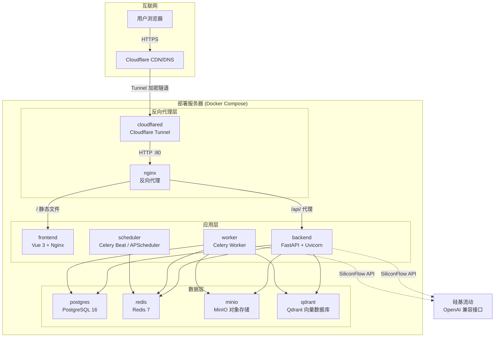
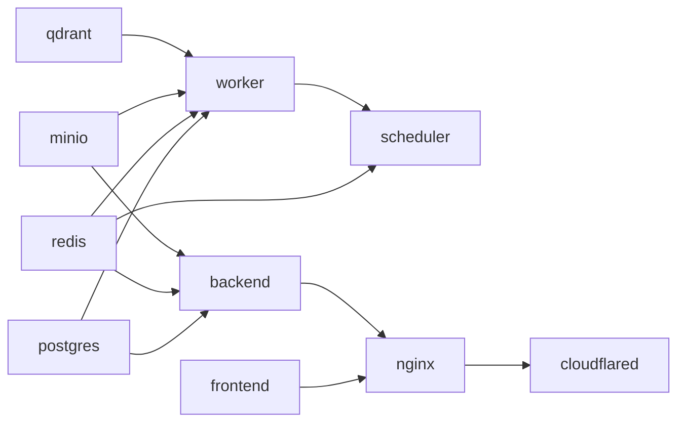

# AI 伴学与智能体协同平台 — 部署与运维指南

版本：V1.0
最后更新：2026-06-02
适用范围：MVP 阶段生产部署

---

## 目录

- [一、部署架构概览](#一部署架构概览)
- [二、环境要求](#二环境要求)
- [三、Docker Compose 完整配置](#三docker-compose-完整配置)
- [四、环境变量配置](#四环境变量配置)
- [五、Nginx 配置](#五nginx-配置)
- [六、Cloudflare Tunnel 配置](#六cloudflare-tunnel-配置)
- [七、数据库初始化](#七数据库初始化)
- [八、MinIO 配置](#八minio-配置)
- [九、快速部署步骤](#九快速部署步骤)
- [十、运维操作](#十运维操作)
- [十一、故障排查](#十一故障排查)
- [十二、安全加固](#十二安全加固)

---

## 一、部署架构概览

### 1.1 部署拓扑图



### 1.2 服务清单

| 序号 | 服务名 | 镜像 | 端口 | 职责 |
|------|--------|------|------|------|
| 1 | `frontend` | 自建 (Vue 3 + Nginx) | 80 (容器内) | 前端静态资源服务 |
| 2 | `backend` | 自建 (FastAPI + Uvicorn) | 8000 (容器内) | 后端 API 服务，SSE 流式输出 |
| 3 | `postgres` | postgres:16-alpine | 5432 | 关系型数据库，存储所有业务数据 |
| 4 | `redis` | redis:7-alpine | 6379 | 缓存、会话、Celery 消息队列 |
| 5 | `minio` | minio/minio:latest | 9000/9001 | 对象存储，文件上传与知识库原文件 |
| 6 | `qdrant` | qdrant/qdrant:latest | 6333/6334 | 向量数据库，知识库语义检索 |
| 7 | `worker` | 同 backend 镜像 | 无 | Celery 异步任务（文档解析、向量化、AI 调用） |
| 8 | `scheduler` | 同 backend 镜像 | 无 | 定时任务（每日 0 点复盘、Memory 更新、备份） |
| 9 | `nginx` | nginx:1.27-alpine | 80/443 (宿主) | 反向代理、SSL 终止、负载均衡 |
| 10 | `cloudflared` | cloudflare/cloudflared:latest | 无 | Cloudflare Tunnel 隧道客户端 |

### 1.3 网络访问链路

```
用户浏览器
  → HTTPS 请求到平台域名 (如 study.example.com)
    → Cloudflare CDN/DNS 解析
      → Cloudflare Tunnel 加密隧道
        → cloudflared 容器接收请求
          → 转发到 nginx 容器 :80
            → /          → frontend 容器 (静态文件)
            → /api/      → backend 容器 :8000 (API)
            → /api/chat/stream → backend :8000 (SSE 流式)
            → /minio/    → minio 容器 :9001 (控制台，仅管理员)
```

---

## 二、环境要求

### 2.1 硬件要求

| 项目 | 最低配置 | 推荐配置 |
|------|---------|---------|
| CPU | 4 核 | 8 核及以上 |
| 内存 | 8 GB | 16 GB 及以上 |
| 磁盘 | 50 GB SSD | 200 GB SSD 及以上 |
| 网络 | 稳定互联网（用于 Cloudflare Tunnel） | 带宽 ≥ 10 Mbps 上行 |

> **说明**：Qdrant 向量数据库和 PostgreSQL 在数据量增长后会占用较多内存，推荐生产环境使用 16 GB 以上内存。MinIO 和知识库文件会占用较多磁盘空间，建议预留充足存储。

### 2.2 操作系统

| 操作系统 | 支持情况 |
|---------|---------|
| Ubuntu Server 22.04/24.04 LTS | ✅ 推荐 |
| Debian 12+ | ✅ 支持 |
| CentOS Stream 9 / Rocky Linux 9 | ✅ 支持 |
| macOS (开发环境) | ⚠️ 仅开发 |
| Windows Server + WSL2 | ⚠️ 可用但不推荐生产 |

### 2.3 软件依赖

在部署服务器上需要预先安装以下软件：

| 软件 | 最低版本 | 安装命令 (Ubuntu) |
|------|---------|------------------|
| Docker Engine | 24.0+ | `curl -fsSL https://get.docker.com \| sh` |
| Docker Compose | v2.20+ (Plugin) | 随 Docker Engine 一起安装 |
| Git | 2.30+ | `sudo apt install git` |
| curl | 任意 | `sudo apt install curl` |
| make (可选) | 任意 | `sudo apt install make` |

验证安装：

```bash
docker --version          # Docker version 24.x+
docker compose version    # Docker Compose version v2.20+
git --version             # git version 2.x+
```

### 2.4 网络要求

| 要求 | 说明 |
|------|------|
| 互联网连接 | 稳定的出站连接，用于 Cloudflare Tunnel、拉取镜像、调用硅基流动 API |
| Cloudflare 账号 | 需要注册 Cloudflare 账号并托管一个域名 |
| 域名 | 一个已托管到 Cloudflare 的域名（如 `example.com`） |
| 防火墙出站 | 允许 HTTPS (443) 出站即可，无需开放入站端口 |

> **优势**：使用 Cloudflare Tunnel 无需公网 IP，无需配置端口转发，无需申请 SSL 证书。Tunnel 会自动建立出站加密隧道。

### 2.5 外部服务依赖

| 服务 | 用途 | 必需性 |
|------|------|--------|
| 硅基流动 (SiliconFlow) | AI 大模型 API 接口 | ✅ 必需 |
| Cloudflare | Tunnel + DNS + CDN | ✅ 必需（外网访问场景） |
| SMTP 邮件服务 | 邮件通知 | ⚠️ 可选，MVP 可暂跳过 |

---

## 三、Docker Compose 完整配置

### 3.1 项目目录结构

```
studyPartner/
├── docker-compose.yml          # 主编排文件
├── .env                        # 环境变量（从 .env.example 复制）
├── .env.example                # 环境变量模板
├── frontend/                   # 前端项目
│   ├── Dockerfile
│   ├── nginx.conf              # 前端容器内 Nginx 配置
│   └── ...
├── backend/                    # 后端项目
│   ├── Dockerfile
│   ├── alembic/                # 数据库迁移
│   ├── app/                    # FastAPI 应用
│   └── ...
├── deploy/                     # 部署配置文件
│   ├── nginx/
│   │   └── nginx.conf          # 主 Nginx 反向代理配置
│   ├── cloudflared/
│   │   └── config.yml          # Cloudflare Tunnel 配置
│   ├── postgres/
│   │   └── init.sql            # 数据库初始化脚本
│   └── scripts/
│       ├── deploy.sh           # 一键部署脚本
│       ├── backup.sh           # 备份脚本
│       └── restore.sh          # 恢复脚本
├── data/                       # 持久化数据（gitignored）
│   ├── postgres/
│   ├── redis/
│   ├── minio/
│   ├── qdrant/
│   └── backups/
└── logs/                       # 日志文件（gitignored）
```

### 3.2 docker-compose.yml

```yaml
# ============================================================
# AI 伴学与智能体协同平台 - Docker Compose 生产配置
# ============================================================
# 使用方法：
#   1. 复制 .env.example 为 .env 并填写配置
#   2. docker compose up -d
# ============================================================

name: study-partner

services:
  # ----------------------------------------------------------
  # 1. PostgreSQL 数据库
  # ----------------------------------------------------------
  postgres:
    image: postgres:16-alpine
    container_name: sp-postgres
    restart: unless-stopped
    environment:
      POSTGRES_DB: ${POSTGRES_DB:-studypartner}
      POSTGRES_USER: ${POSTGRES_USER:-sp_admin}
      POSTGRES_PASSWORD: ${POSTGRES_PASSWORD:?POSTGRES_PASSWORD is required}
      POSTGRES_INITDB_ARGS: "--encoding=UTF-8 --lc-collate=C --lc-ctype=C"
      TZ: Asia/Shanghai
    volumes:
      - ./data/postgres:/var/lib/postgresql/data
      - ./deploy/postgres/init.sql:/docker-entrypoint-initdb.d/init.sql:ro
    ports:
      - "${POSTGRES_PORT:-127.0.0.1:5432}:5432"
    networks:
      - sp-network
    healthcheck:
      test: ["CMD-SHELL", "pg_isready -U ${POSTGRES_USER:-sp_admin} -d ${POSTGRES_DB:-studypartner}"]
      interval: 10s
      timeout: 5s
      retries: 5
      start_period: 30s
    deploy:
      resources:
        limits:
          memory: 1G
        reservations:
          memory: 256M

  # ----------------------------------------------------------
  # 2. Redis 缓存与消息队列
  # ----------------------------------------------------------
  redis:
    image: redis:7-alpine
    container_name: sp-redis
    restart: unless-stopped
    command: >
      redis-server
      --requirepass ${REDIS_PASSWORD:?REDIS_PASSWORD is required}
      --maxmemory 512mb
      --maxmemory-policy allkeys-lru
      --appendonly yes
      --appendfsync everysec
    environment:
      TZ: Asia/Shanghai
    volumes:
      - ./data/redis:/data
    ports:
      - "${REDIS_PORT:-127.0.0.1:6379}:6379"
    networks:
      - sp-network
    healthcheck:
      test: ["CMD", "redis-cli", "-a", "${REDIS_PASSWORD}", "ping"]
      interval: 10s
      timeout: 5s
      retries: 5
      start_period: 10s
    deploy:
      resources:
        limits:
          memory: 512M

  # ----------------------------------------------------------
  # 3. MinIO 对象存储
  # ----------------------------------------------------------
  minio:
    image: minio/minio:latest
    container_name: sp-minio
    restart: unless-stopped
    command: server /data --console-address ":9001"
    environment:
      MINIO_ROOT_USER: ${MINIO_ROOT_USER:?MINIO_ROOT_USER is required}
      MINIO_ROOT_PASSWORD: ${MINIO_ROOT_PASSWORD:?MINIO_ROOT_PASSWORD is required}
      MINIO_BROWSER_REDIRECT_URL: ${MINIO_CONSOLE_URL:-http://localhost:9001}
      TZ: Asia/Shanghai
    volumes:
      - ./data/minio:/data
    ports:
      - "${MINIO_API_PORT:-127.0.0.1:9000}:9000"
      - "${MINIO_CONSOLE_PORT:-127.0.0.1:9001}:9001"
    networks:
      - sp-network
    healthcheck:
      test: ["CMD", "mc", "ready", "local"]
      interval: 30s
      timeout: 10s
      retries: 3
      start_period: 30s
    deploy:
      resources:
        limits:
          memory: 512M

  # ----------------------------------------------------------
  # 4. Qdrant 向量数据库
  # ----------------------------------------------------------
  qdrant:
    image: qdrant/qdrant:latest
    container_name: sp-qdrant
    restart: unless-stopped
    environment:
      QDRANT__SERVICE__API_KEY: ${QDRANT_API_KEY:-}
      QDRANT__STORAGE__STORAGE_PATH: /qdrant/storage
      QDRANT__STORAGE__SNAPSHOTS_PATH: /qdrant/snapshots
      TZ: Asia/Shanghai
    volumes:
      - ./data/qdrant/storage:/qdrant/storage
      - ./data/qdrant/snapshots:/qdrant/snapshots
    ports:
      - "${QDRANT_HTTP_PORT:-127.0.0.1:6333}:6333"
      - "${QDRANT_GRPC_PORT:-127.0.0.1:6334}:6334"
    networks:
      - sp-network
    healthcheck:
      test: ["CMD-SHELL", "curl -sf http://localhost:6333/readyz || exit 1"]
      interval: 30s
      timeout: 10s
      retries: 3
      start_period: 20s
    deploy:
      resources:
        limits:
          memory: 1G
        reservations:
          memory: 256M

  # ----------------------------------------------------------
  # 5. Backend — FastAPI 后端 API 服务
  # ----------------------------------------------------------
  backend:
    build:
      context: ./backend
      dockerfile: Dockerfile
      args:
        - ENVIRONMENT=production
    image: sp-backend:latest
    container_name: sp-backend
    restart: unless-stopped
    command: >
      uvicorn app.main:app
      --host 0.0.0.0
      --port 8000
      --workers ${BACKEND_WORKERS:-4}
      --loop uvloop
      --http httptools
      --log-level info
      --access-log
      --proxy-headers
      --forwarded-allow-ips='*'
    environment:
      # --- 应用配置 ---
      APP_ENV: production
      APP_DEBUG: "false"
      APP_SECRET_KEY: ${APP_SECRET_KEY:?APP_SECRET_KEY is required}
      APP_NAME: ${APP_NAME:-AI伴学与智能体协同平台}
      APP_URL: ${APP_URL:-https://study.example.com}
      # --- 数据库 ---
      DATABASE_URL: postgresql+asyncpg://${POSTGRES_USER:-sp_admin}:${POSTGRES_PASSWORD}@postgres:5432/${POSTGRES_DB:-studypartner}
      DATABASE_POOL_SIZE: ${DATABASE_POOL_SIZE:-10}
      DATABASE_MAX_OVERFLOW: ${DATABASE_MAX_OVERFLOW:-20}
      # --- Redis ---
      REDIS_URL: redis://:${REDIS_PASSWORD}@redis:6379/0
      CELERY_BROKER_URL: redis://:${REDIS_PASSWORD}@redis:6379/1
      CELERY_RESULT_BACKEND: redis://:${REDIS_PASSWORD}@redis:6379/2
      # --- MinIO ---
      MINIO_ENDPOINT: minio:9000
      MINIO_ACCESS_KEY: ${MINIO_ROOT_USER}
      MINIO_SECRET_KEY: ${MINIO_ROOT_PASSWORD}
      MINIO_BUCKET_NAME: ${MINIO_BUCKET_NAME:-studypartner}
      MINIO_USE_SSL: "false"
      # --- Qdrant ---
      QDRANT_HOST: qdrant
      QDRANT_PORT: 6333
      QDRANT_API_KEY: ${QDRANT_API_KEY:-}
      QDRANT_COLLECTION: ${QDRANT_COLLECTION:-knowledge_base}
      # --- JWT ---
      JWT_SECRET_KEY: ${JWT_SECRET_KEY:?JWT_SECRET_KEY is required}
      JWT_ALGORITHM: ${JWT_ALGORITHM:-HS256}
      JWT_ACCESS_TOKEN_EXPIRE_MINUTES: ${JWT_ACCESS_TOKEN_EXPIRE_MINUTES:-1440}
      JWT_REFRESH_TOKEN_EXPIRE_DAYS: ${JWT_REFRESH_TOKEN_EXPIRE_DAYS:-7}
      # --- AI / SiliconFlow ---
      LLM_PROVIDER: ${LLM_PROVIDER:-siliconflow}
      LLM_BASE_URL: ${LLM_BASE_URL:-https://api.siliconflow.cn/v1}
      LLM_API_KEY: ${LLM_API_KEY:?LLM_API_KEY is required}
      LLM_CHAT_MODEL: ${LLM_CHAT_MODEL:-Qwen/Qwen2.5-7B-Instruct}
      LLM_EMBEDDING_MODEL: ${LLM_EMBEDDING_MODEL:-BAAI/bge-large-zh-v1.5}
      LLM_DAILY_QUOTA: ${LLM_DAILY_QUOTA:-1000}
      LLM_RPM_LIMIT: ${LLM_RPM_LIMIT:-30}
      LLM_TPM_LIMIT: ${LLM_TPM_LIMIT:-100000}
      # --- SMTP ---
      SMTP_HOST: ${SMTP_HOST:-}
      SMTP_PORT: ${SMTP_PORT:-465}
      SMTP_USER: ${SMTP_USER:-}
      SMTP_PASSWORD: ${SMTP_PASSWORD:-}
      SMTP_FROM: ${SMTP_FROM:-}
      SMTP_USE_SSL: ${SMTP_USE_SSL:-true}
      # --- 文件上传 ---
      MAX_UPLOAD_SIZE_MB: ${MAX_UPLOAD_SIZE_MB:-50}
      ALLOWED_EXTENSIONS: ${ALLOWED_EXTENSIONS:-pdf,docx,doc,md,txt,pptx,xlsx,png,jpg,jpeg,zip}
      # --- 限流 ---
      RATE_LIMIT_PER_MINUTE: ${RATE_LIMIT_PER_MINUTE:-60}
      RATE_LIMIT_AI_PER_MINUTE: ${RATE_LIMIT_AI_PER_MINUTE:-10}
      # --- 时区 ---
      TZ: Asia/Shanghai
    volumes:
      - ./logs/backend:/app/logs
    ports:
      - "${BACKEND_PORT:-127.0.0.1:8000}:8000"
    networks:
      - sp-network
    depends_on:
      postgres:
        condition: service_healthy
      redis:
        condition: service_healthy
      minio:
        condition: service_healthy
    healthcheck:
      test: ["CMD-SHELL", "curl -sf http://localhost:8000/api/v1/health || exit 1"]
      interval: 30s
      timeout: 10s
      retries: 3
      start_period: 40s
    deploy:
      resources:
        limits:
          memory: 2G
        reservations:
          memory: 512M

  # ----------------------------------------------------------
  # 6. Worker — Celery 异步任务处理
  # ----------------------------------------------------------
  worker:
    build:
      context: ./backend
      dockerfile: Dockerfile
    image: sp-backend:latest
    container_name: sp-worker
    restart: unless-stopped
    command: >
      celery -A app.celery_app worker
      --loglevel=info
      --concurrency=${CELERY_CONCURRENCY:-4}
      --max-tasks-per-child=100
      --queues=default,ai,documents
      -n worker@%h
    environment:
      APP_ENV: production
      DATABASE_URL: postgresql+asyncpg://${POSTGRES_USER:-sp_admin}:${POSTGRES_PASSWORD}@postgres:5432/${POSTGRES_DB:-studypartner}
      REDIS_URL: redis://:${REDIS_PASSWORD}@redis:6379/0
      CELERY_BROKER_URL: redis://:${REDIS_PASSWORD}@redis:6379/1
      CELERY_RESULT_BACKEND: redis://:${REDIS_PASSWORD}@redis:6379/2
      MINIO_ENDPOINT: minio:9000
      MINIO_ACCESS_KEY: ${MINIO_ROOT_USER}
      MINIO_SECRET_KEY: ${MINIO_ROOT_PASSWORD}
      MINIO_BUCKET_NAME: ${MINIO_BUCKET_NAME:-studypartner}
      MINIO_USE_SSL: "false"
      QDRANT_HOST: qdrant
      QDRANT_PORT: 6333
      QDRANT_API_KEY: ${QDRANT_API_KEY:-}
      QDRANT_COLLECTION: ${QDRANT_COLLECTION:-knowledge_base}
      LLM_PROVIDER: ${LLM_PROVIDER:-siliconflow}
      LLM_BASE_URL: ${LLM_BASE_URL:-https://api.siliconflow.cn/v1}
      LLM_API_KEY: ${LLM_API_KEY}
      LLM_CHAT_MODEL: ${LLM_CHAT_MODEL:-Qwen/Qwen2.5-7B-Instruct}
      LLM_EMBEDDING_MODEL: ${LLM_EMBEDDING_MODEL:-BAAI/bge-large-zh-v1.5}
      LLM_DAILY_QUOTA: ${LLM_DAILY_QUOTA:-1000}
      TZ: Asia/Shanghai
    volumes:
      - ./logs/worker:/app/logs
    networks:
      - sp-network
    depends_on:
      postgres:
        condition: service_healthy
      redis:
        condition: service_healthy
      minio:
        condition: service_healthy
      qdrant:
        condition: service_healthy
    deploy:
      resources:
        limits:
          memory: 2G
        reservations:
          memory: 256M

  # ----------------------------------------------------------
  # 7. Scheduler — 定时任务服务
  # ----------------------------------------------------------
  scheduler:
    build:
      context: ./backend
      dockerfile: Dockerfile
    image: sp-backend:latest
    container_name: sp-scheduler
    restart: unless-stopped
    command: >
      celery -A app.celery_app beat
      --loglevel=info
      --schedule=/tmp/celerybeat-schedule
      --pidfile=/tmp/celerybeat.pid
    environment:
      APP_ENV: production
      DATABASE_URL: postgresql+asyncpg://${POSTGRES_USER:-sp_admin}:${POSTGRES_PASSWORD}@postgres:5432/${POSTGRES_DB:-studypartner}
      REDIS_URL: redis://:${REDIS_PASSWORD}@redis:6379/0
      CELERY_BROKER_URL: redis://:${REDIS_PASSWORD}@redis:6379/1
      CELERY_RESULT_BACKEND: redis://:${REDIS_PASSWORD}@redis:6379/2
      TZ: Asia/Shanghai
    networks:
      - sp-network
    depends_on:
      redis:
        condition: service_healthy
      worker:
        condition: service_started
    deploy:
      resources:
        limits:
          memory: 256M

  # ----------------------------------------------------------
  # 8. Frontend — Vue 3 前端服务
  # ----------------------------------------------------------
  frontend:
    build:
      context: ./frontend
      dockerfile: Dockerfile
      args:
        - VITE_API_BASE_URL=${APP_URL:-https://study.example.com}/api/v1
        - VITE_APP_TITLE=${APP_NAME:-AI伴学与智能体协同平台}
    image: sp-frontend:latest
    container_name: sp-frontend
    restart: unless-stopped
    environment:
      TZ: Asia/Shanghai
    networks:
      - sp-network
    healthcheck:
      test: ["CMD-SHELL", "curl -sf http://localhost:80/ || exit 1"]
      interval: 30s
      timeout: 5s
      retries: 3
      start_period: 10s
    deploy:
      resources:
        limits:
          memory: 128M

  # ----------------------------------------------------------
  # 9. Nginx — 反向代理
  # ----------------------------------------------------------
  nginx:
    image: nginx:1.27-alpine
    container_name: sp-nginx
    restart: unless-stopped
    environment:
      TZ: Asia/Shanghai
    volumes:
      - ./deploy/nginx/nginx.conf:/etc/nginx/nginx.conf:ro
      - ./logs/nginx:/var/log/nginx
    ports:
      - "${NGINX_HTTP_PORT:-80}:80"
    networks:
      - sp-network
    depends_on:
      frontend:
        condition: service_healthy
      backend:
        condition: service_healthy
    healthcheck:
      test: ["CMD-SHELL", "curl -sf http://localhost:80/health || exit 1"]
      interval: 30s
      timeout: 5s
      retries: 3
      start_period: 10s
    deploy:
      resources:
        limits:
          memory: 128M

  # ----------------------------------------------------------
  # 10. Cloudflared — Cloudflare Tunnel
  # ----------------------------------------------------------
  cloudflared:
    image: cloudflare/cloudflared:latest
    container_name: sp-cloudflared
    restart: unless-stopped
    command: tunnel run
    environment:
      TUNNEL_TOKEN: ${CLOUDFLARE_TUNNEL_TOKEN:?CLOUDFLARE_TUNNEL_TOKEN is required}
      TZ: Asia/Shanghai
    networks:
      - sp-network
    depends_on:
      nginx:
        condition: service_healthy
    deploy:
      resources:
        limits:
          memory: 128M

# ==============================================================
# 网络配置
# ==============================================================
networks:
  sp-network:
    name: sp-network
    driver: bridge
    ipam:
      config:
        - subnet: 172.28.0.0/16
```

### 3.3 Backend Dockerfile 参考

```dockerfile
# backend/Dockerfile
# =============================================
# 多阶段构建 — Python FastAPI 后端
# =============================================

# --- 阶段1：依赖安装 ---
FROM python:3.12-slim AS builder

WORKDIR /build

# 系统依赖（用于编译 Python 包）
RUN apt-get update && apt-get install -y --no-install-recommends \
    build-essential \
    libpq-dev \
    && rm -rf /var/lib/apt/lists/*

COPY requirements.txt .
RUN pip install --no-cache-dir --prefix=/install -r requirements.txt

# --- 阶段2：运行时镜像 ---
FROM python:3.12-slim

WORKDIR /app

# 运行时系统依赖
RUN apt-get update && apt-get install -y --no-install-recommends \
    libpq5 \
    curl \
    && rm -rf /var/lib/apt/lists/* \
    && groupadd -r appuser && useradd -r -g appuser appuser

# 从 builder 阶段复制 Python 包
COPY --from=builder /install /usr/local

# 复制应用代码
COPY . .

# 创建日志目录
RUN mkdir -p /app/logs && chown -R appuser:appuser /app

USER appuser

EXPOSE 8000

# 健康检查
HEALTHCHECK --interval=30s --timeout=10s --retries=3 --start-period=40s \
    CMD curl -sf http://localhost:8000/api/v1/health || exit 1

CMD ["uvicorn", "app.main:app", "--host", "0.0.0.0", "--port", "8000"]
```

### 3.4 Frontend Dockerfile 参考

```dockerfile
# frontend/Dockerfile
# =============================================
# 多阶段构建 — Vue 3 前端
# =============================================

# --- 阶段1：构建 ---
FROM node:20-alpine AS builder

WORKDIR /build

# 构建参数
ARG VITE_API_BASE_URL
ARG VITE_APP_TITLE

# 安装依赖
COPY package.json pnpm-lock.yaml ./
RUN corepack enable && pnpm install --frozen-lockfile

# 复制源码并构建
COPY . .
RUN pnpm build

# --- 阶段2：Nginx 服务 ---
FROM nginx:1.27-alpine

# 复制构建产物
COPY --from=builder /build/dist /usr/share/nginx/html

# 复制 Nginx 配置（前端容器内部）
COPY nginx.conf /etc/nginx/conf.d/default.conf

EXPOSE 80

HEALTHCHECK --interval=30s --timeout=5s --retries=3 --start-period=10s \
    CMD curl -sf http://localhost:80/ || exit 1
```

前端容器内 Nginx 配置 (`frontend/nginx.conf`)：

```nginx
# frontend/nginx.conf — 前端容器内部的 Nginx 配置
server {
    listen 80;
    server_name _;
    root /usr/share/nginx/html;
    index index.html;

    # Vue Router History 模式支持
    location / {
        try_files $uri $uri/ /index.html;
    }

    # 静态资源缓存
    location ~* \.(js|css|png|jpg|jpeg|gif|ico|svg|woff|woff2|ttf|eot)$ {
        expires 30d;
        add_header Cache-Control "public, immutable";
    }

    # 禁止访问隐藏文件
    location ~ /\. {
        deny all;
    }
}
```

---

## 四、环境变量配置

### 4.1 .env.example 完整模板

将以下内容保存为项目根目录的 `.env.example`，部署时复制为 `.env` 并填写实际值。

```bash
# ==============================================================
# AI 伴学与智能体协同平台 — 环境变量配置
# ==============================================================
# 使用方法：cp .env.example .env && vim .env
# 带有 :? 标记的变量为必填项，部署前必须设置
# ==============================================================

# --------------------------------------------------------------
# 应用基础配置
# --------------------------------------------------------------
APP_NAME=AI伴学与智能体协同平台
APP_URL=https://study.example.com
APP_SECRET_KEY=          # 必填！应用密钥，用 `openssl rand -hex 32` 生成

# --------------------------------------------------------------
# PostgreSQL 数据库
# --------------------------------------------------------------
POSTGRES_DB=studypartner
POSTGRES_USER=sp_admin
POSTGRES_PASSWORD=       # 必填！数据库密码，建议 20+ 字符随机字符串
POSTGRES_PORT=127.0.0.1:5432
DATABASE_POOL_SIZE=10
DATABASE_MAX_OVERFLOW=20

# --------------------------------------------------------------
# Redis
# --------------------------------------------------------------
REDIS_PASSWORD=          # 必填！Redis 密码
REDIS_PORT=127.0.0.1:6379

# --------------------------------------------------------------
# MinIO 对象存储
# --------------------------------------------------------------
MINIO_ROOT_USER=         # 必填！MinIO 管理员用户名（至少 3 字符）
MINIO_ROOT_PASSWORD=     # 必填！MinIO 管理员密码（至少 8 字符）
MINIO_BUCKET_NAME=studypartner
MINIO_API_PORT=127.0.0.1:9000
MINIO_CONSOLE_PORT=127.0.0.1:9001
MINIO_CONSOLE_URL=http://localhost:9001

# --------------------------------------------------------------
# Qdrant 向量数据库
# --------------------------------------------------------------
QDRANT_API_KEY=          # 可选，Qdrant API 密钥（生产环境建议设置）
QDRANT_COLLECTION=knowledge_base
QDRANT_HTTP_PORT=127.0.0.1:6333
QDRANT_GRPC_PORT=127.0.0.1:6334

# --------------------------------------------------------------
# JWT 认证
# --------------------------------------------------------------
JWT_SECRET_KEY=          # 必填！JWT 签名密钥，用 `openssl rand -hex 32` 生成
JWT_ALGORITHM=HS256
JWT_ACCESS_TOKEN_EXPIRE_MINUTES=1440    # 访问令牌过期时间（分钟），默认 24 小时
JWT_REFRESH_TOKEN_EXPIRE_DAYS=7         # 刷新令牌过期时间（天）

# --------------------------------------------------------------
# AI 模型 — 硅基流动 (SiliconFlow)
# --------------------------------------------------------------
LLM_PROVIDER=siliconflow
LLM_BASE_URL=https://api.siliconflow.cn/v1
LLM_API_KEY=             # 必填！硅基流动 API Key
LLM_CHAT_MODEL=Qwen/Qwen2.5-7B-Instruct
LLM_EMBEDDING_MODEL=BAAI/bge-large-zh-v1.5
LLM_DAILY_QUOTA=1000     # 每日 AI 调用次数上限
LLM_RPM_LIMIT=30         # 每分钟请求限制
LLM_TPM_LIMIT=100000     # 每分钟 Token 限制

# --------------------------------------------------------------
# Cloudflare Tunnel
# --------------------------------------------------------------
CLOUDFLARE_TUNNEL_TOKEN=  # 必填！Cloudflare Tunnel Token

# --------------------------------------------------------------
# SMTP 邮件通知（可选）
# --------------------------------------------------------------
SMTP_HOST=smtp.example.com
SMTP_PORT=465
SMTP_USER=noreply@example.com
SMTP_PASSWORD=
SMTP_FROM=AI伴学平台 <noreply@example.com>
SMTP_USE_SSL=true

# --------------------------------------------------------------
# 文件上传
# --------------------------------------------------------------
MAX_UPLOAD_SIZE_MB=50
ALLOWED_EXTENSIONS=pdf,docx,doc,md,txt,pptx,xlsx,png,jpg,jpeg,zip

# --------------------------------------------------------------
# 速率限制
# --------------------------------------------------------------
RATE_LIMIT_PER_MINUTE=60          # 普通 API 每分钟请求限制
RATE_LIMIT_AI_PER_MINUTE=10       # AI 对话每分钟请求限制

# --------------------------------------------------------------
# 后端服务
# --------------------------------------------------------------
BACKEND_WORKERS=4                  # Uvicorn Worker 数量
BACKEND_PORT=127.0.0.1:8000
CELERY_CONCURRENCY=4               # Celery Worker 并发数

# --------------------------------------------------------------
# Nginx
# --------------------------------------------------------------
NGINX_HTTP_PORT=80

# --------------------------------------------------------------
# 默认管理员账号（首次部署时使用）
# --------------------------------------------------------------
DEFAULT_ADMIN_USERNAME=admin
DEFAULT_ADMIN_PASSWORD=  # 必填！首次部署的管理员密码，部署后务必修改
DEFAULT_ADMIN_EMAIL=admin@example.com
```

### 4.2 快速生成密钥

```bash
# 生成 APP_SECRET_KEY
openssl rand -hex 32

# 生成 JWT_SECRET_KEY
openssl rand -hex 32

# 生成强随机密码（用于 POSTGRES_PASSWORD / REDIS_PASSWORD 等）
openssl rand -base64 24

# 或使用 Python
python3 -c "import secrets; print(secrets.token_urlsafe(32))"
```

---

## 五、Nginx 配置

### 5.1 完整 nginx.conf

将以下内容保存为 `deploy/nginx/nginx.conf`：

```nginx
# ==============================================================
# AI 伴学与智能体协同平台 — Nginx 反向代理配置
# ==============================================================

user  nginx;
worker_processes  auto;
worker_rlimit_nofile 65535;

error_log  /var/log/nginx/error.log warn;
pid        /var/run/nginx.pid;

events {
    worker_connections  2048;
    multi_accept on;
    use epoll;
}

http {
    include       /etc/nginx/mime.types;
    default_type  application/octet-stream;

    # --------------------------------------------------------
    # 日志格式
    # --------------------------------------------------------
    log_format main '$remote_addr - $remote_user [$time_local] '
                    '"$request" $status $body_bytes_sent '
                    '"$http_referer" "$http_user_agent" '
                    '$request_time $upstream_response_time';

    access_log  /var/log/nginx/access.log  main;

    # --------------------------------------------------------
    # 基础性能配置
    # --------------------------------------------------------
    sendfile        on;
    tcp_nopush      on;
    tcp_nodelay     on;
    keepalive_timeout  65;
    types_hash_max_size 2048;
    server_tokens   off;           # 隐藏 Nginx 版本号

    # --------------------------------------------------------
    # Gzip 压缩
    # --------------------------------------------------------
    gzip  on;
    gzip_vary on;
    gzip_proxied any;
    gzip_comp_level 6;
    gzip_min_length 1024;
    gzip_types
        text/plain
        text/css
        text/javascript
        text/xml
        application/json
        application/javascript
        application/xml
        application/xml+rss
        application/x-javascript
        application/wasm
        image/svg+xml
        font/woff2;

    # --------------------------------------------------------
    # 文件上传大小限制
    # --------------------------------------------------------
    client_max_body_size 55M;       # 略大于应用层 50MB 限制

    # --------------------------------------------------------
    # 请求体缓冲
    # --------------------------------------------------------
    client_body_buffer_size 16k;
    client_header_buffer_size 4k;
    large_client_header_buffers 4 16k;

    # --------------------------------------------------------
    # 超时配置
    # --------------------------------------------------------
    proxy_connect_timeout 60s;
    proxy_send_timeout 120s;
    proxy_read_timeout 300s;        # AI 流式输出可能较长

    # --------------------------------------------------------
    # Upstream 定义
    # --------------------------------------------------------
    upstream backend_api {
        server backend:8000;
        keepalive 32;
    }

    upstream frontend_app {
        server frontend:80;
    }

    # --------------------------------------------------------
    # 限流配置
    # --------------------------------------------------------
    limit_req_zone $binary_remote_addr zone=api_limit:10m rate=30r/s;
    limit_req_zone $binary_remote_addr zone=ai_limit:10m rate=5r/s;
    limit_req_zone $binary_remote_addr zone=upload_limit:10m rate=2r/s;

    # --------------------------------------------------------
    # 主服务器配置
    # --------------------------------------------------------
    server {
        listen 80;
        server_name _;

        # ====================================================
        # 健康检查端点（供 Docker / Cloudflare 使用）
        # ====================================================
        location /health {
            access_log off;
            return 200 '{"status":"ok"}';
            add_header Content-Type application/json;
        }

        # ====================================================
        # 安全响应头（全局）
        # ====================================================
        add_header X-Frame-Options "SAMEORIGIN" always;
        add_header X-Content-Type-Options "nosniff" always;
        add_header X-XSS-Protection "1; mode=block" always;
        add_header Referrer-Policy "strict-origin-when-cross-origin" always;
        add_header Permissions-Policy "camera=(), microphone=(), geolocation=()" always;

        # ====================================================
        # 后端 API 代理 — /api/
        # ====================================================
        location /api/ {
            limit_req zone=api_limit burst=20 nodelay;

            proxy_pass http://backend_api;
            proxy_set_header Host $host;
            proxy_set_header X-Real-IP $remote_addr;
            proxy_set_header X-Forwarded-For $proxy_add_x_forwarded_for;
            proxy_set_header X-Forwarded-Proto $scheme;
            proxy_set_header X-Request-ID $request_id;

            # Keep-Alive
            proxy_http_version 1.1;
            proxy_set_header Connection "";

            # CORS 头（后端也应处理，此处为防御性配置）
            add_header Access-Control-Allow-Origin "$http_origin" always;
            add_header Access-Control-Allow-Methods "GET, POST, PUT, PATCH, DELETE, OPTIONS" always;
            add_header Access-Control-Allow-Headers "Authorization, Content-Type, X-Requested-With" always;
            add_header Access-Control-Allow-Credentials "true" always;
            add_header Access-Control-Max-Age 86400 always;

            # 处理 OPTIONS 预检请求
            if ($request_method = 'OPTIONS') {
                add_header Access-Control-Allow-Origin "$http_origin";
                add_header Access-Control-Allow-Methods "GET, POST, PUT, PATCH, DELETE, OPTIONS";
                add_header Access-Control-Allow-Headers "Authorization, Content-Type, X-Requested-With";
                add_header Access-Control-Allow-Credentials "true";
                add_header Access-Control-Max-Age 86400;
                add_header Content-Length 0;
                add_header Content-Type text/plain;
                return 204;
            }
        }

        # ====================================================
        # SSE 流式输出代理 — AI 对话
        # ====================================================
        location ~ ^/api/v1/(chat|ai)/.*stream {
            limit_req zone=ai_limit burst=5 nodelay;

            proxy_pass http://backend_api;
            proxy_set_header Host $host;
            proxy_set_header X-Real-IP $remote_addr;
            proxy_set_header X-Forwarded-For $proxy_add_x_forwarded_for;
            proxy_set_header X-Forwarded-Proto $scheme;

            # SSE 关键配置
            proxy_http_version 1.1;
            proxy_set_header Connection "";
            proxy_buffering off;                # 禁用代理缓冲
            proxy_cache off;                    # 禁用缓存
            proxy_read_timeout 600s;            # SSE 长连接超时 10 分钟
            chunked_transfer_encoding on;

            # 禁用 Gzip（SSE 不应压缩）
            gzip off;

            # CORS
            add_header Access-Control-Allow-Origin "$http_origin" always;
            add_header Access-Control-Allow-Credentials "true" always;
        }

        # ====================================================
        # 文件上传代理
        # ====================================================
        location /api/v1/files/upload {
            limit_req zone=upload_limit burst=3 nodelay;

            client_max_body_size 55M;
            proxy_pass http://backend_api;
            proxy_set_header Host $host;
            proxy_set_header X-Real-IP $remote_addr;
            proxy_set_header X-Forwarded-For $proxy_add_x_forwarded_for;
            proxy_set_header X-Forwarded-Proto $scheme;

            proxy_http_version 1.1;
            proxy_set_header Connection "";
            proxy_request_buffering off;        # 直接转发，不在 Nginx 缓冲
        }

        # ====================================================
        # WebSocket 代理（预留，如通知推送等）
        # ====================================================
        location /ws/ {
            proxy_pass http://backend_api;
            proxy_set_header Host $host;
            proxy_set_header X-Real-IP $remote_addr;
            proxy_set_header X-Forwarded-For $proxy_add_x_forwarded_for;
            proxy_set_header X-Forwarded-Proto $scheme;

            # WebSocket 关键配置
            proxy_http_version 1.1;
            proxy_set_header Upgrade $http_upgrade;
            proxy_set_header Connection "upgrade";
            proxy_read_timeout 3600s;           # WebSocket 长连接超时 1 小时
            proxy_send_timeout 3600s;
        }

        # ====================================================
        # 前端静态资源 — /
        # ====================================================
        location / {
            proxy_pass http://frontend_app;
            proxy_set_header Host $host;
            proxy_set_header X-Real-IP $remote_addr;
            proxy_set_header X-Forwarded-For $proxy_add_x_forwarded_for;

            proxy_http_version 1.1;
            proxy_set_header Connection "";
        }

        # ====================================================
        # 禁止访问敏感路径
        # ====================================================
        location ~ /\.(git|env|docker) {
            deny all;
            return 404;
        }

        location ~ ^/(\.well-known) {
            allow all;
        }

        # ====================================================
        # Favicon 和 robots.txt
        # ====================================================
        location = /favicon.ico {
            log_not_found off;
            access_log off;
        }

        location = /robots.txt {
            log_not_found off;
            access_log off;
        }
    }
}
```

---

## 六、Cloudflare Tunnel 配置

### 6.1 前置准备

1. 注册 Cloudflare 账号：[https://dash.cloudflare.com/sign-up](https://dash.cloudflare.com/sign-up)
2. 将域名 DNS 托管到 Cloudflare
3. 等待域名激活（通常几分钟到 48 小时）

### 6.2 创建 Tunnel（推荐 Dashboard 方式）

#### 步骤一：创建 Tunnel

1. 登录 Cloudflare Dashboard
2. 进入 **Zero Trust** → **Networks** → **Tunnels**
3. 点击 **Create a tunnel**
4. 选择 **Cloudflared** 类型
5. 命名 Tunnel（如 `study-partner-tunnel`）
6. 在 **Install and run connectors** 页面，复制 Tunnel Token

> Token 格式类似：`eyJhIjoiNjQ4...` 很长的一串字符

#### 步骤二：配置 Token

将 Token 填入 `.env` 文件：

```bash
CLOUDFLARE_TUNNEL_TOKEN=eyJhIjoiNjQ4...（你的完整 Token）
```

#### 步骤三：配置 Public Hostname

在 Cloudflare Dashboard 的 Tunnel 配置页面，添加 Public Hostname：

| 字段 | 值 | 说明 |
|------|----|------|
| Subdomain | `study` | 子域名 |
| Domain | `example.com` | 你的域名 |
| Type | `HTTP` | 协议类型 |
| URL | `nginx:80` | 指向 Nginx 容器 |

最终访问地址：`https://study.example.com`

#### 步骤四：高级设置（在 Dashboard 中配置）

在 Hostname 的 **Additional application settings** 中：

| 设置项 | 推荐值 | 说明 |
|--------|--------|------|
| HTTP Host Header | `study.example.com` | 保持与域名一致 |
| Connection Timeout | `120s` | AI 流式输出需要较长超时 |
| Disable Chunked Encoding | `OFF` | SSE 需要分块传输 |
| No TLS Verify | `ON` | 内部通信无需 TLS |
| HTTP2 Origin | `OFF` | Nginx 后端使用 HTTP/1.1 |

### 6.3 备选：使用配置文件方式

如果需要使用配置文件而不是 Dashboard Token，可以将 docker-compose 中的 cloudflared 替换为：

```yaml
cloudflared:
  image: cloudflare/cloudflared:latest
  container_name: sp-cloudflared
  restart: unless-stopped
  command: tunnel --config /etc/cloudflared/config.yml run
  volumes:
    - ./deploy/cloudflared:/etc/cloudflared:ro
  networks:
    - sp-network
  depends_on:
    nginx:
      condition: service_healthy
```

配置文件 `deploy/cloudflared/config.yml`：

```yaml
# Cloudflare Tunnel 配置文件
# 使用 `cloudflared tunnel login` 获取凭证
# 使用 `cloudflared tunnel create study-partner` 创建 Tunnel

tunnel: <TUNNEL_ID>            # 替换为你的 Tunnel ID
credentials-file: /etc/cloudflared/<TUNNEL_ID>.json

# 入站规则
ingress:
  # 主应用 — 转发到 Nginx
  - hostname: study.example.com
    service: http://nginx:80
    originRequest:
      connectTimeout: 120s
      noTLSVerify: true
      disableChunkedEncoding: false
      httpHostHeader: study.example.com

  # MinIO 控制台（可选，仅管理员访问）
  - hostname: minio.example.com
    service: http://minio:9001
    originRequest:
      noTLSVerify: true

  # 兜底规则（必须放最后）
  - service: http_status:404
```

### 6.4 SSL/TLS 设置

在 Cloudflare Dashboard 中配置 SSL/TLS：

1. 进入域名设置 → **SSL/TLS** → **Overview**
2. 模式设置为 **Full**（因为 Tunnel 内部自动加密）
3. **Edge Certificates** → 确保 **Always Use HTTPS** 开启
4. 开启 **Automatic HTTPS Rewrites**
5. 开启 **TLS 1.3**

### 6.5 DNS 验证

Tunnel 创建后，Cloudflare 会自动添加 CNAME 记录：

```
study.example.com → <TUNNEL_ID>.cfargotunnel.com
```

验证 DNS 生效：

```bash
dig study.example.com CNAME
# 或
nslookup study.example.com
```

---

## 七、数据库初始化

### 7.1 数据库初始化脚本

将以下内容保存为 `deploy/postgres/init.sql`：

```sql
-- ==============================================================
-- AI 伴学与智能体协同平台 — PostgreSQL 初始化脚本
-- 该脚本在 PostgreSQL 容器首次启动时自动执行
-- ==============================================================

-- 启用必要的扩展
CREATE EXTENSION IF NOT EXISTS "uuid-ossp";     -- UUID 生成
CREATE EXTENSION IF NOT EXISTS "pgcrypto";      -- 加密函数
CREATE EXTENSION IF NOT EXISTS "pg_trgm";       -- 模糊搜索
-- CREATE EXTENSION IF NOT EXISTS "vector";     -- 如果使用 pgvector 替代 Qdrant 则取消注释

-- 设置默认时区
SET timezone = 'Asia/Shanghai';

-- 创建枚举类型（Alembic 迁移也会管理，此处作为初始保障）
DO $$
BEGIN
    -- 用户状态
    IF NOT EXISTS (SELECT 1 FROM pg_type WHERE typname = 'user_status') THEN
        CREATE TYPE user_status AS ENUM ('active', 'disabled', 'pending');
    END IF;

    -- 用户角色
    IF NOT EXISTS (SELECT 1 FROM pg_type WHERE typname = 'user_role') THEN
        CREATE TYPE user_role AS ENUM ('admin', 'teacher', 'student');
    END IF;
END
$$;

-- 输出初始化完成信息
DO $$
BEGIN
    RAISE NOTICE '数据库初始化完成 — AI 伴学与智能体协同平台';
END
$$;
```

### 7.2 Alembic 迁移策略

项目使用 Alembic 管理数据库 Schema 变更。

#### 初始化 Alembic（首次设置）

```bash
# 进入 backend 容器
docker compose exec backend bash

# 初始化 Alembic（项目首次搭建时执行）
alembic init alembic

# 编辑 alembic/env.py，配置 SQLAlchemy 的 metadata
# 确保 target_metadata 指向所有模型的 Base.metadata
```

#### 生成迁移脚本

```bash
# 自动生成迁移脚本（基于模型变更）
docker compose exec backend alembic revision --autogenerate -m "描述变更内容"

# 查看待执行的迁移
docker compose exec backend alembic history
docker compose exec backend alembic current
```

#### 执行迁移

```bash
# 执行所有未应用的迁移
docker compose exec backend alembic upgrade head

# 回退一个版本
docker compose exec backend alembic downgrade -1

# 回退到指定版本
docker compose exec backend alembic downgrade <revision_id>
```

#### 部署时自动迁移

建议在 backend 容器启动命令中加入自动迁移，或在 entrypoint 脚本中执行：

```bash
#!/bin/bash
# backend/entrypoint.sh

set -e

echo "=== 执行数据库迁移 ==="
alembic upgrade head

echo "=== 初始化种子数据 ==="
python -m app.scripts.seed_data

echo "=== 启动应用 ==="
exec "$@"
```

### 7.3 种子数据

首次部署时需要初始化默认管理员和基础角色数据：

```python
# backend/app/scripts/seed_data.py
"""
种子数据初始化脚本
首次部署时创建默认管理员账号和基础配置
"""
import asyncio
import os
from app.database import async_session_factory
from app.models.user import User, Role
from app.core.security import hash_password


async def seed():
    async with async_session_factory() as session:
        # 检查是否已有管理员
        from sqlalchemy import select
        result = await session.execute(
            select(User).where(User.username == "admin")
        )
        if result.scalar_one_or_none():
            print("种子数据已存在，跳过初始化")
            return

        # 创建角色
        roles = [
            Role(name="admin", display_name="管理员", description="系统管理员，拥有所有权限"),
            Role(name="teacher", display_name="老师", description="老师角色，管理学生和任务"),
            Role(name="student", display_name="学生", description="学生角色，使用学习工具和AI伴学"),
        ]
        session.add_all(roles)
        await session.flush()

        # 创建默认管理员
        admin = User(
            username=os.getenv("DEFAULT_ADMIN_USERNAME", "admin"),
            email=os.getenv("DEFAULT_ADMIN_EMAIL", "admin@example.com"),
            hashed_password=hash_password(
                os.getenv("DEFAULT_ADMIN_PASSWORD", "ChangeMe123!")
            ),
            display_name="系统管理员",
            role="admin",
            status="active",
        )
        session.add(admin)
        await session.commit()
        print("✅ 种子数据初始化完成：默认管理员已创建")


if __name__ == "__main__":
    asyncio.run(seed())
```

### 7.4 数据库备份与恢复

#### 手动备份

```bash
# 备份整个数据库（带时间戳）
docker compose exec postgres pg_dump \
    -U sp_admin \
    -d studypartner \
    --format=custom \
    --compress=9 \
    > ./data/backups/db_$(date +%Y%m%d_%H%M%S).dump

# 仅备份数据（不含 schema）
docker compose exec postgres pg_dump \
    -U sp_admin \
    -d studypartner \
    --data-only \
    --format=custom \
    > ./data/backups/db_data_$(date +%Y%m%d_%H%M%S).dump
```

#### 恢复备份

```bash
# 恢复数据库
docker compose exec -T postgres pg_restore \
    -U sp_admin \
    -d studypartner \
    --clean \
    --if-exists \
    < ./data/backups/db_20260601_000000.dump
```

#### 自动备份脚本

详见 [十、运维操作 — 10.3 数据库自动备份](#103-数据库自动备份)。

---

## 八、MinIO 配置

### 8.1 自动初始化 Bucket

创建 MinIO 初始化脚本 `deploy/scripts/init-minio.sh`：

```bash
#!/bin/bash
# ==============================================================
# MinIO 初始化脚本 — 创建 Bucket 和设置策略
# ==============================================================

set -e

# 等待 MinIO 就绪
echo "等待 MinIO 启动..."
until docker compose exec minio mc ready local 2>/dev/null; do
    sleep 2
done
echo "MinIO 已就绪"

# 配置 mc 客户端
docker compose exec minio mc alias set local \
    http://localhost:9000 \
    "${MINIO_ROOT_USER}" \
    "${MINIO_ROOT_PASSWORD}"

# 创建 Bucket
echo "创建 Bucket..."
docker compose exec minio mc mb local/studypartner --ignore-existing
docker compose exec minio mc mb local/studypartner-avatars --ignore-existing
docker compose exec minio mc mb local/studypartner-knowledge --ignore-existing
docker compose exec minio mc mb local/studypartner-temp --ignore-existing

# 设置 Bucket 策略
echo "设置 Bucket 策略..."

# studypartner — 主存储桶（私有）
docker compose exec minio mc anonymous set none local/studypartner

# studypartner-avatars — 头像桶（公开读）
docker compose exec minio mc anonymous set download local/studypartner-avatars

# studypartner-knowledge — 知识库文件（私有）
docker compose exec minio mc anonymous set none local/studypartner-knowledge

# studypartner-temp — 临时文件（私有，设置自动过期）
docker compose exec minio mc anonymous set none local/studypartner-temp
docker compose exec minio mc ilm rule add local/studypartner-temp \
    --expire-days 7 \
    --prefix "" \
    --tags ""

echo "✅ MinIO 初始化完成"
```

### 8.2 Bucket 用途说明

| Bucket 名称 | 用途 | 访问策略 | 说明 |
|-------------|------|---------|------|
| `studypartner` | 通用文件存储 | 私有 | 任务附件、学生提交文件等 |
| `studypartner-avatars` | 用户头像 | 公开读 | 头像图片，允许直接 URL 访问 |
| `studypartner-knowledge` | 知识库原文件 | 私有 | 上传的 PDF/Word/Markdown 等原始文件 |
| `studypartner-temp` | 临时文件 | 私有 | 临时上传文件，7 天自动清理 |

### 8.3 文件大小限制

| 限制项 | 配置值 | 配置位置 |
|--------|--------|---------|
| 单文件最大大小 | 50 MB | `.env` → `MAX_UPLOAD_SIZE_MB` |
| Nginx 请求体限制 | 55 MB | `nginx.conf` → `client_max_body_size` |
| MinIO 单个 PUT 限制 | 5 GB (默认) | MinIO 默认配置 |
| 允许的文件扩展名 | pdf,docx,doc,md,txt,pptx,xlsx,png,jpg,jpeg,zip | `.env` → `ALLOWED_EXTENSIONS` |

### 8.4 MinIO 控制台访问

MinIO 自带 Web 控制台，可用于管理文件和 Bucket：

- 本地访问：`http://localhost:9001`（需要端口映射）
- 用户名/密码：与 `.env` 中 `MINIO_ROOT_USER` / `MINIO_ROOT_PASSWORD` 一致
- **安全提示**：生产环境中不要将 MinIO 控制台暴露到公网，仅限本地或 VPN 访问

---

## 九、快速部署步骤

### 9.1 分步部署指南

```bash
# ================================================
# 第一步：克隆项目
# ================================================
git clone https://github.com/your-org/studyPartner.git
cd studyPartner

# ================================================
# 第二步：准备环境变量
# ================================================
cp .env.example .env

# 编辑 .env，填写所有必填项
# 特别注意以下必填变量：
#   - POSTGRES_PASSWORD
#   - REDIS_PASSWORD
#   - MINIO_ROOT_USER / MINIO_ROOT_PASSWORD
#   - APP_SECRET_KEY （openssl rand -hex 32）
#   - JWT_SECRET_KEY （openssl rand -hex 32）
#   - LLM_API_KEY （硅基流动 API Key）
#   - CLOUDFLARE_TUNNEL_TOKEN
#   - DEFAULT_ADMIN_PASSWORD
nano .env

# ================================================
# 第三步：创建数据和日志目录
# ================================================
mkdir -p data/{postgres,redis,minio,qdrant/storage,qdrant/snapshots,backups}
mkdir -p logs/{backend,worker,nginx}

# ================================================
# 第四步：构建镜像
# ================================================
docker compose build --no-cache

# ================================================
# 第五步：启动基础设施服务
# ================================================
docker compose up -d postgres redis minio qdrant

# 等待健康检查通过
echo "等待基础服务就绪..."
sleep 15
docker compose ps

# ================================================
# 第六步：初始化数据库
# ================================================
# 执行 Alembic 迁移
docker compose run --rm backend alembic upgrade head

# 初始化种子数据
docker compose run --rm backend python -m app.scripts.seed_data

# ================================================
# 第七步：初始化 MinIO
# ================================================
bash deploy/scripts/init-minio.sh

# ================================================
# 第八步：启动全部服务
# ================================================
docker compose up -d

# ================================================
# 第九步：验证部署
# ================================================
# 查看所有服务状态
docker compose ps

# 检查各服务健康状态
docker compose exec backend curl -s http://localhost:8000/api/v1/health
docker compose exec nginx curl -s http://localhost:80/health

# 查看日志确认无错误
docker compose logs --tail=50 backend
docker compose logs --tail=50 worker
docker compose logs --tail=50 scheduler

echo ""
echo "=========================================="
echo "✅ 部署完成！"
echo "=========================================="
echo "本地访问：http://localhost"
echo "外网访问：https://study.example.com"
echo "管理员账号：admin"
echo "管理员密码：（你在 .env 中设置的密码）"
echo "=========================================="
echo "⚠️  请立即登录并修改默认管理员密码！"
echo "=========================================="
```

### 9.2 一键部署脚本

将以下内容保存为 `deploy/scripts/deploy.sh`：

```bash
#!/bin/bash
# ==============================================================
# AI 伴学与智能体协同平台 — 一键部署脚本
# ==============================================================
# 使用方法：bash deploy/scripts/deploy.sh
# ==============================================================

set -e

# 颜色定义
RED='\033[0;31m'
GREEN='\033[0;32m'
YELLOW='\033[1;33m'
BLUE='\033[0;34m'
NC='\033[0m'

log_info()  { echo -e "${BLUE}[INFO]${NC} $1"; }
log_ok()    { echo -e "${GREEN}[OK]${NC} $1"; }
log_warn()  { echo -e "${YELLOW}[WARN]${NC} $1"; }
log_error() { echo -e "${RED}[ERROR]${NC} $1"; }

# 切换到项目根目录
SCRIPT_DIR="$(cd "$(dirname "${BASH_SOURCE[0]}")" && pwd)"
PROJECT_ROOT="$(cd "$SCRIPT_DIR/../.." && pwd)"
cd "$PROJECT_ROOT"

echo ""
echo "=========================================="
echo " AI 伴学与智能体协同平台 — 自动部署"
echo "=========================================="
echo ""

# 1. 检查依赖
log_info "检查系统依赖..."
command -v docker >/dev/null 2>&1 || { log_error "未安装 Docker"; exit 1; }
command -v git >/dev/null 2>&1 || { log_error "未安装 Git"; exit 1; }
docker compose version >/dev/null 2>&1 || { log_error "未安装 Docker Compose"; exit 1; }
log_ok "系统依赖检查通过"

# 2. 检查 .env 文件
if [ ! -f .env ]; then
    log_warn ".env 文件不存在，从模板创建..."
    cp .env.example .env
    log_error "请编辑 .env 文件填写必要配置后重新运行此脚本"
    exit 1
fi

# 3. 验证必填环境变量
log_info "验证环境变量..."
source .env
REQUIRED_VARS=(
    "POSTGRES_PASSWORD"
    "REDIS_PASSWORD"
    "MINIO_ROOT_USER"
    "MINIO_ROOT_PASSWORD"
    "APP_SECRET_KEY"
    "JWT_SECRET_KEY"
    "LLM_API_KEY"
    "CLOUDFLARE_TUNNEL_TOKEN"
)
MISSING=0
for var in "${REQUIRED_VARS[@]}"; do
    if [ -z "${!var}" ]; then
        log_error "缺少必填环境变量：$var"
        MISSING=1
    fi
done
if [ $MISSING -eq 1 ]; then
    log_error "请在 .env 文件中填写所有必填变量"
    exit 1
fi
log_ok "环境变量验证通过"

# 4. 创建必要目录
log_info "创建数据和日志目录..."
mkdir -p data/{postgres,redis,minio,qdrant/storage,qdrant/snapshots,backups}
mkdir -p logs/{backend,worker,nginx}
log_ok "目录创建完成"

# 5. 构建镜像
log_info "构建 Docker 镜像（可能需要几分钟）..."
docker compose build
log_ok "镜像构建完成"

# 6. 启动基础设施
log_info "启动基础设施服务..."
docker compose up -d postgres redis minio qdrant
log_info "等待服务就绪（30 秒）..."
sleep 30

# 检查健康状态
for service in postgres redis minio qdrant; do
    if docker compose ps "$service" | grep -q "healthy"; then
        log_ok "$service 已就绪"
    else
        log_warn "$service 可能尚未就绪，继续等待..."
        sleep 15
    fi
done

# 7. 数据库迁移
log_info "执行数据库迁移..."
docker compose run --rm backend alembic upgrade head
log_ok "数据库迁移完成"

# 8. 种子数据
log_info "初始化种子数据..."
docker compose run --rm backend python -m app.scripts.seed_data
log_ok "种子数据初始化完成"

# 9. 初始化 MinIO
log_info "初始化 MinIO Bucket..."
bash deploy/scripts/init-minio.sh
log_ok "MinIO 初始化完成"

# 10. 启动全部服务
log_info "启动所有服务..."
docker compose up -d
sleep 10

# 11. 验证
log_info "验证服务状态..."
echo ""
docker compose ps --format "table {{.Name}}\t{{.Status}}\t{{.Ports}}"
echo ""

# 检查后端健康
if docker compose exec backend curl -sf http://localhost:8000/api/v1/health > /dev/null 2>&1; then
    log_ok "后端 API 健康检查通过"
else
    log_warn "后端 API 尚未就绪，请稍后手动检查"
fi

echo ""
echo "=========================================="
log_ok "部署完成！"
echo "=========================================="
echo ""
echo "  本地访问：http://localhost"
echo "  外网访问：${APP_URL}"
echo ""
echo "  管理员账号：${DEFAULT_ADMIN_USERNAME:-admin}"
echo "  管理员密码：（.env 中配置的密码）"
echo ""
echo "  ⚠️  请立即登录并修改默认管理员密码！"
echo ""
echo "  常用命令："
echo "    查看状态：docker compose ps"
echo "    查看日志：docker compose logs -f <service>"
echo "    重启服务：docker compose restart <service>"
echo "    停止全部：docker compose down"
echo ""
echo "=========================================="
```

---

## 十、运维操作

### 10.1 查看日志

```bash
# 查看所有服务日志（实时跟踪）
docker compose logs -f

# 查看指定服务日志
docker compose logs -f backend        # 后端 API
docker compose logs -f worker         # 异步任务
docker compose logs -f scheduler      # 定时任务
docker compose logs -f nginx          # 反向代理
docker compose logs -f postgres       # 数据库
docker compose logs -f cloudflared    # Tunnel

# 查看最近 100 行日志
docker compose logs --tail=100 backend

# 按时间过滤（Docker Compose v2）
docker compose logs --since="2026-06-01T00:00:00" backend

# 查看 Nginx 访问日志
docker compose exec nginx cat /var/log/nginx/access.log | tail -50

# 查看 Nginx 错误日志
docker compose exec nginx cat /var/log/nginx/error.log | tail -50
```

### 10.2 重启服务

```bash
# 重启单个服务
docker compose restart backend
docker compose restart worker
docker compose restart scheduler

# 重启全部服务
docker compose restart

# 重建并重启（代码更新后）
docker compose up -d --build backend
docker compose up -d --build frontend

# 强制重建镜像
docker compose build --no-cache backend
docker compose up -d backend

# 停止全部服务
docker compose down

# 停止全部服务并删除数据卷（⚠️ 危险！会丢失所有数据）
# docker compose down -v
```

### 10.3 数据库自动备份

将以下脚本保存为 `deploy/scripts/backup.sh`：

```bash
#!/bin/bash
# ==============================================================
# 数据库 & 文件自动备份脚本
# ==============================================================
# 推荐添加到 crontab：
# 0 2 * * * /path/to/studyPartner/deploy/scripts/backup.sh
# ==============================================================

set -e

SCRIPT_DIR="$(cd "$(dirname "${BASH_SOURCE[0]}")" && pwd)"
PROJECT_ROOT="$(cd "$SCRIPT_DIR/../.." && pwd)"
cd "$PROJECT_ROOT"

# 加载环境变量
source .env

# 配置
BACKUP_DIR="$PROJECT_ROOT/data/backups"
DATE=$(date +%Y%m%d_%H%M%S)
KEEP_DAYS=30  # 保留最近 30 天的备份

mkdir -p "$BACKUP_DIR"

echo "[$(date)] 开始备份..."

# 1. 备份 PostgreSQL
echo "[$(date)] 备份 PostgreSQL..."
docker compose exec -T postgres pg_dump \
    -U "${POSTGRES_USER:-sp_admin}" \
    -d "${POSTGRES_DB:-studypartner}" \
    --format=custom \
    --compress=9 \
    > "$BACKUP_DIR/db_${DATE}.dump"
echo "[$(date)] PostgreSQL 备份完成: db_${DATE}.dump"

# 2. 备份 Redis（触发 RDB 快照）
echo "[$(date)] 备份 Redis..."
docker compose exec redis redis-cli -a "${REDIS_PASSWORD}" BGSAVE
sleep 5
docker compose cp redis:/data/dump.rdb "$BACKUP_DIR/redis_${DATE}.rdb" 2>/dev/null || true
echo "[$(date)] Redis 备份完成"

# 3. 备份 Qdrant 快照
echo "[$(date)] 备份 Qdrant..."
docker compose exec qdrant \
    curl -sf -X POST "http://localhost:6333/snapshots" > /dev/null 2>&1 || true
echo "[$(date)] Qdrant 快照已触发"

# 4. 清理过期备份
echo "[$(date)] 清理 ${KEEP_DAYS} 天前的备份..."
find "$BACKUP_DIR" -name "db_*.dump" -mtime +${KEEP_DAYS} -delete
find "$BACKUP_DIR" -name "redis_*.rdb" -mtime +${KEEP_DAYS} -delete

# 5. 统计备份大小
BACKUP_SIZE=$(du -sh "$BACKUP_DIR" | cut -f1)
echo "[$(date)] 备份完成，备份目录总大小：${BACKUP_SIZE}"
echo "[$(date)] 备份路径：$BACKUP_DIR"
```

#### 配置自动备份 Cron

```bash
# 编辑 crontab
crontab -e

# 添加以下行（每天凌晨 2 点执行备份）
0 2 * * * /path/to/studyPartner/deploy/scripts/backup.sh >> /path/to/studyPartner/logs/backup.log 2>&1

# 验证 crontab
crontab -l
```

### 10.4 恢复数据

```bash
# 恢复 PostgreSQL 数据库
docker compose exec -T postgres pg_restore \
    -U sp_admin \
    -d studypartner \
    --clean \
    --if-exists \
    --no-owner \
    < ./data/backups/db_20260601_020000.dump

# 如果恢复失败，可以先删除再重建数据库
docker compose exec postgres psql -U sp_admin -c "DROP DATABASE studypartner;"
docker compose exec postgres psql -U sp_admin -c "CREATE DATABASE studypartner;"
docker compose exec -T postgres pg_restore \
    -U sp_admin \
    -d studypartner \
    < ./data/backups/db_20260601_020000.dump
```

### 10.5 监控健康状态

```bash
# 查看所有服务状态和健康检查
docker compose ps

# 查看资源使用情况
docker stats --no-stream

# 检查磁盘使用
df -h
du -sh data/*

# 检查 Docker 磁盘使用
docker system df

# 清理无用 Docker 资源
docker system prune -f

# 检查后端 API 健康
curl -s http://localhost:8000/api/v1/health | python3 -m json.tool

# 检查数据库连接
docker compose exec postgres psql -U sp_admin -d studypartner -c "SELECT 1;"

# 检查 Redis 连接
docker compose exec redis redis-cli -a "${REDIS_PASSWORD}" ping

# 检查 MinIO 状态
docker compose exec minio mc admin info local

# 检查 Qdrant 状态
curl -s http://localhost:6333/readyz
```

### 10.6 更新与升级

```bash
# ================================================
# 标准更新流程
# ================================================

# 1. 拉取最新代码
git pull origin main

# 2. 备份数据库
bash deploy/scripts/backup.sh

# 3. 重建并更新应用容器
docker compose build --no-cache frontend backend

# 4. 执行数据库迁移
docker compose run --rm backend alembic upgrade head

# 5. 重启应用服务（零停机滚动更新）
docker compose up -d --no-deps frontend
docker compose up -d --no-deps backend
docker compose up -d --no-deps worker
docker compose up -d --no-deps scheduler

# 6. 验证
docker compose ps
docker compose logs --tail=20 backend

# ================================================
# 更新基础设施镜像（PostgreSQL / Redis 等）
# ⚠️ 需要停机维护
# ================================================

# 1. 完整备份
bash deploy/scripts/backup.sh

# 2. 停止全部服务
docker compose down

# 3. 拉取新镜像
docker compose pull postgres redis minio qdrant nginx

# 4. 启动全部服务
docker compose up -d

# 5. 验证
docker compose ps
```

### 10.7 扩容考虑

| 瓶颈 | 扩容方案 |
|------|---------|
| 后端 API 并发 | 增加 `BACKEND_WORKERS` 数量，或横向扩展 backend 容器实例 |
| Celery 任务堆积 | 增加 `CELERY_CONCURRENCY`，或启动多个 worker 容器 |
| 数据库性能 | 增加连接池大小、优化慢查询、升级硬件 |
| 磁盘空间 | 挂载额外磁盘到 `data/` 目录 |
| 内存不足 | 升级服务器内存，调整各服务 `memory` 限制 |
| AI API 限流 | 升级硅基流动付费套餐，或配置多 Provider fallback |

---

## 十一、故障排查

### 11.1 服务启动顺序依赖

服务必须按以下顺序启动（`depends_on` 已配置，通常自动处理）：



### 11.2 常见问题与解决方案

#### 问题 1：容器启动后立即退出

```bash
# 查看退出原因
docker compose logs <service_name>

# 常见原因：
# - 环境变量未设置（检查 .env）
# - 端口被占用（检查 POSTGRES_PORT 等配置）
# - 磁盘空间不足
```

#### 问题 2：数据库连接失败

```bash
# 检查 PostgreSQL 是否运行
docker compose ps postgres

# 检查数据库日志
docker compose logs postgres

# 手动测试连接
docker compose exec postgres psql -U sp_admin -d studypartner -c "SELECT 1;"

# 常见原因：
# - POSTGRES_PASSWORD 不匹配
# - postgres 容器未通过健康检查
# - data/postgres 目录权限问题
```

#### 问题 3：Redis 连接被拒绝

```bash
# 检查 Redis 状态
docker compose exec redis redis-cli -a "${REDIS_PASSWORD}" ping

# 常见原因：
# - REDIS_PASSWORD 不匹配
# - Redis 内存超限（查看 maxmemory 配置）
```

#### 问题 4：Cloudflare Tunnel 无法连接

```bash
# 查看 cloudflared 日志
docker compose logs cloudflared

# 检查 Token 是否正确
echo $CLOUDFLARE_TUNNEL_TOKEN | head -c 20

# 常见原因：
# - CLOUDFLARE_TUNNEL_TOKEN 过期或错误
# - 服务器无法连接互联网
# - DNS 尚未生效
# - nginx 容器未通过健康检查
```

#### 问题 5：AI 对话无响应或超时

```bash
# 检查后端日志
docker compose logs --tail=50 backend | grep -i "llm\|ai\|silicon"

# 测试硅基流动 API 连通性
docker compose exec backend curl -s https://api.siliconflow.cn/v1/models \
    -H "Authorization: Bearer ${LLM_API_KEY}" | head -100

# 常见原因：
# - LLM_API_KEY 无效
# - 硅基流动 API 限流
# - Nginx 的 proxy_read_timeout 太短（SSE 需要较长超时）
# - 网络出站被防火墙阻断
```

#### 问题 6：文件上传失败

```bash
# 检查 Nginx 日志
docker compose logs nginx | grep "413\|upload"

# 常见原因：
# - 文件超过 client_max_body_size 限制（Nginx 返回 413）
# - MinIO Bucket 未创建
# - MinIO 凭证不正确
# - 磁盘空间不足
```

#### 问题 7：端口冲突

```bash
# 检查端口占用
sudo lsof -i :80
sudo lsof -i :5432
sudo lsof -i :6379

# 解决方案：修改 .env 中对应的端口映射
# 例如：NGINX_HTTP_PORT=8080
```

#### 问题 8：内存/磁盘不足

```bash
# 检查内存使用
free -h
docker stats --no-stream

# 检查磁盘
df -h
du -sh data/*
docker system df

# 清理 Docker 缓存
docker system prune -f
docker builder prune -f

# 清理过期日志
find logs/ -name "*.log" -mtime +30 -delete
```

#### 问题 9：Worker/Scheduler 不执行任务

```bash
# 检查 Celery Worker 状态
docker compose exec worker celery -A app.celery_app inspect active
docker compose exec worker celery -A app.celery_app inspect reserved

# 检查 Redis 队列
docker compose exec redis redis-cli -a "${REDIS_PASSWORD}" -n 1 LLEN celery

# 检查 Scheduler 日志
docker compose logs --tail=50 scheduler

# 常见原因：
# - Redis 连接失败
# - Celery Beat 的 schedule 文件损坏（删除 /tmp/celerybeat-schedule 后重启）
# - Worker 全部 busy（增加 CELERY_CONCURRENCY）
```

---

## 十二、安全加固

### 12.1 防火墙配置

```bash
# ================================================
# UFW 防火墙配置（Ubuntu）
# ================================================

# 启用防火墙
sudo ufw enable

# 允许 SSH
sudo ufw allow 22/tcp

# 允许 HTTP/HTTPS（如果不使用 Cloudflare Tunnel 而是直接暴露）
# sudo ufw allow 80/tcp
# sudo ufw allow 443/tcp

# 使用 Cloudflare Tunnel 时，无需开放 80/443 入站端口
# Tunnel 通过出站连接建立隧道

# 拒绝其他入站
sudo ufw default deny incoming
sudo ufw default allow outgoing

# 查看规则
sudo ufw status verbose
```

> **关键安全优势**：使用 Cloudflare Tunnel 时，服务器无需开放任何入站端口（除 SSH），所有 Web 流量通过 Tunnel 出站隧道转发，大幅减少攻击面。

### 12.2 端口绑定安全

在 `docker-compose.yml` 和 `.env` 中，所有数据库和中间件端口都绑定到 `127.0.0.1`：

```bash
# ✅ 安全配置 — 仅本地访问
POSTGRES_PORT=127.0.0.1:5432
REDIS_PORT=127.0.0.1:6379
MINIO_API_PORT=127.0.0.1:9000
MINIO_CONSOLE_PORT=127.0.0.1:9001
QDRANT_HTTP_PORT=127.0.0.1:6333
BACKEND_PORT=127.0.0.1:8000

# ❌ 危险配置 — 暴露到所有网卡，切勿在生产环境使用
# POSTGRES_PORT=5432
# REDIS_PORT=6379
```

### 12.3 容器安全

```yaml
# docker-compose.yml 安全配置要点（已在上方主配置中体现）

# 1. 使用非 root 用户运行应用容器
#    → Dockerfile 中使用 USER appuser

# 2. 设置资源限制
#    → deploy.resources.limits.memory

# 3. 只读文件系统（可选，高安全场景）
# read_only: true
# tmpfs:
#   - /tmp
#   - /var/run

# 4. 禁用特权模式
# privileged: false  （默认即为 false）

# 5. 限制 capabilities
# cap_drop:
#   - ALL
# cap_add:
#   - NET_BIND_SERVICE
```

### 12.4 密钥管理

| 类别 | 要求 |
|------|------|
| `.env` 文件 | 权限设置为 `chmod 600 .env`，仅属主可读写 |
| Git 忽略 | `.env` 必须在 `.gitignore` 中 |
| API Key | 仅后端持有，绝不传给前端 |
| 密码强度 | 所有密码至少 16 字符，包含大小写+数字+特殊字符 |
| 定期轮换 | 建议每 90 天轮换一次 JWT_SECRET_KEY 和 APP_SECRET_KEY |
| 管理员密码 | 首次部署后立即修改默认密码 |

```bash
# 设置 .env 文件权限
chmod 600 .env

# 确保 .gitignore 包含敏感文件
cat >> .gitignore << 'EOF'
.env
data/
logs/
*.dump
*.rdb
deploy/cloudflared/*.json
EOF
```

### 12.5 定期安全更新

```bash
# 更新服务器系统
sudo apt update && sudo apt upgrade -y

# 更新 Docker 镜像（安全补丁）
docker compose pull
docker compose up -d

# 检查镜像漏洞（使用 Docker Scout 或 Trivy）
# docker scout cves sp-backend:latest
# trivy image sp-backend:latest

# 更新 Python 依赖（后端）
cd backend
pip-audit                    # 检查已知漏洞
pip install --upgrade -r requirements.txt

# 更新 Node.js 依赖（前端）
cd frontend
pnpm audit                   # 检查已知漏洞
pnpm update
```

### 12.6 安全检查清单

| 检查项 | 状态 | 说明 |
|--------|------|------|
| `.env` 文件权限为 600 | ☐ | `ls -la .env` |
| `.env` 已加入 `.gitignore` | ☐ | `grep .env .gitignore` |
| 数据库端口仅绑定 127.0.0.1 | ☐ | 检查 `POSTGRES_PORT` |
| Redis 端口仅绑定 127.0.0.1 | ☐ | 检查 `REDIS_PORT` |
| Redis 设置了密码 | ☐ | 检查 `REDIS_PASSWORD` |
| MinIO 控制台未暴露公网 | ☐ | 检查 `MINIO_CONSOLE_PORT` |
| 默认管理员密码已修改 | ☐ | 登录后台检查 |
| Nginx 隐藏了版本号 | ☐ | `server_tokens off` |
| HTTPS 强制开启 | ☐ | Cloudflare Always Use HTTPS |
| 文件上传限制已配置 | ☐ | 检查 `MAX_UPLOAD_SIZE_MB` |
| 速率限制已配置 | ☐ | 检查 Nginx `limit_req_zone` |
| 防火墙已启用 | ☐ | `sudo ufw status` |
| 数据库备份 Cron 已配置 | ☐ | `crontab -l` |
| API Key 未暴露给前端 | ☐ | 检查前端代码 |
| 容器使用非 root 用户 | ☐ | Dockerfile 中 `USER appuser` |

---

## 附录 A：完整 .gitignore 参考

```gitignore
# 环境变量
.env
.env.local
.env.production

# 数据目录
data/

# 日志
logs/

# 备份
*.dump
*.rdb
*.bak

# Cloudflare 凭证
deploy/cloudflared/*.json

# IDE
.vscode/
.idea/
*.swp
*.swo

# OS
.DS_Store
Thumbs.db

# Python
__pycache__/
*.pyc
*.pyo
.venv/
venv/

# Node.js
node_modules/
dist/
.pnpm-store/
```

## 附录 B：常用运维命令速查表

| 操作 | 命令 |
|------|------|
| 启动全部服务 | `docker compose up -d` |
| 停止全部服务 | `docker compose down` |
| 查看服务状态 | `docker compose ps` |
| 查看日志 | `docker compose logs -f <service>` |
| 重启单个服务 | `docker compose restart <service>` |
| 重建镜像 | `docker compose build --no-cache <service>` |
| 进入容器 Shell | `docker compose exec <service> bash` |
| 执行数据库迁移 | `docker compose exec backend alembic upgrade head` |
| 手动备份数据库 | `bash deploy/scripts/backup.sh` |
| 查看资源占用 | `docker stats --no-stream` |
| 清理 Docker 缓存 | `docker system prune -f` |
| 检查磁盘空间 | `df -h && du -sh data/*` |
| 测试 API 健康 | `curl http://localhost:8000/api/v1/health` |
| 查看 Celery 任务 | `docker compose exec worker celery -A app.celery_app inspect active` |
| 强制重新创建容器 | `docker compose up -d --force-recreate <service>` |

## 附录 C：定时任务一览

| 任务 | Cron 表达式 | 说明 |
|------|------------|------|
| 每日学习复盘 | `0 0 * * *` | 每日 0:00 为每位学生生成前日学习复盘 |
| Memory 更新 | `5 0 * * *` | 每日 0:05 基于复盘结果更新学生 Memory |
| 每日学习建议 | `10 0 * * *` | 每日 0:10 为每位学生生成今日学习建议 |
| 数据库备份 | `0 2 * * *` | 每日 2:00 自动备份数据库 |
| 临时文件清理 | `0 3 * * 0` | 每周日 3:00 清理过期临时文件 |
| LLM 配额重置 | `0 0 * * *` | 每日 0:00 重置 AI 调用计数器 |
| 逾期任务提醒 | `0 9 * * *` | 每日 9:00 发送逾期任务通知 |
