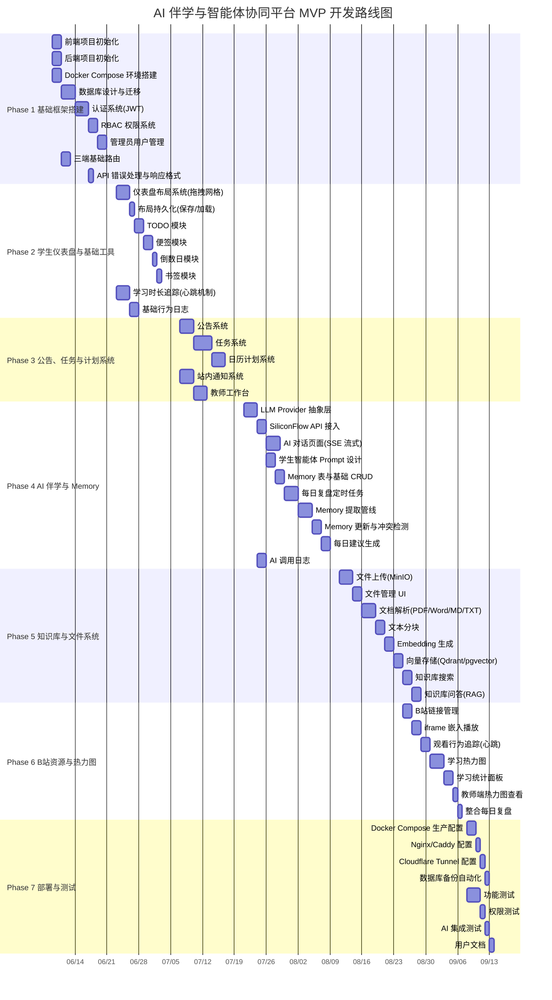
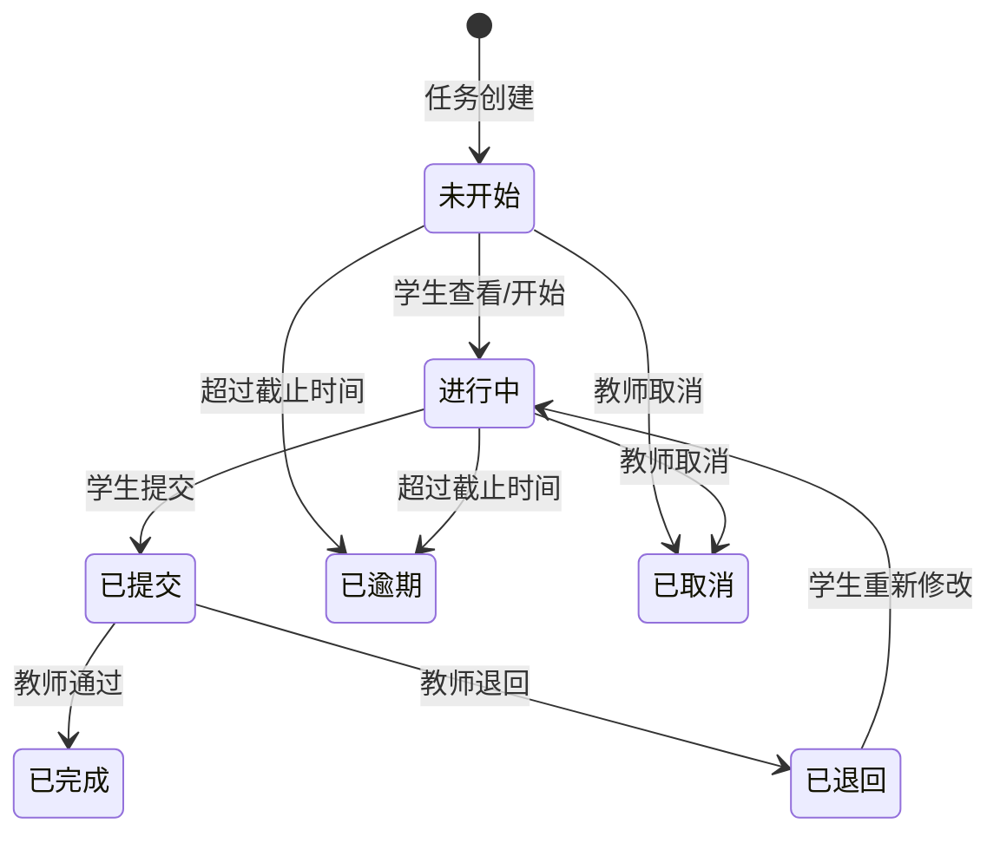
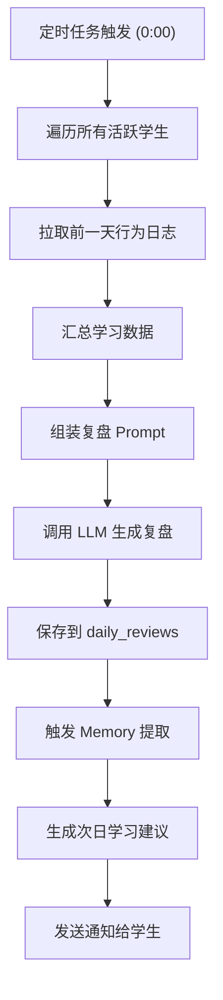
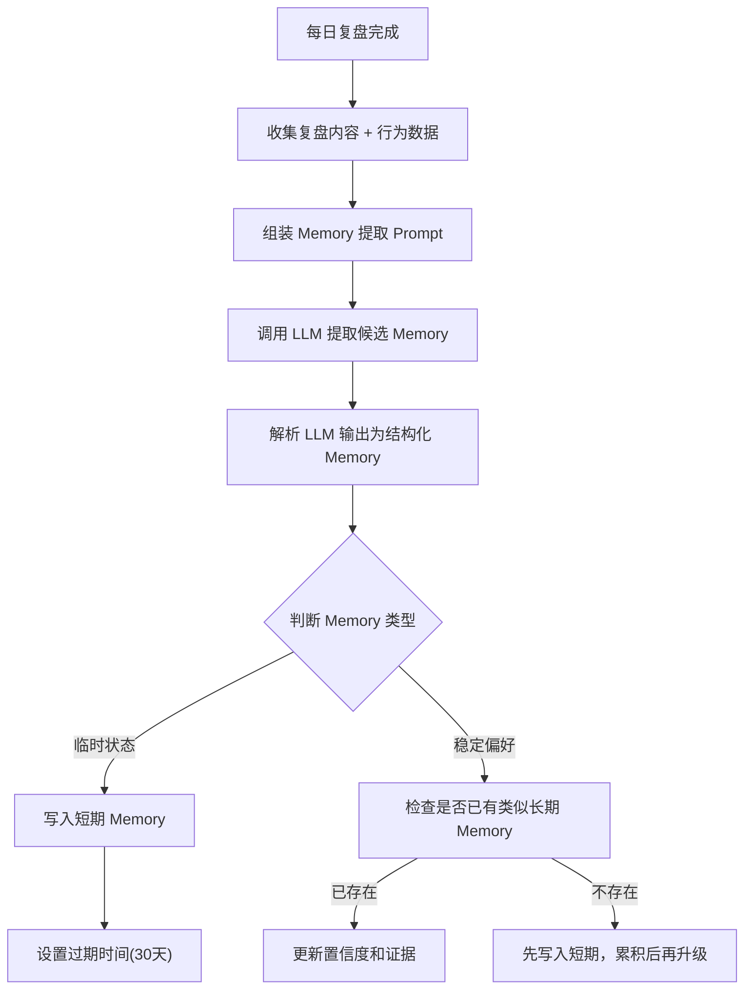
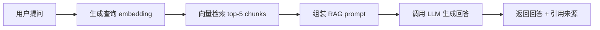

# 开发路线图与任务分解（Development Roadmap & Task Breakdown）

> **版本**：V1.0
> **对应 PRD**：V1.0（prd6.2.md）
> **总工期**：14 周（MVP 阶段）
> **预计开始**：2026-06-09
> **预计交付**：2026-09-14

---

## 一、开发阶段总览



---

## 二、Phase 1：基础框架搭建（Week 1-2）

> **目标**：完成平台基本框架，三种角色可以登录并进入各自首页，管理员可以创建和管理用户账号。

### 任务 1.1：前端项目初始化

| 字段 | 内容 |
|------|------|
| **任务名称** | 前端项目初始化（Vue 3 + Vite + TypeScript） |
| **优先级** | P0 |
| **预估工时** | 2 天 |
| **前置依赖** | 无 |
| **涉及前端页面/组件** | 项目根配置、`App.vue`、路由骨架、全局样式 |
| **涉及后端 API** | 无 |
| **涉及数据库表** | 无 |

**具体工作内容**：

1. 使用 `create-vue` 初始化 Vue 3 + TypeScript + Vite 项目
2. 安装并配置 Element Plus（按需导入）
3. 安装并配置 Tailwind CSS v3
4. 安装并配置 Pinia 状态管理
5. 安装并配置 Vue Router（History 模式）
6. 配置 Axios 实例（baseURL、拦截器骨架、请求/响应类型）
7. 配置 ESLint + Prettier
8. 创建目录结构：

```
src/
├── api/            # API 请求模块
├── assets/         # 静态资源
├── components/     # 通用组件
├── composables/    # 组合式函数
├── layouts/        # 布局组件
├── pages/          # 页面组件（按角色分目录）
│   ├── admin/
│   ├── teacher/
│   ├── student/
│   └── common/
├── router/         # 路由配置
├── stores/         # Pinia stores
├── styles/         # 全局样式
├── types/          # TypeScript 类型定义
└── utils/          # 工具函数
```

**验收标准**：

- [ ] `pnpm dev` 能正常启动开发服务器
- [ ] Element Plus 组件可正常使用（渲染一个 `ElButton` 验证）
- [ ] Tailwind CSS 类名生效
- [ ] Pinia store 可正常创建和使用
- [ ] Vue Router 路由切换正常
- [ ] Axios 实例可发起请求
- [ ] ESLint + Prettier 检查通过
- [ ] TypeScript 编译无错误

---

### 任务 1.2：后端项目初始化

| 字段 | 内容 |
|------|------|
| **任务名称** | 后端项目初始化（FastAPI + SQLAlchemy） |
| **优先级** | P0 |
| **预估工时** | 2 天 |
| **前置依赖** | 无 |
| **涉及前端页面/组件** | 无 |
| **涉及后端 API** | `GET /api/v1/health` |
| **涉及数据库表** | 无（此任务仅搭建骨架） |

**具体工作内容**：

1. 创建 Python 项目，使用 Poetry / pip + requirements.txt 管理依赖
2. 安装核心依赖：FastAPI、Uvicorn、SQLAlchemy、Alembic、Pydantic v2、python-jose、passlib、Redis（aioredis）
3. 创建项目目录结构：

```
backend/
├── app/
│   ├── __init__.py
│   ├── main.py              # FastAPI 应用入口
│   ├── core/
│   │   ├── config.py         # 配置管理（Pydantic Settings）
│   │   ├── security.py       # JWT / 密码哈希
│   │   ├── database.py       # SQLAlchemy 引擎和会话
│   │   └── dependencies.py   # FastAPI 依赖注入
│   ├── models/               # SQLAlchemy ORM 模型
│   ├── schemas/              # Pydantic 请求/响应模型
│   ├── api/
│   │   └── v1/
│   │       ├── __init__.py
│   │       └── endpoints/    # 路由端点
│   ├── services/             # 业务逻辑层
│   ├── tasks/                # Celery/APScheduler 任务
│   └── utils/                # 工具函数
├── alembic/                  # 数据库迁移
├── alembic.ini
├── tests/                    # 测试
├── .env.example
└── requirements.txt
```

4. 配置 Pydantic Settings（从环境变量 / `.env` 读取配置）
5. 配置 SQLAlchemy async engine 和 session
6. 配置 Alembic 数据库迁移
7. 创建健康检查接口 `GET /api/v1/health`
8. 配置 CORS 中间件
9. 配置日志系统（loguru 或标准库 logging）

**验收标准**：

- [ ] `uvicorn app.main:app --reload` 能正常启动
- [ ] 访问 `GET /api/v1/health` 返回 `{"status": "ok"}`
- [ ] 访问 `/docs` 能看到 Swagger UI
- [ ] Alembic 初始化完成，`alembic revision --autogenerate` 可生成迁移
- [ ] `.env.example` 包含所有必需配置项
- [ ] CORS 配置允许前端开发服务器跨域访问

---

### 任务 1.3：数据库 Schema 设计与迁移

| 字段 | 内容 |
|------|------|
| **任务名称** | 数据库 Schema 设计与迁移配置 |
| **优先级** | P0 |
| **预估工时** | 3 天 |
| **前置依赖** | 任务 1.2 |
| **涉及前端页面/组件** | 无 |
| **涉及后端 API** | 无 |
| **涉及数据库表** | 全部 32 张表（本阶段创建 Phase 1-2 所需表，其余预留定义） |

**Phase 1 必须创建的表**：

```sql
-- 用户与权限
users              -- 用户基础信息
roles              -- 角色定义(admin/teacher/student)
user_roles         -- 用户角色关联
student_profiles   -- 学生扩展档案
teacher_student_relations  -- 师生关联
```

**Phase 2 提前创建的表**：

```sql
-- 仪表盘与工具
dashboard_layouts  -- 仪表盘布局
todos              -- TODO 待办
notes              -- 便签
countdowns         -- 倒数日
bookmarks          -- 书签
behavior_logs      -- 行为日志
study_time_logs    -- 学习时长记录
```

**具体工作内容**：

1. 定义所有 SQLAlchemy ORM 模型（按模块分文件）
2. 设计表关系（外键、索引、唯一约束）
3. 所有表包含 `id`（UUID 主键）、`created_at`、`updated_at` 公共字段
4. 使用 Alembic 生成初始迁移脚本
5. 创建种子数据脚本（初始管理员账号、默认角色）
6. 编写数据库初始化命令（`python -m app.init_db`）

**关键表设计**：

| 表名 | 核心字段 | 索引 |
|------|---------|------|
| `users` | id, username, email, hashed_password, display_name, avatar, is_active, last_login_at | username (unique), email (unique) |
| `roles` | id, name, description | name (unique) |
| `user_roles` | id, user_id, role_id | (user_id, role_id) unique |
| `student_profiles` | id, user_id, student_number, grade, major, research_direction | user_id (unique) |
| `teacher_student_relations` | id, teacher_id, student_id | (teacher_id, student_id) unique |
| `dashboard_layouts` | id, user_id, layout_config (JSONB), is_default | user_id (unique) |
| `todos` | id, user_id, title, description, priority, status, category, due_date, completed_at | user_id, status, due_date |
| `notes` | id, user_id, content, color, is_pinned, sort_order | user_id, is_pinned |
| `countdowns` | id, user_id, title, target_date, category, is_important | user_id, target_date |
| `bookmarks` | id, user_id, title, url, icon, category, sort_order | user_id, category |
| `behavior_logs` | id, user_id, action_type, action_detail (JSONB), page, ip_address, user_agent, created_at | user_id, action_type, created_at |
| `study_time_logs` | id, user_id, date, total_seconds, heartbeat_count, last_heartbeat_at | (user_id, date) unique |

**验收标准**：

- [ ] 所有 ORM 模型定义完成且无语法错误
- [ ] `alembic upgrade head` 可成功创建所有表
- [ ] `alembic downgrade base` 可回滚所有表
- [ ] 种子数据脚本执行后，数据库包含：3 个角色（admin/teacher/student）、1 个管理员账号
- [ ] 表结构中所有外键关系正确
- [ ] 关键字段有适当索引

---

### 任务 1.4：Docker Compose 环境搭建

| 字段 | 内容 |
|------|------|
| **任务名称** | Docker Compose 开发环境搭建 |
| **优先级** | P0 |
| **预估工时** | 2 天 |
| **前置依赖** | 无 |
| **涉及前端页面/组件** | 无 |
| **涉及后端 API** | 无 |
| **涉及数据库表** | 无 |

**具体工作内容**：

1. 编写 `docker-compose.dev.yml` 包含以下服务：

```yaml
services:
  postgres:     # PostgreSQL 15+
  redis:        # Redis 7+
  minio:        # MinIO 文件存储
  qdrant:       # Qdrant 向量数据库（预留）
```

2. 配置持久化卷（volumes）
3. 配置网络（networks）
4. 编写 `.env.docker` 模板
5. 编写 `Makefile` 或 `scripts/` 快捷命令
6. 编写前端 `Dockerfile.dev`（热更新开发模式）
7. 编写后端 `Dockerfile.dev`（uvicorn --reload 模式）

**验收标准**：

- [ ] `docker compose -f docker-compose.dev.yml up -d` 一键启动所有基础服务
- [ ] PostgreSQL 可通过 `localhost:5432` 连接
- [ ] Redis 可通过 `localhost:6379` 连接
- [ ] MinIO 控制台可通过 `localhost:9001` 访问
- [ ] 各服务重启后数据不丢失（卷持久化验证）
- [ ] 前端开发服务器可访问后端 API（跨域配置正确）

---

### 任务 1.5：认证系统（JWT 登录/退出/Token 刷新）

| 字段 | 内容 |
|------|------|
| **任务名称** | JWT 认证系统 |
| **优先级** | P0 |
| **预估工时** | 3 天 |
| **前置依赖** | 任务 1.3（数据库表） |
| **涉及前端页面/组件** | `pages/common/LoginPage.vue`、`stores/auth.ts`、`api/auth.ts`、Axios 拦截器 |
| **涉及后端 API** | `POST /api/v1/auth/login`、`POST /api/v1/auth/logout`、`POST /api/v1/auth/refresh`、`GET /api/v1/auth/me` |
| **涉及数据库表** | `users`、`roles`、`user_roles` |

**后端工作内容**：

1. 实现密码哈希（bcrypt via passlib）
2. 实现 JWT Token 生成（access_token + refresh_token）
   - access_token 有效期：30 分钟
   - refresh_token 有效期：7 天
3. 实现 Token 黑名单（Redis 存储已登出的 token）
4. 创建 `get_current_user` 依赖注入
5. 实现登录接口：验证用户名密码 → 返回 tokens + 用户信息 + 角色
6. 实现退出接口：将 token 加入黑名单
7. 实现刷新接口：验证 refresh_token → 返回新 tokens
8. 实现获取当前用户信息接口

**API 定义**：

```
POST /api/v1/auth/login
  Request:  { username: string, password: string }
  Response: { access_token, refresh_token, token_type, user: { id, username, display_name, roles[] } }

POST /api/v1/auth/logout
  Headers:  Authorization: Bearer <token>
  Response: { message: "已退出登录" }

POST /api/v1/auth/refresh
  Request:  { refresh_token: string }
  Response: { access_token, refresh_token, token_type }

GET /api/v1/auth/me
  Headers:  Authorization: Bearer <token>
  Response: { id, username, email, display_name, avatar, roles[], is_active }
```

**前端工作内容**：

1. 开发登录页面（用户名 + 密码表单）
2. 实现 auth store（token 存储、用户信息、登录/退出方法）
3. 配置 Axios 请求拦截器（自动附加 Authorization header）
4. 配置 Axios 响应拦截器（401 自动刷新 token，刷新失败跳转登录页）
5. 配置路由守卫（未登录重定向到登录页）

**验收标准**：

- [ ] 使用正确的用户名密码可以登录，返回 tokens 和用户信息
- [ ] 使用错误的用户名密码登录返回 401 错误
- [ ] 已禁用账号登录返回 403 错误
- [ ] 携带有效 token 可访问受保护接口
- [ ] 携带过期 token 返回 401
- [ ] 退出后 token 失效，再次使用返回 401
- [ ] refresh_token 可成功获取新的 access_token
- [ ] 前端登录成功后自动跳转到对应角色首页
- [ ] 前端未登录状态访问任何页面自动跳转到登录页
- [ ] 前端 token 过期后自动刷新，用户无感知

---

### 任务 1.6：RBAC 权限系统

| 字段 | 内容 |
|------|------|
| **任务名称** | 基于角色的访问控制（RBAC）系统 |
| **优先级** | P0 |
| **预估工时** | 2 天 |
| **前置依赖** | 任务 1.5（认证系统） |
| **涉及前端页面/组件** | `router/guards.ts`、`composables/usePermission.ts`、`components/PermissionGuard.vue` |
| **涉及后端 API** | 各受保护接口的权限装饰器 |
| **涉及数据库表** | `roles`、`user_roles` |

**后端工作内容**：

1. 创建角色检查依赖注入：

```python
def require_roles(*roles: str):
    """生成需要指定角色的依赖"""
    async def checker(current_user = Depends(get_current_user)):
        if not any(r.name in roles for r in current_user.roles):
            raise HTTPException(403, "权限不足")
        return current_user
    return checker

# 快捷方式
require_admin = require_roles("admin")
require_teacher = require_roles("admin", "teacher")
require_student = require_roles("admin", "teacher", "student")
```

2. 在每个路由端点使用角色依赖注入
3. 实现数据级权限过滤（学生只能查看自己的数据，教师只能查看关联学生的数据）

**前端工作内容**：

1. 实现路由元信息中的角色要求：

```typescript
{
  path: '/admin',
  meta: { roles: ['admin'] }
}
```

2. 实现路由守卫检查角色权限
3. 创建 `usePermission` 组合函数（检查当前用户是否有某角色）
4. 创建 `<PermissionGuard>` 组件（按角色显示/隐藏 UI 元素）
5. 创建无权限提示页面 `403.vue`

**验收标准**：

- [ ] 学生角色无法访问管理员和教师端路由，返回 403
- [ ] 教师角色无法访问管理员端路由，返回 403
- [ ] 管理员角色可以访问所有路由
- [ ] 前端根据角色动态显示侧边栏菜单
- [ ] 前端角色不匹配时显示无权限页面
- [ ] 学生 API 调用无法获取其他学生的数据（数据级隔离）

---

### 任务 1.7：管理员用户管理

| 字段 | 内容 |
|------|------|
| **任务名称** | 管理员创建/管理用户功能 |
| **优先级** | P0 |
| **预估工时** | 2 天 |
| **前置依赖** | 任务 1.6（RBAC） |
| **涉及前端页面/组件** | `pages/admin/UserManagement.vue`、`pages/admin/CreateUser.vue` |
| **涉及后端 API** | `GET/POST /api/v1/admin/users`、`PUT/PATCH /api/v1/admin/users/{id}`、`POST /api/v1/admin/users/{id}/reset-password`、`PATCH /api/v1/admin/users/{id}/status` |
| **涉及数据库表** | `users`、`user_roles`、`student_profiles`、`teacher_student_relations` |

**后端 API 定义**：

```
GET    /api/v1/admin/users                  # 用户列表(分页+筛选)
POST   /api/v1/admin/users                  # 创建用户
GET    /api/v1/admin/users/{id}             # 用户详情
PUT    /api/v1/admin/users/{id}             # 更新用户信息
PATCH  /api/v1/admin/users/{id}/status      # 启用/禁用用户
POST   /api/v1/admin/users/{id}/reset-password  # 重置密码
GET    /api/v1/admin/users/stats            # 用户统计概览
```

**前端工作内容**：

1. 用户列表页面（表格 + 分页 + 搜索 + 角色筛选 + 状态筛选）
2. 创建用户对话框（用户名、密码、姓名、角色选择、邮箱）
3. 创建学生账号时需填写学号、年级、专业等扩展信息
4. 用户操作按钮（编辑、禁用/启用、重置密码）
5. 师生关联管理（为教师分配学生）

**验收标准**：

- [ ] 管理员可以创建学生账号，创建后学生可以登录
- [ ] 管理员可以创建教师账号，创建后教师可以登录
- [ ] 管理员可以禁用账号，禁用后该用户无法登录
- [ ] 管理员可以启用已禁用账号
- [ ] 管理员可以重置用户密码
- [ ] 管理员可以为教师分配关联学生
- [ ] 用户列表支持分页、搜索、按角色筛选
- [ ] 非管理员无法访问用户管理 API

---

### 任务 1.8：三端基础路由

| 字段 | 内容 |
|------|------|
| **任务名称** | 三种角色基础路由与布局框架 |
| **优先级** | P0 |
| **预估工时** | 2 天 |
| **前置依赖** | 任务 1.1（前端初始化） |
| **涉及前端页面/组件** | `layouts/AdminLayout.vue`、`layouts/TeacherLayout.vue`、`layouts/StudentLayout.vue`、`router/index.ts` |
| **涉及后端 API** | 无 |
| **涉及数据库表** | 无 |

**具体工作内容**：

1. 创建三种角色的布局组件：
   - **通用要素**：顶部导航栏（用户信息 + 通知图标 + 退出）、侧边栏菜单、主内容区
   - **管理员布局**：管理功能为主的侧边栏
   - **教师布局**：教学管理为主的侧边栏
   - **学生布局**：学习工具为主的侧边栏

2. 配置路由结构：

```typescript
const routes = [
  { path: '/login', component: LoginPage },
  { path: '/403', component: ForbiddenPage },
  {
    path: '/student', component: StudentLayout,
    meta: { roles: ['student'] },
    children: [
      { path: 'dashboard', component: () => import('./pages/student/Dashboard.vue') },
      { path: 'chat', component: () => import('./pages/student/AIChat.vue') },
      // ... 其他学生端路由
    ]
  },
  {
    path: '/teacher', component: TeacherLayout,
    meta: { roles: ['teacher'] },
    children: [ /* ... */ ]
  },
  {
    path: '/admin', component: AdminLayout,
    meta: { roles: ['admin'] },
    children: [ /* ... */ ]
  }
]
```

3. 登录成功后根据角色自动跳转对应首页
4. 创建各角色首页占位页面

**验收标准**：

- [ ] 管理员登录后跳转到 `/admin/dashboard`
- [ ] 教师登录后跳转到 `/teacher/workbench`
- [ ] 学生登录后跳转到 `/student/dashboard`
- [ ] 三端布局各自独立，侧边栏菜单不同
- [ ] 路由懒加载正常工作
- [ ] 未匹配路由显示 404 页面
- [ ] 路由守卫权限检查正常

---

### 任务 1.9：API 错误处理与响应格式

| 字段 | 内容 |
|------|------|
| **任务名称** | 统一 API 错误处理与响应格式 |
| **优先级** | P0 |
| **预估工时** | 1 天 |
| **前置依赖** | 任务 1.2（后端初始化） |
| **涉及前端页面/组件** | `api/request.ts`（Axios 拦截器）、`utils/errorHandler.ts` |
| **涉及后端 API** | 全局异常处理中间件 |
| **涉及数据库表** | 无 |

**后端统一响应格式**：

```json
// 成功响应
{
  "code": 200,
  "message": "success",
  "data": { ... }
}

// 分页响应
{
  "code": 200,
  "message": "success",
  "data": {
    "items": [...],
    "total": 100,
    "page": 1,
    "page_size": 20,
    "total_pages": 5
  }
}

// 错误响应
{
  "code": 400,
  "message": "请求参数错误",
  "detail": "用户名已存在"
}
```

**具体工作内容**：

1. 创建统一响应模型（`ResponseModel`、`PaginatedResponse`）
2. 创建自定义异常类（`BusinessError`、`PermissionError`、`NotFoundError`）
3. 注册全局异常处理器（捕获所有异常并格式化响应）
4. 前端 Axios 响应拦截器统一错误提示（ElMessage）
5. 前端根据 HTTP 状态码分类处理（401→重新登录、403→无权限、500→系统错误）

**验收标准**：

- [ ] 所有 API 响应格式统一
- [ ] 400 错误返回清晰的错误信息
- [ ] 404 错误返回 "资源不存在"
- [ ] 500 错误返回 "服务器内部错误"，不暴露堆栈
- [ ] Pydantic 验证错误返回字段级错误详情
- [ ] 前端错误拦截器自动弹出错误提示

---

### Phase 1 交付物总结

| 交付物 | 验证方式 |
|--------|---------|
| 可运行的前端项目 | `pnpm dev` 启动成功 |
| 可运行的后端项目 | Swagger UI 可访问 |
| Docker Compose 开发环境 | 一键启动所有基础服务 |
| 数据库完成初始化 | 表结构创建成功，有种子数据 |
| 登录功能 | 三种角色均可登录并跳转到各自首页 |
| 用户管理 | 管理员可创建/禁用/启用/重置密码 |
| 权限系统 | 不同角色访问权限隔离正确 |
| 统一 API 格式 | 所有接口响应格式一致 |

---

## 三、Phase 2：学生仪表盘与基础工具（Week 3-4）

> **目标**：完成学生端核心使用体验，包括可拖拽的模块化仪表盘和基础学习工具。

### 任务 2.1：仪表盘布局系统（拖拽网格）

| 字段 | 内容 |
|------|------|
| **任务名称** | 仪表盘拖拽网格布局系统 |
| **优先级** | P0 |
| **预估工时** | 3 天 |
| **前置依赖** | Phase 1 全部完成 |
| **涉及前端页面/组件** | `pages/student/Dashboard.vue`、`components/dashboard/DashboardGrid.vue`、`components/dashboard/DashboardCard.vue`、`components/dashboard/CardWrapper.vue` |
| **涉及后端 API** | `GET/PUT /api/v1/dashboard/layout` |
| **涉及数据库表** | `dashboard_layouts` |

**具体工作内容**：

1. 选择并集成网格布局库（推荐 `vue-grid-layout` 或 `gridstack.js`）
2. 开发 `DashboardGrid` 容器组件：
   - 支持拖拽排序
   - 支持调整卡片大小
   - 支持显示/隐藏卡片
   - 拖拽过程流畅动画（transition）
3. 开发 `DashboardCard` 通用卡片壳（标题、操作按钮、加载状态）
4. 定义布局配置数据结构：

```typescript
interface LayoutItem {
  i: string        // 模块唯一标识
  x: number        // 列位置
  y: number        // 行位置
  w: number        // 宽度（网格单位）
  h: number        // 高度（网格单位）
  visible: boolean // 是否显示
}
```

5. 开发布局编辑模式（切换编辑/正常模式）
6. 开发恢复默认布局功能

**验收标准**：

- [ ] 仪表盘以网格卡片形式展示各模块
- [ ] 卡片可自由拖拽到新位置
- [ ] 卡片可调整大小
- [ ] 拖拽过程有流畅动画，不卡顿
- [ ] 支持显示/隐藏特定模块
- [ ] 支持恢复默认布局
- [ ] 布局在不同屏幕宽度下有基础响应式适配

---

### 任务 2.2：布局持久化（保存/加载）

| 字段 | 内容 |
|------|------|
| **任务名称** | 仪表盘布局持久化 |
| **优先级** | P0 |
| **预估工时** | 1 天 |
| **前置依赖** | 任务 2.1 |
| **涉及前端页面/组件** | `stores/dashboard.ts`、`api/dashboard.ts` |
| **涉及后端 API** | `GET /api/v1/dashboard/layout`、`PUT /api/v1/dashboard/layout`、`POST /api/v1/dashboard/layout/reset` |
| **涉及数据库表** | `dashboard_layouts` |

**后端 API 定义**：

```
GET  /api/v1/dashboard/layout
  Response: { layout_config: LayoutItem[], updated_at: string }

PUT  /api/v1/dashboard/layout
  Request:  { layout_config: LayoutItem[] }
  Response: { message: "布局已保存" }

POST /api/v1/dashboard/layout/reset
  Response: { layout_config: LayoutItem[] }  # 返回默认布局
```

**具体工作内容**：

1. 后端实现布局 CRUD API
2. 首次登录时自动创建默认布局
3. 前端拖拽结束自动保存（debounce 500ms）
4. 前端加载时先从服务端获取布局，无布局则使用默认配置
5. 不同用户布局独立保存

**验收标准**：

- [ ] 拖拽调整布局后自动保存到服务端
- [ ] 刷新页面后布局保持不变
- [ ] 新用户首次登录看到默认布局
- [ ] 恢复默认布局功能正常
- [ ] 不同用户布局互不影响

---

### 任务 2.3：TODO 模块

| 字段 | 内容 |
|------|------|
| **任务名称** | TODO 待办事项模块 |
| **优先级** | P0 |
| **预估工时** | 2 天 |
| **前置依赖** | 任务 2.1 |
| **涉及前端页面/组件** | `components/dashboard/modules/TodoModule.vue`、`pages/student/TodoManagement.vue`、`api/todos.ts`、`stores/todos.ts` |
| **涉及后端 API** | `GET/POST /api/v1/todos`、`PUT/DELETE /api/v1/todos/{id}`、`PATCH /api/v1/todos/{id}/status` |
| **涉及数据库表** | `todos`、`behavior_logs` |

**后端 API 定义**：

```
GET    /api/v1/todos                    # TODO 列表(分页+筛选)
  Query: status, priority, category, due_before, due_after, page, page_size
POST   /api/v1/todos                    # 创建 TODO
GET    /api/v1/todos/{id}               # TODO 详情
PUT    /api/v1/todos/{id}               # 更新 TODO
DELETE /api/v1/todos/{id}               # 删除 TODO
PATCH  /api/v1/todos/{id}/status        # 更新状态(完成/未完成)
GET    /api/v1/todos/today              # 今日 TODO
GET    /api/v1/todos/overdue            # 逾期 TODO
GET    /api/v1/todos/stats              # TODO 统计
```

**数据模型**：

```typescript
interface Todo {
  id: string
  title: string
  description?: string
  priority: 'low' | 'medium' | 'high' | 'urgent'
  status: 'pending' | 'completed'
  category?: string
  due_date?: string        // ISO date
  completed_at?: string
  created_at: string
  updated_at: string
}
```

**前端工作内容**：

1. 仪表盘 TODO 卡片（展示今日待办，快速添加、快速完成）
2. TODO 完整管理页面（列表视图、筛选、排序、批量操作）
3. 创建/编辑 TODO 对话框
4. 优先级颜色标识（urgent=红色、high=橙色、medium=蓝色、low=灰色）
5. 逾期 TODO 高亮提示
6. TODO 完成/未完成状态切换动画

**验收标准**：

- [ ] 学生可以创建 TODO，设置标题、描述、优先级、截止时间、分类
- [ ] 学生可以编辑 TODO
- [ ] 学生可以删除 TODO
- [ ] 学生可以标记 TODO 为完成/未完成
- [ ] 仪表盘展示今日 TODO
- [ ] 逾期 TODO 有明显高亮提示
- [ ] TODO 完成操作写入行为日志
- [ ] 学生只能查看和操作自己的 TODO

---

### 任务 2.4：便签模块

| 字段 | 内容 |
|------|------|
| **任务名称** | 便签 / Sticky Notes 模块 |
| **优先级** | P0 |
| **预估工时** | 2 天 |
| **前置依赖** | 任务 2.1 |
| **涉及前端页面/组件** | `components/dashboard/modules/NotesModule.vue`、`pages/student/NotesManagement.vue`、`api/notes.ts` |
| **涉及后端 API** | `GET/POST /api/v1/notes`、`PUT/DELETE /api/v1/notes/{id}`、`PATCH /api/v1/notes/{id}/pin` |
| **涉及数据库表** | `notes`、`behavior_logs` |

**后端 API 定义**：

```
GET    /api/v1/notes                    # 便签列表
POST   /api/v1/notes                    # 创建便签
PUT    /api/v1/notes/{id}               # 更新便签
DELETE /api/v1/notes/{id}               # 删除便签
PATCH  /api/v1/notes/{id}/pin           # 置顶/取消置顶
```

**数据模型**：

```typescript
interface Note {
  id: string
  content: string
  color: 'yellow' | 'green' | 'blue' | 'pink' | 'purple' | 'orange'
  is_pinned: boolean
  sort_order: number
  created_at: string
  updated_at: string
}
```

**前端工作内容**：

1. 仪表盘便签卡片（展示置顶便签 + 最近便签）
2. 便签管理页面（网格/列表视图切换）
3. 便签卡片样式（仿真实便签贴纸效果，不同颜色区分）
4. 行内编辑（点击便签直接编辑内容）
5. 快速新建便签
6. 便签拖拽排序

**验收标准**：

- [ ] 学生可以创建便签，设置内容和颜色
- [ ] 学生可以编辑便签内容（行内编辑）
- [ ] 学生可以删除便签
- [ ] 学生可以置顶/取消置顶便签
- [ ] 仪表盘展示置顶便签
- [ ] 便签有不同颜色视觉区分
- [ ] 学生只能查看和操作自己的便签

---

### 任务 2.5：倒数日模块

| 字段 | 内容 |
|------|------|
| **任务名称** | 倒数日模块 |
| **优先级** | P0 |
| **预估工时** | 1 天 |
| **前置依赖** | 任务 2.1 |
| **涉及前端页面/组件** | `components/dashboard/modules/CountdownModule.vue`、`api/countdowns.ts` |
| **涉及后端 API** | `GET/POST /api/v1/countdowns`、`PUT/DELETE /api/v1/countdowns/{id}` |
| **涉及数据库表** | `countdowns` |

**后端 API 定义**：

```
GET    /api/v1/countdowns               # 倒数日列表
POST   /api/v1/countdowns               # 创建倒数日
PUT    /api/v1/countdowns/{id}          # 更新倒数日
DELETE /api/v1/countdowns/{id}          # 删除倒数日
```

**数据模型**：

```typescript
interface Countdown {
  id: string
  title: string
  target_date: string       // ISO date
  category?: string         // 考试/比赛/项目/自定义
  is_important: boolean
  remaining_days: number    // 计算字段
  created_at: string
}
```

**验收标准**：

- [ ] 学生可以创建倒数日（标题 + 目标日期 + 分类）
- [ ] 学生可以编辑/删除倒数日
- [ ] 自动计算并显示剩余天数
- [ ] 已过期倒数日显示"已过 N 天"
- [ ] 仪表盘展示重要倒数日
- [ ] 临近（≤7 天）的倒数日有醒目提示

---

### 任务 2.6：书签模块

| 字段 | 内容 |
|------|------|
| **任务名称** | 书签收藏模块 |
| **优先级** | P0 |
| **预估工时** | 1 天 |
| **前置依赖** | 任务 2.1 |
| **涉及前端页面/组件** | `components/dashboard/modules/BookmarkModule.vue`、`api/bookmarks.ts` |
| **涉及后端 API** | `GET/POST /api/v1/bookmarks`、`PUT/DELETE /api/v1/bookmarks/{id}` |
| **涉及数据库表** | `bookmarks`、`behavior_logs` |

**后端 API 定义**：

```
GET    /api/v1/bookmarks                # 书签列表(支持按分类筛选)
POST   /api/v1/bookmarks               # 添加书签
PUT    /api/v1/bookmarks/{id}           # 更新书签
DELETE /api/v1/bookmarks/{id}           # 删除书签
GET    /api/v1/bookmarks/categories     # 获取书签分类列表
```

**数据模型**：

```typescript
interface Bookmark {
  id: string
  title: string
  url: string
  icon?: string         // favicon URL 或 emoji
  category: string      // 分类: 课程/工具/文档/论文/其他
  description?: string
  sort_order: number
  visit_count: number
  created_at: string
}
```

**验收标准**：

- [ ] 学生可以添加书签（标题 + URL + 分类 + 图标）
- [ ] 学生可以编辑/删除书签
- [ ] 书签按分类展示
- [ ] 点击书签可在新标签页打开链接
- [ ] 点击书签记录访问行为到行为日志
- [ ] 仪表盘展示常用书签

---

### 任务 2.7：学习时长追踪（心跳机制）

| 字段 | 内容 |
|------|------|
| **任务名称** | 平台在线学习时长追踪 |
| **优先级** | P0 |
| **预估工时** | 3 天 |
| **前置依赖** | 任务 1.5（认证系统） |
| **涉及前端页面/组件** | `composables/useStudyTimer.ts`、`components/dashboard/modules/StudyTimeModule.vue` |
| **涉及后端 API** | `POST /api/v1/study-time/heartbeat`、`GET /api/v1/study-time/today`、`GET /api/v1/study-time/stats` |
| **涉及数据库表** | `study_time_logs` |

**心跳机制设计**：

```
前端每 60 秒发送一次心跳 → 后端记录心跳时间
后端根据心跳间隔判断是否在线 → 累计有效学习时长
超过 5 分钟无心跳 → 判定为离线，不计入学习时长
```

**后端 API 定义**：

```
POST /api/v1/study-time/heartbeat
  Request:  { page: string }     # 当前页面路径
  Response: { today_seconds: number, heartbeat_received: true }

GET  /api/v1/study-time/today
  Response: { date: string, total_seconds: number, formatted: "2小时30分钟" }

GET  /api/v1/study-time/stats
  Query: start_date, end_date
  Response: { days: [{ date, total_seconds }], total_seconds, avg_seconds }
```

**前端工作内容**：

1. 创建 `useStudyTimer` 组合函数：
   - 登录后自动启动心跳定时器（setInterval 60s）
   - 页面不可见时暂停心跳（`document.visibilityState`）
   - 页面重新可见时恢复心跳
   - 退出登录时停止心跳
2. 仪表盘"今日学习时长"卡片（实时更新显示）
3. 学习时长统计图表（按周/月查看）

**验收标准**：

- [ ] 登录后自动开始记录学习时长
- [ ] 心跳每 60 秒发送一次
- [ ] 页面最小化或切换到其他标签页时暂停心跳
- [ ] 页面重新可见时恢复心跳
- [ ] 仪表盘显示今日学习时长（实时更新）
- [ ] 超过 5 分钟无心跳后的时间不计入学习时长
- [ ] 可查看历史学习时长统计

---

### 任务 2.8：基础行为日志

| 字段 | 内容 |
|------|------|
| **任务名称** | 基础行为日志采集系统 |
| **优先级** | P0 |
| **预估工时** | 2 天 |
| **前置依赖** | 任务 1.5（认证系统） |
| **涉及前端页面/组件** | `composables/useBehaviorLog.ts`、`api/behaviorLog.ts` |
| **涉及后端 API** | `POST /api/v1/behavior-logs`、`POST /api/v1/behavior-logs/batch` |
| **涉及数据库表** | `behavior_logs` |

**行为类型枚举**：

```python
class ActionType(str, Enum):
    LOGIN = "login"
    LOGOUT = "logout"
    PAGE_VIEW = "page_view"
    TODO_CREATE = "todo_create"
    TODO_COMPLETE = "todo_complete"
    TODO_DELETE = "todo_delete"
    NOTE_CREATE = "note_create"
    NOTE_EDIT = "note_edit"
    NOTE_DELETE = "note_delete"
    BOOKMARK_VISIT = "bookmark_visit"
    TASK_VIEW = "task_view"
    TASK_SUBMIT = "task_submit"
    ANNOUNCEMENT_VIEW = "announcement_view"
    CALENDAR_CREATE = "calendar_create"
    CALENDAR_COMPLETE = "calendar_complete"
    FILE_UPLOAD = "file_upload"
    KB_SEARCH = "kb_search"
    AI_CHAT = "ai_chat"
    BILIBILI_OPEN = "bilibili_open"
    BILIBILI_WATCH = "bilibili_watch"
```

**后端 API 定义**：

```
POST /api/v1/behavior-logs
  Request:  { action_type: string, action_detail?: object, page?: string }
  Response: { id: string }

POST /api/v1/behavior-logs/batch
  Request:  { logs: [{ action_type, action_detail, page, timestamp }] }
  Response: { count: number }
```

**前端工作内容**：

1. 创建 `useBehaviorLog` 组合函数，提供 `logAction(type, detail)` 方法
2. 行为日志本地队列 + 批量上报（每 30 秒或累积 10 条时批量发送）
3. 在路由守卫中自动记录 `page_view`
4. 在各业务模块中调用 `logAction` 记录关键操作
5. 离线时缓存到 localStorage，上线后自动上报

**验收标准**：

- [ ] 登录/退出行为自动记录
- [ ] 页面切换自动记录 page_view
- [ ] TODO 创建/完成/删除自动记录
- [ ] 便签创建/编辑/删除自动记录
- [ ] 行为日志批量上报正常工作
- [ ] 后端可查询某用户某时间段的行为日志
- [ ] 行为日志数据为后续热力图和每日复盘提供数据基础

---

### Phase 2 交付物总结

| 交付物 | 验证方式 |
|--------|---------|
| 可拖拽仪表盘 | 拖拽卡片后刷新页面布局不变 |
| TODO 模块 | 完成 CRUD 全流程 |
| 便签模块 | 完成 CRUD + 颜色 + 置顶 |
| 倒数日模块 | 创建后自动显示剩余天数 |
| 书签模块 | 添加书签后可点击访问 |
| 学习时长追踪 | 仪表盘实时显示今日学习时长 |
| 行为日志系统 | 数据库中可查到用户操作记录 |

---

## 四、Phase 3：公告、任务与计划系统（Week 5-6）

> **目标**：完成教师/管理员与学生之间的管理闭环——公告发布、任务下达与提交、日历计划。

### 任务 3.1：公告系统

| 字段 | 内容 |
|------|------|
| **任务名称** | 公告发布与阅读系统 |
| **优先级** | P0 |
| **预估工时** | 3 天 |
| **前置依赖** | Phase 1、Phase 2 |
| **涉及前端页面/组件** | `pages/admin/AnnouncementManage.vue`、`pages/teacher/AnnouncementManage.vue`、`pages/student/AnnouncementCenter.vue`、`components/dashboard/modules/AnnouncementModule.vue` |
| **涉及后端 API** | 见下方 |
| **涉及数据库表** | `announcements`、`announcement_receivers`、`announcement_reads`、`behavior_logs` |

**后端 API 定义**：

```
# 管理员/教师端
POST   /api/v1/announcements                    # 创建公告
GET    /api/v1/announcements                    # 公告列表(管理端)
PUT    /api/v1/announcements/{id}               # 更新公告
DELETE /api/v1/announcements/{id}               # 删除公告
GET    /api/v1/announcements/{id}/read-status   # 查看阅读状态

# 学生端
GET    /api/v1/announcements/my                 # 我收到的公告列表
GET    /api/v1/announcements/{id}               # 公告详情
POST   /api/v1/announcements/{id}/read          # 标记已读
GET    /api/v1/announcements/unread-count       # 未读数量
```

**公告创建请求体**：

```typescript
interface CreateAnnouncement {
  title: string
  content: string                    // 支持富文本/Markdown
  target_type: 'all' | 'students' | 'teachers' | 'specific'
  target_user_ids?: string[]        // target_type=specific 时使用
  is_pinned: boolean
  expires_at?: string               // 有效期
  priority: 'normal' | 'important' | 'urgent'
}
```

**验收标准**：

- [ ] 管理员可以创建公告，设置标题、内容、发布对象、优先级
- [ ] 教师可以创建公告，发布给关联的学生
- [ ] 学生可以查看自己收到的公告列表
- [ ] 学生打开公告后自动标记为已读
- [ ] 管理员/教师可以查看公告阅读状态（谁已读/谁未读）
- [ ] 仪表盘公告提醒卡片显示最新未读公告
- [ ] 学生端显示未读公告数量角标
- [ ] 公告过期后不再显示
- [ ] 置顶公告在列表顶部

---

### 任务 3.2：任务系统

| 字段 | 内容 |
|------|------|
| **任务名称** | 任务下达、提交与审核系统 |
| **优先级** | P0 |
| **预估工时** | 4 天 |
| **前置依赖** | 任务 3.1 |
| **涉及前端页面/组件** | `pages/teacher/TaskManage.vue`、`pages/admin/TaskManage.vue`、`pages/student/MyTasks.vue`、`pages/student/TaskDetail.vue`、`components/dashboard/modules/TaskModule.vue` |
| **涉及后端 API** | 见下方 |
| **涉及数据库表** | `tasks`、`task_assignees`、`task_submissions`、`files`、`behavior_logs` |

**后端 API 定义**：

```
# 管理员/教师端
POST   /api/v1/tasks                          # 创建任务
GET    /api/v1/tasks                          # 任务列表(管理端)
PUT    /api/v1/tasks/{id}                     # 更新任务
DELETE /api/v1/tasks/{id}                     # 删除任务
GET    /api/v1/tasks/{id}/submissions         # 查看提交情况
PATCH  /api/v1/tasks/{id}/submissions/{sid}/review  # 审核提交(通过/退回)
GET    /api/v1/tasks/stats                    # 任务统计

# 学生端
GET    /api/v1/tasks/my                       # 我的任务列表
GET    /api/v1/tasks/{id}                     # 任务详情
POST   /api/v1/tasks/{id}/submissions         # 提交任务
PUT    /api/v1/tasks/{id}/submissions/{sid}   # 更新提交
```

**任务状态流转**：



**任务数据模型**：

```typescript
interface Task {
  id: string
  title: string
  description: string            // 支持 Markdown
  priority: 'low' | 'medium' | 'high' | 'urgent'
  due_date: string
  created_by: string             // 创建者ID
  attachments?: FileInfo[]       // 任务附件
  assignees: TaskAssignee[]      // 被分配的学生
  created_at: string
  updated_at: string
}

interface TaskAssignee {
  user_id: string
  status: 'not_started' | 'in_progress' | 'submitted' | 'completed' | 'rejected' | 'overdue' | 'cancelled'
  submission?: TaskSubmission
}

interface TaskSubmission {
  id: string
  content: string
  attachments?: FileInfo[]
  submitted_at: string
  review_comment?: string
  reviewed_at?: string
  reviewed_by?: string
}
```

**验收标准**：

- [ ] 教师/管理员可以创建任务，设置标题、描述、优先级、截止时间
- [ ] 教师/管理员可以指定任务对象（全体/指定学生）
- [ ] 任务可以上传附件
- [ ] 学生可以查看"我的任务"列表
- [ ] 学生可以提交任务（文字说明 + 附件）
- [ ] 教师可以查看每个学生的提交情况
- [ ] 教师可以通过或退回提交
- [ ] 任务状态流转正确（未开始→进行中→已提交→已完成/已退回）
- [ ] 超过截止时间自动标记为逾期
- [ ] 仪表盘今日任务卡片显示待处理任务
- [ ] 任务操作写入行为日志

---

### 任务 3.3：日历/计划系统

| 字段 | 内容 |
|------|------|
| **任务名称** | 日历计划管理系统 |
| **优先级** | P1 |
| **预估工时** | 3 天 |
| **前置依赖** | 任务 3.2 |
| **涉及前端页面/组件** | `pages/student/Calendar.vue`、`pages/teacher/CalendarManage.vue`、`components/dashboard/modules/CalendarModule.vue` |
| **涉及后端 API** | 见下方 |
| **涉及数据库表** | `calendar_events`、`behavior_logs` |

**后端 API 定义**：

```
GET    /api/v1/calendar/events             # 获取事件(支持日期范围筛选)
  Query: start_date, end_date, type
POST   /api/v1/calendar/events             # 创建事件
PUT    /api/v1/calendar/events/{id}        # 更新事件
DELETE /api/v1/calendar/events/{id}        # 删除事件
PATCH  /api/v1/calendar/events/{id}/status # 更新事件状态
```

**前端工作内容**：

1. 集成 FullCalendar 组件
2. 实现月视图、周视图、日视图
3. 日历事件 CRUD（点击日期创建、点击事件编辑）
4. 事件分类（学习/任务/考试/个人/其他）+ 颜色区分
5. 事件状态管理（待完成/已完成）
6. 仪表盘月日历卡片（缩略版月视图）
7. 教师可为学生创建计划

**验收标准**：

- [ ] 日历支持月/周/日三种视图切换
- [ ] 学生可以在日历上创建/编辑/删除计划事件
- [ ] 教师可以为关联学生创建计划
- [ ] 事件按分类颜色区分
- [ ] 事件可标记为完成/未完成
- [ ] 仪表盘展示本月计划摘要
- [ ] 日历操作写入行为日志

---

### 任务 3.4：站内通知系统

| 字段 | 内容 |
|------|------|
| **任务名称** | 站内信通知系统 |
| **优先级** | P1 |
| **预估工时** | 3 天 |
| **前置依赖** | Phase 1 |
| **涉及前端页面/组件** | `pages/common/Notifications.vue`、`components/NotificationBell.vue`、`stores/notification.ts` |
| **涉及后端 API** | 见下方 |
| **涉及数据库表** | `notifications` |

**后端 API 定义**：

```
GET    /api/v1/notifications               # 通知列表(分页)
GET    /api/v1/notifications/unread-count   # 未读数量
PATCH  /api/v1/notifications/{id}/read      # 标记已读
POST   /api/v1/notifications/read-all       # 全部标记已读
DELETE /api/v1/notifications/{id}           # 删除通知
```

**通知触发场景**：

| 场景 | 通知内容 | 接收者 |
|------|---------|--------|
| 新公告发布 | "有新公告：{title}" | 目标用户 |
| 新任务下达 | "您有新任务：{title}，截止时间 {due_date}" | 被分配的学生 |
| 任务即将截止 | "任务 {title} 将在 {hours} 小时后截止" | 被分配的学生 |
| 任务已逾期 | "任务 {title} 已逾期" | 被分配的学生 |
| 教师退回任务 | "任务 {title} 已被退回，原因：{comment}" | 提交的学生 |
| 学生提交任务 | "学生 {name} 提交了任务 {title}" | 任务创建者 |
| 每日复盘生成 | "您的每日学习复盘已生成" | 学生 |

**验收标准**：

- [ ] 顶部导航栏显示通知图标和未读数量角标
- [ ] 点击通知图标展示最近通知列表（下拉面板）
- [ ] 通知列表页面支持分页浏览
- [ ] 通知可标记已读/全部已读
- [ ] 新公告发布时自动创建通知
- [ ] 新任务下达时自动创建通知
- [ ] 任务截止前 24 小时自动创建提醒通知

---

### 任务 3.5：教师工作台

| 字段 | 内容 |
|------|------|
| **任务名称** | 教师工作台（班级态势驾驶舱 + Agent 工作台） |
| **优先级** | P1 |
| **预估工时** | 3 天 |
| **前置依赖** | 任务 3.2（任务系统） |
| **涉及前端页面/组件** | `views/teacher/WorkbenchView.vue`、`views/teacher/ClassOverviewView.vue`、`views/teacher/TasksView.vue`、`views/teacher/LearningPathsView.vue` |
| **涉及后端 API** | `GET /api/v1/learning-paths/classes/list`、`GET /api/v1/learning-paths/classes/{class_id}/overview`、`GET /api/v1/tasks/`、`GET /api/v1/tasks/{task_id}`、`POST /api/v1/ai/chat/conversations/{id}/messages` |
| **涉及数据库表** | `learning_classes`、`learning_class_members`、`learning_insights`、`learning_path_tasks`、`tasks`、`task_assignees`、`task_submissions`、`ai_conversations`、`ai_messages` |

**后端 API 定义**：

```
GET /api/v1/learning-paths/classes/list
  Response: [{ id, name, description, grade, subject, member_count, members }]

GET /api/v1/learning-paths/classes/{class_id}/overview
  Response: { class_info, metrics, trend, memory_summary, insights, attention_students, recent_paths }

GET /api/v1/tasks/
  Response: [{ id, title, description, priority, status, due_date, created_at }]

GET /api/v1/tasks/{task_id}
  Response: { task, assignees, submissions }
```

**前端工作内容**：

1. 教师工作台首页（班级选择 + 核心指标 + 趋势 + 洞察 + 待办）
2. 需关注学生区（显示风险原因、路径进度和真实洞察来源）
3. 近期学习路径区（展示路径目标、截止日期、分配人数和平均进度）
4. 待办队列（普通任务待批改 + 未处理洞察）
5. 教师 Agent 工作台（基于当前班级快照生成简报、干预计划、分层任务草稿、反馈话术）

**验收标准**：

- [ ] 教师可以在工作台切换自己创建或管理的班级
- [ ] 工作台展示班级人数、平均路径进度、需关注学生、待处理事项和学情记忆数
- [ ] 工作台展示高优先级班级洞察，并支持标记已读或解决
- [ ] 工作台展示待审核的任务提交，并可跳转到任务管理处理
- [ ] 教师 Agent 动作只基于当前班级真实快照生成内容，不编造学生或任务
- [ ] 教师只能查看自己有权限的班级、任务和学生数据

---

### Phase 3 交付物总结

| 交付物 | 验证方式 |
|--------|---------|
| 公告系统 | 教师发布公告 → 学生收到并可查看 → 阅读状态正确 |
| 任务系统 | 教师创建任务 → 学生提交 → 教师审核通过/退回 |
| 日历计划 | 月/周/日视图切换正常，事件 CRUD 正常 |
| 通知系统 | 新公告/任务自动触发通知，角标显示未读数 |
| 教师工作台 | 教师可查看学生列表和任务统计 |

---

## 五、Phase 4：AI 伴学与 Memory（Week 7-9）

> **目标**：完成平台核心智能体能力——AI 对话、Memory 机制、每日复盘。

### 任务 4.1：LLM Provider 抽象层

| 字段 | 内容 |
|------|------|
| **任务名称** | 统一 LLM Provider 抽象层 |
| **优先级** | P0 |
| **预估工时** | 3 天 |
| **前置依赖** | Phase 1 |
| **涉及前端页面/组件** | `pages/admin/ModelConfig.vue` |
| **涉及后端 API** | `GET/POST/PUT /api/v1/admin/llm-providers`、内部调用接口 |
| **涉及数据库表** | `llm_provider_configs`、`llm_usage_logs` |

**架构设计**：

```python
# app/services/llm/base.py
class LLMProvider(ABC):
    @abstractmethod
    async def chat(self, messages, **kwargs) -> str: ...
    
    @abstractmethod
    async def chat_stream(self, messages, **kwargs) -> AsyncGenerator: ...

# app/services/llm/siliconflow.py
class SiliconFlowProvider(LLMProvider):
    """硅基流动 OpenAI 兼容接口实现"""
    ...

# app/services/llm/router.py
class LLMRouter:
    """根据 task_type 路由到最佳 provider"""
    async def route(self, task_type: str, messages, **kwargs):
        provider = self._get_provider(task_type)
        return await provider.chat(messages, **kwargs)
```

**具体工作内容**：

1. 定义 `LLMProvider` 抽象基类（chat、chat_stream 方法）
2. 实现 `SiliconFlowProvider`（基于 OpenAI SDK）
3. 实现 `LLMRouter`（根据 task_type 选择 provider + model）
4. 实现配置热加载（管理员修改配置后无需重启）
5. 实现调用日志记录（请求/响应/token 用量/耗时/成功失败）
6. 实现降级策略（主 provider 失败时 fallback 到备用）
7. 实现速率限制（RPM/TPM 控制）
8. 管理员配置页面（provider 列表、添加/编辑/启禁用）

**`llm_provider_configs` 表设计**：

| 字段 | 类型 | 说明 |
|------|------|------|
| id | UUID | 主键 |
| provider_name | VARCHAR | 供应商名称 |
| base_url | VARCHAR | API 基础 URL |
| api_key | VARCHAR | 加密存储 |
| model_name | VARCHAR | 模型名称 |
| task_type | VARCHAR | 任务类型 |
| priority | INT | 优先级(越小越优先) |
| enabled | BOOLEAN | 是否启用 |
| daily_quota | INT | 每日配额 |
| used_today | INT | 今日已用量 |
| rpm_limit | INT | 每分钟请求数限制 |
| tpm_limit | INT | 每分钟 token 限制 |
| fallback_provider_id | UUID | 降级目标 |

**验收标准**：

- [ ] 可通过 `LLMRouter` 调用硅基流动 API 获得有效响应
- [ ] 支持流式输出（SSE）
- [ ] 每次 AI 调用自动记录到 `llm_usage_logs`
- [ ] 管理员可以在后台配置 provider（base_url、api_key、model_name）
- [ ] 主 provider 调用失败时自动 fallback
- [ ] 达到每日配额上限后拒绝调用并返回友好提示
- [ ] API Key 在数据库中加密存储，不会暴露到前端

---

### 任务 4.2：SiliconFlow API 集成

| 字段 | 内容 |
|------|------|
| **任务名称** | 硅基流动 OpenAI 兼容接口集成 |
| **优先级** | P0 |
| **预估工时** | 2 天 |
| **前置依赖** | 任务 4.1 |
| **涉及前端页面/组件** | 无 |
| **涉及后端 API** | 内部服务 |
| **涉及数据库表** | `llm_provider_configs` |

**具体工作内容**：

1. 使用 OpenAI Python SDK 接入硅基流动：

```python
from openai import AsyncOpenAI

client = AsyncOpenAI(
    api_key=config.api_key,
    base_url="https://api.siliconflow.cn/v1"
)
```

2. 配置不同 task_type 对应的推荐模型：

| task_type | 推荐模型 | 说明 |
|-----------|---------|------|
| student_chat | Qwen/Qwen2.5-7B-Instruct | 日常对话 |
| daily_review | Qwen/Qwen2.5-7B-Instruct | 每日复盘 |
| memory_extract | Qwen/Qwen2.5-7B-Instruct | Memory 提取 |
| knowledge_qa | Qwen/Qwen2.5-7B-Instruct | 知识库问答 |
| document_summary | Qwen/Qwen2.5-7B-Instruct | 文档总结 |
| system_summary | Qwen/Qwen2.5-7B-Instruct | 轻量总结 |

3. 实现连接测试接口
4. 创建默认配置种子数据

**验收标准**：

- [ ] 调用硅基流动接口可返回正常 AI 回复
- [ ] 流式输出逐 token 返回
- [ ] 连接测试接口可验证 API Key 是否有效
- [ ] 默认配置初始化后即可使用

---

### 任务 4.3：AI 对话页面（流式 SSE）

| 字段 | 内容 |
|------|------|
| **任务名称** | AI 伴学对话页面（流式输出） |
| **优先级** | P0 |
| **预估工时** | 3 天 |
| **前置依赖** | 任务 4.2 |
| **涉及前端页面/组件** | `pages/student/AIChat.vue`、`components/chat/ChatMessage.vue`、`components/chat/ChatInput.vue`、`components/chat/MarkdownRenderer.vue` |
| **涉及后端 API** | `POST /api/v1/ai/chat`（SSE）、`GET /api/v1/ai/conversations`、`GET /api/v1/ai/conversations/{id}/messages` |
| **涉及数据库表** | `ai_conversations`、`ai_messages`、`llm_usage_logs`、`behavior_logs` |

**后端 API 定义**：

```
# 对话管理
GET    /api/v1/ai/conversations                    # 对话列表
POST   /api/v1/ai/conversations                    # 新建对话
DELETE /api/v1/ai/conversations/{id}               # 删除对话
GET    /api/v1/ai/conversations/{id}/messages      # 对话消息历史

# AI 聊天（SSE 流式）
POST   /api/v1/ai/chat
  Request:  { conversation_id: string, message: string }
  Response: text/event-stream (SSE)
    data: {"type":"token","content":"你"}
    data: {"type":"token","content":"好"}
    data: {"type":"done","message_id":"xxx","usage":{"prompt_tokens":100,"completion_tokens":50}}
```

**前端工作内容**：

1. 对话列表侧边栏（新建对话、历史对话列表）
2. 消息列表区域（用户消息 + AI 消息，支持 Markdown 渲染）
3. 输入区域（文本输入 + 发送按钮 + 快捷键 Ctrl+Enter）
4. SSE 流式接收（逐字显示 AI 回复，打字机效果）
5. 消息中 Markdown 渲染（代码块语法高亮、表格、列表）
6. 加载状态（AI 思考中动画）
7. 错误处理（网络断开、API 超时等）
8. 对话记录无限滚动

**验收标准**：

- [ ] 学生可以新建对话
- [ ] 学生可以发送消息并收到 AI 回复
- [ ] AI 回复以流式方式逐字显示（打字机效果）
- [ ] 消息支持 Markdown 渲染（代码块、表格、列表）
- [ ] 对话历史记录正确保存和加载
- [ ] 学生可以管理多个对话
- [ ] 学生只能查看自己的对话
- [ ] AI 对话行为写入行为日志
- [ ] 每次 AI 调用记录到 `llm_usage_logs`

---

### 任务 4.4：学生智能体 Prompt 设计

| 字段 | 内容 |
|------|------|
| **任务名称** | 学生伴学智能体 System Prompt 设计 |
| **优先级** | P0 |
| **预估工时** | 2 天 |
| **前置依赖** | 任务 4.3 |
| **涉及前端页面/组件** | 无 |
| **涉及后端 API** | prompt 模板系统（内部） |
| **涉及数据库表** | `student_memories`、`todos`、`calendar_events`、`tasks` |

**具体工作内容**：

1. 设计 System Prompt 模板（包含动态注入的上下文信息）：

```
你是 {student_name} 的个人 AI 伴学助手。

## 学生信息
{student_profile}

## 当前任务
{current_tasks}

## 今日 TODO
{today_todos}

## 近期计划
{upcoming_events}

## 学生记忆（Memory）
### 短期记忆
{short_term_memory}

### 长期记忆
{long_term_memory}

## 最近学习行为摘要
{recent_behavior_summary}

## 你的职责
1. 回答学习相关问题
2. 帮助拆解任务
3. 提供学习建议
4. 根据 Memory 提供个性化指导
5. 识别拖延风险并提醒
...
```

2. 实现上下文动态组装服务（每次对话前收集用户相关数据）
3. 实现上下文长度控制（按优先级裁剪，确保不超 token 限制）
4. 设计不同场景的 prompt 变体（日常聊天、任务拆解、学习建议）

**验收标准**：

- [ ] AI 回复时能体现对学生个人信息的了解
- [ ] AI 可以基于学生当前任务给出建议
- [ ] AI 可以参考 TODO 和日历计划
- [ ] AI 可以基于 Memory 提供个性化回复
- [ ] 上下文不超过模型 token 限制
- [ ] prompt 模板可配置可维护

---

### 任务 4.5：Memory 表与基础 CRUD

| 字段 | 内容 |
|------|------|
| **任务名称** | Memory 数据结构与基础管理 |
| **优先级** | P0 |
| **预估工时** | 2 天 |
| **前置依赖** | 任务 1.3 |
| **涉及前端页面/组件** | `pages/student/MyMemory.vue`、`pages/admin/MemoryLogs.vue` |
| **涉及后端 API** | `GET /api/v1/memory/my`、`DELETE /api/v1/memory/{id}/request-delete`、`GET /api/v1/admin/memory/logs` |
| **涉及数据库表** | `student_memories` |

**`student_memories` 表设计**：

| 字段 | 类型 | 说明 |
|------|------|------|
| id | UUID | 主键 |
| user_id | UUID | 学生 ID |
| memory_type | VARCHAR | short_term / long_term |
| category | VARCHAR | learning_habit / preference / skill / interest / behavior_pattern |
| content | TEXT | Memory 内容描述 |
| confidence | FLOAT | 置信度 (0.0-1.0) |
| evidence_count | INT | 支撑证据数量 |
| source | VARCHAR | daily_review / chat / behavior |
| source_detail | JSONB | 来源详情 |
| is_active | BOOLEAN | 是否生效 |
| promoted_at | TIMESTAMP | 从短期升级为长期的时间 |
| last_verified_at | TIMESTAMP | 最后验证时间 |
| expires_at | TIMESTAMP | 过期时间（短期 Memory） |
| created_at | TIMESTAMP | 创建时间 |
| updated_at | TIMESTAMP | 更新时间 |

**验收标准**：

- [ ] Memory 表创建成功，支持短期/长期两种类型
- [ ] 学生可以在"我的 Memory"页面查看自己的 Memory 列表
- [ ] 学生可以申请删除不准确的 Memory
- [ ] 管理员可以查看 Memory 更新日志
- [ ] 教师可以查看学生的教学相关 Memory 摘要（不含私密信息）
- [ ] Memory 数据结构包含置信度、来源、证据数量

---

### 任务 4.6：每日复盘定时任务

| 字段 | 内容 |
|------|------|
| **任务名称** | 每日 0:00 自动复盘定时任务 |
| **优先级** | P0 |
| **预估工时** | 3 天 |
| **前置依赖** | 任务 4.2、任务 4.5 |
| **涉及前端页面/组件** | `pages/student/DailyReview.vue` |
| **涉及后端 API** | `GET /api/v1/daily-reviews/my`、`GET /api/v1/daily-reviews/{id}` |
| **涉及数据库表** | `daily_reviews`、`behavior_logs`、`study_time_logs`、`todos`、`tasks`、`ai_messages` |

**复盘流程**：



**`daily_reviews` 表设计**：

| 字段 | 类型 | 说明 |
|------|------|------|
| id | UUID | 主键 |
| user_id | UUID | 学生 ID |
| review_date | DATE | 复盘日期 |
| study_duration_seconds | INT | 当日学习时长 |
| todo_completed_count | INT | TODO 完成数 |
| task_completed_count | INT | 任务完成数 |
| ai_chat_count | INT | AI 对话次数 |
| behavior_summary | JSONB | 行为数据汇总 |
| ai_review_content | TEXT | AI 生成的复盘内容 |
| ai_suggestions | TEXT | AI 生成的次日建议 |
| new_memories_extracted | JSONB | 新提取的 Memory |
| status | VARCHAR | pending / completed / failed |
| error_message | TEXT | 失败原因 |
| llm_usage_log_id | UUID | 关联的 LLM 调用日志 |

**具体工作内容**：

1. 使用 APScheduler（或 Celery Beat）创建每日 0:00 定时任务
2. 实现行为数据汇总逻辑（从 behavior_logs、study_time_logs 等表拉取）
3. 设计复盘 Prompt 模板（输入前一天汇总数据，输出结构化复盘）
4. 实现复盘生成（调用 LLM）
5. 实现复盘结果解析和存储
6. 实现失败重试（最多 3 次）
7. 前端每日复盘查看页面

**验收标准**：

- [ ] 每日 0:00 自动触发复盘任务
- [ ] 每个活跃学生生成一份复盘报告
- [ ] 复盘包含：学习时长、TODO 完成、任务完成、AI 对话次数、行为摘要
- [ ] 复盘包含 AI 生成的学习总结和次日建议
- [ ] 学生可在"每日复盘"页面查看历史复盘
- [ ] 复盘任务失败时自动重试，最终失败记录错误信息
- [ ] 复盘生成后发送通知给学生

---

### 任务 4.7：Memory 提取管线

| 字段 | 内容 |
|------|------|
| **任务名称** | Memory 自动提取管线 |
| **优先级** | P0 |
| **预估工时** | 3 天 |
| **前置依赖** | 任务 4.6 |
| **涉及前端页面/组件** | 无（后端任务） |
| **涉及后端 API** | 内部服务 |
| **涉及数据库表** | `student_memories`、`daily_reviews`、`behavior_logs` |

**Memory 提取流程**：



**Memory 提取 Prompt 设计**：

```
基于以下学习复盘数据，提取学生的学习习惯和偏好信息。
请以 JSON 数组格式输出，每条包含：
- category: learning_habit | preference | skill | interest | behavior_pattern
- content: 具体描述
- type: short_term | long_term
- confidence: 0.0-1.0

注意：
1. 只提取有一定确信度的信息
2. 不要提取敏感个人信息
3. 偏好和习惯需要多次行为支撑才能标记为 long_term
```

**验收标准**：

- [ ] 每日复盘后自动触发 Memory 提取
- [ ] 提取结果为结构化 Memory（类型、分类、内容、置信度）
- [ ] 短期 Memory 设置 30 天过期时间
- [ ] 新提取的 Memory 默认置信度根据证据量设定
- [ ] 不会提取敏感个人信息
- [ ] 提取结果保存到 `student_memories` 表

---

### 任务 4.8：Memory 更新与冲突检测

| 字段 | 内容 |
|------|------|
| **任务名称** | Memory 更新策略与冲突检测 |
| **优先级** | P0 |
| **预估工时** | 2 天 |
| **前置依赖** | 任务 4.7 |
| **涉及前端页面/组件** | 无 |
| **涉及后端 API** | 内部服务 |
| **涉及数据库表** | `student_memories` |

**具体工作内容**：

1. **冲突检测**：新 Memory 与已有 Memory 相似度计算
   - 使用文本相似度（或 embedding 相似度）判断是否为同一信息
   - 相似度 > 0.85：视为同一条，更新置信度和证据
   - 相似度 0.6-0.85：可能相关，创建新条目但标记关联
   - 相似度 < 0.6：独立新条目

2. **置信度更新规则**：
   - 每次被验证 +0.1（上限 1.0）
   - 连续 14 天无新证据 -0.05
   - 置信度 < 0.2 的 Memory 自动失效

3. **短期→长期升级规则**：
   - 同一主题短期 Memory 被验证 ≥ 3 次
   - 置信度 ≥ 0.7
   - 时间跨度 ≥ 14 天

4. **Memory 清理**：
   - 短期 Memory 过期后标记为 inactive
   - 长期 Memory 置信度过低时降级回短期

**验收标准**：

- [ ] 新 Memory 写入前检查与已有 Memory 的冲突
- [ ] 相似 Memory 合并更新而非重复创建
- [ ] 短期 Memory 满足条件后可升级为长期 Memory
- [ ] 置信度随验证次数增加
- [ ] 过期 Memory 自动标记为 inactive
- [ ] Memory 更新有完整日志

---

### 任务 4.9：每日建议生成

| 字段 | 内容 |
|------|------|
| **任务名称** | AI 每日学习建议生成 |
| **优先级** | P1 |
| **预估工时** | 2 天 |
| **前置依赖** | 任务 4.6 |
| **涉及前端页面/组件** | `components/dashboard/modules/AISuggestionModule.vue` |
| **涉及后端 API** | `GET /api/v1/ai/daily-suggestion` |
| **涉及数据库表** | `daily_reviews`、`student_memories` |

**具体工作内容**：

1. 在每日复盘任务中，生成次日建议
2. 建议基于：前一天复盘 + Memory + 待办任务 + 近期计划
3. 建议内容：优先处理事项、学习方法建议、时间分配建议、风险提醒
4. 仪表盘"AI 今日建议"卡片展示

**验收标准**：

- [ ] 每日复盘后自动生成次日建议
- [ ] 建议内容与学生实际情况相关
- [ ] 仪表盘展示今日 AI 建议
- [ ] 建议可参考学生 Memory 和任务情况

---

### 任务 4.10：AI 调用日志

| 字段 | 内容 |
|------|------|
| **任务名称** | AI 调用日志记录与管理 |
| **优先级** | P1 |
| **预估工时** | 2 天 |
| **前置依赖** | 任务 4.1 |
| **涉及前端页面/组件** | `pages/admin/AILogs.vue` |
| **涉及后端 API** | `GET /api/v1/admin/llm-logs` |
| **涉及数据库表** | `llm_usage_logs` |

**`llm_usage_logs` 表设计**：

| 字段 | 类型 | 说明 |
|------|------|------|
| id | UUID | 主键 |
| user_id | UUID | 触发用户（可为 null，如定时任务） |
| task_type | VARCHAR | 任务类型 |
| provider_name | VARCHAR | Provider 名称 |
| model_name | VARCHAR | 模型名称 |
| prompt_tokens | INT | Prompt token 数 |
| completion_tokens | INT | Completion token 数 |
| total_tokens | INT | 总 token 数 |
| latency_ms | INT | 调用耗时(ms) |
| status | VARCHAR | success / failed |
| error_message | TEXT | 失败原因 |
| created_at | TIMESTAMP | 调用时间 |

**验收标准**：

- [ ] 每次 LLM 调用自动记录日志
- [ ] 管理员可在后台查看 AI 调用日志列表
- [ ] 日志包含 token 用量、调用耗时、成功/失败状态
- [ ] 支持按日期、任务类型、用户筛选
- [ ] 管理员可查看今日/本周/本月的调用统计

---

### Phase 4 交付物总结

| 交付物 | 验证方式 |
|--------|---------|
| LLM Provider 抽象层 | 可通过统一接口调用硅基流动 API |
| AI 对话页面 | 学生可与 AI 对话，流式显示回复 |
| 智能体上下文 | AI 回复体现对学生个人情况的了解 |
| Memory 系统 | 可创建/查看/管理 Memory |
| 每日复盘 | 每日 0:00 自动生成复盘和建议 |
| Memory 提取 | 复盘后自动提取学习习惯 Memory |
| AI 调用日志 | 管理员可查看完整的 AI 调用记录 |

---

## 六、Phase 5：知识库与文件系统（Week 10-11）

> **目标**：完成知识库资料沉淀能力——文件上传、文档解析、向量化、检索和问答。

### 任务 5.1：文件上传（MinIO 集成）

| 字段 | 内容 |
|------|------|
| **任务名称** | 文件上传与 MinIO 存储集成 |
| **优先级** | P1 |
| **预估工时** | 3 天 |
| **前置依赖** | Phase 1（Docker 环境中已有 MinIO） |
| **涉及前端页面/组件** | `components/FileUploader.vue`、`api/files.ts` |
| **涉及后端 API** | `POST /api/v1/files/upload`、`GET /api/v1/files/{id}/download`、`DELETE /api/v1/files/{id}` |
| **涉及数据库表** | `files`、`behavior_logs` |

**后端 API 定义**：

```
POST   /api/v1/files/upload               # 上传文件(multipart/form-data)
  FormData: file, category?, tags?
  Response: { id, filename, size, mime_type, url }

GET    /api/v1/files                       # 文件列表
  Query: category, tags, page, page_size
GET    /api/v1/files/{id}                  # 文件详情
GET    /api/v1/files/{id}/download         # 下载文件
DELETE /api/v1/files/{id}                  # 删除文件
```

**`files` 表设计**：

| 字段 | 类型 | 说明 |
|------|------|------|
| id | UUID | 主键 |
| user_id | UUID | 上传者 |
| original_filename | VARCHAR | 原始文件名 |
| stored_filename | VARCHAR | 存储文件名（UUID） |
| mime_type | VARCHAR | 文件 MIME 类型 |
| file_size | BIGINT | 文件大小(bytes) |
| bucket | VARCHAR | MinIO bucket |
| object_key | VARCHAR | MinIO 对象键 |
| category | VARCHAR | 文件分类 |
| tags | JSONB | 标签数组 |
| is_public | BOOLEAN | 是否公开 |
| download_count | INT | 下载次数 |

**具体工作内容**：

1. 配置 MinIO 客户端（Python `minio` 库）
2. 实现文件上传（限制类型和大小：单文件 ≤ 100MB）
3. 实现文件下载（签名 URL）
4. 实现文件删除（同时删除 MinIO 对象和数据库记录）
5. 前端通用文件上传组件（拖拽上传、进度条、文件预览）
6. 文件类型限制（PDF、Word、Markdown、TXT、图片）

**验收标准**：

- [ ] 学生/教师可以上传文件
- [ ] 上传文件保存到 MinIO
- [ ] 文件元数据保存到数据库
- [ ] 支持文件下载
- [ ] 支持文件删除
- [ ] 文件上传有进度条显示
- [ ] 文件大小和类型限制生效
- [ ] 文件上传行为写入行为日志

---

### 任务 5.2：文件管理 UI

| 字段 | 内容 |
|------|------|
| **任务名称** | 文件管理页面 |
| **优先级** | P1 |
| **预估工时** | 2 天 |
| **前置依赖** | 任务 5.1 |
| **涉及前端页面/组件** | `pages/student/FileManage.vue`、`pages/admin/FileManage.vue` |
| **涉及后端 API** | 复用任务 5.1 的 API |
| **涉及数据库表** | `files` |

**前端工作内容**：

1. 文件列表（表格/网格视图切换）
2. 文件搜索和筛选（按类型、分类、标签）
3. 文件预览（PDF 在线预览、图片预览、Markdown 渲染、TXT 显示）
4. 文件信息编辑（修改分类、标签）
5. 批量操作（批量删除、批量分类）
6. 管理员文件管理（查看所有文件、管理存储空间）

**验收标准**：

- [ ] 文件列表正常展示，支持分页
- [ ] 支持按文件类型、分类筛选
- [ ] PDF 文件可在线预览
- [ ] 文件信息可编辑（分类、标签）
- [ ] 管理员可查看和管理所有用户上传的文件

---

### 任务 5.3：文档解析

| 字段 | 内容 |
|------|------|
| **任务名称** | 文档解析服务（PDF / Word / Markdown / TXT） |
| **优先级** | P1 |
| **预估工时** | 3 天 |
| **前置依赖** | 任务 5.1 |
| **涉及前端页面/组件** | 无 |
| **涉及后端 API** | 后台异步任务 |
| **涉及数据库表** | `knowledge_documents` |

**具体工作内容**：

1. 创建文档解析器抽象基类：

```python
class DocumentParser(ABC):
    @abstractmethod
    async def parse(self, file_path: str) -> str:
        """返回提取的纯文本"""
        ...
```

2. 实现各类型解析器：
   - `PDFParser`：使用 `PyPDF2` 或 `pdfplumber`
   - `WordParser`：使用 `python-docx`
   - `MarkdownParser`：直接读取原文
   - `TXTParser`：直接读取原文
3. 文件上传到知识库后自动触发异步解析任务
4. 解析结果存入 `knowledge_documents`

**`knowledge_documents` 表设计**：

| 字段 | 类型 | 说明 |
|------|------|------|
| id | UUID | 主键 |
| file_id | UUID | 关联文件 |
| title | VARCHAR | 文档标题 |
| content | TEXT | 解析后的纯文本 |
| summary | TEXT | AI 生成的摘要 |
| auto_tags | JSONB | AI 生成的标签 |
| parse_status | VARCHAR | pending / parsing / completed / failed |
| chunk_count | INT | 切片数量 |
| word_count | INT | 总字数 |

**验收标准**：

- [ ] PDF 文件可正确提取文本内容
- [ ] Word 文件可正确提取文本内容
- [ ] Markdown 文件可正确读取
- [ ] TXT 文件可正确读取
- [ ] 解析任务异步执行，不阻塞上传接口
- [ ] 解析状态可查询（pending → parsing → completed / failed）

---

### 任务 5.4：文本分块（Chunking）

| 字段 | 内容 |
|------|------|
| **任务名称** | 文档文本分块 |
| **优先级** | P1 |
| **预估工时** | 2 天 |
| **前置依赖** | 任务 5.3 |
| **涉及前端页面/组件** | 无 |
| **涉及后端 API** | 内部服务 |
| **涉及数据库表** | `knowledge_chunks` |

**分块策略**：

```
1. 按段落分块，每个 chunk 500-1000 字符
2. chunk 之间有 100 字符重叠（overlap）
3. 尊重段落和句子边界，不在句中断开
4. 保留 chunk 的元信息（所属文档、位置索引）
```

**`knowledge_chunks` 表设计**：

| 字段 | 类型 | 说明 |
|------|------|------|
| id | UUID | 主键 |
| document_id | UUID | 关联文档 |
| chunk_index | INT | 切片顺序 |
| content | TEXT | 切片文本 |
| char_count | INT | 字符数 |
| embedding | VECTOR(1024) | 向量（如使用 pgvector） |
| metadata | JSONB | 元信息 |

**验收标准**：

- [ ] 长文档可正确分割为多个 chunk
- [ ] 每个 chunk 大小在 500-1000 字符范围内
- [ ] chunk 之间有适当重叠
- [ ] 不在句子中间断开
- [ ] chunk 保留所属文档和顺序信息

---

### 任务 5.5：Embedding 生成

| 字段 | 内容 |
|------|------|
| **任务名称** | 文本 Embedding 向量生成 |
| **优先级** | P1 |
| **预估工时** | 2 天 |
| **前置依赖** | 任务 5.4 |
| **涉及前端页面/组件** | 无 |
| **涉及后端 API** | 内部服务 |
| **涉及数据库表** | `knowledge_chunks`、`llm_usage_logs` |

**具体工作内容**：

1. 使用硅基流动 Embedding API（OpenAI 兼容）：

```python
response = await client.embeddings.create(
    model="BAAI/bge-large-zh-v1.5",
    input=chunk_text
)
embedding = response.data[0].embedding
```

2. 批量处理 embedding（每批最多 20 个 chunk）
3. embedding 生成为异步任务（文档解析 → 分块 → embedding → 入库）
4. 失败重试机制

**验收标准**：

- [ ] 可成功调用 embedding API 生成向量
- [ ] 支持批量 embedding 生成
- [ ] embedding 维度与模型匹配
- [ ] embedding 生成记录到 AI 调用日志
- [ ] 任务失败时自动重试

---

### 任务 5.6：向量存储（Qdrant / pgvector）

| 字段 | 内容 |
|------|------|
| **任务名称** | 向量数据库存储与检索 |
| **优先级** | P1 |
| **预估工时** | 2 天 |
| **前置依赖** | 任务 5.5 |
| **涉及前端页面/组件** | 无 |
| **涉及后端 API** | 内部服务 |
| **涉及数据库表** | `knowledge_chunks`（pgvector 方案）或 Qdrant collection |

**具体工作内容**：

1. 选择向量存储方案（推荐 Qdrant，Docker 部署简单）：

```python
from qdrant_client import QdrantClient

client = QdrantClient(host="qdrant", port=6333)

# 创建 collection
client.create_collection(
    collection_name="knowledge_chunks",
    vectors_config=VectorParams(size=1024, distance=Distance.COSINE)
)

# 写入向量
client.upsert(
    collection_name="knowledge_chunks",
    points=[PointStruct(id=chunk_id, vector=embedding, payload={...})]
)

# 相似度搜索
results = client.search(
    collection_name="knowledge_chunks",
    query_vector=query_embedding,
    limit=5
)
```

2. 实现向量写入服务
3. 实现向量检索服务（top-k 相似度搜索）
4. 实现向量删除（文档删除时同步删除向量）

**验收标准**：

- [ ] embedding 向量可成功写入向量数据库
- [ ] 可通过查询向量检索相似 chunk
- [ ] 删除文档时同步清除向量
- [ ] 检索结果返回相似度分数和原文内容
- [ ] 检索性能满足要求（< 500ms）

---

### 任务 5.7：知识库搜索

| 字段 | 内容 |
|------|------|
| **任务名称** | 知识库语义搜索 |
| **优先级** | P1 |
| **预估工时** | 2 天 |
| **前置依赖** | 任务 5.6 |
| **涉及前端页面/组件** | `pages/student/KnowledgeBase.vue`、`components/KBSearchBar.vue` |
| **涉及后端 API** | `GET /api/v1/knowledge/search` |
| **涉及数据库表** | `knowledge_documents`、`knowledge_chunks`、`behavior_logs` |

**后端 API 定义**：

```
GET /api/v1/knowledge/search
  Query: q (查询文本), top_k (返回数量, 默认5), category?, tags?
  Response: {
    results: [{
      chunk_id, document_id, document_title,
      content, score, highlight
    }]
  }
```

**搜索流程**：

```
用户输入查询 → 生成查询 embedding → 向量相似度搜索 → 返回 top-k 结果
```

**前端工作内容**：

1. 知识库主页面（搜索框 + 文档列表 + 分类标签）
2. 搜索结果展示（高亮匹配内容、来源文档、相似度分数）
3. 点击结果可查看原文上下文
4. 搜索历史记录

**验收标准**：

- [ ] 用户输入查询可返回语义相关的文档片段
- [ ] 搜索结果包含来源文档、相关内容、相似度分数
- [ ] 搜索结果按相似度排序
- [ ] 搜索行为写入行为日志
- [ ] 搜索响应时间 < 2 秒

---

### 任务 5.8：知识库问答（RAG）

| 字段 | 内容 |
|------|------|
| **任务名称** | 知识库 RAG 问答 |
| **优先级** | P1 |
| **预估工时** | 2 天 |
| **前置依赖** | 任务 5.7、任务 4.3 |
| **涉及前端页面/组件** | `pages/student/KnowledgeQA.vue` 或集成到 AI 对话中 |
| **涉及后端 API** | `POST /api/v1/knowledge/qa` |
| **涉及数据库表** | `knowledge_chunks`、`ai_conversations`、`llm_usage_logs` |

**RAG 流程**：



**后端 API 定义**：

```
POST /api/v1/knowledge/qa
  Request:  { question: string, conversation_id?: string }
  Response: SSE stream
    data: {"type":"token","content":"..."}
    data: {"type":"sources","chunks":[{document_title, content, score}]}
    data: {"type":"done","message_id":"xxx"}
```

**验收标准**：

- [ ] 用户提问后，系统先检索相关知识，再基于知识生成回答
- [ ] 回答中引用知识库来源（附上原文档标题和内容片段）
- [ ] 知识库无相关内容时，AI 明确说明"知识库中未找到相关内容"
- [ ] 回答以流式方式输出
- [ ] 问答记录可保存到对话历史

---

### Phase 5 交付物总结

| 交付物 | 验证方式 |
|--------|---------|
| 文件上传系统 | 上传文件到 MinIO，下载正常 |
| 文件管理 UI | 文件列表、预览、筛选功能正常 |
| 文档解析 | PDF/Word/MD/TXT 文件文本提取正确 |
| 向量化 | 文档 chunk 写入向量数据库成功 |
| 知识库搜索 | 语义搜索返回相关结果 |
| 知识库问答 | RAG 问答返回基于知识库的回答 |

---

## 七、Phase 6：B站资源与热力图（Week 12-13）

> **目标**：完善学习行为记录和可视化——B站视频学习追踪、学习热力图。

### 任务 6.1：B站链接管理

| 字段 | 内容 |
|------|------|
| **任务名称** | B站学习资源链接管理 |
| **优先级** | P1 |
| **预估工时** | 2 天 |
| **前置依赖** | Phase 1 |
| **涉及前端页面/组件** | `pages/student/BilibiliResources.vue`、`api/bilibili.ts` |
| **涉及后端 API** | `GET/POST /api/v1/bilibili/resources`、`PUT/DELETE /api/v1/bilibili/resources/{id}` |
| **涉及数据库表** | `bilibili_resources` |

**后端 API 定义**：

```
POST   /api/v1/bilibili/resources          # 添加 B 站资源
GET    /api/v1/bilibili/resources          # 资源列表
PUT    /api/v1/bilibili/resources/{id}     # 更新资源
DELETE /api/v1/bilibili/resources/{id}     # 删除资源
POST   /api/v1/bilibili/parse-url          # 解析 B 站链接元信息
```

**`bilibili_resources` 表设计**：

| 字段 | 类型 | 说明 |
|------|------|------|
| id | UUID | 主键 |
| user_id | UUID | 添加者 |
| bv_id | VARCHAR | B 站 BV 号 |
| title | VARCHAR | 视频标题 |
| cover_url | VARCHAR | 封面 URL |
| total_parts | INT | 总分集数 |
| category | VARCHAR | 分类 |
| description | TEXT | 描述 |
| embed_url | VARCHAR | iframe 嵌入 URL |
| is_completed | BOOLEAN | 是否学习完成 |
| total_watch_seconds | INT | 累计观看时长 |

**验收标准**：

- [ ] 学生可以通过粘贴 B 站 URL 添加学习资源
- [ ] 系统自动解析视频标题、封面、分集信息
- [ ] 学生可以管理（编辑/删除）已添加的资源
- [ ] 资源列表展示视频信息和学习进度
- [ ] 学生可以手动标记视频为"已学习完成"

---

### 任务 6.2：iframe 嵌入播放

| 字段 | 内容 |
|------|------|
| **任务名称** | B站视频 iframe 嵌入播放 |
| **优先级** | P1 |
| **预估工时** | 2 天 |
| **前置依赖** | 任务 6.1 |
| **涉及前端页面/组件** | `components/BilibiliPlayer.vue`、`pages/student/BilibiliWatch.vue` |
| **涉及后端 API** | 无（前端 iframe） |
| **涉及数据库表** | 无 |

**具体工作内容**：

1. 构造 B 站嵌入 URL：`https://player.bilibili.com/player.html?bvid=BV...&autoplay=0`
2. 开发 `BilibiliPlayer` 组件（iframe 容器 + 播放器外壳）
3. 学习页面布局（左侧播放器 + 右侧笔记/信息）
4. 适配不同屏幕尺寸
5. 分集选择切换

**验收标准**：

- [ ] B 站视频可以通过 iframe 在平台内播放
- [ ] 播放器尺寸自适应
- [ ] 支持分集切换
- [ ] 播放页面提供笔记区域

---

### 任务 6.3：观看行为追踪（心跳）

| 字段 | 内容 |
|------|------|
| **任务名称** | B站观看行为追踪（页面停留时长 + 心跳） |
| **优先级** | P1 |
| **预估工时** | 2 天 |
| **前置依赖** | 任务 6.2 |
| **涉及前端页面/组件** | `composables/useBilibiliTracker.ts` |
| **涉及后端 API** | `POST /api/v1/bilibili/watch-log` |
| **涉及数据库表** | `bilibili_watch_logs`、`behavior_logs` |

**`bilibili_watch_logs` 表设计**：

| 字段 | 类型 | 说明 |
|------|------|------|
| id | UUID | 主键 |
| user_id | UUID | 学生 |
| resource_id | UUID | 关联 B 站资源 |
| start_time | TIMESTAMP | 开始观看时间 |
| end_time | TIMESTAMP | 结束观看时间 |
| duration_seconds | INT | 本次观看时长 |
| heartbeat_count | INT | 心跳次数 |
| page_visible_seconds | INT | 页面可见时长 |

**追踪机制**：

```
进入 B 站学习页面 → 开始心跳计时（30 秒/次）
页面不可见 → 暂停心跳
页面可见 → 恢复心跳
离开页面 → 上报本次观看记录
```

**验收标准**：

- [ ] 进入 B 站学习页面时开始记录观看时长
- [ ] 页面不可见时暂停计时
- [ ] 离开页面时自动上报观看记录
- [ ] 观看记录写入行为日志
- [ ] 累计观看时长更新到资源信息

---

### 任务 6.4：学习热力图

| 字段 | 内容 |
|------|------|
| **任务名称** | GitHub 风格学习热力图 |
| **优先级** | P1 |
| **预估工时** | 3 天 |
| **前置依赖** | 任务 2.8（行为日志） |
| **涉及前端页面/组件** | `pages/student/Heatmap.vue`、`components/LearningHeatmap.vue`、`components/dashboard/modules/HeatmapModule.vue` |
| **涉及后端 API** | `GET /api/v1/stats/heatmap` |
| **涉及数据库表** | `behavior_logs`、`study_time_logs`、`todos`、`bilibili_watch_logs` |

**后端 API 定义**：

```
GET /api/v1/stats/heatmap
  Query: user_id (教师查看学生时), year (默认当年)
  Response: {
    year: 2026,
    data: [
      { date: "2026-06-01", level: 3, details: { study_minutes: 120, todos: 5, tasks: 1 } },
      { date: "2026-06-02", level: 1, details: { study_minutes: 30, todos: 1, tasks: 0 } },
      ...
    ],
    summary: { total_active_days: 150, max_streak: 30, current_streak: 7 }
  }
```

**热力等级计算**：

| 等级 | 条件 | 颜色 |
|------|------|------|
| 0 | 无活动 | #ebedf0 |
| 1 | 学习 ≤ 30 分钟 | #9be9a8 |
| 2 | 学习 30-60 分钟 | #40c463 |
| 3 | 学习 60-120 分钟 | #30a14e |
| 4 | 学习 > 120 分钟 | #216e39 |

**验收标准**：

- [ ] 热力图展示全年学习活跃度（类似 GitHub contribution graph）
- [ ] 鼠标悬停显示当日详情（学习时长、TODO 完成、任务完成）
- [ ] 支持按年查看
- [ ] 展示连续活跃天数统计
- [ ] 仪表盘展示缩略版热力图
- [ ] 热力等级计算正确

---

### 任务 6.5：学习统计面板

| 字段 | 内容 |
|------|------|
| **任务名称** | 学习数据统计面板 |
| **优先级** | P1 |
| **预估工时** | 2 天 |
| **前置依赖** | 任务 6.4 |
| **涉及前端页面/组件** | `pages/student/Statistics.vue`、`components/StatsCharts.vue` |
| **涉及后端 API** | `GET /api/v1/stats/overview`、`GET /api/v1/stats/trends` |
| **涉及数据库表** | 多张表聚合查询 |

**后端 API 定义**：

```
GET /api/v1/stats/overview
  Query: user_id?, period (week/month/all)
  Response: {
    total_study_hours: 150.5,
    total_active_days: 90,
    todos_completed: 234,
    tasks_completed: 45,
    ai_chats: 120,
    kb_searches: 67,
    bilibili_hours: 30.2,
    files_uploaded: 23,
    consecutive_days: 7,
    avg_daily_minutes: 85
  }

GET /api/v1/stats/trends
  Query: user_id?, metric (study_time/todos/tasks), period (week/month)
  Response: {
    labels: ["6/1", "6/2", ...],
    data: [120, 90, ...]
  }
```

**前端工作内容**：

1. 概览卡片（今日/本周/累计学习时长、连续活跃天数等）
2. 趋势图表（学习时长趋势、TODO 完成趋势）使用 ECharts
3. 各维度数据分布（饼图/柱状图）
4. 时段分析（什么时间段学习最多）

**验收标准**：

- [ ] 学习统计面板展示关键数据指标
- [ ] 趋势图表可按周/月查看
- [ ] 数据与实际行为日志一致
- [ ] 图表交互正常（缩放、悬停详情）

---

### 任务 6.6：教师端热力图查看

| 字段 | 内容 |
|------|------|
| **任务名称** | 教师查看学生学习热力图 |
| **优先级** | P1 |
| **预估工时** | 1 天 |
| **前置依赖** | 任务 6.4 |
| **涉及前端页面/组件** | `pages/teacher/StudentHeatmap.vue` |
| **涉及后端 API** | 复用 `GET /api/v1/stats/heatmap?user_id=xxx` |
| **涉及数据库表** | 同任务 6.4 |

**具体工作内容**：

1. 教师学生详情页嵌入热力图组件
2. 教师工作台展示学生活跃度排行
3. 教师可选择查看具体学生的热力图和统计数据
4. 权限控制：教师只能查看关联学生

**验收标准**：

- [ ] 教师可以查看关联学生的学习热力图
- [ ] 教师工作台展示学生活跃度排行
- [ ] 教师不能查看非关联学生的数据

---

### 任务 6.7：整合每日复盘

| 字段 | 内容 |
|------|------|
| **任务名称** | B 站学习数据整合每日复盘 |
| **优先级** | P1 |
| **预估工时** | 1 天 |
| **前置依赖** | 任务 4.6、任务 6.3 |
| **涉及前端页面/组件** | 无 |
| **涉及后端 API** | 修改每日复盘任务 |
| **涉及数据库表** | `bilibili_watch_logs`、`daily_reviews` |

**具体工作内容**：

1. 在每日复盘数据收集中增加 B 站观看记录
2. 复盘 Prompt 中加入视频学习内容（观看了哪些视频、时长多少）
3. 热力图活跃度计算中纳入 B 站学习时长

**验收标准**：

- [ ] 每日复盘中包含 B 站学习记录
- [ ] 热力图活跃度包含 B 站学习时长
- [ ] AI 复盘提及视频学习内容

---

### Phase 6 交付物总结

| 交付物 | 验证方式 |
|--------|---------|
| B 站资源模块 | 添加 B 站链接 → 嵌入播放 → 记录观看时长 |
| 学习热力图 | 全年热力图正确展示学习活跃度 |
| 学习统计面板 | 各项统计数据与行为日志一致 |
| 教师端热力图 | 教师可查看学生热力图 |
| 复盘整合 | 复盘包含 B 站学习数据 |

---

## 八、Phase 7：部署与测试（Week 14）

> **目标**：完成生产环境部署、全功能测试和用户文档编写，交付 MVP。

### 任务 7.1：Docker Compose 生产配置

| 字段 | 内容 |
|------|------|
| **任务名称** | Docker Compose 生产环境配置 |
| **优先级** | P0 |
| **预估工时** | 2 天 |
| **前置依赖** | Phase 1-6 全部完成 |
| **涉及前端页面/组件** | 无 |
| **涉及后端 API** | 无 |
| **涉及数据库表** | 无 |

**具体工作内容**：

1. 编写 `docker-compose.prod.yml`，包含所有 10 个服务：

```yaml
services:
  frontend:    # Nginx 提供前端静态文件
  backend:     # Gunicorn + Uvicorn workers
  postgres:    # PostgreSQL 15
  redis:       # Redis 7
  minio:       # MinIO
  qdrant:      # Qdrant 向量数据库
  worker:      # Celery worker
  scheduler:   # APScheduler / Celery Beat
  nginx:       # 反向代理
  cloudflared: # Cloudflare Tunnel
```

2. 前端生产构建（`pnpm build` → Nginx 静态文件服务）
3. 后端生产构建（Gunicorn 多 worker 模式）
4. 所有服务设置 `restart: unless-stopped`
5. 配置 Docker 网络隔离
6. 配置环境变量文件（`.env.prod`）
7. 配置资源限制（CPU/内存）
8. 编写一键部署脚本

**验收标准**：

- [ ] `docker compose -f docker-compose.prod.yml up -d` 一键启动全部服务
- [ ] 所有服务正常运行（`docker compose ps` 全部 Up）
- [ ] 服务异常退出后自动重启
- [ ] 数据持久化（容器重建后数据不丢失）
- [ ] 环境变量不含硬编码敏感信息

---

### 任务 7.2：Nginx / Caddy 配置

| 字段 | 内容 |
|------|------|
| **任务名称** | 反向代理配置 |
| **优先级** | P0 |
| **预估工时** | 1 天 |
| **前置依赖** | 任务 7.1 |
| **涉及前端页面/组件** | 无 |
| **涉及后端 API** | 无 |
| **涉及数据库表** | 无 |

**Nginx 配置要点**：

```nginx
# 前端静态文件
location / {
    root /usr/share/nginx/html;
    try_files $uri $uri/ /index.html;  # Vue SPA 路由
}

# 后端 API 代理
location /api/ {
    proxy_pass http://backend:8000;
    proxy_set_header Host $host;
    proxy_set_header X-Real-IP $remote_addr;
}

# SSE 流式支持
location /api/v1/ai/chat {
    proxy_pass http://backend:8000;
    proxy_buffering off;            # 禁用缓冲，SSE 必须
    proxy_cache off;
    proxy_read_timeout 300s;        # AI 响应可能较慢
}

# MinIO 文件访问
location /files/ {
    proxy_pass http://minio:9000;
}

# 文件上传大小限制
client_max_body_size 100M;
```

**验收标准**：

- [ ] 前端页面通过反向代理正常访问
- [ ] 后端 API 通过反向代理正常调用
- [ ] SSE 流式响应正常（AI 对话打字机效果）
- [ ] 文件上传大小限制 100MB
- [ ] 静态资源缓存配置正确

---

### 任务 7.3：Cloudflare Tunnel 配置

| 字段 | 内容 |
|------|------|
| **任务名称** | Cloudflare Tunnel 域名访问配置 |
| **优先级** | P0 |
| **预估工时** | 1 天 |
| **前置依赖** | 任务 7.2 |
| **涉及前端页面/组件** | 无 |
| **涉及后端 API** | 无 |
| **涉及数据库表** | 无 |

**具体工作内容**：

1. 创建 Cloudflare Tunnel（`cloudflared tunnel create`）
2. 配置 Tunnel 路由（域名 → 本地 Nginx）
3. 将 cloudflared 容器化到 Docker Compose
4. 配置 Cloudflare DNS 记录
5. 配置 Cloudflare 安全策略（WAF 基础规则）

**验收标准**：

- [ ] 通过域名可以正常访问平台
- [ ] HTTPS 证书正常（Cloudflare 自动管理）
- [ ] 内网服务不直接暴露到公网
- [ ] Tunnel 断开后自动重连
- [ ] 容器重启后 Tunnel 自动恢复

---

### 任务 7.4：数据库备份自动化

| 字段 | 内容 |
|------|------|
| **任务名称** | 数据库和文件备份自动化 |
| **优先级** | P0 |
| **预估工时** | 1 天 |
| **前置依赖** | 任务 7.1 |
| **涉及前端页面/组件** | 无 |
| **涉及后端 API** | 无 |
| **涉及数据库表** | 无 |

**具体工作内容**：

1. PostgreSQL 每日自动备份脚本（`pg_dump`）
2. MinIO 文件备份策略
3. 备份文件保留策略（保留最近 30 天）
4. 备份脚本容器化（cron 或 APScheduler 触发）
5. 备份结果通知（成功/失败通知管理员）

**验收标准**：

- [ ] 数据库每日自动备份
- [ ] 备份文件保留最近 30 天
- [ ] 可从备份恢复数据库
- [ ] 备份失败时通知管理员

---

### 任务 7.5：功能测试

| 字段 | 内容 |
|------|------|
| **任务名称** | 全功能测试 |
| **优先级** | P0 |
| **预估工时** | 3 天 |
| **前置依赖** | Phase 1-6 |
| **涉及前端页面/组件** | 所有页面 |
| **涉及后端 API** | 所有 API |
| **涉及数据库表** | 所有表 |

**测试清单**：

| 序号 | 测试项 | 预期结果 |
|------|--------|---------|
| 1 | 管理员登录 | 跳转到管理后台 |
| 2 | 管理员创建学生账号 | 学生可使用新账号登录 |
| 3 | 管理员创建教师账号 | 教师可使用新账号登录 |
| 4 | 管理员禁用账号 | 被禁用用户无法登录 |
| 5 | 学生登录仪表盘 | 显示完整仪表盘 |
| 6 | 仪表盘拖拽 | 布局保存并恢复 |
| 7 | TODO CRUD | 全流程正常 |
| 8 | 便签 CRUD | 全流程正常 |
| 9 | 倒数日 CRUD | 显示正确剩余天数 |
| 10 | 书签 CRUD | 点击可访问链接 |
| 11 | 学习时长 | 心跳正常记录 |
| 12 | 公告发布与查看 | 学生收到并可阅读 |
| 13 | 任务创建与提交 | 完整状态流转 |
| 14 | 日历计划 | 三种视图正常 |
| 15 | AI 对话 | 流式回复正常 |
| 16 | 每日复盘 | 手动触发可生成 |
| 17 | Memory | 可查看和管理 |
| 18 | 文件上传 | 上传/下载正常 |
| 19 | 知识库搜索 | 返回相关结果 |
| 20 | 知识库问答 | RAG 回答正常 |
| 21 | B 站嵌入 | 视频可播放 |
| 22 | 热力图 | 正确展示活跃度 |
| 23 | 通知 | 通知触发和显示正常 |

**验收标准**：

- [ ] 以上 23 项功能测试全部通过
- [ ] 无 P0 级别的 bug
- [ ] 所有页面无 JS 控制台错误

---

### 任务 7.6：权限测试

| 字段 | 内容 |
|------|------|
| **任务名称** | 权限隔离测试 |
| **优先级** | P0 |
| **预估工时** | 1 天 |
| **前置依赖** | 任务 7.5 |
| **涉及前端页面/组件** | 所有页面 |
| **涉及后端 API** | 所有 API |
| **涉及数据库表** | `users`、`user_roles`、`teacher_student_relations` |

**测试矩阵**：

| 操作 | 管理员 | 教师 | 学生 |
|------|--------|------|------|
| 创建用户 | ✅ | ❌ 403 | ❌ 403 |
| 发布公告 | ✅ | ✅ | ❌ 403 |
| 创建任务 | ✅ | ✅ | ❌ 403 |
| 查看学生 TODO | ✅ | 仅关联学生 | 仅自己 |
| 查看 AI 对话 | 统计信息 | 摘要 | 完整对话 |
| 查看 Memory | 更新日志 | 教学摘要 | 自己的 Memory |
| 模型配置 | ✅ | ❌ 403 | ❌ 403 |
| 查看系统日志 | ✅ | ❌ 403 | ❌ 403 |

**验收标准**：

- [ ] 学生不能访问教师/管理员 API
- [ ] 教师不能访问管理员 API
- [ ] 学生不能查看其他学生的数据
- [ ] 教师不能查看非关联学生的数据
- [ ] 所有越权请求返回 403

---

### 任务 7.7：AI 集成测试

| 字段 | 内容 |
|------|------|
| **任务名称** | AI 功能集成测试 |
| **优先级** | P0 |
| **预估工时** | 1 天 |
| **前置依赖** | 任务 7.5 |
| **涉及前端页面/组件** | AI 相关页面 |
| **涉及后端 API** | AI 相关 API |
| **涉及数据库表** | AI 相关表 |

**测试项**：

| 序号 | 测试项 | 预期结果 |
|------|--------|---------|
| 1 | AI 对话 | 正常回复，流式输出 |
| 2 | 上下文注入 | AI 了解学生个人信息和任务 |
| 3 | Memory 读取 | AI 回复体现 Memory 内容 |
| 4 | 知识库问答 | 返回基于知识库的回答并附来源 |
| 5 | 每日复盘 | 生成包含所有维度的复盘 |
| 6 | Memory 提取 | 复盘后提取新 Memory |
| 7 | 建议生成 | 生成个性化学习建议 |
| 8 | API 限流 | 达到配额上限后返回友好提示 |
| 9 | 降级策略 | 主 provider 失败时 fallback |
| 10 | 调用日志 | 所有调用有完整日志 |

**验收标准**：

- [ ] 以上 10 项 AI 测试全部通过
- [ ] AI 调用稳定，无频繁报错
- [ ] 流式输出完整，不截断

---

### 任务 7.8：用户文档

| 字段 | 内容 |
|------|------|
| **任务名称** | 用户操作文档编写 |
| **优先级** | P1 |
| **预估工时** | 1 天 |
| **前置依赖** | 任务 7.5 |
| **涉及前端页面/组件** | 无 |
| **涉及后端 API** | 无 |
| **涉及数据库表** | 无 |

**文档清单**：

1. **管理员手册**：用户管理、模型配置、系统维护
2. **教师手册**：学生管理、任务管理、公告管理
3. **学生手册**：仪表盘使用、工具使用、AI 对话、知识库
4. **部署手册**：环境要求、部署步骤、配置说明、常见问题
5. **API 文档**：自动生成（Swagger/ReDoc）

**验收标准**：

- [ ] 四份用户文档编写完成
- [ ] 部署手册可指导零基础部署
- [ ] API 文档自动生成并可访问
- [ ] 文档无明显遗漏

---

### Phase 7 交付物总结

| 交付物 | 验证方式 |
|--------|---------|
| Docker Compose 生产部署 | 一键启动全部 10 个服务 |
| 域名访问 | 通过 Cloudflare Tunnel 域名访问平台 |
| 数据库备份 | 自动备份且可恢复 |
| 功能测试报告 | 23 项测试全部通过 |
| 权限测试报告 | 权限隔离正确 |
| AI 测试报告 | 10 项 AI 测试通过 |
| 用户文档 | 四份文档 + API 文档 |

---

## 九、MVP 验收检查清单

> 以下 28 项验收标准直接来源于 PRD 第十八章，每项必须逐一确认通过。

| 序号 | 验收标准 | Phase | 优先级 | 状态 |
|------|---------|-------|--------|------|
| 1 | 管理员可以登录后台 | Phase 1 | P0 | ⬜ |
| 2 | 管理员可以创建学生账号 | Phase 1 | P0 | ⬜ |
| 3 | 管理员可以创建老师账号 | Phase 1 | P0 | ⬜ |
| 4 | 老师可以登录老师端 | Phase 1 | P0 | ⬜ |
| 5 | 学生可以登录学生端 | Phase 1 | P0 | ⬜ |
| 6 | 学生进入后看到个人仪表盘 | Phase 2 | P0 | ⬜ |
| 7 | 仪表盘可以拖拽调整布局 | Phase 2 | P0 | ⬜ |
| 8 | 学生可以使用 TODO | Phase 2 | P0 | ⬜ |
| 9 | 学生可以使用便签 | Phase 2 | P0 | ⬜ |
| 10 | 学生可以使用倒数日 | Phase 2 | P0 | ⬜ |
| 11 | 学生可以使用书签 | Phase 2 | P0 | ⬜ |
| 12 | 系统能记录学生学习时长 | Phase 2 | P0 | ⬜ |
| 13 | 老师可以发布公告 | Phase 3 | P0 | ⬜ |
| 14 | 老师可以发布任务 | Phase 3 | P0 | ⬜ |
| 15 | 学生可以查看公告 | Phase 3 | P0 | ⬜ |
| 16 | 学生可以提交任务 | Phase 3 | P0 | ⬜ |
| 17 | 系统可以记录学生行为日志 | Phase 2 | P0 | ⬜ |
| 18 | 学生可以与 AI 伴学智能体对话 | Phase 4 | P0 | ⬜ |
| 19 | AI 接口通过硅基流动 OpenAI 兼容接口调用 | Phase 4 | P0 | ⬜ |
| 20 | 系统每天 0 点可以生成学习复盘 | Phase 4 | P0 | ⬜ |
| 21 | 系统可以更新学生 Memory | Phase 4 | P0 | ⬜ |
| 22 | 学生可以上传文件 | Phase 5 | P1 | ⬜ |
| 23 | 知识库可以检索文件内容 | Phase 5 | P1 | ⬜ |
| 24 | B 站链接可以嵌入展示 | Phase 6 | P1 | ⬜ |
| 25 | 系统可以生成学习热力图 | Phase 6 | P1 | ⬜ |
| 26 | 平台可以通过 Cloudflare Tunnel 域名访问 | Phase 7 | P0 | ⬜ |
| 27 | 不同角色之间权限隔离正常 | Phase 7 | P0 | ⬜ |
| 28 | 系统日志、AI 调用日志、Memory 更新日志可查看 | Phase 7 | P1 | ⬜ |

---

## 十、技术风险与缓解措施

### 风险 1：AI 服务稳定性

| 项目 | 内容 |
|------|------|
| **风险描述** | 硅基流动免费模型可能限流、高峰期不稳定或下线模型 |
| **影响范围** | AI 对话、每日复盘、Memory 提取、知识库问答、Embedding 生成 |
| **严重程度** | 🔴 高 |
| **缓解措施** | 1. 统一 LLM Provider 抽象层，不绑定单一服务<br>2. 配置 fallback provider（Cloudflare Workers AI / Groq / 本地 Ollama）<br>3. 每日复盘任务失败重试 3 次，跨小时重试<br>4. 设置每日调用配额，避免超限<br>5. 记录详细调用日志，便于问题排查 |

### 风险 2：B 站 iframe 跨域限制

| 项目 | 内容 |
|------|------|
| **风险描述** | 无法获取 B 站播放器内部真实播放进度，学习数据可能不准确 |
| **影响范围** | B 站学习记录、热力图数据 |
| **严重程度** | 🟡 中 |
| **缓解措施** | 1. 使用页面停留时间 + 心跳估算学习时长<br>2. 支持学生手动标记完成<br>3. 将视频学习记录作为参考，不作为强考核指标<br>4. 后续可考虑自建视频资源 |

### 风险 3：Memory 准确性

| 项目 | 内容 |
|------|------|
| **风险描述** | AI 可能根据少量行为误判学生偏好，产生不准确的 Memory |
| **影响范围** | 智能体个性化建议质量 |
| **严重程度** | 🟡 中 |
| **缓解措施** | 1. 区分短期/长期 Memory，长期需多次验证<br>2. 引入置信度机制，低置信度 Memory 不参与推荐<br>3. 学生可查看和申请删除 Memory<br>4. 管理员可审计 Memory 更新日志<br>5. Memory 记录来源证据，可追溯 |

### 风险 4：通知渠道

| 项目 | 内容 |
|------|------|
| **风险描述** | QQ/微信个人号通知方案不稳定，可能违反平台规则 |
| **影响范围** | 消息触达率 |
| **严重程度** | 🟢 低 |
| **缓解措施** | 1. MVP 优先站内信 + 浏览器通知<br>2. 预留企业微信/飞书/钉钉 Webhook<br>3. 邮件通知作为保底方案<br>4. QQ/微信作为后续探索 |

### 风险 5：部署环境稳定性

| 项目 | 内容 |
|------|------|
| **风险描述** | 工作站可能断电、断网或服务异常 |
| **影响范围** | 平台可用性 |
| **严重程度** | 🟡 中 |
| **缓解措施** | 1. Docker Compose `restart: unless-stopped`<br>2. PostgreSQL 每日自动备份<br>3. MinIO 数据定期备份<br>4. Cloudflare Tunnel 自动重连<br>5. 系统运行状态监控<br>6. 后续可迁移到云服务器 |

### 风险 6：前端性能

| 项目 | 内容 |
|------|------|
| **风险描述** | 仪表盘拖拽、大量卡片渲染可能导致卡顿 |
| **影响范围** | 学生端使用体验 |
| **严重程度** | 🟢 低 |
| **缓解措施** | 1. 使用虚拟滚动处理长列表<br>2. 卡片组件懒加载<br>3. 拖拽动画使用 CSS transform（GPU 加速）<br>4. 性能监控和优化 |

---

## 十一、后续迭代方向（P2 Features）

> 以下功能不在 MVP 范围内，待 MVP 稳定运行后逐步迭代。

### 迭代 1：多智能体协同

| 功能 | 描述 |
|------|------|
| 学习规划智能体 | 自动生成周/月学习计划 |
| 任务督导智能体 | 监控任务进度，自动提醒拖延 |
| 知识库问答智能体 | 深度知识库问答，支持多轮追问 |
| 资料整理智能体 | 自动整理上传的资料，生成知识图谱 |
| 教师助手智能体 | 帮助教师分析学生数据，生成指导建议 |
| 管理员运维智能体 | 监控系统状态，自动预警 |
| 多智能体工作流 | 智能体之间的任务流转和协同 |

### 迭代 2：报告系统

| 功能 | 描述 |
|------|------|
| 自动周报 | 每周自动生成学习周报 |
| 自动月报 | 每月自动生成学习月报 |
| 阶段评价 | AI 生成学生阶段性学习评价 |
| 学生学习画像 | 基于长期数据生成完整学习画像 |
| 教师数据看板 | 教师端数据大屏 |

### 迭代 3：增强功能

| 功能 | 描述 |
|------|------|
| 多模型路由 | 根据任务类型自动选择最优模型 |
| 本地模型部署 | 接入 Ollama 本地大模型 |
| 组件市场 | 仪表盘组件市场，学生可自选组件 |
| 自定义主题 | 支持主题切换和自定义 |
| 项目协作空间 | 学生组队协作功能 |
| 学习风险预警 | 基于行为数据自动预警 |
| 更多文件类型 | PPT、Excel、图片 OCR、代码文件解析 |
| 知识图谱 | 基于知识库构建知识图谱 |

### 迭代 4：扩展接入

| 功能 | 描述 |
|------|------|
| 移动端适配 | 响应式移动端或 PWA |
| 微信小程序 | 轻量级小程序入口 |
| 企业微信集成 | 深度集成企业微信消息和通讯录 |
| 统一身份认证 | 对接学校/企业 SSO |
| 公开注册 | 开放注册入口，支持多组织 |

---

## 十二、附录

### A. 数据库表完整清单

| 序号 | 表名 | 所属阶段 | 说明 |
|------|------|---------|------|
| 1 | `users` | Phase 1 | 用户基础信息 |
| 2 | `roles` | Phase 1 | 角色定义 |
| 3 | `user_roles` | Phase 1 | 用户角色关联 |
| 4 | `student_profiles` | Phase 1 | 学生扩展档案 |
| 5 | `teacher_student_relations` | Phase 1 | 师生关联 |
| 6 | `dashboard_layouts` | Phase 2 | 仪表盘布局 |
| 7 | `todos` | Phase 2 | TODO 待办 |
| 8 | `notes` | Phase 2 | 便签 |
| 9 | `countdowns` | Phase 2 | 倒数日 |
| 10 | `bookmarks` | Phase 2 | 书签 |
| 11 | `behavior_logs` | Phase 2 | 行为日志 |
| 12 | `study_time_logs` | Phase 2 | 学习时长 |
| 13 | `announcements` | Phase 3 | 公告 |
| 14 | `announcement_receivers` | Phase 3 | 公告接收 |
| 15 | `announcement_reads` | Phase 3 | 公告阅读记录 |
| 16 | `tasks` | Phase 3 | 任务 |
| 17 | `task_assignees` | Phase 3 | 任务分配 |
| 18 | `task_submissions` | Phase 3 | 任务提交 |
| 19 | `calendar_events` | Phase 3 | 日历计划 |
| 20 | `notifications` | Phase 3 | 通知 |
| 21 | `llm_provider_configs` | Phase 4 | 模型配置 |
| 22 | `llm_usage_logs` | Phase 4 | 模型调用日志 |
| 23 | `ai_conversations` | Phase 4 | AI 对话 |
| 24 | `ai_messages` | Phase 4 | AI 消息 |
| 25 | `student_memories` | Phase 4 | 学生 Memory |
| 26 | `daily_reviews` | Phase 4 | 每日复盘 |
| 27 | `files` | Phase 5 | 文件 |
| 28 | `knowledge_documents` | Phase 5 | 知识库文档 |
| 29 | `knowledge_chunks` | Phase 5 | 知识库切片 |
| 30 | `bilibili_resources` | Phase 6 | B 站资源 |
| 31 | `bilibili_watch_logs` | Phase 6 | B 站观看记录 |
| 32 | `system_logs` | Phase 7 | 系统日志 |

### B. API 端点完整清单

| 模块 | 方法 | 路径 | 说明 | Phase |
|------|------|------|------|-------|
| 健康检查 | GET | `/api/v1/health` | 健康检查 | 1 |
| 认证 | POST | `/api/v1/auth/login` | 登录 | 1 |
| 认证 | POST | `/api/v1/auth/logout` | 退出 | 1 |
| 认证 | POST | `/api/v1/auth/refresh` | 刷新 Token | 1 |
| 认证 | GET | `/api/v1/auth/me` | 当前用户信息 | 1 |
| 用户管理 | GET | `/api/v1/admin/users` | 用户列表 | 1 |
| 用户管理 | POST | `/api/v1/admin/users` | 创建用户 | 1 |
| 用户管理 | GET | `/api/v1/admin/users/{id}` | 用户详情 | 1 |
| 用户管理 | PUT | `/api/v1/admin/users/{id}` | 更新用户 | 1 |
| 用户管理 | PATCH | `/api/v1/admin/users/{id}/status` | 启用/禁用 | 1 |
| 用户管理 | POST | `/api/v1/admin/users/{id}/reset-password` | 重置密码 | 1 |
| 仪表盘 | GET | `/api/v1/dashboard/layout` | 获取布局 | 2 |
| 仪表盘 | PUT | `/api/v1/dashboard/layout` | 保存布局 | 2 |
| 仪表盘 | POST | `/api/v1/dashboard/layout/reset` | 重置布局 | 2 |
| TODO | GET | `/api/v1/todos` | TODO 列表 | 2 |
| TODO | POST | `/api/v1/todos` | 创建 TODO | 2 |
| TODO | PUT | `/api/v1/todos/{id}` | 更新 TODO | 2 |
| TODO | DELETE | `/api/v1/todos/{id}` | 删除 TODO | 2 |
| TODO | PATCH | `/api/v1/todos/{id}/status` | 更新状态 | 2 |
| TODO | GET | `/api/v1/todos/today` | 今日 TODO | 2 |
| TODO | GET | `/api/v1/todos/overdue` | 逾期 TODO | 2 |
| 便签 | GET | `/api/v1/notes` | 便签列表 | 2 |
| 便签 | POST | `/api/v1/notes` | 创建便签 | 2 |
| 便签 | PUT | `/api/v1/notes/{id}` | 更新便签 | 2 |
| 便签 | DELETE | `/api/v1/notes/{id}` | 删除便签 | 2 |
| 便签 | PATCH | `/api/v1/notes/{id}/pin` | 置顶 | 2 |
| 倒数日 | GET | `/api/v1/countdowns` | 倒数日列表 | 2 |
| 倒数日 | POST | `/api/v1/countdowns` | 创建倒数日 | 2 |
| 倒数日 | PUT | `/api/v1/countdowns/{id}` | 更新倒数日 | 2 |
| 倒数日 | DELETE | `/api/v1/countdowns/{id}` | 删除倒数日 | 2 |
| 书签 | GET | `/api/v1/bookmarks` | 书签列表 | 2 |
| 书签 | POST | `/api/v1/bookmarks` | 添加书签 | 2 |
| 书签 | PUT | `/api/v1/bookmarks/{id}` | 更新书签 | 2 |
| 书签 | DELETE | `/api/v1/bookmarks/{id}` | 删除书签 | 2 |
| 学习时长 | POST | `/api/v1/study-time/heartbeat` | 心跳 | 2 |
| 学习时长 | GET | `/api/v1/study-time/today` | 今日时长 | 2 |
| 学习时长 | GET | `/api/v1/study-time/stats` | 时长统计 | 2 |
| 行为日志 | POST | `/api/v1/behavior-logs` | 记录行为 | 2 |
| 行为日志 | POST | `/api/v1/behavior-logs/batch` | 批量记录 | 2 |
| 公告 | POST | `/api/v1/announcements` | 创建公告 | 3 |
| 公告 | GET | `/api/v1/announcements` | 公告列表(管理端) | 3 |
| 公告 | GET | `/api/v1/announcements/my` | 我的公告 | 3 |
| 公告 | GET | `/api/v1/announcements/{id}` | 公告详情 | 3 |
| 公告 | PUT | `/api/v1/announcements/{id}` | 更新公告 | 3 |
| 公告 | DELETE | `/api/v1/announcements/{id}` | 删除公告 | 3 |
| 公告 | POST | `/api/v1/announcements/{id}/read` | 标记已读 | 3 |
| 任务 | POST | `/api/v1/tasks` | 创建任务 | 3 |
| 任务 | GET | `/api/v1/tasks` | 任务列表(管理端) | 3 |
| 任务 | GET | `/api/v1/tasks/my` | 我的任务 | 3 |
| 任务 | GET | `/api/v1/tasks/{id}` | 任务详情 | 3 |
| 任务 | PUT | `/api/v1/tasks/{id}` | 更新任务 | 3 |
| 任务 | DELETE | `/api/v1/tasks/{id}` | 删除任务 | 3 |
| 任务 | POST | `/api/v1/tasks/{id}/submissions` | 提交任务 | 3 |
| 任务 | PATCH | `/api/v1/tasks/{id}/submissions/{sid}/review` | 审核 | 3 |
| 日历 | GET | `/api/v1/calendar/events` | 获取事件 | 3 |
| 日历 | POST | `/api/v1/calendar/events` | 创建事件 | 3 |
| 日历 | PUT | `/api/v1/calendar/events/{id}` | 更新事件 | 3 |
| 日历 | DELETE | `/api/v1/calendar/events/{id}` | 删除事件 | 3 |
| 通知 | GET | `/api/v1/notifications` | 通知列表 | 3 |
| 通知 | GET | `/api/v1/notifications/unread-count` | 未读数 | 3 |
| 通知 | PATCH | `/api/v1/notifications/{id}/read` | 标记已读 | 3 |
| 通知 | POST | `/api/v1/notifications/read-all` | 全部已读 | 3 |
| 教师 | GET | `/api/v1/teacher/students` | 学生列表 | 3 |
| 教师 | GET | `/api/v1/teacher/students/{id}/overview` | 学生概览 | 3 |
| 教师 | GET | `/api/v1/teacher/tasks/stats` | 任务统计 | 3 |
| LLM 配置 | GET | `/api/v1/admin/llm-providers` | Provider 列表 | 4 |
| LLM 配置 | POST | `/api/v1/admin/llm-providers` | 添加 Provider | 4 |
| LLM 配置 | PUT | `/api/v1/admin/llm-providers/{id}` | 更新 Provider | 4 |
| AI 对话 | GET | `/api/v1/ai/conversations` | 对话列表 | 4 |
| AI 对话 | POST | `/api/v1/ai/conversations` | 新建对话 | 4 |
| AI 对话 | DELETE | `/api/v1/ai/conversations/{id}` | 删除对话 | 4 |
| AI 对话 | GET | `/api/v1/ai/conversations/{id}/messages` | 消息历史 | 4 |
| AI 对话 | POST | `/api/v1/ai/chat` | AI 聊天(SSE) | 4 |
| AI 建议 | GET | `/api/v1/ai/daily-suggestion` | 今日建议 | 4 |
| Memory | GET | `/api/v1/memory/my` | 我的 Memory | 4 |
| Memory | DELETE | `/api/v1/memory/{id}/request-delete` | 申请删除 | 4 |
| 复盘 | GET | `/api/v1/daily-reviews/my` | 我的复盘 | 4 |
| 复盘 | GET | `/api/v1/daily-reviews/{id}` | 复盘详情 | 4 |
| AI 日志 | GET | `/api/v1/admin/llm-logs` | AI 调用日志 | 4 |
| Memory 日志 | GET | `/api/v1/admin/memory/logs` | Memory 日志 | 4 |
| 文件 | POST | `/api/v1/files/upload` | 上传文件 | 5 |
| 文件 | GET | `/api/v1/files` | 文件列表 | 5 |
| 文件 | GET | `/api/v1/files/{id}` | 文件详情 | 5 |
| 文件 | GET | `/api/v1/files/{id}/download` | 下载文件 | 5 |
| 文件 | DELETE | `/api/v1/files/{id}` | 删除文件 | 5 |
| 知识库 | GET | `/api/v1/knowledge/search` | 知识库搜索 | 5 |
| 知识库 | POST | `/api/v1/knowledge/qa` | 知识库问答 | 5 |
| B 站 | POST | `/api/v1/bilibili/resources` | 添加资源 | 6 |
| B 站 | GET | `/api/v1/bilibili/resources` | 资源列表 | 6 |
| B 站 | PUT | `/api/v1/bilibili/resources/{id}` | 更新资源 | 6 |
| B 站 | DELETE | `/api/v1/bilibili/resources/{id}` | 删除资源 | 6 |
| B 站 | POST | `/api/v1/bilibili/parse-url` | 解析链接 | 6 |
| B 站 | POST | `/api/v1/bilibili/watch-log` | 观看记录 | 6 |
| 统计 | GET | `/api/v1/stats/heatmap` | 热力图数据 | 6 |
| 统计 | GET | `/api/v1/stats/overview` | 统计概览 | 6 |
| 统计 | GET | `/api/v1/stats/trends` | 趋势数据 | 6 |

### C. 工时汇总

| Phase | 时间 | 任务数 | 总预估工时 |
|-------|------|--------|-----------|
| Phase 1 基础框架搭建 | Week 1-2 | 9 | 17 天 |
| Phase 2 学生仪表盘与基础工具 | Week 3-4 | 8 | 15 天 |
| Phase 3 公告、任务与计划系统 | Week 5-6 | 5 | 16 天 |
| Phase 4 AI 伴学与 Memory | Week 7-9 | 10 | 24 天 |
| Phase 5 知识库与文件系统 | Week 10-11 | 8 | 19 天 |
| Phase 6 B站资源与热力图 | Week 12-13 | 7 | 13 天 |
| Phase 7 部署与测试 | Week 14 | 8 | 11 天 |
| **合计** | **14 周** | **55** | **115 天** |

> [!NOTE]
> 工时按单人全职开发估算。如有多人协作，前后端可并行开发，总工期可缩短至 8-10 周。Phase 内的前端和后端任务可分配给不同开发者并行推进。
