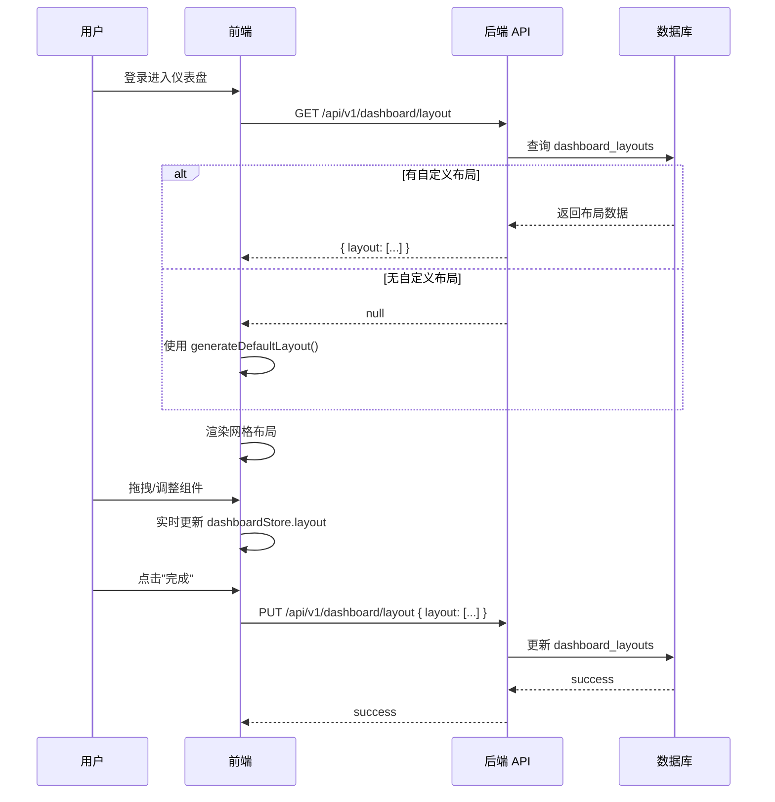

# 前端架构设计文档

> AI 伴学与智能体协同平台 · Frontend Architecture Document

版本：V1.0
适用阶段：MVP
最后更新：2026-06-02

---

## 目录

1. [技术栈说明](#一技术栈说明)
2. [项目目录结构](#二项目目录结构)
3. [路由设计](#三路由设计)
4. [布局设计](#四布局设计)
5. [状态管理设计](#五状态管理设计)
6. [组件设计](#六组件设计)
7. [仪表盘拖拽系统设计](#七仪表盘拖拽系统设计)
8. [API 请求封装](#八api-请求封装)
9. [SSE 流式对话](#九sse-流式对话)
10. [主题与样式系统](#十主题与样式系统)
11. [国际化预留](#十一国际化预留)
12. [性能优化策略](#十二性能优化策略)
13. [页面清单](#十三页面清单)

---

## 一、技术栈说明

### 1.1 核心框架

| 技术 | 版本要求 | 说明 |
|------|---------|------|
| **Vue 3** | ^3.5+ | 使用 Composition API + `<script setup>` 语法 |
| **TypeScript** | ^5.5+ | 全面使用 TS，严格模式 `strict: true` |
| **Vite** | ^6.0+ | 构建工具，支持 HMR、代码分割、环境变量 |
| **Pinia** | ^3.0+ | 状态管理，替代 Vuex |
| **Vue Router** | ^4.5+ | 路由管理，支持路由守卫、懒加载 |
| **Element Plus** | ^2.9+ | UI 组件库，按需引入 |
| **Tailwind CSS** | ^4.0+ | 原子化 CSS，与 Element Plus 配合使用 |

### 1.2 功能类库

| 库 | 用途 | 说明 |
|----|------|------|
| **VueDraggablePlus** | 拖拽排序 | 仪表盘模块拖拽、TODO 排序 |
| **vue-grid-layout** | 网格布局 | 仪表盘卡片网格化定位与缩放 |
| **ECharts** / **vue-echarts** | 数据图表 | 学习热力图、统计图表 |
| **FullCalendar** / **@fullcalendar/vue3** | 日历组件 | 月日历计划视图 |
| **markdown-it** | Markdown 渲染 | AI 对话 Markdown 输出渲染 |
| **highlight.js** | 代码高亮 | AI 对话中代码块语法高亮 |
| **axios** | HTTP 请求 | API 调用、拦截器、Token 刷新 |
| **dayjs** | 日期处理 | 替代 moment.js，轻量日期格式化 |
| **@vueuse/core** | 组合式工具函数 | useStorage、useDark、useIntersectionObserver 等 |
| **nprogress** | 页面加载进度条 | 路由切换进度指示 |
| **vue-i18n** | 国际化 | 预留多语言支持（MVP 仅中文） |
| **@iconify/vue** | 图标库 | 统一图标方案，支持多图标集 |
| **file-saver** | 文件下载 | 前端触发文件下载 |
| **xlsx** / **docx-preview** | 文件预览 | 知识库文件在线预览 |

### 1.3 开发工具

| 工具 | 用途 |
|------|------|
| **ESLint** + **@antfu/eslint-config** | 代码规范与静态检查 |
| **Prettier** | 代码格式化 |
| **unplugin-auto-import** | 自动导入 Vue、Vue Router、Pinia API |
| **unplugin-vue-components** | Element Plus 组件按需自动导入 |
| **unplugin-icons** | 图标按需自动导入 |
| **vite-plugin-vue-devtools** | Vue DevTools 集成 |

### 1.4 包管理器

使用 **pnpm** 作为包管理器，统一 lock 文件，提升安装速度。

```bash
pnpm create vite web --template vue-ts
```

---

## 二、项目目录结构

```
web/
├── public/                          # 静态资源（直接拷贝到输出目录）
│   ├── favicon.ico
│   └── logo.svg
│
├── src/
│   ├── api/                         # API 请求模块（按业务领域拆分）
│   │   ├── index.ts                 # Axios 实例与拦截器
│   │   ├── auth.ts                  # 登录/登出/Token 刷新
│   │   ├── user.ts                  # 用户管理 CRUD
│   │   ├── dashboard.ts             # 仪表盘布局保存/读取
│   │   ├── todo.ts                  # TODO CRUD
│   │   ├── note.ts                  # 便签 CRUD
│   │   ├── countdown.ts             # 倒数日 CRUD
│   │   ├── bookmark.ts              # 书签 CRUD
│   │   ├── announcement.ts          # 公告 CRUD + 已读标记
│   │   ├── task.ts                  # 任务 CRUD + 提交
│   │   ├── calendar.ts              # 日历计划 CRUD
│   │   ├── ai-chat.ts               # AI 对话（创建/列表/发送/SSE）
│   │   ├── memory.ts                # Memory 查看/反馈
│   │   ├── daily-review.ts          # 每日复盘查看
│   │   ├── heatmap.ts               # 学习热力图数据
│   │   ├── study-time.ts            # 学习时长统计
│   │   ├── bilibili.ts              # B 站资源管理
│   │   ├── knowledge.ts             # 知识库文件/搜索
│   │   ├── file.ts                  # 文件上传/下载
│   │   ├── notification.ts          # 通知列表/已读
│   │   ├── behavior-log.ts          # 行为日志上报
│   │   ├── admin/                   # 管理员专用 API
│   │   │   ├── system.ts            # 系统设置
│   │   │   ├── model-config.ts      # 模型配置
│   │   │   ├── logs.ts              # 系统日志/AI 调用日志
│   │   │   └── statistics.ts        # 平台统计
│   │   └── teacher/                 # 教师专用 API
│   │       ├── students.ts          # 学生列表/详情
│   │       └── workspace.ts         # 教师工作台数据
│   │
│   ├── assets/                      # 静态资源（会被 Vite 处理）
│   │   ├── images/                  # 图片资源
│   │   │   ├── login-bg.svg
│   │   │   ├── empty-state.svg
│   │   │   └── avatar-default.png
│   │   └── icons/                   # SVG 图标
│   │
│   ├── components/                  # 全局共享组件
│   │   ├── common/                  # 基础通用组件
│   │   │   ├── AppLogo.vue          # 平台 Logo
│   │   │   ├── PageHeader.vue       # 页面标题栏
│   │   │   ├── EmptyState.vue       # 空状态占位
│   │   │   ├── ConfirmDialog.vue    # 确认弹窗
│   │   │   ├── LoadingOverlay.vue   # 加载遮罩
│   │   │   └── UserAvatar.vue       # 用户头像组件
│   │   ├── dashboard/               # 仪表盘组件系统
│   │   │   ├── DashboardGrid.vue    # 仪表盘网格容器
│   │   │   ├── WidgetWrapper.vue    # 卡片外壳（标题栏+操作+插槽）
│   │   │   ├── WidgetRegistry.ts    # 组件注册表
│   │   │   ├── widgets/             # 具体组件实现
│   │   │   │   ├── TodoWidget.vue
│   │   │   │   ├── NoteWidget.vue
│   │   │   │   ├── CountdownWidget.vue
│   │   │   │   ├── BookmarkWidget.vue
│   │   │   │   ├── StudyTimeWidget.vue
│   │   │   │   ├── TaskWidget.vue
│   │   │   │   ├── AnnouncementWidget.vue
│   │   │   │   ├── HeatmapWidget.vue
│   │   │   │   ├── CalendarWidget.vue
│   │   │   │   ├── AiSuggestionWidget.vue
│   │   │   │   ├── RecentFilesWidget.vue
│   │   │   │   └── RecentKnowledgeWidget.vue
│   │   │   └── WidgetConfigPanel.vue # 组件管理面板
│   │   ├── ai-chat/                 # AI 对话组件
│   │   │   ├── ChatContainer.vue    # 对话容器
│   │   │   ├── MessageList.vue      # 消息列表
│   │   │   ├── MessageBubble.vue    # 单条消息气泡
│   │   │   ├── ChatInput.vue        # 输入框+发送按钮
│   │   │   ├── MarkdownRenderer.vue # Markdown 渲染器
│   │   │   ├── StreamingIndicator.vue # 流式输出指示器
│   │   │   ├── ConversationList.vue # 会话列表侧栏
│   │   │   └── ChatWelcome.vue      # 新对话欢迎页
│   │   ├── heatmap/                 # 热力图组件
│   │   │   └── ContributionHeatmap.vue # GitHub 风格活跃热力图
│   │   ├── calendar/                # 日历组件
│   │   │   ├── FullCalendarWrapper.vue # FullCalendar 封装
│   │   │   └── EventFormDialog.vue  # 日历事件编辑弹窗
│   │   ├── file/                    # 文件相关组件
│   │   │   ├── FileUploader.vue     # 文件上传组件
│   │   │   ├── FilePreview.vue      # 文件预览组件
│   │   │   └── FileList.vue         # 文件列表组件
│   │   ├── notification/            # 通知组件
│   │   │   ├── NotificationBell.vue # 通知铃铛（Header 中）
│   │   │   ├── NotificationPopover.vue # 通知弹出列表
│   │   │   └── NotificationItem.vue # 单条通知
│   │   └── editor/                  # 编辑器组件
│   │       └── MarkdownEditor.vue   # Markdown 编辑器
│   │
│   ├── composables/                 # Vue Composables（可复用逻辑）
│   │   ├── useAuth.ts               # 登录/登出/权限判断
│   │   ├── usePermission.ts         # 角色权限检查
│   │   ├── usePagination.ts         # 分页逻辑
│   │   ├── useDebounce.ts           # 防抖
│   │   ├── useStudyTimer.ts         # 学习时长计时器（心跳上报）
│   │   ├── useBehaviorLog.ts        # 行为日志上报
│   │   ├── useSse.ts                # SSE 流式请求
│   │   ├── useBreakpoint.ts         # 响应式断点检测
│   │   ├── useDarkMode.ts           # 暗色模式切换
│   │   └── useNotification.ts       # 浏览器 Notification API
│   │
│   ├── layouts/                     # 布局组件
│   │   ├── AuthLayout.vue           # 登录页布局
│   │   ├── MainLayout.vue           # 主布局（侧栏+Header+内容区）
│   │   ├── components/
│   │   │   ├── AppHeader.vue        # 顶部导航栏
│   │   │   ├── AppSidebar.vue       # 侧边导航栏
│   │   │   ├── SidebarMenu.ts       # 侧栏菜单配置（按角色）
│   │   │   └── AppBreadcrumb.vue    # 面包屑导航
│   │   └── BlankLayout.vue          # 空白布局（嵌入页等）
│   │
│   ├── pages/                       # 页面视图（按角色/模块分目录）
│   │   ├── auth/                    # 认证相关页面
│   │   │   └── LoginPage.vue
│   │   ├── common/                  # 公共页面
│   │   │   ├── NotFoundPage.vue     # 404
│   │   │   ├── ForbiddenPage.vue    # 403
│   │   │   ├── ProfilePage.vue      # 个人设置
│   │   │   ├── ChangePasswordPage.vue # 修改密码
│   │   │   └── NotificationPage.vue # 消息通知
│   │   ├── student/                 # 学生端页面
│   │   │   ├── DashboardPage.vue    # 学生仪表盘
│   │   │   ├── AiChatPage.vue       # AI 伴学对话
│   │   │   ├── TodoPage.vue         # TODO 管理
│   │   │   ├── NotesPage.vue        # 便签管理
│   │   │   ├── CountdownPage.vue    # 倒数日管理
│   │   │   ├── BookmarksPage.vue    # 书签管理
│   │   │   ├── TasksPage.vue        # 我的任务
│   │   │   ├── AnnouncementsPage.vue # 公告中心
│   │   │   ├── CalendarPage.vue     # 月日历计划
│   │   │   ├── HeatmapPage.vue      # 学习热力图
│   │   │   ├── BilibiliPage.vue     # B 站学习资源
│   │   │   ├── KnowledgePage.vue    # 知识库
│   │   │   ├── FilesPage.vue        # 文件上传
│   │   │   ├── DailyReviewPage.vue  # 每日复盘
│   │   │   └── MemoryPage.vue       # 我的 Memory
│   │   ├── teacher/                 # 教师端页面
│   │   │   ├── WorkspacePage.vue    # 教师工作台
│   │   │   ├── StudentsPage.vue     # 学生列表
│   │   │   ├── StudentDetailPage.vue # 学生详情
│   │   │   ├── TaskManagePage.vue   # 任务管理
│   │   │   ├── AnnouncementManagePage.vue # 公告管理
│   │   │   ├── CalendarManagePage.vue # 日历计划管理
│   │   │   ├── KnowledgeManagePage.vue # 知识库管理
│   │   │   ├── StudentReviewPage.vue # 学生复盘查看
│   │   │   └── AiAssistantPage.vue  # 教师助手智能体
│   │   └── admin/                   # 管理员端页面
│   │       ├── OverviewPage.vue     # 管理概览
│   │       ├── UsersPage.vue        # 用户管理
│   │       ├── StudentsManagePage.vue # 学生账号管理
│   │       ├── TeachersManagePage.vue # 教师账号管理
│   │       ├── RolesPage.vue        # 角色权限管理
│   │       ├── AnnouncementManagePage.vue # 公告管理
│   │       ├── TaskManagePage.vue    # 任务管理
│   │       ├── KnowledgeManagePage.vue # 知识库管理
│   │       ├── ModelConfigPage.vue  # 模型配置
│   │       ├── NotificationConfigPage.vue # 通知配置
│   │       ├── FileManagePage.vue   # 文件管理
│   │       ├── BehaviorLogPage.vue  # 行为日志
│   │       ├── AiLogPage.vue        # AI 调用日志
│   │       ├── MemoryLogPage.vue    # Memory 更新日志
│   │       ├── SystemLogPage.vue    # 系统日志
│   │       └── SettingsPage.vue     # 系统设置
│   │
│   ├── router/                      # 路由配置
│   │   ├── index.ts                 # 路由实例与全局守卫
│   │   ├── guards.ts                # 路由守卫逻辑
│   │   ├── routes/
│   │   │   ├── public.ts            # 公共路由
│   │   │   ├── student.ts           # 学生路由
│   │   │   ├── teacher.ts           # 教师路由
│   │   │   └── admin.ts             # 管理员路由
│   │   └── types.ts                 # 路由 Meta 类型定义
│   │
│   ├── stores/                      # Pinia 状态管理
│   │   ├── auth.ts                  # 认证状态
│   │   ├── dashboard.ts             # 仪表盘布局
│   │   ├── todo.ts                  # TODO 状态
│   │   ├── note.ts                  # 便签状态
│   │   ├── countdown.ts             # 倒数日状态
│   │   ├── bookmark.ts              # 书签状态
│   │   ├── announcement.ts          # 公告状态
│   │   ├── task.ts                  # 任务状态
│   │   ├── calendar.ts              # 日历计划状态
│   │   ├── ai-chat.ts               # AI 对话状态
│   │   ├── notification.ts          # 通知状态
│   │   ├── app.ts                   # 全局应用状态（侧栏、主题等）
│   │   └── study-time.ts            # 学习时长状态
│   │
│   ├── styles/                      # 全局样式
│   │   ├── index.css                # 入口样式文件（引入 Tailwind）
│   │   ├── variables.css            # CSS 变量（主题色、间距等）
│   │   ├── element-overrides.css    # Element Plus 样式覆盖
│   │   ├── transitions.css          # 过渡动画
│   │   └── scrollbar.css            # 滚动条美化
│   │
│   ├── types/                       # TypeScript 类型定义
│   │   ├── api.d.ts                 # API 响应通用类型
│   │   ├── user.d.ts                # 用户类型
│   │   ├── todo.d.ts                # TODO 类型
│   │   ├── note.d.ts                # 便签类型
│   │   ├── countdown.d.ts           # 倒数日类型
│   │   ├── bookmark.d.ts            # 书签类型
│   │   ├── announcement.d.ts        # 公告类型
│   │   ├── task.d.ts                # 任务类型
│   │   ├── calendar.d.ts            # 日历事件类型
│   │   ├── ai-chat.d.ts             # AI 对话类型
│   │   ├── memory.d.ts              # Memory 类型
│   │   ├── knowledge.d.ts           # 知识库类型
│   │   ├── notification.d.ts        # 通知类型
│   │   ├── dashboard.d.ts           # 仪表盘布局类型
│   │   ├── heatmap.d.ts             # 热力图数据类型
│   │   ├── bilibili.d.ts            # B 站资源类型
│   │   └── env.d.ts                 # 环境变量类型声明
│   │
│   ├── utils/                       # 工具函数
│   │   ├── request.ts               # 同 api/index.ts 的底层封装
│   │   ├── storage.ts               # localStorage / sessionStorage 封装
│   │   ├── format.ts                # 日期、数字、文件大小格式化
│   │   ├── validator.ts             # 表单验证规则
│   │   ├── color.ts                 # 颜色处理（热力图色阶等）
│   │   └── constants.ts             # 全局常量（角色、任务状态枚举等）
│   │
│   ├── App.vue                      # 根组件
│   ├── main.ts                      # 应用入口
│   └── env.d.ts                     # Vite 环境变量类型
│
├── .env                             # 默认环境变量
├── .env.development                 # 开发环境变量
├── .env.production                  # 生产环境变量
├── index.html                       # HTML 入口
├── vite.config.ts                   # Vite 配置
├── tsconfig.json                    # TypeScript 配置
├── tailwind.config.ts               # Tailwind CSS 配置（v4 可能为 CSS-based）
├── eslint.config.js                 # ESLint 配置
├── components.d.ts                  # 自动生成的组件类型声明
├── auto-imports.d.ts                # 自动生成的 API 导入声明
├── package.json
├── pnpm-lock.yaml
└── README.md
```

### 目录约定

| 规则 | 说明 |
|------|------|
| 文件命名 | 组件使用 **PascalCase**（`TodoWidget.vue`），非组件使用 **kebab-case**（`ai-chat.ts`） |
| 页面命名 | 统一以 `Page` 结尾（`DashboardPage.vue`） |
| 组件命名 | 按功能域分子目录，避免单层堆积 |
| API 模块 | 每个业务领域一个文件，导出函数 |
| 类型文件 | 使用 `.d.ts` 声明文件或普通 `.ts` 均可，按领域拆分 |

---

## 三、路由设计

### 3.1 路由 Meta 类型定义

```typescript
// src/router/types.ts
import 'vue-router'

export type UserRole = 'admin' | 'teacher' | 'student'

declare module 'vue-router' {
  interface RouteMeta {
    /** 页面标题（用于 document.title 和面包屑） */
    title?: string
    /** 允许访问的角色列表，空数组表示不限角色 */
    roles?: UserRole[]
    /** 是否需要登录，默认 true */
    requiresAuth?: boolean
    /** 侧栏菜单中的图标名 */
    icon?: string
    /** 是否在侧栏菜单中隐藏 */
    hidden?: boolean
    /** 是否缓存页面（KeepAlive） */
    keepAlive?: boolean
    /** 面包屑配置 */
    breadcrumb?: { title: string; path?: string }[]
    /** 菜单排序序号 */
    order?: number
  }
}
```

### 3.2 完整路由表

#### 公共路由（无需登录）

```typescript
// src/router/routes/public.ts
import type { RouteRecordRaw } from 'vue-router'

export const publicRoutes: RouteRecordRaw[] = [
  {
    path: '/login',
    name: 'Login',
    component: () => import('@/pages/auth/LoginPage.vue'),
    meta: {
      title: '登录',
      requiresAuth: false,
      layout: 'auth',
    },
  },
  {
    path: '/403',
    name: 'Forbidden',
    component: () => import('@/pages/common/ForbiddenPage.vue'),
    meta: {
      title: '无权限',
      requiresAuth: false,
    },
  },
  {
    path: '/:pathMatch(.*)*',
    name: 'NotFound',
    component: () => import('@/pages/common/NotFoundPage.vue'),
    meta: {
      title: '页面不存在',
      requiresAuth: false,
    },
  },
]
```

#### 学生路由

```typescript
// src/router/routes/student.ts
import type { RouteRecordRaw } from 'vue-router'

export const studentRoutes: RouteRecordRaw[] = [
  {
    path: '/student',
    component: () => import('@/layouts/MainLayout.vue'),
    redirect: '/student/dashboard',
    meta: { roles: ['student'] },
    children: [
      {
        path: 'dashboard',
        name: 'StudentDashboard',
        component: () => import('@/pages/student/DashboardPage.vue'),
        meta: {
          title: '仪表盘',
          icon: 'i-ep-odometer',
          keepAlive: true,
          order: 1,
        },
      },
      {
        path: 'ai-chat',
        name: 'StudentAiChat',
        component: () => import('@/pages/student/AiChatPage.vue'),
        meta: {
          title: 'AI 伴学',
          icon: 'i-ep-chat-dot-round',
          order: 2,
        },
      },
      {
        path: 'todos',
        name: 'StudentTodos',
        component: () => import('@/pages/student/TodoPage.vue'),
        meta: {
          title: 'TODO',
          icon: 'i-ep-finished',
          keepAlive: true,
          order: 3,
        },
      },
      {
        path: 'notes',
        name: 'StudentNotes',
        component: () => import('@/pages/student/NotesPage.vue'),
        meta: {
          title: '便签',
          icon: 'i-ep-document',
          keepAlive: true,
          order: 4,
        },
      },
      {
        path: 'countdowns',
        name: 'StudentCountdowns',
        component: () => import('@/pages/student/CountdownPage.vue'),
        meta: {
          title: '倒数日',
          icon: 'i-ep-timer',
          keepAlive: true,
          order: 5,
        },
      },
      {
        path: 'bookmarks',
        name: 'StudentBookmarks',
        component: () => import('@/pages/student/BookmarksPage.vue'),
        meta: {
          title: '书签',
          icon: 'i-ep-star',
          keepAlive: true,
          order: 6,
        },
      },
      {
        path: 'tasks',
        name: 'StudentTasks',
        component: () => import('@/pages/student/TasksPage.vue'),
        meta: {
          title: '我的任务',
          icon: 'i-ep-list',
          keepAlive: true,
          order: 7,
        },
      },
      {
        path: 'announcements',
        name: 'StudentAnnouncements',
        component: () => import('@/pages/student/AnnouncementsPage.vue'),
        meta: {
          title: '公告中心',
          icon: 'i-ep-bell',
          order: 8,
        },
      },
      {
        path: 'calendar',
        name: 'StudentCalendar',
        component: () => import('@/pages/student/CalendarPage.vue'),
        meta: {
          title: '日历计划',
          icon: 'i-ep-calendar',
          order: 9,
        },
      },
      {
        path: 'heatmap',
        name: 'StudentHeatmap',
        component: () => import('@/pages/student/HeatmapPage.vue'),
        meta: {
          title: '学习热力图',
          icon: 'i-ep-data-analysis',
          order: 10,
        },
      },
      {
        path: 'bilibili',
        name: 'StudentBilibili',
        component: () => import('@/pages/student/BilibiliPage.vue'),
        meta: {
          title: 'B 站学习',
          icon: 'i-ep-video-play',
          order: 11,
        },
      },
      {
        path: 'knowledge',
        name: 'StudentKnowledge',
        component: () => import('@/pages/student/KnowledgePage.vue'),
        meta: {
          title: '知识库',
          icon: 'i-ep-collection',
          order: 12,
        },
      },
      {
        path: 'files',
        name: 'StudentFiles',
        component: () => import('@/pages/student/FilesPage.vue'),
        meta: {
          title: '文件管理',
          icon: 'i-ep-folder-opened',
          order: 13,
        },
      },
      {
        path: 'daily-review',
        name: 'StudentDailyReview',
        component: () => import('@/pages/student/DailyReviewPage.vue'),
        meta: {
          title: '每日复盘',
          icon: 'i-ep-memo',
          order: 14,
        },
      },
      {
        path: 'memory',
        name: 'StudentMemory',
        component: () => import('@/pages/student/MemoryPage.vue'),
        meta: {
          title: '我的 Memory',
          icon: 'i-ep-cpu',
          order: 15,
        },
      },
      // --- 公共子页面 ---
      {
        path: 'profile',
        name: 'StudentProfile',
        component: () => import('@/pages/common/ProfilePage.vue'),
        meta: {
          title: '个人设置',
          hidden: true,
        },
      },
      {
        path: 'change-password',
        name: 'StudentChangePassword',
        component: () => import('@/pages/common/ChangePasswordPage.vue'),
        meta: {
          title: '修改密码',
          hidden: true,
        },
      },
      {
        path: 'notifications',
        name: 'StudentNotifications',
        component: () => import('@/pages/common/NotificationPage.vue'),
        meta: {
          title: '消息通知',
          hidden: true,
        },
      },
    ],
  },
]
```

#### 教师路由

```typescript
// src/router/routes/teacher.ts
import type { RouteRecordRaw } from 'vue-router'

export const teacherRoutes: RouteRecordRaw[] = [
  {
    path: '/teacher',
    component: () => import('@/layouts/MainLayout.vue'),
    redirect: '/teacher/workspace',
    meta: { roles: ['teacher'] },
    children: [
      {
        path: 'workspace',
        name: 'TeacherWorkspace',
        component: () => import('@/pages/teacher/WorkspacePage.vue'),
        meta: {
          title: '工作台',
          icon: 'i-ep-platform',
          order: 1,
        },
      },
      {
        path: 'students',
        name: 'TeacherStudents',
        component: () => import('@/pages/teacher/StudentsPage.vue'),
        meta: {
          title: '学生管理',
          icon: 'i-ep-user',
          keepAlive: true,
          order: 2,
        },
      },
      {
        path: 'students/:id',
        name: 'TeacherStudentDetail',
        component: () => import('@/pages/teacher/StudentDetailPage.vue'),
        meta: {
          title: '学生详情',
          hidden: true,
        },
      },
      {
        path: 'tasks',
        name: 'TeacherTasks',
        component: () => import('@/pages/teacher/TaskManagePage.vue'),
        meta: {
          title: '任务管理',
          icon: 'i-ep-list',
          keepAlive: true,
          order: 3,
        },
      },
      {
        path: 'announcements',
        name: 'TeacherAnnouncements',
        component: () => import('@/pages/teacher/AnnouncementManagePage.vue'),
        meta: {
          title: '公告管理',
          icon: 'i-ep-bell',
          keepAlive: true,
          order: 4,
        },
      },
      {
        path: 'calendar',
        name: 'TeacherCalendar',
        component: () => import('@/pages/teacher/CalendarManagePage.vue'),
        meta: {
          title: '日历计划',
          icon: 'i-ep-calendar',
          order: 5,
        },
      },
      {
        path: 'knowledge',
        name: 'TeacherKnowledge',
        component: () => import('@/pages/teacher/KnowledgeManagePage.vue'),
        meta: {
          title: '知识库管理',
          icon: 'i-ep-collection',
          order: 6,
        },
      },
      {
        path: 'reviews',
        name: 'TeacherReviews',
        component: () => import('@/pages/teacher/StudentReviewPage.vue'),
        meta: {
          title: '学生复盘',
          icon: 'i-ep-memo',
          order: 7,
        },
      },
      {
        path: 'ai-assistant',
        name: 'TeacherAiAssistant',
        component: () => import('@/pages/teacher/AiAssistantPage.vue'),
        meta: {
          title: '教师助手',
          icon: 'i-ep-magic-stick',
          order: 8,
        },
      },
      // --- 公共子页面 ---
      {
        path: 'profile',
        name: 'TeacherProfile',
        component: () => import('@/pages/common/ProfilePage.vue'),
        meta: { title: '个人设置', hidden: true },
      },
      {
        path: 'change-password',
        name: 'TeacherChangePassword',
        component: () => import('@/pages/common/ChangePasswordPage.vue'),
        meta: { title: '修改密码', hidden: true },
      },
      {
        path: 'notifications',
        name: 'TeacherNotifications',
        component: () => import('@/pages/common/NotificationPage.vue'),
        meta: { title: '消息通知', hidden: true },
      },
    ],
  },
]
```

#### 管理员路由

```typescript
// src/router/routes/admin.ts
import type { RouteRecordRaw } from 'vue-router'

export const adminRoutes: RouteRecordRaw[] = [
  {
    path: '/admin',
    component: () => import('@/layouts/MainLayout.vue'),
    redirect: '/admin/overview',
    meta: { roles: ['admin'] },
    children: [
      {
        path: 'overview',
        name: 'AdminOverview',
        component: () => import('@/pages/admin/OverviewPage.vue'),
        meta: {
          title: '管理概览',
          icon: 'i-ep-data-board',
          order: 1,
        },
      },
      // --- 用户管理组 ---
      {
        path: 'users',
        name: 'AdminUsers',
        component: () => import('@/pages/admin/UsersPage.vue'),
        meta: {
          title: '用户管理',
          icon: 'i-ep-user',
          order: 2,
        },
      },
      {
        path: 'students',
        name: 'AdminStudents',
        component: () => import('@/pages/admin/StudentsManagePage.vue'),
        meta: {
          title: '学生管理',
          icon: 'i-ep-avatar',
          order: 3,
        },
      },
      {
        path: 'teachers',
        name: 'AdminTeachers',
        component: () => import('@/pages/admin/TeachersManagePage.vue'),
        meta: {
          title: '教师管理',
          icon: 'i-ep-postcard',
          order: 4,
        },
      },
      {
        path: 'roles',
        name: 'AdminRoles',
        component: () => import('@/pages/admin/RolesPage.vue'),
        meta: {
          title: '角色权限',
          icon: 'i-ep-lock',
          order: 5,
        },
      },
      // --- 业务管理组 ---
      {
        path: 'announcements',
        name: 'AdminAnnouncements',
        component: () => import('@/pages/admin/AnnouncementManagePage.vue'),
        meta: {
          title: '公告管理',
          icon: 'i-ep-bell',
          order: 6,
        },
      },
      {
        path: 'tasks',
        name: 'AdminTasks',
        component: () => import('@/pages/admin/TaskManagePage.vue'),
        meta: {
          title: '任务管理',
          icon: 'i-ep-list',
          order: 7,
        },
      },
      {
        path: 'knowledge',
        name: 'AdminKnowledge',
        component: () => import('@/pages/admin/KnowledgeManagePage.vue'),
        meta: {
          title: '知识库管理',
          icon: 'i-ep-collection',
          order: 8,
        },
      },
      // --- 系统配置组 ---
      {
        path: 'model-config',
        name: 'AdminModelConfig',
        component: () => import('@/pages/admin/ModelConfigPage.vue'),
        meta: {
          title: '模型配置',
          icon: 'i-ep-cpu',
          order: 9,
        },
      },
      {
        path: 'notification-config',
        name: 'AdminNotificationConfig',
        component: () => import('@/pages/admin/NotificationConfigPage.vue'),
        meta: {
          title: '通知配置',
          icon: 'i-ep-message',
          order: 10,
        },
      },
      {
        path: 'files',
        name: 'AdminFiles',
        component: () => import('@/pages/admin/FileManagePage.vue'),
        meta: {
          title: '文件管理',
          icon: 'i-ep-folder',
          order: 11,
        },
      },
      // --- 日志监控组 ---
      {
        path: 'behavior-logs',
        name: 'AdminBehaviorLogs',
        component: () => import('@/pages/admin/BehaviorLogPage.vue'),
        meta: {
          title: '行为日志',
          icon: 'i-ep-document-copy',
          order: 12,
        },
      },
      {
        path: 'ai-logs',
        name: 'AdminAiLogs',
        component: () => import('@/pages/admin/AiLogPage.vue'),
        meta: {
          title: 'AI 调用日志',
          icon: 'i-ep-chat-line-square',
          order: 13,
        },
      },
      {
        path: 'memory-logs',
        name: 'AdminMemoryLogs',
        component: () => import('@/pages/admin/MemoryLogPage.vue'),
        meta: {
          title: 'Memory 日志',
          icon: 'i-ep-files',
          order: 14,
        },
      },
      {
        path: 'system-logs',
        name: 'AdminSystemLogs',
        component: () => import('@/pages/admin/SystemLogPage.vue'),
        meta: {
          title: '系统日志',
          icon: 'i-ep-monitor',
          order: 15,
        },
      },
      {
        path: 'settings',
        name: 'AdminSettings',
        component: () => import('@/pages/admin/SettingsPage.vue'),
        meta: {
          title: '系统设置',
          icon: 'i-ep-setting',
          order: 16,
        },
      },
      // --- 公共子页面 ---
      {
        path: 'profile',
        name: 'AdminProfile',
        component: () => import('@/pages/common/ProfilePage.vue'),
        meta: { title: '个人设置', hidden: true },
      },
      {
        path: 'change-password',
        name: 'AdminChangePassword',
        component: () => import('@/pages/common/ChangePasswordPage.vue'),
        meta: { title: '修改密码', hidden: true },
      },
      {
        path: 'notifications',
        name: 'AdminNotifications',
        component: () => import('@/pages/common/NotificationPage.vue'),
        meta: { title: '消息通知', hidden: true },
      },
    ],
  },
]
```

#### 路由注册入口

```typescript
// src/router/index.ts
import { createRouter, createWebHistory } from 'vue-router'
import { publicRoutes } from './routes/public'
import { studentRoutes } from './routes/student'
import { teacherRoutes } from './routes/teacher'
import { adminRoutes } from './routes/admin'
import { setupGuards } from './guards'

const router = createRouter({
  history: createWebHistory(import.meta.env.BASE_URL),
  routes: [
    ...publicRoutes,
    ...studentRoutes,
    ...teacherRoutes,
    ...adminRoutes,
  ],
  scrollBehavior: () => ({ top: 0 }),
})

setupGuards(router)

export default router
```

### 3.3 路由守卫

```typescript
// src/router/guards.ts
import type { Router } from 'vue-router'
import NProgress from 'nprogress'
import { useAuthStore } from '@/stores/auth'

export function setupGuards(router: Router) {
  router.beforeEach(async (to, _from, next) => {
    NProgress.start()

    const authStore = useAuthStore()
    const requiresAuth = to.meta.requiresAuth !== false

    // 1. 不需要认证的页面直接通过
    if (!requiresAuth) {
      // 已登录用户访问登录页 → 重定向到对应首页
      if (to.path === '/login' && authStore.isLoggedIn) {
        return next(authStore.homeRoute)
      }
      return next()
    }

    // 2. 未登录 → 跳转登录页
    if (!authStore.isLoggedIn) {
      return next({ path: '/login', query: { redirect: to.fullPath } })
    }

    // 3. 已登录但 Token 即将过期 → 尝试刷新
    if (authStore.isTokenExpiringSoon) {
      try {
        await authStore.refreshToken()
      } catch {
        authStore.logout()
        return next({ path: '/login', query: { redirect: to.fullPath } })
      }
    }

    // 4. 检查角色权限
    const requiredRoles = to.matched
      .flatMap(record => record.meta.roles || [])
    if (requiredRoles.length > 0 && !requiredRoles.includes(authStore.role)) {
      return next('/403')
    }

    // 5. 设置页面标题
    document.title = to.meta.title
      ? `${to.meta.title} - AI 伴学平台`
      : 'AI 伴学平台'

    next()
  })

  router.afterEach(() => {
    NProgress.done()
  })
}
```

### 3.4 角色首页重定向

```typescript
// 在 useAuthStore 中
get homeRoute(): string {
  switch (this.role) {
    case 'student': return '/student/dashboard'
    case 'teacher': return '/teacher/workspace'
    case 'admin':   return '/admin/overview'
    default:        return '/login'
  }
}
```

根路径 `/` 路由守卫自动按角色重定向：

```typescript
{
  path: '/',
  redirect: () => {
    const authStore = useAuthStore()
    return authStore.isLoggedIn ? authStore.homeRoute : '/login'
  },
}
```

---

## 四、布局设计

### 4.1 布局体系概览

```
┌─────────────────────────────────────────────────────┐
│ AuthLayout（登录页专用）                               │
│ ┌─────────────────┬─────────────────────────────────┐ │
│ │ 品牌展示 / 背景   │  登录表单                        │ │
│ └─────────────────┴─────────────────────────────────┘ │
└─────────────────────────────────────────────────────┘

┌─────────────────────────────────────────────────────┐
│ MainLayout（主要布局）                                 │
│ ┌───────┬───────────────────────────────────────────┐ │
│ │       │ AppHeader（Logo / 搜索 / 通知 / 用户菜单）   │ │
│ │  App  ├───────────────────────────────────────────┤ │
│ │ Side  │ AppBreadcrumb（面包屑）                     │ │
│ │  bar  ├───────────────────────────────────────────┤ │
│ │       │                                           │ │
│ │ 导航   │  <RouterView />  页面内容区                 │ │
│ │ 菜单   │                                           │ │
│ │       │                                           │ │
│ └───────┴───────────────────────────────────────────┘ │
└─────────────────────────────────────────────────────┘
```

### 4.2 AuthLayout

```vue
<!-- src/layouts/AuthLayout.vue -->
<template>
  <div class="flex h-screen">
    <!-- 左侧品牌区 -->
    <div class="hidden lg:flex lg:w-1/2 items-center justify-center
                bg-gradient-to-br from-blue-500 to-indigo-600">
      <div class="text-center text-white">
        <AppLogo size="lg" />
        <h1 class="mt-6 text-3xl font-bold">AI 伴学平台</h1>
        <p class="mt-2 text-lg opacity-80">智能学习 · 持续成长</p>
      </div>
    </div>
    <!-- 右侧表单区 -->
    <div class="flex-1 flex items-center justify-center px-8">
      <div class="w-full max-w-md">
        <slot />
      </div>
    </div>
  </div>
</template>
```

### 4.3 MainLayout

```vue
<!-- src/layouts/MainLayout.vue -->
<template>
  <div class="flex h-screen overflow-hidden bg-gray-50 dark:bg-gray-900">
    <!-- 侧边栏 -->
    <AppSidebar
      :collapsed="appStore.sidebarCollapsed"
      @toggle="appStore.toggleSidebar"
    />
    <!-- 主区域 -->
    <div class="flex flex-1 flex-col overflow-hidden">
      <!-- 顶部栏 -->
      <AppHeader />
      <!-- 面包屑 -->
      <AppBreadcrumb class="px-6 pt-4" />
      <!-- 内容区 -->
      <main class="flex-1 overflow-y-auto px-6 pb-6">
        <router-view v-slot="{ Component }">
          <transition name="fade" mode="out-in">
            <keep-alive :include="cachedPages">
              <component :is="Component" />
            </keep-alive>
          </transition>
        </router-view>
      </main>
    </div>
  </div>
</template>
```

### 4.4 侧栏导航配置

侧栏菜单根据当前用户角色动态渲染，菜单数据从路由 `meta` 中自动提取：

```typescript
// src/layouts/components/SidebarMenu.ts
import type { UserRole } from '@/router/types'
import { useRouter } from 'vue-router'

export interface MenuItem {
  label: string
  icon: string
  path: string
  order: number
  children?: MenuItem[]
  badge?: number   // 徽标数字（如未读消息数）
  group?: string   // 菜单分组标题
}

/**
 * 从路由配置自动生成侧栏菜单
 * 过滤条件：
 *  - meta.hidden !== true
 *  - 父路由 meta.roles 包含当前角色
 */
export function useSidebarMenu(role: UserRole): MenuItem[] {
  const router = useRouter()
  const rolePrefix = `/${role}`

  const parentRoute = router.getRoutes()
    .find(r => r.path === rolePrefix)

  if (!parentRoute) return []

  return parentRoute.children
    .filter(child => !child.meta?.hidden)
    .sort((a, b) => (a.meta?.order ?? 99) - (b.meta?.order ?? 99))
    .map(child => ({
      label: child.meta?.title ?? '',
      icon: child.meta?.icon ?? '',
      path: `${rolePrefix}/${child.path}`,
      order: child.meta?.order ?? 99,
    }))
}
```

#### 学生端侧栏菜单分组结构

| 分组 | 菜单项 |
|------|--------|
| **核心** | 仪表盘、AI 伴学 |
| **工具** | TODO、便签、倒数日、书签 |
| **学习** | 我的任务、公告中心、日历计划 |
| **数据** | 学习热力图、每日复盘、我的 Memory |
| **资源** | B 站学习、知识库、文件管理 |

#### 教师端侧栏菜单分组结构

| 分组 | 菜单项 |
|------|--------|
| **总览** | 工作台 |
| **学生** | 学生管理 |
| **管理** | 任务管理、公告管理、日历计划 |
| **资源** | 知识库管理 |
| **AI** | 学生复盘、教师助手 |

#### 管理员端侧栏菜单分组结构

| 分组 | 菜单项 |
|------|--------|
| **总览** | 管理概览 |
| **用户** | 用户管理、学生管理、教师管理、角色权限 |
| **业务** | 公告管理、任务管理、知识库管理 |
| **系统** | 模型配置、通知配置、文件管理 |
| **日志** | 行为日志、AI 调用日志、Memory 日志、系统日志 |
| **设置** | 系统设置 |

### 4.5 Header 组件结构

```
┌──────────────────────────────────────────────────────────────────┐
│ ≡（折叠按钮）   AI 伴学平台       🔍 搜索      🔔(3)  👤 张三 ▼  │
└──────────────────────────────────────────────────────────────────┘
```

Header 包含：
- **侧栏折叠按钮** —— 切换侧栏展开/收起
- **平台名称** —— 或当前页面标题
- **全局搜索**（P2） —— 搜索 TODO / 任务 / 知识库 / 公告
- **通知铃铛** —— 显示未读通知数，点击弹出通知列表
- **用户下拉菜单** —— 头像 + 用户名，下拉菜单含：个人设置 / 修改密码 / 退出

---

## 五、状态管理设计

### 5.1 总体设计原则

1. **按领域拆分 Store**：每个业务模块一个 Store，避免单一大 Store
2. **使用 Setup Store 语法**：`defineStore('name', () => { ... })` 形式
3. **服务端数据不长缓存**：列表数据通过 API 拉取，Store 仅缓存当前页面生命周期内的数据
4. **持久化按需使用**：仅 `authStore`、`appStore` 使用 `pinia-plugin-persistedstate` 持久化到 `localStorage`
5. **Getter 代替重复计算**：对过滤、统计等逻辑使用 computed

### 5.2 Store 清单与详细设计

#### useAuthStore —— 认证状态

```typescript
// src/stores/auth.ts
import { defineStore } from 'pinia'
import { ref, computed } from 'vue'
import { loginApi, logoutApi, refreshTokenApi, getUserInfoApi } from '@/api/auth'
import type { UserRole } from '@/router/types'

export interface UserInfo {
  id: number
  username: string
  displayName: string
  email?: string
  avatar?: string
  role: UserRole
  createdAt: string
}

export const useAuthStore = defineStore('auth', () => {
  // --- State ---
  const token = ref<string>('')
  const refreshTokenStr = ref<string>('')
  const tokenExpireAt = ref<number>(0)         // Token 过期时间戳(ms)
  const user = ref<UserInfo | null>(null)

  // --- Getters ---
  const isLoggedIn = computed(() => !!token.value && !!user.value)
  const role = computed(() => user.value?.role ?? '')
  const isAdmin = computed(() => role.value === 'admin')
  const isTeacher = computed(() => role.value === 'teacher')
  const isStudent = computed(() => role.value === 'student')
  const homeRoute = computed(() => {
    switch (role.value) {
      case 'student': return '/student/dashboard'
      case 'teacher': return '/teacher/workspace'
      case 'admin':   return '/admin/overview'
      default:        return '/login'
    }
  })
  /** Token 是否将在 5 分钟内过期 */
  const isTokenExpiringSoon = computed(() =>
    tokenExpireAt.value > 0 && tokenExpireAt.value - Date.now() < 5 * 60 * 1000
  )

  // --- Actions ---
  async function login(username: string, password: string) {
    const res = await loginApi({ username, password })
    token.value = res.data.accessToken
    refreshTokenStr.value = res.data.refreshToken
    tokenExpireAt.value = res.data.expireAt
    await fetchUserInfo()
  }

  async function fetchUserInfo() {
    const res = await getUserInfoApi()
    user.value = res.data
  }

  async function refreshToken() {
    const res = await refreshTokenApi(refreshTokenStr.value)
    token.value = res.data.accessToken
    refreshTokenStr.value = res.data.refreshToken
    tokenExpireAt.value = res.data.expireAt
  }

  function logout() {
    logoutApi().catch(() => {})
    token.value = ''
    refreshTokenStr.value = ''
    tokenExpireAt.value = 0
    user.value = null
  }

  return {
    token, refreshTokenStr, tokenExpireAt, user,
    isLoggedIn, role, isAdmin, isTeacher, isStudent,
    homeRoute, isTokenExpiringSoon,
    login, fetchUserInfo, refreshToken, logout,
  }
}, {
  persist: {
    pick: ['token', 'refreshTokenStr', 'tokenExpireAt'],
  },
})
```

#### useAppStore —— 全局应用状态

```typescript
// src/stores/app.ts
export const useAppStore = defineStore('app', () => {
  const sidebarCollapsed = ref(false)
  const darkMode = ref(false)
  const locale = ref('zh-CN')

  function toggleSidebar() {
    sidebarCollapsed.value = !sidebarCollapsed.value
  }

  function toggleDarkMode() {
    darkMode.value = !darkMode.value
    document.documentElement.classList.toggle('dark', darkMode.value)
  }

  return { sidebarCollapsed, darkMode, locale, toggleSidebar, toggleDarkMode }
}, {
  persist: true,
})
```

#### useDashboardStore —— 仪表盘布局状态

```typescript
// src/stores/dashboard.ts
import type { WidgetLayoutItem } from '@/types/dashboard'

export const useDashboardStore = defineStore('dashboard', () => {
  /** 当前布局配置 */
  const layout = ref<WidgetLayoutItem[]>([])
  /** 是否处于编辑模式（拖拽/调整） */
  const isEditing = ref(false)
  /** 布局加载状态 */
  const loading = ref(false)
  /** 已注册的组件列表（所有可用组件） */
  const availableWidgets = ref<WidgetMeta[]>([])

  /** 当前可见组件（布局中 visible === true 的） */
  const visibleWidgets = computed(() =>
    layout.value.filter(item => item.visible)
  )

  async function loadLayout() { /* 从 API 加载 */ }
  async function saveLayout() { /* 保存到 API */ }
  function updateLayout(newLayout: WidgetLayoutItem[]) { /* 拖拽后更新 */ }
  function toggleWidgetVisibility(widgetId: string) { /* 显示/隐藏组件 */ }
  function resetToDefault() { /* 恢复默认布局 */ }

  return {
    layout, isEditing, loading, availableWidgets, visibleWidgets,
    loadLayout, saveLayout, updateLayout, toggleWidgetVisibility, resetToDefault,
  }
})
```

#### useAiChatStore —— AI 对话状态

```typescript
// src/stores/ai-chat.ts
export const useAiChatStore = defineStore('aiChat', () => {
  /** 会话列表 */
  const conversations = ref<Conversation[]>([])
  /** 当前激活会话 ID */
  const activeConversationId = ref<string | null>(null)
  /** 当前会话的消息列表 */
  const messages = ref<ChatMessage[]>([])
  /** 是否正在流式接收 */
  const isStreaming = ref(false)
  /** 当前流式接收的部分内容 */
  const streamingContent = ref('')
  /** AbortController 用于取消流式请求 */
  let abortController: AbortController | null = null

  const activeConversation = computed(() =>
    conversations.value.find(c => c.id === activeConversationId.value)
  )

  async function loadConversations() { /* ... */ }
  async function createConversation() { /* ... */ }
  async function deleteConversation(id: string) { /* ... */ }
  async function loadMessages(conversationId: string) { /* ... */ }
  async function sendMessage(content: string) { /* 发送并启动 SSE 接收 */ }
  function stopStreaming() { abortController?.abort() }

  return {
    conversations, activeConversationId, messages,
    isStreaming, streamingContent, activeConversation,
    loadConversations, createConversation, deleteConversation,
    loadMessages, sendMessage, stopStreaming,
  }
})
```

#### useTodoStore —— TODO 状态

```typescript
// src/stores/todo.ts
export const useTodoStore = defineStore('todo', () => {
  const todos = ref<Todo[]>([])
  const loading = ref(false)
  const filter = ref<'all' | 'active' | 'completed'>('all')

  const filteredTodos = computed(() => {
    switch (filter.value) {
      case 'active':    return todos.value.filter(t => t.status !== 'completed')
      case 'completed': return todos.value.filter(t => t.status === 'completed')
      default:          return todos.value
    }
  })

  const todayTodos = computed(() =>
    todos.value.filter(t => isToday(t.dueDate))
  )
  const overdueTodos = computed(() =>
    todos.value.filter(t => t.status !== 'completed' && isPast(t.dueDate))
  )
  const completedCount = computed(() =>
    todos.value.filter(t => t.status === 'completed').length
  )

  async function fetchTodos() { /* ... */ }
  async function createTodo(data: CreateTodoDto) { /* ... */ }
  async function updateTodo(id: number, data: UpdateTodoDto) { /* ... */ }
  async function deleteTodo(id: number) { /* ... */ }
  async function toggleComplete(id: number) { /* ... */ }

  return {
    todos, loading, filter,
    filteredTodos, todayTodos, overdueTodos, completedCount,
    fetchTodos, createTodo, updateTodo, deleteTodo, toggleComplete,
  }
})
```

#### useNotificationStore —— 通知状态

```typescript
// src/stores/notification.ts
export const useNotificationStore = defineStore('notification', () => {
  const notifications = ref<Notification[]>([])
  const unreadCount = ref(0)
  const loading = ref(false)

  /** 定时轮询未读数（30 秒间隔） */
  let pollTimer: ReturnType<typeof setInterval> | null = null

  async function fetchUnreadCount() { /* ... */ }
  async function fetchNotifications(page?: number) { /* ... */ }
  async function markAsRead(id: number) { /* ... */ }
  async function markAllAsRead() { /* ... */ }

  function startPolling() {
    pollTimer = setInterval(fetchUnreadCount, 30_000)
  }
  function stopPolling() {
    if (pollTimer) clearInterval(pollTimer)
  }

  return {
    notifications, unreadCount, loading,
    fetchUnreadCount, fetchNotifications, markAsRead, markAllAsRead,
    startPolling, stopPolling,
  }
})
```

#### 其余 Store 速览

| Store | 核心 State | 说明 |
|-------|-----------|------|
| `useNoteStore` | `notes`, `loading` | 便签 CRUD，颜色/置顶 |
| `useCountdownStore` | `countdowns`, `loading` | 倒数日 CRUD，自动计算剩余天数 |
| `useBookmarkStore` | `bookmarks`, `categories`, `loading` | 书签 CRUD，分类管理 |
| `useAnnouncementStore` | `announcements`, `loading` | 公告列表，已读标记 |
| `useTaskStore` | `tasks`, `filter`, `loading` | 任务列表/详情，提交任务 |
| `useCalendarStore` | `events`, `currentView`, `loading` | 日历事件 CRUD |
| `useStudyTimeStore` | `todayMinutes`, `weekMinutes`, `totalMinutes` | 学习时长统计 |

---

## 六、组件设计

### 6.1 仪表盘组件系统

#### 组件注册表

```typescript
// src/components/dashboard/WidgetRegistry.ts
import { defineAsyncComponent, type Component } from 'vue'

export interface WidgetMeta {
  id: string                     // 唯一标识
  name: string                   // 显示名称
  icon: string                   // 图标
  description: string            // 描述
  component: Component           // 异步组件
  defaultSize: { w: number; h: number }  // 默认网格尺寸
  minSize: { w: number; h: number }      // 最小尺寸
  maxSize?: { w: number; h: number }     // 最大尺寸
  priority: 'P0' | 'P1' | 'P2'  // 优先级
}

export const widgetRegistry: WidgetMeta[] = [
  {
    id: 'study-time',
    name: '今日学习时长',
    icon: 'i-ep-timer',
    description: '显示今日平台学习时长',
    component: defineAsyncComponent(() => import('./widgets/StudyTimeWidget.vue')),
    defaultSize: { w: 3, h: 2 },
    minSize: { w: 2, h: 2 },
    priority: 'P0',
  },
  {
    id: 'todo',
    name: 'TODO',
    icon: 'i-ep-finished',
    description: '待办事项快捷视图',
    component: defineAsyncComponent(() => import('./widgets/TodoWidget.vue')),
    defaultSize: { w: 4, h: 4 },
    minSize: { w: 3, h: 3 },
    priority: 'P0',
  },
  {
    id: 'note',
    name: '便签',
    icon: 'i-ep-document',
    description: '快捷便签',
    component: defineAsyncComponent(() => import('./widgets/NoteWidget.vue')),
    defaultSize: { w: 3, h: 3 },
    minSize: { w: 2, h: 2 },
    priority: 'P0',
  },
  {
    id: 'countdown',
    name: '倒数日',
    icon: 'i-ep-timer',
    description: '重要日期倒数',
    component: defineAsyncComponent(() => import('./widgets/CountdownWidget.vue')),
    defaultSize: { w: 3, h: 2 },
    minSize: { w: 2, h: 2 },
    priority: 'P0',
  },
  {
    id: 'bookmark',
    name: '书签',
    icon: 'i-ep-star',
    description: '常用链接快捷入口',
    component: defineAsyncComponent(() => import('./widgets/BookmarkWidget.vue')),
    defaultSize: { w: 3, h: 3 },
    minSize: { w: 2, h: 2 },
    priority: 'P0',
  },
  {
    id: 'task',
    name: '今日任务',
    icon: 'i-ep-list',
    description: '今日待完成任务概览',
    component: defineAsyncComponent(() => import('./widgets/TaskWidget.vue')),
    defaultSize: { w: 4, h: 3 },
    minSize: { w: 3, h: 2 },
    priority: 'P0',
  },
  {
    id: 'announcement',
    name: '公告提醒',
    icon: 'i-ep-bell',
    description: '最新公告提醒',
    component: defineAsyncComponent(() => import('./widgets/AnnouncementWidget.vue')),
    defaultSize: { w: 4, h: 2 },
    minSize: { w: 3, h: 2 },
    priority: 'P0',
  },
  {
    id: 'heatmap',
    name: '学习热力图',
    icon: 'i-ep-data-analysis',
    description: '类 GitHub 学习活跃度图',
    component: defineAsyncComponent(() => import('./widgets/HeatmapWidget.vue')),
    defaultSize: { w: 12, h: 3 },
    minSize: { w: 6, h: 3 },
    priority: 'P1',
  },
  {
    id: 'calendar',
    name: '月日历计划',
    icon: 'i-ep-calendar',
    description: '月视图日历计划概览',
    component: defineAsyncComponent(() => import('./widgets/CalendarWidget.vue')),
    defaultSize: { w: 6, h: 4 },
    minSize: { w: 4, h: 3 },
    priority: 'P1',
  },
  {
    id: 'ai-suggestion',
    name: 'AI 今日建议',
    icon: 'i-ep-magic-stick',
    description: 'AI 智能体今日学习建议',
    component: defineAsyncComponent(() => import('./widgets/AiSuggestionWidget.vue')),
    defaultSize: { w: 4, h: 3 },
    minSize: { w: 3, h: 2 },
    priority: 'P1',
  },
  {
    id: 'recent-files',
    name: '最近文件',
    icon: 'i-ep-folder-opened',
    description: '最近上传文件',
    component: defineAsyncComponent(() => import('./widgets/RecentFilesWidget.vue')),
    defaultSize: { w: 4, h: 3 },
    minSize: { w: 3, h: 2 },
    priority: 'P1',
  },
  {
    id: 'recent-knowledge',
    name: '知识库记录',
    icon: 'i-ep-collection',
    description: '最近知识库访问记录',
    component: defineAsyncComponent(() => import('./widgets/RecentKnowledgeWidget.vue')),
    defaultSize: { w: 4, h: 3 },
    minSize: { w: 3, h: 2 },
    priority: 'P1',
  },
]
```

#### WidgetWrapper 卡片外壳

```vue
<!-- src/components/dashboard/WidgetWrapper.vue -->
<template>
  <div class="widget-wrapper rounded-xl bg-white dark:bg-gray-800 shadow-sm
              border border-gray-100 dark:border-gray-700
              flex flex-col overflow-hidden transition-shadow
              hover:shadow-md">
    <!-- 标题栏 -->
    <div class="widget-header flex items-center justify-between
                px-4 py-3 border-b border-gray-100 dark:border-gray-700">
      <div class="flex items-center gap-2">
        <component :is="icon" class="w-4 h-4 text-blue-500" />
        <span class="font-medium text-sm">{{ title }}</span>
      </div>
      <div class="flex items-center gap-1">
        <!-- 刷新按钮 -->
        <el-button v-if="refreshable" text size="small" @click="$emit('refresh')">
          <i class="i-ep-refresh" />
        </el-button>
        <!-- 更多菜单（编辑模式下显示拖拽句柄） -->
        <div v-if="isEditing" class="drag-handle cursor-move">
          <i class="i-ep-rank" />
        </div>
      </div>
    </div>
    <!-- 内容区 -->
    <div class="widget-body flex-1 overflow-auto p-4">
      <slot />
    </div>
  </div>
</template>
```

### 6.2 AI 对话组件

#### 整体结构

```
┌─────────────────────────────────────────────────────────────┐
│ AI 伴学对话                                                  │
├──────────────┬──────────────────────────────────────────────┤
│ 会话列表       │  对话区域                                    │
│              │  ┌──────────────────────────────────────────┐ │
│ + 新对话      │  │ ChatWelcome / MessageList               │ │
│              │  │                                          │ │
│ 📅 今天       │  │  [User] 你好，我今天应该学什么？           │ │
│  ├ 学习规划   │  │  [AI]   根据你最近的学习状态...            │ │
│  └ 代码调试   │  │         *(流式输出 Markdown)*            │ │
│              │  │                                          │ │
│ 📅 昨天       │  ├──────────────────────────────────────────┤ │
│  └ 论文阅读   │  │ ChatInput                               │ │
│              │  │ [输入框...                    ] [发送]    │ │
└──────────────┴──┴──────────────────────────────────────────┘
```

#### MessageBubble 消息气泡

```vue
<!-- src/components/ai-chat/MessageBubble.vue -->
<template>
  <div class="flex gap-3" :class="isUser ? 'flex-row-reverse' : 'flex-row'">
    <!-- 头像 -->
    <UserAvatar v-if="isUser" :user="authStore.user" size="sm" />
    <div v-else class="w-8 h-8 rounded-full bg-gradient-to-br
                        from-blue-500 to-purple-500 flex items-center
                        justify-center text-white text-xs">AI</div>
    <!-- 消息内容 -->
    <div
      class="max-w-[70%] rounded-2xl px-4 py-3"
      :class="isUser
        ? 'bg-blue-500 text-white rounded-br-sm'
        : 'bg-gray-100 dark:bg-gray-700 rounded-bl-sm'
      "
    >
      <!-- 用户消息：纯文本 -->
      <template v-if="isUser">
        <p class="text-sm whitespace-pre-wrap">{{ message.content }}</p>
      </template>
      <!-- AI 消息：Markdown 渲染 -->
      <template v-else>
        <MarkdownRenderer :content="message.content" />
        <!-- 流式输出时的光标闪烁 -->
        <StreamingIndicator v-if="isStreaming" />
      </template>
    </div>
  </div>
</template>
```

#### MarkdownRenderer

```vue
<!-- src/components/ai-chat/MarkdownRenderer.vue -->
<script setup lang="ts">
import { computed } from 'vue'
import MarkdownIt from 'markdown-it'
import hljs from 'highlight.js'

const props = defineProps<{ content: string }>()

const md = new MarkdownIt({
  html: false,
  linkify: true,
  typographer: true,
  highlight(str: string, lang: string) {
    if (lang && hljs.getLanguage(lang)) {
      try {
        return `<pre class="hljs"><code>${hljs.highlight(str, { language: lang }).value}</code></pre>`
      } catch {}
    }
    return `<pre class="hljs"><code>${md.utils.escapeHtml(str)}</code></pre>`
  },
})

const rendered = computed(() => md.render(props.content))
</script>

<template>
  <div class="markdown-body prose dark:prose-invert max-w-none text-sm"
       v-html="rendered" />
</template>
```

### 6.3 热力图组件

```vue
<!-- src/components/heatmap/ContributionHeatmap.vue -->
<!--
  类似 GitHub contribution graph：
  - 横轴：52 周
  - 纵轴：周一~周日
  - 颜色深浅代表活跃度（0~4 级）
  - 支持 hover 显示详细信息 tooltip
  - 支持按月/年切换
-->
<script setup lang="ts">
import { computed } from 'vue'
import dayjs from 'dayjs'

interface HeatmapData {
  date: string    // 'YYYY-MM-DD'
  count: number   // 活跃度数值
  level: 0 | 1 | 2 | 3 | 4  // 颜色等级
}

const props = defineProps<{
  data: HeatmapData[]
  year?: number
}>()

// 颜色等级映射（与 GitHub 一致）
const colorMap = {
  0: 'bg-gray-100 dark:bg-gray-800',
  1: 'bg-green-200 dark:bg-green-900',
  2: 'bg-green-400 dark:bg-green-700',
  3: 'bg-green-500 dark:bg-green-500',
  4: 'bg-green-700 dark:bg-green-400',
}

// 计算 52×7 的日期网格 ...
</script>

<template>
  <div class="heatmap-container overflow-x-auto">
    <div class="flex gap-[3px]">
      <!-- 月份标签行 -->
      <!-- 52 列 × 7 行的方格网格 -->
      <div v-for="week in weeks" :key="week[0]?.date" class="flex flex-col gap-[3px]">
        <div
          v-for="day in week"
          :key="day.date"
          class="w-3 h-3 rounded-sm cursor-pointer transition-colors"
          :class="colorMap[day.level]"
          :title="`${day.date}: ${day.count} 活跃度`"
        />
      </div>
    </div>
    <!-- 图例 -->
    <div class="flex items-center gap-1 mt-2 text-xs text-gray-400">
      <span>少</span>
      <div v-for="level in [0,1,2,3,4]" :key="level"
           class="w-3 h-3 rounded-sm" :class="colorMap[level]" />
      <span>多</span>
    </div>
  </div>
</template>
```

### 6.4 日历组件

```vue
<!-- src/components/calendar/FullCalendarWrapper.vue -->
<script setup lang="ts">
import FullCalendar from '@fullcalendar/vue3'
import dayGridPlugin from '@fullcalendar/daygrid'
import timeGridPlugin from '@fullcalendar/timegrid'
import interactionPlugin from '@fullcalendar/interaction'
import zhCn from '@fullcalendar/core/locales/zh-cn'

const props = defineProps<{
  events: CalendarEvent[]
  editable?: boolean
}>()

const emit = defineEmits<{
  (e: 'dateClick', date: Date): void
  (e: 'eventClick', event: CalendarEvent): void
  (e: 'eventDrop', event: CalendarEvent): void
}>()

const calendarOptions = computed(() => ({
  plugins: [dayGridPlugin, timeGridPlugin, interactionPlugin],
  initialView: 'dayGridMonth',
  locale: zhCn,
  headerToolbar: {
    left: 'prev,next today',
    center: 'title',
    right: 'dayGridMonth,timeGridWeek,timeGridDay',
  },
  events: props.events,
  editable: props.editable ?? false,
  selectable: true,
  dayMaxEvents: 3,
  dateClick: (info: any) => emit('dateClick', info.date),
  eventClick: (info: any) => emit('eventClick', info.event),
  eventDrop: (info: any) => emit('eventDrop', info.event),
}))
</script>

<template>
  <FullCalendar :options="calendarOptions" />
</template>
```

### 6.5 文件上传组件

```vue
<!-- src/components/file/FileUploader.vue -->
<!--
  特性：
  - 拖拽上传
  - 多文件上传
  - 文件类型/大小校验
  - 上传进度条
  - 可配置 accept（PDF/Word/MD/TXT 等）
  - 上传到 MinIO（通过后端 API）
-->
<script setup lang="ts">
const props = withDefaults(defineProps<{
  accept?: string
  maxSize?: number      // MB
  maxCount?: number
  action?: string       // 上传 API 地址
}>(), {
  accept: '.pdf,.doc,.docx,.md,.txt',
  maxSize: 50,
  maxCount: 10,
  action: '/api/v1/files/upload',
})
</script>

<template>
  <el-upload
    :action="action"
    :accept="accept"
    :limit="maxCount"
    :before-upload="handleBeforeUpload"
    :on-progress="handleProgress"
    :on-success="handleSuccess"
    :on-error="handleError"
    :headers="{ Authorization: `Bearer ${authStore.token}` }"
    drag
    multiple
  >
    <div class="flex flex-col items-center py-8">
      <i class="i-ep-upload-filled text-4xl text-gray-400" />
      <p class="mt-2 text-sm text-gray-500">
        将文件拖到此处，或 <em class="text-blue-500">点击上传</em>
      </p>
      <p class="mt-1 text-xs text-gray-400">
        支持 {{ accept }}，单文件不超过 {{ maxSize }}MB
      </p>
    </div>
  </el-upload>
</template>
```

### 6.6 通知铃铛组件

```vue
<!-- src/components/notification/NotificationBell.vue -->
<template>
  <el-popover placement="bottom-end" :width="360" trigger="click">
    <template #reference>
      <el-badge :value="unreadCount" :hidden="unreadCount === 0" :max="99">
        <el-button text circle>
          <i class="i-ep-bell text-lg" />
        </el-button>
      </el-badge>
    </template>
    <NotificationPopover />
  </el-popover>
</template>
```

### 6.7 Markdown 编辑器

```vue
<!-- src/components/editor/MarkdownEditor.vue -->
<!--
  MVP 使用简洁方案：
  - 左侧 textarea 编辑
  - 右侧 MarkdownRenderer 实时预览
  - 工具栏：加粗/斜体/标题/链接/图片/代码块/列表
  后续可替换为功能更丰富的 milkdown / tiptap 编辑器
-->
<script setup lang="ts">
const props = defineProps<{
  modelValue: string
  placeholder?: string
}>()

const emit = defineEmits<{
  (e: 'update:modelValue', value: string): void
}>()
</script>

<template>
  <div class="flex gap-4 h-full">
    <div class="flex-1 flex flex-col">
      <!-- 工具栏 -->
      <div class="flex gap-1 p-2 border-b">
        <el-button text size="small" @click="insertBold">B</el-button>
        <el-button text size="small" @click="insertItalic">I</el-button>
        <!-- ... 更多工具 -->
      </div>
      <!-- 编辑区 -->
      <textarea
        :value="modelValue"
        @input="emit('update:modelValue', ($event.target as HTMLTextAreaElement).value)"
        class="flex-1 resize-none p-4 font-mono text-sm
               outline-none border-none"
        :placeholder="placeholder"
      />
    </div>
    <!-- 预览区 -->
    <div class="flex-1 overflow-auto p-4 border-l">
      <MarkdownRenderer :content="modelValue" />
    </div>
  </div>
</template>
```

---

## 七、仪表盘拖拽系统设计

### 7.1 技术选型

| 方案 | 优势 | 劣势 | 结论 |
|------|------|------|------|
| **vue-grid-layout** | Vue 官方推荐，API 简洁，自带拖拽+缩放 | Vue 3 兼容需 fork 版本 | ✅ **推荐方案** |
| VueDraggablePlus | 轻量、简单 | 无网格布局，需自行实现尺寸调整 | 适合纯排序场景 |
| GridStack.js | 功能最全 | Vue 集成较弱，体积较大 | 备选 |

**最终方案：`vue-grid-layout`（vue3-grid-layout-next）作为主方案**，配合 `VueDraggablePlus` 处理列表排序场景。

### 7.2 网格系统设计

```
12 列网格系统

┌───┬───┬───┬───┬───┬───┬───┬───┬───┬───┬───┬───┐
│ 1 │ 2 │ 3 │ 4 │ 5 │ 6 │ 7 │ 8 │ 9 │10 │11 │12 │
├───┴───┴───┼───┴───┴───┴───┼───┴───┴───┴───┴───┤
│ 学习时长    │  TODO (4×4)    │   书签 (5×3)       │
│ (3×2)     │               │                   │
├───────────┤               ├───────────────────┤
│ 倒数日     │               │   公告 (5×2)       │
│ (3×2)     ├───────────────┤                   │
│           │  便签 (4×3)    ├───────────────────┤
├───────────┤               │   任务 (5×3)       │
│ AI 建议    │               │                   │
│ (3×3)     │               │                   │
├───────────┴───────────────┴───────────────────┤
│  热力图 (12×3)                                  │
└───────────────────────────────────────────────┘
```

### 7.3 布局数据结构

```typescript
// src/types/dashboard.d.ts

/** 单个组件的布局定位信息 */
export interface WidgetLayoutItem {
  /** 对应 widgetRegistry 中的 id */
  widgetId: string
  /** grid-layout 所需的唯一 key */
  i: string
  /** 网格 X 坐标（列，0~11） */
  x: number
  /** 网格 Y 坐标（行） */
  y: number
  /** 宽度（占几列，1~12） */
  w: number
  /** 高度（占几行） */
  h: number
  /** 是否可见 */
  visible: boolean
  /** 最小宽度 */
  minW?: number
  /** 最小高度 */
  minH?: number
  /** 最大宽度 */
  maxW?: number
  /** 最大高度 */
  maxH?: number
  /** 是否固定不可移动 */
  static?: boolean
}

/** 完整仪表盘布局配置（存储到后端） */
export interface DashboardLayout {
  userId: number
  version: number
  layout: WidgetLayoutItem[]
  updatedAt: string
}
```

### 7.4 默认布局配置

```typescript
// src/components/dashboard/defaultLayout.ts
import { widgetRegistry } from './WidgetRegistry'

export function generateDefaultLayout(): WidgetLayoutItem[] {
  return [
    { widgetId: 'study-time',   i: 'study-time',   x: 0, y: 0, w: 3, h: 2, visible: true },
    { widgetId: 'todo',         i: 'todo',         x: 3, y: 0, w: 4, h: 4, visible: true },
    { widgetId: 'bookmark',     i: 'bookmark',     x: 7, y: 0, w: 5, h: 3, visible: true },
    { widgetId: 'countdown',    i: 'countdown',    x: 0, y: 2, w: 3, h: 2, visible: true },
    { widgetId: 'announcement', i: 'announcement', x: 7, y: 3, w: 5, h: 2, visible: true },
    { widgetId: 'note',         i: 'note',         x: 3, y: 4, w: 4, h: 3, visible: true },
    { widgetId: 'task',         i: 'task',         x: 7, y: 5, w: 5, h: 3, visible: true },
    { widgetId: 'ai-suggestion',i: 'ai-suggestion',x: 0, y: 4, w: 3, h: 3, visible: true },
    { widgetId: 'heatmap',      i: 'heatmap',      x: 0, y: 7, w: 12, h: 3, visible: true },
    { widgetId: 'calendar',     i: 'calendar',     x: 0, y: 10, w: 6, h: 4, visible: false },
    { widgetId: 'recent-files', i: 'recent-files', x: 6, y: 10, w: 6, h: 4, visible: false },
    { widgetId: 'recent-knowledge', i: 'recent-knowledge', x: 0, y: 14, w: 6, h: 3, visible: false },
  ]
}
```

### 7.5 DashboardGrid 容器实现

```vue
<!-- src/components/dashboard/DashboardGrid.vue -->
<script setup lang="ts">
import { GridLayout, GridItem } from 'vue3-grid-layout-next'
import { useDashboardStore } from '@/stores/dashboard'
import { widgetRegistry } from './WidgetRegistry'
import WidgetWrapper from './WidgetWrapper.vue'

const dashboardStore = useDashboardStore()

// 响应式列数
const colNum = 12
const rowHeight = 60
const margin = [16, 16]

function onLayoutUpdated(newLayout: any[]) {
  dashboardStore.updateLayout(newLayout)
}

function getWidgetMeta(widgetId: string) {
  return widgetRegistry.find(w => w.id === widgetId)
}
</script>

<template>
  <div class="dashboard-grid">
    <!-- 编辑模式工具栏 -->
    <div class="flex justify-between items-center mb-4">
      <h2 class="text-lg font-bold">我的仪表盘</h2>
      <div class="flex gap-2">
        <el-button
          v-if="!dashboardStore.isEditing"
          @click="dashboardStore.isEditing = true"
          size="small"
        >
          <i class="i-ep-edit mr-1" /> 编辑布局
        </el-button>
        <template v-else>
          <el-button @click="dashboardStore.isEditing = false" size="small">
            完成
          </el-button>
          <el-button @click="dashboardStore.resetToDefault" size="small" text>
            恢复默认
          </el-button>
        </template>
      </div>
    </div>

    <!-- 网格布局 -->
    <GridLayout
      v-model:layout="dashboardStore.layout"
      :col-num="colNum"
      :row-height="rowHeight"
      :margin="margin"
      :is-draggable="dashboardStore.isEditing"
      :is-resizable="dashboardStore.isEditing"
      :vertical-compact="true"
      :use-css-transforms="true"
      @layout-updated="onLayoutUpdated"
    >
      <GridItem
        v-for="item in dashboardStore.visibleWidgets"
        :key="item.i"
        :i="item.i"
        :x="item.x"
        :y="item.y"
        :w="item.w"
        :h="item.h"
        :min-w="item.minW"
        :min-h="item.minH"
        :max-w="item.maxW"
        :max-h="item.maxH"
        :static="item.static"
        drag-allow-from=".drag-handle"
      >
        <WidgetWrapper
          :title="getWidgetMeta(item.widgetId)?.name ?? ''"
          :icon="getWidgetMeta(item.widgetId)?.icon ?? ''"
          :is-editing="dashboardStore.isEditing"
          :refreshable="true"
        >
          <component :is="getWidgetMeta(item.widgetId)?.component" />
        </WidgetWrapper>
      </GridItem>
    </GridLayout>
  </div>
</template>
```

### 7.6 布局持久化流程



### 7.7 响应式断点

```typescript
// 响应式策略
const breakpoints = {
  lg: 1200,  // ≥1200px → 12 列
  md: 996,   // ≥996px  → 8 列
  sm: 768,   // ≥768px  → 4 列
  xs: 480,   // ≥480px  → 2 列
  xxs: 0,    // <480px  → 1 列
}

// vue-grid-layout 支持 responsive 属性自动切换列数
// 不同断点下 layout 可独立存储（可选，MVP 仅支持 lg）
```

### 7.8 动画要求

| 场景 | 动画类型 | 时长 | 缓动函数 |
|------|---------|------|---------|
| 拖拽移动 | CSS transform 位移 | 200ms | ease |
| 尺寸调整 | CSS transform 缩放 | 200ms | ease |
| 组件进入 | fadeIn + slideUp | 300ms | ease-out |
| 组件退出 | fadeOut | 200ms | ease-in |
| 布局重排 | CSS transform 位移 | 300ms | ease |

```css
/* src/styles/transitions.css */
.vue-grid-item.vue-grid-placeholder {
  background: theme('colors.blue.100') !important;
  border: 2px dashed theme('colors.blue.400') !important;
  border-radius: 12px;
  opacity: 0.5;
}

.vue-grid-item {
  transition: all 200ms ease;
  transition-property: left, top, right;
}

.widget-enter-active { animation: widget-in 300ms ease-out; }
.widget-leave-active { animation: widget-out 200ms ease-in; }

@keyframes widget-in {
  from { opacity: 0; transform: translateY(10px); }
  to { opacity: 1; transform: translateY(0); }
}
@keyframes widget-out {
  from { opacity: 1; }
  to { opacity: 0; }
}
```

---

## 八、API 请求封装

### 8.1 Axios 实例

```typescript
// src/api/index.ts
import axios, { type AxiosResponse, type InternalAxiosRequestConfig } from 'axios'
import { ElMessage } from 'element-plus'
import { useAuthStore } from '@/stores/auth'
import router from '@/router'

// --- 创建 Axios 实例 ---
const request = axios.create({
  baseURL: import.meta.env.VITE_API_BASE_URL ?? '/api/v1',
  timeout: 30_000,
  headers: {
    'Content-Type': 'application/json',
  },
})

// --- 请求拦截器 ---
request.interceptors.request.use(
  (config: InternalAxiosRequestConfig) => {
    const authStore = useAuthStore()
    if (authStore.token) {
      config.headers.Authorization = `Bearer ${authStore.token}`
    }
    return config
  },
  error => Promise.reject(error),
)

// --- 响应拦截器 ---
let isRefreshing = false
let pendingRequests: Array<(token: string) => void> = []

request.interceptors.response.use(
  (response: AxiosResponse) => {
    // 后端统一返回格式：{ code, data, message }
    const { code, data, message } = response.data
    if (code === 0) {
      return data
    }
    // 业务错误
    ElMessage.error(message || '请求失败')
    return Promise.reject(new Error(message))
  },
  async (error) => {
    const { response, config } = error

    // --- 401 Token 过期处理 ---
    if (response?.status === 401) {
      const authStore = useAuthStore()

      if (!isRefreshing) {
        isRefreshing = true
        try {
          await authStore.refreshToken()
          isRefreshing = false
          // 重发队列中的请求
          pendingRequests.forEach(cb => cb(authStore.token))
          pendingRequests = []
          // 重发当前请求
          config.headers.Authorization = `Bearer ${authStore.token}`
          return request(config)
        } catch {
          isRefreshing = false
          pendingRequests = []
          authStore.logout()
          router.push('/login')
          return Promise.reject(error)
        }
      } else {
        // 正在刷新 Token 时，将请求加入队列
        return new Promise(resolve => {
          pendingRequests.push((token: string) => {
            config.headers.Authorization = `Bearer ${token}`
            resolve(request(config))
          })
        })
      }
    }

    // --- 403 无权限 ---
    if (response?.status === 403) {
      ElMessage.error('无权限访问')
      router.push('/403')
      return Promise.reject(error)
    }

    // --- 其他错误 ---
    const msg = response?.data?.message || error.message || '网络错误'
    ElMessage.error(msg)
    return Promise.reject(error)
  },
)

export default request
```

### 8.2 统一响应类型

```typescript
// src/types/api.d.ts

/** 后端统一响应格式 */
export interface ApiResponse<T = any> {
  code: number       // 0=成功，非0=错误
  data: T
  message: string
}

/** 分页响应 */
export interface PaginatedResponse<T> {
  items: T[]
  total: number
  page: number
  pageSize: number
  totalPages: number
}

/** 分页请求参数 */
export interface PaginationParams {
  page?: number
  pageSize?: number
  sortBy?: string
  sortOrder?: 'asc' | 'desc'
}
```

### 8.3 API 模块示例

```typescript
// src/api/todo.ts
import request from './index'
import type { Todo, CreateTodoDto, UpdateTodoDto } from '@/types/todo'
import type { PaginatedResponse, PaginationParams } from '@/types/api'

export function getTodos(params?: PaginationParams) {
  return request.get<PaginatedResponse<Todo>>('/todos', { params })
}

export function getTodoById(id: number) {
  return request.get<Todo>(`/todos/${id}`)
}

export function createTodo(data: CreateTodoDto) {
  return request.post<Todo>('/todos', data)
}

export function updateTodo(id: number, data: UpdateTodoDto) {
  return request.put<Todo>(`/todos/${id}`, data)
}

export function deleteTodo(id: number) {
  return request.delete(`/todos/${id}`)
}

export function toggleTodoComplete(id: number) {
  return request.patch<Todo>(`/todos/${id}/toggle`)
}
```

### 8.4 环境变量

```bash
# .env.development
VITE_API_BASE_URL=http://localhost:8000/api/v1
VITE_APP_TITLE=AI 伴学平台 (Dev)

# .env.production
VITE_API_BASE_URL=/api/v1
VITE_APP_TITLE=AI 伴学平台
```

---

## 九、SSE 流式对话

### 9.1 技术选型

| 方案 | 优势 | 劣势 | 结论 |
|------|------|------|------|
| **fetch + ReadableStream** | 可携带自定义 Header（如 Authorization），支持 POST 方法 | 需自行解析 SSE 格式 | ✅ **推荐** |
| EventSource API | 浏览器原生支持 | 仅支持 GET，不支持自定义 Header | ❌ 不适合 |
| WebSocket | 全双工 | 实现复杂，MVP 不需要 | ❌ 暂不使用 |

### 9.2 SSE Composable 实现

```typescript
// src/composables/useSse.ts
import { ref, type Ref } from 'vue'
import { useAuthStore } from '@/stores/auth'

export interface UseSseOptions {
  /** SSE API 地址 */
  url: string
  /** 请求方法 */
  method?: 'GET' | 'POST'
  /** 请求体 */
  body?: any
  /** 收到每个 token 的回调 */
  onMessage: (content: string) => void
  /** 流式结束回调 */
  onComplete?: () => void
  /** 错误回调 */
  onError?: (error: Error) => void
}

export function useSse() {
  const isStreaming = ref(false)
  let abortController: AbortController | null = null

  async function start(options: UseSseOptions) {
    const authStore = useAuthStore()
    abortController = new AbortController()
    isStreaming.value = true

    try {
      const response = await fetch(
        `${import.meta.env.VITE_API_BASE_URL}${options.url}`,
        {
          method: options.method ?? 'POST',
          headers: {
            'Content-Type': 'application/json',
            'Authorization': `Bearer ${authStore.token}`,
            'Accept': 'text/event-stream',
          },
          body: options.body ? JSON.stringify(options.body) : undefined,
          signal: abortController.signal,
        },
      )

      if (!response.ok) {
        throw new Error(`SSE 请求失败: ${response.status}`)
      }

      const reader = response.body?.getReader()
      if (!reader) throw new Error('无法读取响应流')

      const decoder = new TextDecoder()
      let buffer = ''

      while (true) {
        const { done, value } = await reader.read()
        if (done) break

        buffer += decoder.decode(value, { stream: true })

        // 按行解析 SSE 格式
        const lines = buffer.split('\n')
        buffer = lines.pop() ?? ''  // 保留不完整行

        for (const line of lines) {
          if (line.startsWith('data: ')) {
            const data = line.slice(6).trim()

            // [DONE] 标记结束
            if (data === '[DONE]') {
              options.onComplete?.()
              isStreaming.value = false
              return
            }

            // 解析 JSON（OpenAI 兼容格式）
            try {
              const parsed = JSON.parse(data)
              const content = parsed.choices?.[0]?.delta?.content ?? ''
              if (content) {
                options.onMessage(content)
              }
            } catch {
              // 非 JSON 格式，直接作为文本处理
              options.onMessage(data)
            }
          }
        }
      }

      options.onComplete?.()
    } catch (error: any) {
      if (error.name === 'AbortError') {
        // 用户主动取消
        options.onComplete?.()
      } else {
        options.onError?.(error)
      }
    } finally {
      isStreaming.value = false
      abortController = null
    }
  }

  function stop() {
    abortController?.abort()
    isStreaming.value = false
  }

  return { isStreaming, start, stop }
}
```

### 9.3 在 AI 对话中使用

```typescript
// src/stores/ai-chat.ts（sendMessage 实现）
async function sendMessage(content: string) {
  if (!activeConversationId.value) return

  // 1. 添加用户消息到列表
  const userMsg: ChatMessage = {
    id: Date.now().toString(),
    role: 'user',
    content,
    createdAt: new Date().toISOString(),
  }
  messages.value.push(userMsg)

  // 2. 添加空的 AI 消息占位
  const aiMsg: ChatMessage = {
    id: (Date.now() + 1).toString(),
    role: 'assistant',
    content: '',
    createdAt: new Date().toISOString(),
  }
  messages.value.push(aiMsg)

  // 3. 启动 SSE 流式接收
  const { start, stop } = useSse()

  streamingContent.value = ''
  isStreaming.value = true

  await start({
    url: `/ai/chat/${activeConversationId.value}/stream`,
    method: 'POST',
    body: { message: content },
    onMessage(token: string) {
      streamingContent.value += token
      // 更新 AI 消息内容
      aiMsg.content = streamingContent.value
    },
    onComplete() {
      isStreaming.value = false
      streamingContent.value = ''
    },
    onError(error: Error) {
      isStreaming.value = false
      aiMsg.content += '\n\n*（回答中断，请重试）*'
      ElMessage.error('AI 回答失败')
    },
  })
}
```

### 9.4 SSE 数据格式约定

后端返回的 SSE 格式遵循 OpenAI 兼容标准：

```
data: {"id":"chatcmpl-xxx","choices":[{"delta":{"content":"你"},"index":0}]}

data: {"id":"chatcmpl-xxx","choices":[{"delta":{"content":"好"},"index":0}]}

data: {"id":"chatcmpl-xxx","choices":[{"delta":{"content":"！"},"index":0}]}

data: [DONE]
```

---

## 十、主题与样式系统

### 10.1 Tailwind CSS 配置

```typescript
// tailwind.config.ts （Tailwind v4 可能使用 CSS-first 配置）
import type { Config } from 'tailwindcss'

export default {
  content: ['./index.html', './src/**/*.{vue,js,ts,jsx,tsx}'],
  darkMode: 'class',   // 使用 class 策略切换暗色模式
  theme: {
    extend: {
      colors: {
        primary: {
          50:  '#eff6ff',
          100: '#dbeafe',
          200: '#bfdbfe',
          300: '#93c5fd',
          400: '#60a5fa',
          500: '#3b82f6',   // 主色
          600: '#2563eb',
          700: '#1d4ed8',
          800: '#1e40af',
          900: '#1e3a8a',
        },
        // 与 Element Plus --el-color-primary 保持一致
      },
      fontFamily: {
        sans: [
          'Inter', '-apple-system', 'BlinkMacSystemFont',
          '"Noto Sans SC"', 'sans-serif',
        ],
        mono: ['"Fira Code"', '"JetBrains Mono"', 'monospace'],
      },
      animation: {
        'fade-in': 'fadeIn 0.3s ease-out',
        'slide-up': 'slideUp 0.3s ease-out',
        'pulse-dot': 'pulseDot 1.4s infinite',
      },
      keyframes: {
        fadeIn: {
          from: { opacity: '0' },
          to: { opacity: '1' },
        },
        slideUp: {
          from: { opacity: '0', transform: 'translateY(10px)' },
          to: { opacity: '1', transform: 'translateY(0)' },
        },
        pulseDot: {
          '0%, 100%': { opacity: '1' },
          '50%': { opacity: '0.3' },
        },
      },
    },
  },
  // 避免 Tailwind 样式与 Element Plus 冲突
  corePlugins: {
    preflight: false,  // 禁用 Tailwind reset，避免影响 Element Plus
  },
} satisfies Config
```

### 10.2 Element Plus 主题定制

```css
/* src/styles/variables.css */

:root {
  /* Element Plus 主题色覆盖 */
  --el-color-primary: #3b82f6;
  --el-color-primary-light-3: #60a5fa;
  --el-color-primary-light-5: #93c5fd;
  --el-color-primary-light-7: #bfdbfe;
  --el-color-primary-light-8: #dbeafe;
  --el-color-primary-light-9: #eff6ff;
  --el-color-primary-dark-2: #2563eb;

  /* 圆角 */
  --el-border-radius-base: 8px;
  --el-border-radius-small: 4px;

  /* 字体 */
  --el-font-family: 'Inter', '-apple-system', 'BlinkMacSystemFont',
                    '"Noto Sans SC"', 'sans-serif';

  /* 侧栏 */
  --sidebar-width: 240px;
  --sidebar-collapsed-width: 64px;
  --header-height: 56px;
}

/* 暗色模式变量 */
html.dark {
  --el-bg-color: #1f2937;
  --el-bg-color-overlay: #374151;
  --el-text-color-primary: #f9fafb;
  --el-text-color-regular: #d1d5db;
  --el-border-color: #4b5563;
  --el-fill-color-light: #374151;
}
```

### 10.3 全局样式入口

```css
/* src/styles/index.css */
@import 'tailwindcss';
@import './variables.css';
@import './element-overrides.css';
@import './transitions.css';
@import './scrollbar.css';
```

### 10.4 暗色模式实现

```typescript
// src/composables/useDarkMode.ts
import { useDark, useToggle } from '@vueuse/core'

export function useDarkMode() {
  const isDark = useDark({
    selector: 'html',
    attribute: 'class',
    valueDark: 'dark',
    valueLight: '',
    storageKey: 'sp-dark-mode',
    listenToBrowserTheme: true,
  })

  const toggleDark = useToggle(isDark)

  return { isDark, toggleDark }
}
```

切换暗色模式时：
1. `html` 元素添加/移除 `dark` class
2. Tailwind CSS `dark:` 变体自动生效
3. Element Plus 通过 CSS 变量自动切换暗色

### 10.5 样式规范

| 规则 | 说明 |
|------|------|
| 布局 | 使用 Tailwind 的 flex/grid 工具类 |
| 间距 | 使用 Tailwind 间距系统（`p-4`, `gap-3` 等） |
| 颜色 | 使用 Tailwind 颜色类，不直接写 hex 值 |
| 组件样式 | 优先使用 Element Plus 组件，二次定制用 Tailwind |
| 自定义样式 | 仅当 Tailwind 无法满足时使用 `<style scoped>` |
| 全局样式 | 只放在 `src/styles/` 中，禁止在组件中写全局样式 |

---

## 十一、国际化预留

### 11.1 目录结构

```
src/
├── i18n/
│   ├── index.ts          # vue-i18n 实例创建
│   ├── locales/
│   │   ├── zh-CN.ts      # 中文语言包
│   │   └── en-US.ts      # 英文语言包（预留，MVP 不实现）
│   └── types.ts          # 类型定义
```

### 11.2 i18n 初始化

```typescript
// src/i18n/index.ts
import { createI18n } from 'vue-i18n'
import zhCN from './locales/zh-CN'

const i18n = createI18n({
  legacy: false,         // Composition API 模式
  locale: 'zh-CN',       // 默认语言
  fallbackLocale: 'zh-CN',
  messages: {
    'zh-CN': zhCN,
  },
})

export default i18n
```

### 11.3 语言包结构

```typescript
// src/i18n/locales/zh-CN.ts
export default {
  common: {
    confirm: '确认',
    cancel: '取消',
    save: '保存',
    delete: '删除',
    edit: '编辑',
    create: '创建',
    search: '搜索',
    loading: '加载中...',
    noData: '暂无数据',
    success: '操作成功',
    error: '操作失败',
  },
  auth: {
    login: '登录',
    logout: '退出登录',
    username: '用户名',
    password: '密码',
    loginSuccess: '登录成功',
  },
  sidebar: {
    dashboard: '仪表盘',
    aiChat: 'AI 伴学',
    todo: 'TODO',
    notes: '便签',
    // ...
  },
  // MVP 阶段可以在模板中直接写中文
  // 后续迁移时批量替换为 t('key') 调用
}
```

### 11.4 MVP 阶段策略

- **MVP 阶段**：模板中直接使用中文硬编码，不强制使用 `$t()`
- **预留规范**：所有用户可见文本集中在组件 `<template>` 中，不散落在 JS 逻辑里
- **后续迁移**：批量替换中文为 `$t('key')` 调用，工作量可控

---

## 十二、性能优化策略

### 12.1 路由级代码分割

所有页面组件使用动态 `import()` 懒加载：

```typescript
// ✅ 正确：懒加载
component: () => import('@/pages/student/DashboardPage.vue')

// ❌ 错误：直接引入
import DashboardPage from '@/pages/student/DashboardPage.vue'
```

Vite 会自动将每个懒加载的页面组件打包为独立 chunk。

### 12.2 组件懒加载

仪表盘 Widget 使用 `defineAsyncComponent` 按需加载：

```typescript
component: defineAsyncComponent({
  loader: () => import('./widgets/HeatmapWidget.vue'),
  loadingComponent: WidgetSkeleton,   // 加载占位骨架屏
  delay: 200,                         // 200ms 后才显示 loading
  timeout: 10000,                     // 10秒超时
})
```

### 12.3 虚拟滚动

对于长列表场景（行为日志、通知列表、AI 调用日志等），使用虚拟滚动组件：

```typescript
// 使用 @vueuse/core 的 useVirtualList 或 vue-virtual-scroller
import { useVirtualList } from '@vueuse/core'

const { list, containerProps, wrapperProps } = useVirtualList(items, {
  itemHeight: 64,
})
```

适用场景：
- 管理员端行为日志列表（可能数万条）
- AI 调用日志列表
- 系统日志列表
- 知识库文件列表（文件数较多时）

### 12.4 图片与资源优化

| 策略 | 实现方式 |
|------|---------|
| 图片懒加载 | `` 或 `v-lazy` 指令 |
| SVG 图标 | 使用 `unplugin-icons` 按需内联 SVG |
| 字体加载 | 使用 `font-display: swap`，避免 FOIT |
| 静态资源缓存 | Vite 构建自动带 hash 后缀 |

### 12.5 请求优化

| 策略 | 说明 |
|------|------|
| 接口去重 | 相同请求短时间内只发一次（使用 AbortController） |
| 数据缓存 | 不频繁变更的数据（如用户信息）在 Store 中缓存 |
| 分页加载 | 所有列表接口使用分页，默认 20 条/页 |
| 请求并发控制 | 仪表盘加载时，使用 `Promise.allSettled` 并行请求各组件数据 |
| 防抖节流 | 搜索输入使用 300ms 防抖，滚动事件使用 100ms 节流 |

### 12.6 构建优化

```typescript
// vite.config.ts
import { defineConfig } from 'vite'
import vue from '@vitejs/plugin-vue'
import AutoImport from 'unplugin-auto-import/vite'
import Components from 'unplugin-vue-components/vite'
import { ElementPlusResolver } from 'unplugin-vue-components/resolvers'

export default defineConfig({
  resolve: {
    alias: {
      '@': '/src',
    },
  },
  plugins: [
    vue(),
    AutoImport({
      imports: ['vue', 'vue-router', 'pinia', '@vueuse/core'],
      resolvers: [ElementPlusResolver()],
      dts: 'auto-imports.d.ts',
    }),
    Components({
      resolvers: [ElementPlusResolver()],
      dts: 'components.d.ts',
    }),
  ],
  build: {
    rollupOptions: {
      output: {
        manualChunks: {
          // 将大型第三方库拆分为独立 chunk
          'vendor-vue':     ['vue', 'vue-router', 'pinia'],
          'vendor-element': ['element-plus'],
          'vendor-echarts':  ['echarts'],
          'vendor-calendar': ['@fullcalendar/core', '@fullcalendar/vue3'],
          'vendor-markdown': ['markdown-it', 'highlight.js'],
        },
      },
    },
    chunkSizeWarningLimit: 1000,
  },
  server: {
    proxy: {
      '/api': {
        target: 'http://localhost:8000',
        changeOrigin: true,
      },
    },
  },
})
```

### 12.7 性能指标目标

| 指标 | 目标值 | 说明 |
|------|--------|------|
| FCP (First Contentful Paint) | < 1.5s | 首次内容渲染 |
| LCP (Largest Contentful Paint) | < 2.5s | 最大内容渲染 |
| TTI (Time to Interactive) | < 3s | 可交互时间 |
| 仪表盘拖拽帧率 | ≥ 30fps | 拖拽操作流畅 |
| 首包大小 | < 200KB gzip | 首屏核心 JS 包 |
| AI 首 token 延迟 | < 2s | SSE 第一个 token 到达时间 |

---

## 十三、页面清单

### 13.1 公共页面

| # | 页面 | 路由 | 说明 |
|---|------|------|------|
| 1 | 登录页 | `/login` | 左侧品牌展示，右侧登录表单（用户名+密码），记住密码选项 |
| 2 | 403 页面 | `/403` | 无权限提示，引导用户返回首页 |
| 3 | 404 页面 | `/:pathMatch(.*)*` | 页面不存在提示，引导用户返回首页 |
| 4 | 个人设置 | `/:role/profile` | 个人信息展示与修改（头像、昵称、邮箱） |
| 5 | 修改密码 | `/:role/change-password` | 旧密码验证 + 新密码设置 |
| 6 | 消息通知 | `/:role/notifications` | 全量通知列表，支持筛选、已读/未读标记 |

### 13.2 学生端页面

| # | 页面 | 路由 | 布局描述 |
|---|------|------|---------|
| 1 | **学生仪表盘** | `/student/dashboard` | 可拖拽网格布局，包含学习时长/TODO/便签/倒数日/书签/任务/公告/热力图/日历/AI建议等卡片组件。右上角"编辑布局"按钮进入编辑模式 |
| 2 | **AI 伴学对话** | `/student/ai-chat` | 左侧会话列表（可新建/删除），右侧对话区（消息列表+输入框），支持 Markdown 渲染和流式输出。新对话时显示欢迎页和快捷提问建议 |
| 3 | **TODO 管理** | `/student/todos` | 顶部筛选栏（全部/进行中/已完成），列表展示 TODO 项（复选框+标题+优先级标签+截止日期），支持新建/编辑/删除弹窗 |
| 4 | **便签管理** | `/student/notes` | 瀑布流/网格布局展示多色便签卡片，每个卡片支持内容编辑、颜色切换、置顶、删除，支持新建按钮 |
| 5 | **倒数日管理** | `/student/countdowns` | 列表展示倒数日卡片（事件名+目标日期+剩余天数大字显示），支持新建/编辑/删除 |
| 6 | **书签管理** | `/student/bookmarks` | 按分类分组展示书签网格（图标+标题+链接），支持新建/编辑/删除/分类管理 |
| 7 | **我的任务** | `/student/tasks` | 任务列表（标题/来源/状态标签/截止日期/优先级），支持状态筛选（全部/进行中/已完成/已逾期），点击查看详情/提交任务 |
| 8 | **公告中心** | `/student/announcements` | 公告列表（标题/发布者/发布时间/已读标记），点击展开查看公告全文 |
| 9 | **日历计划** | `/student/calendar` | FullCalendar 月/周/日 三视图切换，点击日期新建计划，点击事件编辑/删除，事件支持颜色分类 |
| 10 | **学习热力图** | `/student/heatmap` | 顶部年份选择，中央 GitHub 风格热力图，下方统计汇总（总活跃天数/最长连续/本月活跃天数），点击单日查看详细行为 |
| 11 | **B 站学习** | `/student/bilibili` | 视频资源列表（封面+标题+分集数+累计学习时长），点击进入 iframe 播放页面，底部显示学习计时器 |
| 12 | **知识库** | `/student/knowledge` | 搜索栏 + 文件列表（文件名/类型图标/上传者/上传时间），支持分类筛选/标签筛选，点击预览/下载 |
| 13 | **文件管理** | `/student/files` | 我上传的文件列表 + 拖拽上传区域，支持批量上传/删除/下载 |
| 14 | **每日复盘** | `/student/daily-review` | 左侧日期列表，右侧复盘内容展示（Markdown 渲染），包含学习时长/任务完成/AI对话要点/明日建议 |
| 15 | **我的 Memory** | `/student/memory` | 分标签展示短期 Memory 和长期 Memory，每条 Memory 显示内容/来源/置信度/更新时间，支持反馈"不准确" |

### 13.3 教师端页面

| # | 页面 | 路由 | 布局描述 |
|---|------|------|---------|
| 1 | **工作台** | `/teacher/workspace` | 统计卡片（学生总数/活跃学生/待审任务/逾期任务），学生活跃排行，待处理事项列表，最近公告 |
| 2 | **学生列表** | `/teacher/students` | 学生表格（头像/姓名/最近登录/学习时长/任务完成率/活跃度标签），搜索/筛选，点击进入详情 |
| 3 | **学生详情** | `/teacher/students/:id` | 学生基本信息 + Tab 切换：学习概览/热力图/任务列表/复盘记录/学习计划 |
| 4 | **任务管理** | `/teacher/tasks` | 任务列表（标题/分配对象/状态/截止日期/完成率），新建任务弹窗（标题/描述/分配对象/截止日期/附件上传） |
| 5 | **公告管理** | `/teacher/announcements` | 公告列表 + 新建公告表单（标题/内容编辑器/发布对象/有效期/是否置顶） |
| 6 | **日历计划** | `/teacher/calendar` | FullCalendar 视图，可为学生创建学习计划，显示所有学生的计划事件 |
| 7 | **知识库管理** | `/teacher/knowledge` | 文件列表 + 上传区域，管理自己上传的文件，查看学生上传的文件 |
| 8 | **学生复盘** | `/teacher/reviews` | 左侧学生选择 + 日期列表，右侧复盘摘要展示（教学相关部分），可添加老师批注 |
| 9 | **教师助手** | `/teacher/ai-assistant` | AI 对话界面（类似学生端），智能体基于学生数据生成教学建议/学习报告/任务推荐 |

### 13.4 管理员端页面

| # | 页面 | 路由 | 布局描述 |
|---|------|------|---------|
| 1 | **管理概览** | `/admin/overview` | 统计卡片（用户总数/今日活跃/文件总数/AI调用次数），活跃趋势图，系统状态面板 |
| 2 | **用户管理** | `/admin/users` | 全部用户表格（用户名/角色/状态/创建时间/最近登录），新建/编辑/禁用/启用/重置密码 |
| 3 | **学生管理** | `/admin/students` | 学生表格，批量创建，分配老师，查看学生概览 |
| 4 | **教师管理** | `/admin/teachers` | 教师表格，创建教师账号，分配学生 |
| 5 | **角色权限** | `/admin/roles` | 角色列表 + 权限矩阵配置（功能模块 × 操作权限勾选） |
| 6 | **公告管理** | `/admin/announcements` | 全部公告管理，可发布面向全体的系统公告 |
| 7 | **任务管理** | `/admin/tasks` | 全部任务管理，可查看/创建/删除所有任务 |
| 8 | **知识库管理** | `/admin/knowledge` | 全部知识库文件管理，文件审核/删除/分类/标签管理 |
| 9 | **模型配置** | `/admin/model-config` | 模型 Provider 列表（名称/base_url/模型/任务类型/状态/配额），新建/编辑/启用/禁用，配额展示 |
| 10 | **通知配置** | `/admin/notification-config` | 通知渠道配置（邮件SMTP/企微Webhook/飞书/钉钉），通知规则设置 |
| 11 | **文件管理** | `/admin/files` | 全部文件列表，存储用量统计，批量删除 |
| 12 | **行为日志** | `/admin/behavior-logs` | 日志表格（用户/行为类型/详情/时间），支持用户/类型/日期筛选，虚拟滚动 |
| 13 | **AI 调用日志** | `/admin/ai-logs` | 日志表格（用户/任务类型/模型/Token用量/耗时/状态），支持筛选/统计图表 |
| 14 | **Memory 日志** | `/admin/memory-logs` | Memory 更新记录（学生/Memory类型/旧值/新值/置信度变化/更新时间） |
| 15 | **系统日志** | `/admin/system-logs` | 系统运行日志（级别/模块/内容/时间），支持级别筛选 |
| 16 | **系统设置** | `/admin/settings` | 站点名称、Logo、注册开关、文件大小限制、默认配额等平台级配置 |

### 13.5 页面总计

| 角色 | 页面数 |
|------|--------|
| 公共 | 6 |
| 学生 | 15 |
| 教师 | 9 |
| 管理员 | 16 |
| **总计** | **46** |

---

## 附录 A：关键类型定义

```typescript
// src/types/user.d.ts
export type UserRole = 'admin' | 'teacher' | 'student'
export type UserStatus = 'active' | 'disabled'

export interface User {
  id: number
  username: string
  displayName: string
  email?: string
  avatar?: string
  role: UserRole
  status: UserStatus
  createdAt: string
  lastLoginAt?: string
}

// src/types/todo.d.ts
export type TodoPriority = 'low' | 'medium' | 'high' | 'urgent'
export type TodoStatus = 'pending' | 'in_progress' | 'completed'

export interface Todo {
  id: number
  userId: number
  title: string
  description?: string
  priority: TodoPriority
  status: TodoStatus
  dueDate?: string
  category?: string
  createdAt: string
  updatedAt: string
  completedAt?: string
}

// src/types/task.d.ts
export type TaskStatus =
  | 'not_started' | 'in_progress' | 'submitted'
  | 'completed' | 'rejected' | 'overdue' | 'cancelled'

export interface Task {
  id: number
  title: string
  description: string
  creatorId: number
  creatorName: string
  status: TaskStatus
  priority: TodoPriority
  dueDate: string
  attachments?: FileInfo[]
  createdAt: string
  updatedAt: string
}

// src/types/ai-chat.d.ts
export interface Conversation {
  id: string
  title: string
  createdAt: string
  updatedAt: string
  messageCount: number
}

export interface ChatMessage {
  id: string
  role: 'user' | 'assistant' | 'system'
  content: string
  createdAt: string
}

// src/types/dashboard.d.ts
export interface WidgetLayoutItem {
  widgetId: string
  i: string
  x: number
  y: number
  w: number
  h: number
  visible: boolean
  minW?: number
  minH?: number
  maxW?: number
  maxH?: number
  static?: boolean
}
```

---

## 附录 B：开发约定清单

| 编号 | 约定 | 说明 |
|------|------|------|
| 1 | 使用 `<script setup lang="ts">` | 所有组件统一使用 Composition API + setup 语法糖 |
| 2 | Props 使用 `defineProps<T>()` | 强类型化 Props |
| 3 | Emits 使用 `defineEmits<T>()` | 强类型化 Emits |
| 4 | 文件命名 PascalCase | `.vue` 组件文件使用 PascalCase |
| 5 | API 返回值解包 | Axios 拦截器统一解包 `response.data.data`，业务层直接拿数据 |
| 6 | 错误处理统一 | Axios 拦截器统一 toast 错误，业务层 catch 仅处理特殊逻辑 |
| 7 | 路由懒加载 | 所有页面组件使用 `() => import()` |
| 8 | Store 命名规范 | `use[Module]Store`，文件名与模块名一致 |
| 9 | 样式优先级 | Tailwind > Element Plus 覆盖 > scoped CSS |
| 10 | Git 提交规范 | `feat:` / `fix:` / `docs:` / `style:` / `refactor:` / `chore:` |
