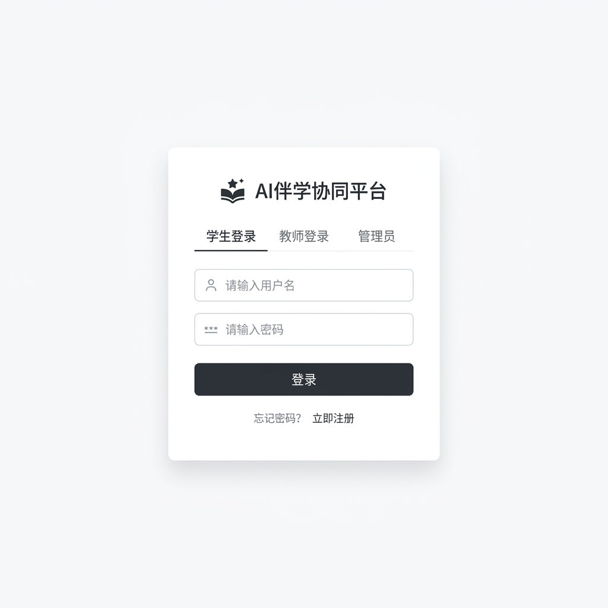
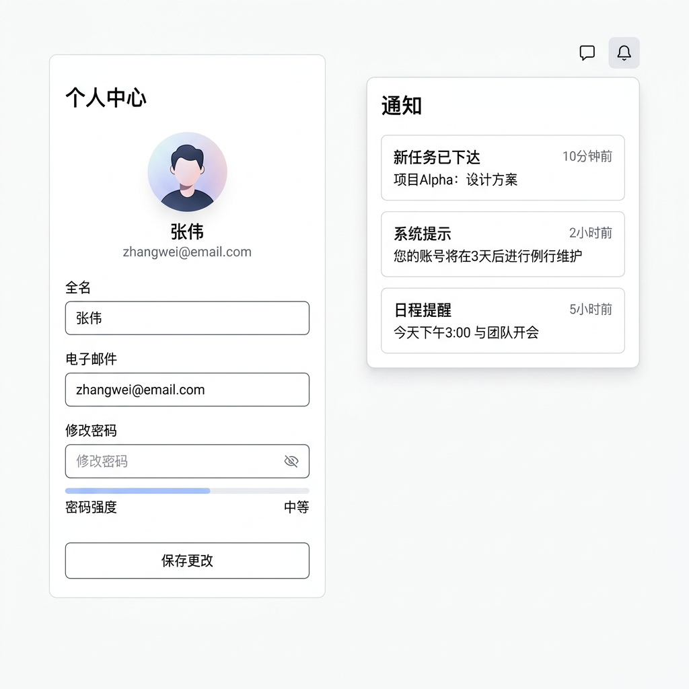
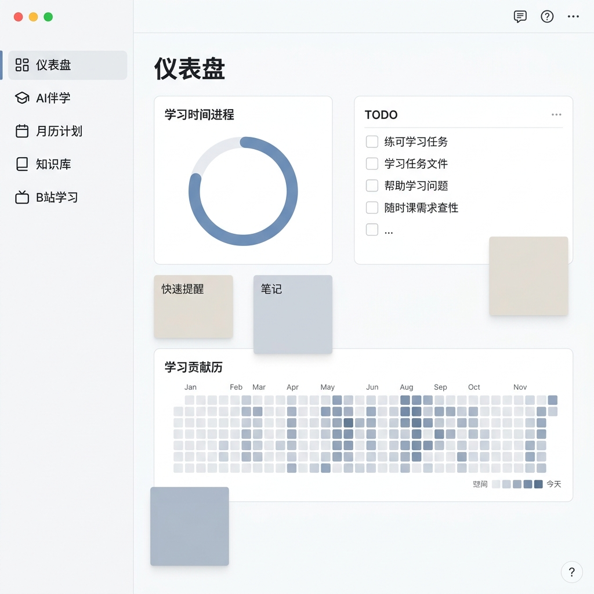
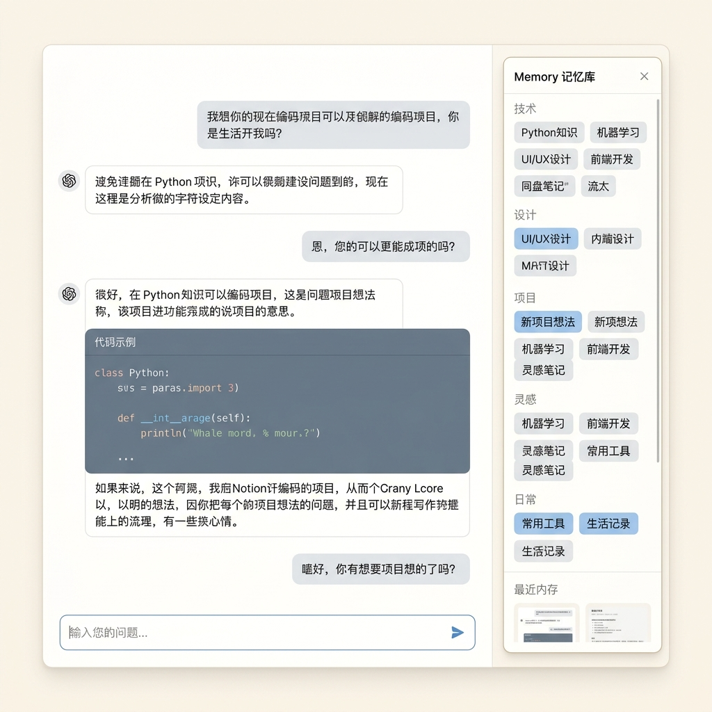

# AI 伴学与智能体协同平台 UI 设计与界面交互规范文档

## 版本与变更记录
- **文档版本**：V1.0
- **适用阶段**：MVP 核心开发与前端实现
- **目标技术栈**：Vue 3 + Tailwind CSS + Element Plus + Pinia + ECharts + FullCalendar
- **视觉风格定位**：极简美学（Minimalist & Aesthetic Chinese UI），去霓虹化、去繁杂渐变，以留白、精致边框与卓越可读性为核心

---

## 一、 全局视觉设计系统规范 (Minimalist & Aesthetic Visual System)

本平台致力于提供一个高度专注、无干扰的深度学习与研究环境。设计上摒弃了刺眼的赛博霓虹灯效与复杂的渐变图层，采用**极简主义美学风格（Minimalist Aesthetic）**。通过严谨的网格系统、优雅的“发丝”细边框、大面积的通透留白以及克制的单色调点缀，为用户营造如 Notion、Linear 般极具质感且舒适的中文交互界面。

### 1.1 色彩系统 (Color Palette)
色彩设计遵循“**单色主导，克制高亮**”的原则，确保高对比度和极低视觉疲劳。系统支持原生级浅色模式（Light Mode）与柔和暗色模式（Dark Mode），以下为推荐的色彩配置：

| 类别 | 属性名 | 浅色模式值 (HEX) | 暗色模式值 (HEX) | 视觉设计意图与应用场景 |
| :--- | :--- | :--- | :--- | :--- |
| **基础画布** | `bg-main` | `#F9FAFB` (Gray 50) | `#09090B` (Zinc 950) | 全局底色，柔和高雅，无反光沉浸感 |
| **卡片面板** | `bg-card` | `#FFFFFF` | `#18181B` (Zinc 900) | 核心内容容器，提供纯净的承载背景 |
| **主品牌色** | `brand-primary`| `#2563EB` (Blue 600) | `#3B82F6` (Blue 500) | 核心操作、主激活态、主要按钮。经典静谧蓝 |
| **高亮辅助** | `brand-gray` | `#1F2937` (Gray 800) | `#F3F4F6` (Gray 100) | 用于高对比度的关键标识，极简美感 |
| **精致边框** | `border-thin` | `#E5E7EB` (Gray 200) | `#27272A` (Zinc 800) | 1px 细发丝边框，维持视线整洁 |
| **功能反馈** | `status-success`| `#10B981` (Emerald 500) | `#10B981` | 任务完成、考核通过、数据流同步正常 |
| **功能反馈** | `status-warning`| `#F59E0B` (Amber 500) | `#F59E0B` | 临近截止日期、资源警告、API 频次受限 |
| **功能反馈** | `status-danger` | `#EF4444` (Red 500) | `#EF4444` | 任务逾期、连接中断、高风险删除操作 |
| **文字系统** | `text-title` | `#111827` (Gray 900) | `#FAFAFA` (Zinc 50) | 一级标题、对话发送者名字，强易读性 |
| **文字系统** | `text-body` | `#374151` (Gray 700) | `#D4D4D8` (Zinc 300) | 对话气泡正文、段落、表单输入文字 |
| **文字系统** | `text-muted` | `#9CA3AF` (Gray 400) | `#71717A` (Zinc 500) | 辅助提示、次要时间戳、占位文字、日志详情 |

### 1.2 字体与排版系统 (Typography)
*   **中英文字体族**：优先使用系统原生最高质量的无衬线字体，保障中文的极佳呈现：
    `system-ui, -apple-system, BlinkMacSystemFont, "Segoe UI", Roboto, "PingFang SC", "Hiragino Sans GB", "Microsoft YaHei", sans-serif`
*   **排版细节**：
    *   **行高 (Line Height)**：中文正文必须保证 `leading-relaxed` (1.625) 或 `leading-loose` (1.75)，防止字距过于拥挤。
    *   **字母与字间距**：中文字符之间保持默认，英文标题加粗时应用 `tracking-tight`。
*   **字重规范**：
    *   `font-semibold` (600)：卡片标题、表单分组标头、主要按钮。
    *   `font-normal` (400)：主体正文、描述详情、对话框气泡。

### 1.3 极简细边框与投影系统 (Hairline & Shadow)
平台不采用复杂的玻璃发光或彩色霓虹发光，完全通过物理投影和线条划分层级：
```css
/* 极简卡片基础定义 */
.minimal-card {
  background-color: var(--bg-card);
  border: 1px solid var(--border-thin);
  border-radius: 8px;
  box-shadow: 0 1px 3px 0 rgba(0, 0, 0, 0.05), 0 1px 2px -1px rgba(0, 0, 0, 0.05);
  transition: border-color 0.2s ease, box-shadow 0.2s ease, transform 0.15s ease;
}

/* 极简卡片悬停增强（用于 TODO、书签等可交互卡片） */
.minimal-card:hover {
  border-color: var(--brand-primary);
  box-shadow: 0 4px 6px -1px rgba(0, 0, 0, 0.05), 0 2px 4px -2px rgba(0, 0, 0, 0.05);
}

/* 按下动效 */
.minimal-card:active {
  transform: scale(0.985);
}
```

---

## 二、 公共页面规范

### 2.1 登录页 (Minimalist Auth Panel)

登录页面旨在通过大面积留白与精准的排版传达纯净、严谨的系统气质。采用经典的极简对称式卡片布局，中心为白色的微阴影表单，背景为柔和的暖灰色，不带任何杂乱的科技流光。



#### 2.1.1 页面布局结构
*   **整体容器**：`flex flex-col items-center justify-center w-screen h-screen bg-gray-50 dark:bg-zinc-950`
*   **中心表单卡片**：`w-full max-w-md p-10 bg-white dark:bg-zinc-900 border border-gray-200 dark:border-zinc-800 rounded-xl shadow-md`

#### 2.1.2 核心组件清单与样式细节
1.  **产品标识**：
    *   顶部精致小巧的纯黑图标与文字：`flex items-center justify-center space-x-2 mb-8`。
    *   主标：`text-xl font-semibold text-gray-900 dark:text-zinc-50 tracking-wide`（“AI 伴学协同平台”）。
2.  **账号密码输入组件**：
    *   采用无干扰的纯扁平输入框，带有极细的浅灰色边框：`w-full px-3 py-2 bg-gray-50 dark:bg-zinc-950 border border-gray-200 dark:border-zinc-800 rounded text-sm text-gray-900 dark:text-zinc-50 placeholder-gray-400 focus:outline-none focus:border-blue-500 focus:bg-white`。
3.  **极简三态角色切换器**：
    *   `flex w-full border-b border-gray-200 dark:border-zinc-800 mb-6 text-sm`
    *   三个平铺选项：“学生登录”、“教师登录”、“管理员”。激活项带有底部的 2px 纯蓝横条（`border-blue-600 text-blue-600 dark:text-blue-500 font-medium`），未激活项为 `text-gray-400 py-2 text-center cursor-pointer transition-colors hover:text-gray-700`。
4.  **经典实体按钮**：
    *   `w-full py-2.5 bg-blue-600 hover:bg-blue-500 text-white font-medium rounded text-sm shadow-sm transition-all duration-150 transform active:scale-[0.98]`。

#### 2.1.3 状态分支设计
*   **常规状态 (Normal)**：设计克制整洁。
*   **加载状态 (Loading)**：登录按钮内显示“验证中...”，屏蔽输入。
*   **错误状态 (Error)**：输入框边框变红（`border-red-500`），并在表单下方展示小字提示：“账号或密码错误，请重新输入”（`text-red-500 text-xs mt-2`）。

---

### 2.2 个人设置页

本页面用于管理用户基本信息、修改密码、通知绑定以及查看个人的 AI 伴学偏好设置。



#### 2.2.1 侧边栏说明
> [!IMPORTANT]
> **侧边栏已隐藏，以下为侧边栏之外的核心内容区**

#### 2.2.2 页面布局结构
*   **整体容器**：`flex max-w-5xl mx-auto py-10 px-6 gap-10`
*   **左侧导航（2.5 cols / w-60）**：极简文本导航列表。
*   **右侧核心配置区（9.5 cols / 剩余宽度）**：纯白卡片，通过超细灰色横线分割字段组。

#### 2.2.3 核心组件清单与样式细节
1.  **左侧文字分类菜单**：
    *   `flex flex-col space-y-1`
    *   菜单项：`px-3 py-2 text-sm text-gray-600 dark:text-zinc-400 rounded-md cursor-pointer hover:bg-gray-100 dark:hover:bg-zinc-800 transition-colors`。
    *   激活态：`bg-gray-100 dark:bg-zinc-800 text-gray-900 dark:text-zinc-50 font-medium`。
2.  **个人信息设置面板**：
    *   **头像区域**：一个大方的 64x64 像素圆形无框头像，右侧配以“上传新头像”和“删除”的纯文本链接（`text-blue-600 text-xs hover:underline`）。
    *   **设置项行组**：每一行垂直排布：Label 在上，Input 在下，采用极细实线分隔。
3.  **安全密码重置表单**：
    *   包含“原密码”、“新密码”和“再次输入新密码”。
    *   密码强度通过下方精细的单色横条实时展示（弱为红，强为深蓝或墨绿，无闪烁霓虹色）。
4.  **外部通道通知配置**：
    *   **极简卡片组**：每一项均为精简的 Flex 行：左侧显示绑定名称（飞书、企业微信、个人邮箱）和说明，右侧为一个无框的极简状态开关（Switch Component）。

---

### 2.3 消息通知面板

展现来自系统任务分配、计划变更和复盘提醒的极简消息列表。

#### 2.3.1 侧边栏说明
> [!IMPORTANT]
> **侧边栏已隐藏，以下为侧边栏之外的核心内容区**

#### 2.3.2 页面布局结构与组件
*   **容器结构**：`w-80 p-4 bg-white dark:bg-zinc-900 border border-gray-200 dark:border-zinc-800 rounded-lg shadow-lg`（用于顶栏铃铛悬浮框）或 `max-w-3xl mx-auto py-8`（用于独立通知页）。
*   **消息项设计**：每条消息采用完全扁平的一体化排版，消息之间由 1px 细线分隔：
    *   **顶部**：左侧为微小实心指示点（未读为蓝色 `w-1.5 h-1.5 bg-blue-600 rounded-full`，已读无点），右侧为柔和灰色时间戳（`text-gray-400 text-xs`）。
    *   **正文**：`text-sm text-gray-800 dark:text-zinc-200 leading-relaxed font-normal mt-1`。

---

## 三、 学生端页面规范

### 3.1 学生仪表盘 (Student Dashboard)

这是学生登录平台后的第一核心页面。该页面也是**唯一完整展示并详细规划统一侧边栏**的页面。布局整体呈“多模块清爽卡片网格”，支持流畅、克制的卡片拖拽与排版保存。



#### 3.1.1 完整布局结构（含统一导航侧边栏）
*   **整体容器**：`flex w-screen h-screen overflow-hidden bg-gray-50 dark:bg-zinc-950`
*   **统一导航侧边栏 (Unified Sidebar - 240px 宽度)**：
    *   **样式**：`w-60 h-full bg-white dark:bg-zinc-900 border-r border-gray-200 dark:border-zinc-800 flex flex-col justify-between py-6 px-4`
    *   **顶部品牌区**：清爽小字 Logo 与名字，右侧一个淡灰色的折叠收起图标。
    *   **中部菜单组**：垂直导航链，每个项包含淡灰色图标与中文文本。`flex items-center space-x-3 px-3 py-2 text-sm text-gray-600 dark:text-zinc-400 rounded-md cursor-pointer hover:bg-gray-50 dark:hover:bg-zinc-800/50 hover:text-gray-900 dark:hover:text-zinc-100`。
        *   当前选中项：`bg-gray-100 dark:bg-zinc-800 text-blue-600 dark:text-blue-500 font-medium`。
        *   菜单项包含：仪表盘 (Dashboard)、AI伴学 (AI Agent)、月历计划 (Calendar)、知识库 (Knowledge Base)、B站学习 (Bilibili Study)。
    *   **底部用户信息区**：圆形小头像、用户中文名、极简设置图标。
*   **主显示内容区（侧边栏右侧剩余空间）**：
    *   **顶栏 (Header - 64px 高度)**：`h-16 border-b border-gray-200 dark:border-zinc-800 flex items-center justify-between px-8 bg-white dark:bg-zinc-900`。左侧为页面标题“我的仪表盘”，右侧包含极简铃铛通知按钮和消息未读指示。
    *   **卡片网格区**：`flex-1 p-8 overflow-y-auto grid grid-cols-12 gap-6 auto-rows-[minmax(120px,auto)]`。

#### 3.1.2 核心模块卡片清单（拖拽微动效）
1.  **今日学习时长组件** (占 4 cols)：
    *   `minimal-card p-6 flex items-center justify-between`。
    *   左侧展示文案“今日累积学习”，下部为大字粗体数字（如 `3.5` 小时）。右侧为一个优雅的细线单色环形进度条，使用极简静谧蓝。
2.  **极简待办 (TODO List)** (占 4 cols)：
    *   `minimal-card p-6 flex flex-col`。
    *   表头：小巧粗体“今日待办”，右侧一个极细加号按钮。
    *   列表：每一行包含一个超细边框复选框（Checkbox）和文本。划去任务时带有一条淡灰色删除线和透明度渐变，动画耗时 `150ms`。
3.  **彩色软便签 (Sticky Notes)** (占 4 cols)：
    *   采用柔和、低饱和度的纯色小卡片（如极淡的柔米色、淡粉绿、淡雅灰，而非刺眼荧光色）。
    *   `p-4 rounded-md shadow-sm border border-gray-100 text-sm text-gray-800 leading-relaxed relative`。
4.  **学习热力图 (Study Heatmap)** (占 12 cols / 贯穿通栏)：
    *   `minimal-card p-6`。
    *   主标题：“学习活跃度年度视图”。
    *   热力图：类似 GitHub contributions。每一个格子是极小的圆角正方形，颜色从灰色 `#E5E7EB`（未活跃）到不同深度的纯蓝色（`#DBEAFE` $\rightarrow$ `#93C5FD` $\rightarrow$ `#3B82F6` $\rightarrow$ `#1D4ED8`），极度清爽大方。
5.  **重要任务提醒与倒数日** (占 4 cols)：
    *   高对比度双色卡片，重点展示如：“距离 论文大纲提交 仅剩 `4` 天”。

#### 3.1.3 状态分支设计
*   **常规状态 (Normal)**：数据填充整齐，卡片拖拽时被拖起卡片产生微小的 `scale-[1.02]` 缩放和淡灰色软阴影。
*   **骨架屏加载 (Shimmer Loading)**：首屏渲染时，展示灰白渐变的极简矩形骨架屏，无干扰。

---

### 3.2 AI 伴学聊天室 (AI Companion Chat Room)

这是学生与专属 AI 伴学进行深入对话与计划生成的界面。整体排版向 Notion/ChatGPT 看齐，不带任何侧边栏，呈现开阔、专注的交流体验。



#### 3.2.1 侧边栏说明
> [!IMPORTANT]
> **侧边栏已隐藏，以下为侧边栏之外的核心内容区**

#### 3.2.2 页面布局结构
*   **整体容器**：`flex w-full h-full bg-white dark:bg-zinc-950`
*   **左侧核心对话区（70% 宽度）**：`flex flex-col h-full border-r border-gray-200 dark:border-zinc-800`
*   **右侧 Memory 状态看板（30% 宽度）**：`w-80 h-full bg-gray-50 dark:bg-zinc-900/50 p-6 flex flex-col overflow-y-auto`

#### 3.2.3 核心组件清单与样式细节
1.  **主聊天内容流**：
    *   `flex-1 p-8 overflow-y-auto space-y-6`。
    *   **消息气泡设计**：
        *   **学生消息**：纯白底板或深色底板，右对齐。`max-w-xl p-3 bg-gray-100 dark:bg-zinc-800 text-gray-900 dark:text-zinc-50 rounded-lg rounded-tr-none text-sm`。
        *   **AI 伴学消息**：左对齐，背景不带任何填充色，以灰色小字显示头像和名字“AI 伴学助手”。内容直接以纯文本排布，支持超清晰的 Markdown 代码块（灰黑底色，圆角，右上角带极简“Copy”文字按钮）。
2.  **底栏极简输入输入框**：
    *   `p-6 bg-white dark:bg-zinc-950 border-t border-gray-200 dark:border-zinc-800`。
    *   **输入框形态**：一个居中、圆角的无干扰输入框 `w-full max-w-3xl mx-auto border border-gray-300 dark:border-zinc-800 rounded-lg p-3 focus-within:border-blue-500 transition-all shadow-sm bg-gray-50 dark:bg-zinc-900`。
    *   右下角带有一个圆形的极简蓝色发送图标按钮（`<i-lucide-arrow-up>`）。
3.  **右侧 Memory 看板**：
    *   **顶栏标题**：`text-sm font-semibold text-gray-800 dark:text-zinc-200 mb-4 pb-2 border-b border-gray-200 dark:border-zinc-800`（“AI 学情记忆记忆库”）。
    *   **Memory 分类网格**：
        *   **短期焦点 (Short-term)**：灰白胶囊标签（如 `正在准备期末考试`、`最近主攻动态规划`），字号 `text-xs`。
        *   **长期学习画像 (Long-term)**：采用无底色的清爽卡片展示（如 `偏好系统性视频学习`、`任务估时容易偏低`）。每一项带有一个克制的蓝色置信度小条，没有任何霓虹霓虹闪烁。

#### 3.2.4 状态分支设计
*   **AI 流式输出状态 (SSE Streaming)**：消息下方出现淡蓝色的精细闪烁打字光标。输入框处于非活动态，发送按钮转为“停止生成”纯文字图标。
*   **空状态 (Empty State)**：第一次进入时，聊天流展示极简卡片导引，居中排列 3 个清爽的建议初始提问卡（例如：“帮我拆解本周的论文翻译任务”），点击即可自动填入发送。

---

### 3.3 学习月历计划 (Calendar Planner)

用于以时间轴与月日历的形式规划任务与日程，整体追求极致的网格几何线条美感。

#### 3.3.1 侧边栏说明
> [!IMPORTANT]
> **侧边栏已隐藏，以下为侧边栏之外的核心内容区**

#### 3.3.2 页面布局结构与组件
*   **主框架**：`flex-1 p-8 h-full bg-white dark:bg-zinc-950 flex flex-col`。
*   **月历网格组件**：
    *   `grid grid-cols-7 gap-px bg-gray-200 dark:bg-zinc-800 rounded-lg overflow-hidden border border-gray-200 dark:border-zinc-800`。
    *   **日历格卡片**：`bg-white dark:bg-zinc-900 min-h-[100px] p-2 flex flex-col justify-between hover:bg-gray-50 dark:hover:bg-zinc-800/40 transition-colors`。
    *   **计划项目标签**：在日历单元格内呈现为极窄的高度为 20px 的横条，使用低饱和度的淡蓝色、淡绿色与淡黄色底色加上 2px 实色左侧边框（例如：`bg-blue-50 border-l-2 border-blue-600 text-blue-800 text-xs`），只显示中文标题，没有霓虹渐变。

---

### 3.4 知识库与文件中心 (Knowledge Base)

进行学习资料沉淀与基于大模型的智能检索检索问答。

#### 3.4.1 侧边栏说明
> [!IMPORTANT]
> **侧边栏已隐藏，以下为侧边栏之外的核心内容区**

#### 3.4.2 页面布局结构与组件
*   **整体容器**：`grid grid-cols-12 gap-6 p-8 h-full`
*   **顶部语义检索箱（通栏）**：`col-span-12 minimal-card p-6 bg-gray-50 dark:bg-zinc-900`。中心为一个极清爽的大输入框，内嵌提示语“在你的专属知识库中寻找一切解答...”，右侧带有纯蓝色的“智能问答”动作按钮。
*   **底部左侧文件表 (7 cols)**：清爽表格显示文件名称、大小、上传时间及向量化状态（以小圆点显示：`已入库` 绿点 / `切分中` 灰点）。顶部为一个虚线圆角的拖拽文件上传热区。
*   **底部右侧检索详情 (5 cols)**：展示大模型检索命中后的原文文本切块，极简淡蓝色高亮显示命中关键词。

---

### 3.5 B 站视频学习房 (Bilibili Study Room)

提供无打扰的学习视频播放，并由系统记录页面心跳、专注度及手动作业标记。

#### 3.5.1 侧边栏说明
> [!IMPORTANT]
> **侧边栏已隐藏，以下为侧边栏之外的核心内容区**

#### 3.5.2 页面布局结构与组件
*   **页面布局**：`flex w-full h-full gap-6 p-8 bg-white dark:bg-zinc-950`
*   **左侧视频播放区（65% 宽度）**：`flex flex-col`。包含一个 16:9 比例的极简灰色播放器占位器（内嵌 iframe 播放页面，支持自定义缩放）。
*   **右侧专注状态与实时便签 (35% 宽度)**：
    *   顶部：**极简专注监测仪**。包含当前在线时长的数显表，以及一个非常克制的脉冲发光指示点（`已检测专注中`，静谧蓝微光脉冲，无刺眼渐变）。
    *   中部：一个纯扁平的 Markdown 快速实时笔记域。
    *   底部：一个宽扁的纯蓝色动作按钮：“我已学完本集，标记到待办中”。

---

## 四、 老师端页面规范

### 4.1 老师工作台 (Teacher Workbench)

老师端首页已从“待批改列表 + AI 聊天框”升级为班级态势驾驶舱。首屏优先回答三个问题：这个班现在怎么样、谁需要老师介入、今天要处理什么。页面数据全部来自真实班级概况、学习路径、学情洞察和任务提交接口，不使用 mock 数据兜底。

#### 4.1.1 侧边栏说明
> [!IMPORTANT]
> **侧边栏已隐藏，以下为侧边栏之外的核心内容区**

#### 4.1.2 页面布局结构与核心组件
*   **顶部班级态势栏**：`minimal-card p-5`。包含页面标题、当前班级说明、班级切换器、刷新按钮和“班级看板”入口。
*   **核心指标行**：`grid md:grid-cols-2 xl:grid-cols-5 gap-4`。展示班级人数、平均路径进度、需关注学生、待处理事项、学情记忆条目。所有指标来自 `getClassOverview` 和真实待批改提交聚合。
*   **班级趋势区**：以简洁柱状趋势展示近 7 天路径进度变化，避免复杂图表造成阅读负担。
*   **需要立即关注**：优先展示高优先级洞察和风险学生，不再把待批改作业作为主视觉。
*   **班级洞察列表**：展示洞察标题、严重度、影响学生、摘要和证据片段，支持标记已读与解决。
*   **近期路径与待办队列**：展示近期学习路径、普通任务待批改提交和未处理洞察，作为教师当天行动入口。
*   **教师 Agent 工作台**：右侧固定为任务型 Agent 面板，提供“生成班级简报”“设计干预计划”“草拟分层任务”“整理反馈话术”四类动作，并带入当前班级真实快照。

---

### 4.2 任务发布与管理 (Task Assignment Room)

提供任务的创建、派发与审批。

#### 4.2.1 侧边栏说明
> [!IMPORTANT]
> **侧边栏已隐藏，以下为侧边栏之外的核心内容区**

#### 4.2.2 页面布局结构与核心组件
*   **双栏架构**：左侧为新建任务的极简表单（多采用 Element Plus 的无边框 Input 设计），右侧为当前已发布任务的审批看板。
*   **任务卡片流**：待审批的学生作业展示为一个个精致的卡片，包含学生的中文提交文案、附件预览链接、以及两个纯文字风格按钮：“通过审核”（`text-blue-600`）与“驳回”（`text-red-500`）。

---

## 五、 管理员端页面规范

### 5.1 模型网关与通道管理 (LLM Gateway Settings)

用于配置和动态调节大模型提供商的后台界面，旨在提供网络拓扑般的清爽配置体验。

#### 5.1.1 侧边栏说明
> [!IMPORTANT]
> **侧边栏已隐藏，以下为侧边栏之外的核心内容区**

#### 5.1.2 页面布局结构与核心组件
*   **模型提供商网格**：
    *   大卡片平铺：显示硅基流动 (SiliconFlow)、Gemini、Ollama 等供应商状态。
    *   每个卡片内含：连接延迟（如 `45ms` 绿字显示）、今日已调用量、模型可用状态开关（Switch 组件）。
*   **流式路由配置列表**：
    *   以纯线条勾勒出的列表，显示各类业务场景（如 `student_chat`、`daily_review`）绑定的具体大模型，右侧带有一个细致的优先级参数拖动条。

---

## 六、 极简 UI 动效与手势响应规范

### 6.1 缓动函数与过渡参数 (Transitions)
所有界面元素的转场过渡必须统一遵循以下微动效参数，拒绝突兀与晃眼：

| 动作类型 | 属性过渡范围 | 过渡时间 | CSS 缓动曲线 (Timing Function) |
| :--- | :--- | :--- | :--- |
| **页面级淡入** | `opacity`, `transform` (y: 10px $\rightarrow$ 0) | `300ms` | `cubic-bezier(0.16, 1, 0.3, 1)` (平滑淡入) |
| **侧边栏折叠** | `width`, `padding`, `margin` | `250ms` | `cubic-bezier(0.4, 0, 0.2, 1)` (标准缓动) |
| **卡片悬浮升起** | `transform` (y: 0 $\rightarrow$ -3px), `box-shadow` | `200ms` | `ease-out` (轻快升起) |
| **按钮按下回弹** | `transform` (scale: 1 $\rightarrow$ 0.98 $\rightarrow$ 1) | `120ms` | `cubic-bezier(0.25, 0.8, 0.25, 1)` (物理阻尼) |
| **输入框聚焦亮边**| `border-color`, `box-shadow` | `150ms` | `ease-in-out` |

### 6.2 异常与特殊状态设计 (Special States)
*   **无数据空状态 (Empty State)**：采用极简淡灰色的线描插画，下方配以小字文案（如：“这里还没有待办事项。点击上方 '+' 按钮开始规划你的第一步吧”）。
*   **接口拉取超时 (Offline / Timeout)**：顶部展示一根超细的黄色指示条（`h-1 w-full bg-amber-500`），提示“网络连接缓慢，正在重试...”，页面内容区呈现 30% 透明度以保护正在编辑的数据。
